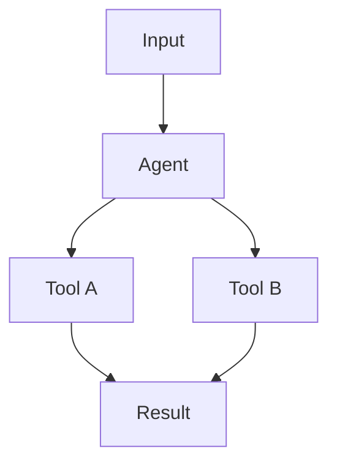

## End-of-Level Reflection

Level: $ARGUMENTS (auto-detect from recent conversation if omitted)

**Your task — do NOT ask the user questions, do the work yourself.**

---

### Step 1 — Extract observations from the conversation

Identify every:
- **mistake** — wrong assumption, bad API call, bug, failed approach
- **pattern** — technique or sequence that worked reliably
- **insight** — non-obvious learning, surprise, "aha" moment
- **question** — open question for a future level

---

### Step 2 — Append to `.claude/learnings/observations.jsonl`

One line per observation:

```
{"ts":"ISO8601","repo":"aws_agent_1","level":N,"cat":"mistake|pattern|insight|question","topic":"short-slug","obs":"full observation","ctx":"what triggered this","entities":["Technology","Pattern","Pitfall"]}
```

---

### Step 3 — Write `.claude/learnings/reflections/level-N-reflection.md`

Use the dual-format template below. The file serves TWO readers:

**HUMAN SECTION** — plain English + ASCII art (BOTH REQUIRED)
- Explain concepts as you would to a colleague over coffee
- **REQUIRED: at least one ASCII box diagram** — every reflection must have one; no exceptions
- ASCII art rules: use `+`, `-`, `|`, `>`, `v`, `^`, `[`, `]` only (renders everywhere)
- ASCII diagrams MUST be enclosed in a fenced code block (``` ``` ```) — prevents markdown from interpreting `+`, `-`, `|` as table/HR syntax
- Keep diagrams under 60 chars wide
- No code — describe WHAT and WHY, not HOW

**LLM SECTION** — mermaid diagrams + ASCII mirrors + structured data (ALL REQUIRED)
- **REQUIRED: at least one mermaid diagram** — every reflection must have one; no exceptions
- **REQUIRED: every mermaid diagram must have a paired ASCII equivalent immediately below it** — anti-fragile documentation: if mermaid fails to render, the ASCII is the fallback; both must convey the same structure
- ASCII mirror rules: same nodes, same edges, same direction as the mermaid — not a summary, a structural equivalent
- ASCII diagrams MUST be enclosed in a fenced code block (``` ``` ```) to prevent markdown from interpreting `+`, `-`, `|` as table syntax or horizontal rules
- Pseudocode for logic flows (no real syntax)
- Explicit forward/backward links to other levels
- Observation log (mirrors JSONL but readable in context)

---

### Dual-format template

```markdown
# Level N: [Title]
**Date:** YYYY-MM-DD | **File:** `path/to/file.py`
**Depends on:** L? (topic) | **Unlocks:** L? (topic)

---

## Part 1 — For Humans

### What We Built
[2-3 sentences. What problem does this solve? What can you now do that you couldn't before?]

### How It Works

[REQUIRED ASCII diagram — enclosed in a fenced code block, under 60 chars wide]

Example layout:

```
+------------------+
|   Your Prompt    |
+--------+---------+
         |
         v
+------------------+     +----------+
|      Agent       |---->|  Tool A  |--+
|                  |     +----------+  |
| ConcurrentExec   |---->|  Tool B  |--+--> merged result
+------------------+     +----------+  |
                    \--->|  Tool C  |--+
                         +----------+
```

### What Went Wrong
[Numbered list. Each entry: what failed, why, what fixed it.]

### What Worked
[Numbered list. Each entry: the pattern, why it works, when to reach for it.]

### The Single Most Important Thing
[One paragraph. The insight that changes how you think about this topic.]

---

## Part 2 — For LLMs

### Architecture

[REQUIRED mermaid diagram — primary concept]

[REQUIRED ASCII mirror — same structure as the mermaid above; use +, -, |, >, v, ^, [, ] only]

Example paired format:



```
+---------+
|  Input  |
+----+----+
     |
     v
+---------+
|  Agent  |
+--+---+--+
   |   |
   v   v
[Tool A] [Tool B]
   |       |
   +---+---+
       |
       v
   [Result]
```

### Decision Log

| Decision | Why | Trade-off |
|----------|-----|-----------|
| ... | ... | ... |

### Pseudocode — Key Patterns

[Logic flows using plain pseudocode, NOT real syntax]

### Observation Log

| # | Category | Topic | Observation |
|---|----------|-------|-------------|
| 1 | mistake  | ...   | ...         |
| 2 | pattern  | ...   | ...         |

### Forward Links

- **Unlocks L?**: [what this level's patterns enable]
- **Revisit when**: [trigger condition for coming back to these concepts]
```

---

### Step 4 — Report to user

Show:
- Observation count by category
- The single most important insight (one sentence)
