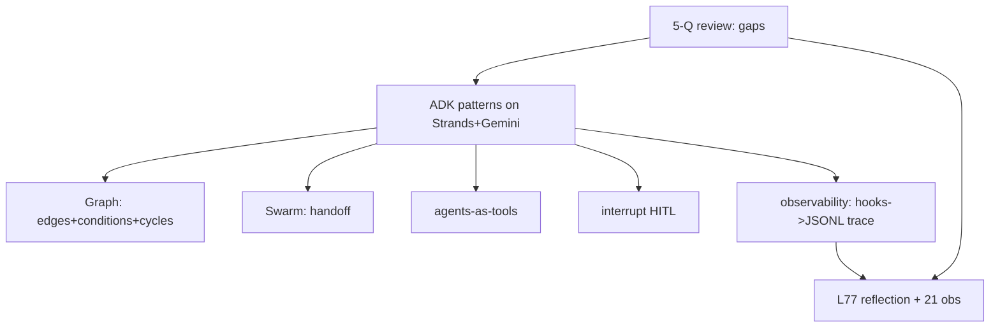

# Session Reflection — 2026-06-03
**Scope:** Answered an external team's 5-question Strands architecture review, then ported + live-verified
all 8 ADK multi-agent patterns onto Strands on the team's exact transport (`OpenAIModel` → LiteLLM proxy
→ `gemini-2.5-flash`), added a reproducibility + token + trace harness, fixed `CLAUDE.md`, and produced a
handover. Observations 843 → 865 (+21 new under L77; 1 legacy malformed line repaired). All deliverables
in `artifacts/`.

---

## Work units

| Unit | Output | One-line takeaway |
|------|--------|-------------------|
| 5-question architecture review | `artifacts/strands_review_gate/strands-review-gate-architecture.md` | AgentCore services = model-agnostic boto3 → adapters behind hexagonal ports; only the deployed Runtime's model is Bedrock-bound. Flagged 3 NOT-VERIFIED gaps. |
| ADK 8 patterns (L77) | `artifacts/adk_patterns/p1–p8` | Strands has no per-pattern classes; Graph(+conditions+cycles)+Swarm+as-tools cover all 8. 8/8 pass, 8/8 reproducible. |
| Observability | `_trace.py`, `_harness.py` | Per-run JSONL action trace (invoke + tool calls) via hooks; multi-run reproducibility + token cost. |
| Runtime fix | `CLAUDE.md` | LiteLLM proxy is a **podman** container `litellm-proxy` (not docker, no compose dir); Gemini also routes through it. |
| Handover | `artifacts/adk_patterns/HANDOVER.md` | Lessons + full paths for the external lead engineer. |
| Meta-process | this file + L77 obs | Spike-vs-learning-artifact; advice-vs-implementation; trust-live-state; don't over-ask. |

## How the pieces fit

```
   5-question review  -- flagged gaps -->  ADK pattern build
   (synthesis of            (structured-output? )   (closes them
    existing L27/33/         (reproducible?      )    empirically)
    66/71/74 obs)           (trace capture?     )         |
         |                                                v
         |                                      observability layer
         +------------> handover <--------------  (_trace, _harness)
                           ^                              |
                    CLAUDE.md fix                    L77 reflection
                    (podman proxy)                   + 21 observations
```

## Cross-cutting insights
1. **ADK = one class per pattern; Strands = few general primitives.** One Graph (conditional edges +
   cycles) absorbs Sequential/Parallel/Generator-Critic/Iterative-Refinement; Swarm = routing;
   agents-as-tools = hierarchy; nested nodes = composite. Corrects "L8 Graph = DAG only."
2. **Reproducibility is architectural, not a sampling knob.** `temp 0` does not pin Gemini; 8/8 became
   reproducible only after structural guards (handoff limits, bounded retries, typed outputs, caps).
3. **Forced structured output works through the compat proxy** and as a Graph node — it's a forced tool
   call under the hood (visible in the trace). Closes the review's biggest gap.
4. **A sub-agent's callback doesn't fire when it runs as a tool** — trace nesting by lineage, not callbacks.

## Meta-process lessons (the honest-assessment arc)
- **Spike vs learning artifact** — a use-case-scoped spike verifies mechanisms but, for *this* repo,
  must be integrated into observations/reflections and exercise failure modes, not just topology.
- **Advice vs implementation** — I recommended observability in two docs before building it; if the work
  needs a capability it recommends, build it in the same pass.
- **Trust live state over stale docs** — twice I called the proxy "down" (docker-vs-podman + truncated
  `ps`) before checking the actual container; the stale CLAUDE.md actively misled.
- **Don't over-ask** — I offered to finish clearly-needed, non-destructive reflections as a question;
  identified in-scope work should just be done.

## Architecture (the ADK→Strands mapping verified this session)



```
        [5-Q review: gaps]
               |
               v
   [ADK patterns on Strands+Gemini]
        |    |     |     |     |
        v    v     v     v     v
    [Graph][Swarm][as-tools][HITL][observability]
                                       |
                                       v
                            [L77 reflection + 21 obs] <-- [5-Q review]
```

## Observation delta
- 843 → 865 (+21 new, all `level:77`): 8 pattern, 7 insight, 4 mistake, 2 question.
- Repaired 1 legacy malformed line (263: a level-0 insight + a level-26 pattern concatenated — both preserved).

## What's next / open
- **DONE — agentic memory + evals plan executed empirically (L78–L87)**: shared/cross-session/LTM-filtered/
  long-horizon memory + durable multi-agent resume; trajectory/goal-success/significance evals + a unified
  harness; capstone proved memory's value at p=0.0003. All live, no-simulation (gated by `tools/no_sim_check.py`).
  See `level-78-87-reflection.md`. Closes the agentic-memory and agentic-evals gaps from the audit.
- **DONE — cross-model on AWS Bedrock `claude-haiku-4-5`**: same suite, 8/8 pass + 8/8 reproducible,
  **consistent with** framework-inherence (N=2 families; mechanism not quality — not a universal proof).
  Re-run **2026-06-03 artifact-backed** (~35.1k tok; 23 traces preserved; every per-pattern signal
  byte-identical to Gemini) — see `level-77-crossmodel-validation-reflection.md`. Model-specific delta:
  nested tool-call fired first-attempt on Claude (`attempts=1/4`) vs 1–2 on Gemini (bounded retry absorbs
  it). (`ADK_MODEL_PROVIDER=bedrock`, acct <agentic-account-id>)
- **DONE (partial) — promoted the reusable harness to `tools/`**: `tools/eval_harness.py` +
  `tools/no_sim_check.py` now live in `tools/`; `_trace.py` still in `artifacts/adk_patterns/`.
- **Open — F2 (OTel→Application Signals)**: would un-gate the SDK's native TRACE_LEVEL `GoalSuccessRate`/
  `Faithfulness` (L84 currently proves goal-success locally without it).
- **Reasoning-trace capture** through the compat path — actions-only today. (L77 question)
- **Add `get_model`-native variants** so the patterns also run on the repo's default (direct GeminiModel) path.
