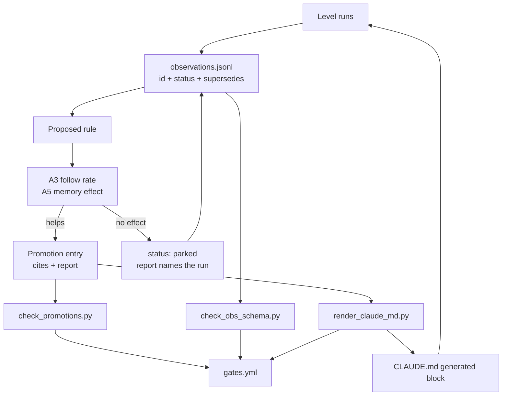

# Session Reflection: 2026-08-30, the learning loop measures itself

**Scope:** implementing `docs/recommendations-for-the-experiment-repos.md` from the
continual-learning repo in `aws_agent_1`. Six recommendations, A1 to A6. A4 was already done
in the global instruction files before this session started and was verified rather than
redone. Observations 994 to 1008 plus the run entries below.

---

## Part 1: For Humans

### What we built

The repo already captured what it learned. It wrote observations, wrote reflections, and
promoted rules into `CLAUDE.md` by hand. Nothing read any of it back under measurement, and
`CLAUDE.md` was the only artifact in the repo held to no evidence standard while every AWS
finding was held to one.

Four things changed. Observations got an identity and a lifecycle, so a rule can name the
entries behind it. `CLAUDE.md`'s rule section became a rendered view of those entries rather
than a file rewritten whole. A promotion now has to name the run or the incident that decided
it, and CI fails one that does not. And two experiments now measure the loop itself: whether
the rules are followed, and whether a captured mistake is avoided because it was captured.

### How it works

```
   run a level
        |
        v
 +------------------+     append-only, id + status
 | observations     |<--------------------------+
 | obs-0001..NNNN   |                           |
 +---+----------+---+                           |
     |          |                               |
     |          | promoted entries              |
     |          v                               |
     |   +--------------+   render    +---------+--------+
     |   | rule entry   |------------>| CLAUDE.md block  |
     |   | cites: ids   |             | (### + the ids)  |
     |   | report: run  |             +------------------+
     |   +------+-------+                       ^
     |          |                               |
     |          | A6 gate: no report, no promo  | CI re-renders
     |          v                               | and compares
     |   +--------------+                       |
     |   | CI gates     |-----------------------+
     |   +--------------+
     |
     |  A3: is the rule followed?     A5: is the memory used?
     +---> two arms, rule in or out   ---> two arms, note in or out
           verifier over the answer        verifier over the answer
```

### What went wrong

1. **A liveness probe is not a throughput probe.** Four model routes answered "ok" to a
   one-word prompt, so the run was preregistered on the fastest-looking one. Under the real
   workload that route returned HTTP 429 with no fallback group, and one call took 92 seconds
   and came back empty. The probe measured reachability and it was read as capacity. The
   preregistration was amended and committed before the first measured run rather than
   quietly rewritten afterwards.

2. **The first verifier scored prose.** An answer wrote `Swarm([coder, reviewer])`, correctly,
   then added a note explaining that the keyword form is wrong. The verifier matched the
   sentence and called it a recurrence. The bias ran one way: the arm carrying the memory is
   the arm that restates it, so the measurement was penalising the memory for being quoted.
   Re-scoring the partial report after the fix moved that case from 7/15 to 0/15.

3. **Three more near misses, all found by reading answers rather than totals.** An agent
   named after a session id counted as passing a session id to the agent. A coroutine awaited
   two lines below its call counted as the sync-call bug. A `concurrent.futures` timeout
   counted as the Temporal one. Each is now a control.

4. **Both tripwires fired on this session's own files and both were right.** The account-id
   gate caught a fabricated 12-digit id inside an observation describing that very gate, and
   the anti-simulation gate caught the word it hunts inside a verifier written to hunt it.

### What worked

1. **Storing the raw answers and recomputing every rate from them.** Three verifier defects
   were found while the run was still going, and fixing them re-derived every number instead
   of invalidating 600 model calls.

2. **Reading the answer, not the tally.** Every defect above is invisible in a follow rate
   and obvious in the text underneath it.

3. **Copying rule text instead of retyping it.** The eight rules were parsed out of
   `CLAUDE.md` and the re-promotion copied its text from the entry it supersedes, so the
   first render was a zero diff and a promotion cannot silently reword a rule.

4. **Frozen legacy windows.** 18 entries predate the schema and carry a null field the
   capture never had. Rather than backfilling invented text, the gate allows those nulls only
   at or below `obs-0208`, so history stays honest and new decay is impossible.

### The single most important thing

A rule that is never measured is indistinguishable from a rule that does nothing, and the
measurement is only worth what its verifier is worth. Both experiments here spent their real
effort not on statistics but on the question of what counts as an opportunity: an answer that
never reached the fork is not compliance, and a sentence explaining the rule is not a
violation. Get that wrong and the numbers are confident and backwards.

---

## Part 2: For LLMs

### Architecture



```
[Level runs]
     |
     v
[observations.jsonl: id + status + supersedes]
     |                         ^
     v                         |
[Proposed rule]                |
     |                         |
     v                         |
[A3 follow rate / A5 memory effect]
     |            \                |
   helps           no effect       |
     |               \             |
     v                v            |
[Promotion: cites + report]  [parked + report]
     |         \                   |
     |          \                  +--> back to the log
     v           v
[render_claude_md.py]   [check_promotions.py]
     |                        |
     v                        v
[CLAUDE.md block] -----> [gates.yml in CI]
     |
     +--> steers the next level run
```

### Decision log

| Decision | Why | Trade-off |
|---|---|---|
| Backfill ids, never invent missing content | 18 entries had no category or context; writing one now would be fabricating provenance | The schema gate must carry a legacy window, frozen at obs-0208 |
| Delete `observations.normalized.jsonl` | Every text and entity list in it is in the main log; its only unique ctx values are the filler "From aws_agent_1"; its level field disagrees (325 of 334 say level 3) | A second view is gone; nothing referenced it |
| Promotion carries `report`, `run:` or `incident:` | A6 wants evidence, and retro-fitting a paid run to eight existing rules would be theatre | `incident:` is the weaker form, so the data shows which is which |
| Render order follows the supersedes chain to its root | Re-promoting on new evidence must not move a rule in the file | The renderer has to walk the chain |
| Probe rule audited against the repo, not against answers | It is a rule about the order of work across files and days | The "predates" half is unrecoverable inside the squashed import |
| Verifiers call the packaged gates | The measurement and CI cannot drift on what a violation is | A temp file per scored answer |
| Verifiers see code, not prose | An answer carrying the memory restates it, and prose cannot commit the mistake | A code line containing "not" can be dropped when there is no fence |

### Pseudocode: the loop

```
capture(observation):
    entry.id     = next id after the highest in the log
    entry.status = raw
    append; never edit, never delete

correct(entry):
    append a NEW entry with supersedes = the old id

promote(rule):
    require a report: run:<path that exists> or incident:<ids that exist>
    append entry with cat=rule, status=promoted, rule_title, rule_body, cites
    render CLAUDE.md from every promoted rule not superseded,
        ordered by the root of its supersedes chain

measure(rule):
    for arm in (rule in the prompt, rule absent):
        for paraphrase in three tasks that create the opportunity:
            n runs, store the raw answer
    rate = followed / opportunities        # None answers leave the denominator
    compare with a permutation test at alpha / number of rules
```

### Observation log

| # | Category | Topic | Observation |
|---|---|---|---|
| obs-1003 | insight | anti-simulation-rule-earns-its-line | 5/15 to 15/15, p=0.0007 |
| obs-1004 | insight | the-model-provider-rule-supplies-the-surface | 0/15 opportunities unprompted; eight invented APIs |
| obs-1005 | insight | account-id-rule-not-separated-at-n5 | 11/11 against 7/11, p=0.0956 |
| obs-1006 | mistake | a-liveness-probe-is-not-a-throughput-probe | 429 and 92s under load after "ok" on a probe |
| obs-1007 | pattern | probe-rule-audited-against-the-repo | 7 of 8 opportunities have a probe; order unrecoverable |
| obs-1008 | rule | rule-model-provider | first promotion carrying a run report |

### Forward links

- **Unlocks**: any rule in `CLAUDE.md` can now be measured with three paraphrases and a
  verifier, and any captured mistake can be tested for use rather than for storage.
- **Revisit when**: a rule is proposed. It goes in as `proposed`, gets a run, and is promoted
  or parked with the report id that decided it.
- **Open**: `obs-0138` contradicts the Streaming rule the file still carries. Nothing in this
  session resolved it, and it is a candidate for the first measured park.
