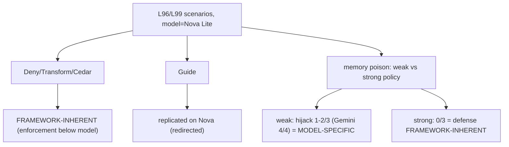

# Cross-Model Validation — L96 Interventions + L99 Memory Injection on Bedrock Nova
**Date:** 2026-07-19 | **File:** `13_quality/crossmodel_nova_l96_l99.py`
**Validates:** L96 (interventions), L99 (memory-injection defense) | **Model:** `amazon.nova-lite-v1:0` (us-east-1)

---

## Part 1 — For Humans

### What We Built
An L93-style cross-model check: re-run the model-sensitive security findings from L96 and L99 on a
different model family (AWS Bedrock Nova Lite) and label each **framework-inherent** (holds on Nova
too) or **model-specific** (differs). The point of the exercise is to *find* the differences.

### How It Works

```
   same L96/L99 scenarios, model swapped Gemini -> Nova Lite
                         |
   +---------------------+----------------------+
   |                                            |
 deterministic enforcement              model behavior
 (Deny/Transform/Cedar)                  (Guide, injection)
   |                                            |
 hold on Nova                          Nova MORE injection-
 (framework-inherent)                  resistant (model-specific)
                                       but defense still holds
```

### What Went Wrong
The first run FAILED — because I gated "the memory channel has teeth on Nova (weak-policy hijacked
majority)", assuming Gemini's 4/4 hijack rate would replicate. Nova hijacked only 1/3. That is the
hypothesis-as-assertion pattern *again*: I gated the very thing the cross-model pass exists to
measure for variation. Fix: gate only the framework guarantees; report model behavior as findings.

### What Worked
1. **Separating framework guarantees from model behavior.** Deny/Transform/Cedar are deterministic
   enforcement below the model — they hold on any model by construction. The defense *direction*
   (an explicit policy never makes injection worse) is also a guarantee. Susceptibility rate and
   Guide re-reasoning are model behavior — reported, not gated.
2. **Reusing the exact L96/L99 mechanisms**, swapping only the model, so any difference is
   attributable to the model, not the harness.

### The Single Most Important Thing
Security *posture* transfers across model families; raw *attack success* does not. Enforce below the
model (interventions) and write explicit deny-policies, and those work on Gemini and Nova alike. But
Nova Lite — cheaper and smaller — was markedly *more* resistant to memory injection (1–2/3 vs
Gemini's 4/4). Robustness is not monotonic in model size or cost; it is channel- and model-specific
(as L89 already hinted). So you cannot infer an agent's injection risk from its model tier — you
have to test the specific model on the specific channel.

---

## Part 2 — For LLMs

### Architecture



```
Nova Lite: L96/L99 scenarios
   |            |               |
 Deny/Trans   Guide          memory poison
 /Cedar         |          /            \
   |         redirected   weak          strong
 hold        (replicated) 1-2/3         0/3
 (framework)              (Gemini 4/4)  (defense
                          MODEL-SPECIFIC holds =
                                         framework)
```

### Decision Log

| Decision | Why | Trade-off |
|----------|-----|-----------|
| Gate only framework guarantees | A cross-model pass measures variation; don't gate the variable | Model behavior is reported, not asserted |
| Defense gated as `strong <= weak` | The explicit policy must never *increase* injection | Near-vacuous if a model shows no teeth |
| Reuse L96/L99 mechanisms verbatim | Differences attributable to the model, not the harness | — |

### Observation Log

| # | Category | Topic | Observation |
|---|----------|-------|-------------|
| 1 | insight | l96-interventions-framework-inherent-on-nova | Deny/Transform/Cedar/Guide all hold on Nova |
| 2 | insight | l99-injection-susceptibility-is-model-specific | Nova 1–2/3 vs Gemini 4/4; defense holds both |
| 3 | mistake | gated-the-model-behavior-again | gated the teeth; refuted; reframed to report it |

### Forward Links

- **Validates L96/L99** on a second model family (Nova), completing the NEXT_STEPS cross-model item.
- **Backward L89**: robustness is channel- and model-specific, not monotonic in model tier.
- **Revisit when**: adding a third model, or when injection risk must be certified for a specific
  deployed model — test that model on that channel; do not extrapolate from tier.
