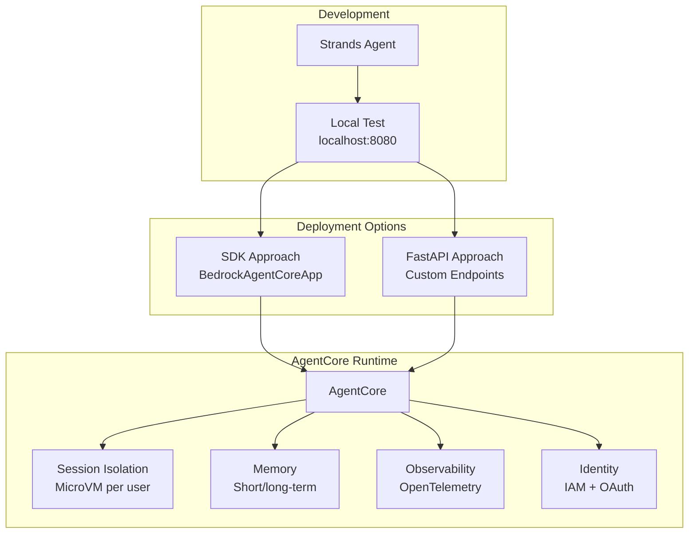
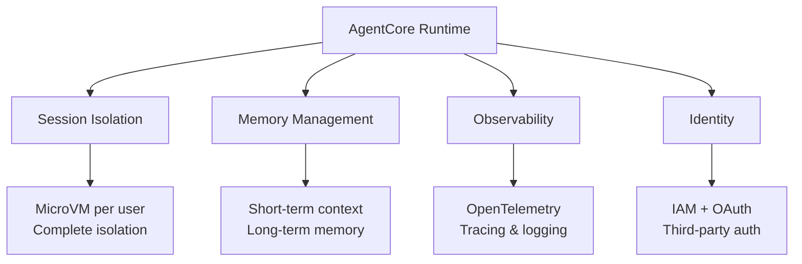
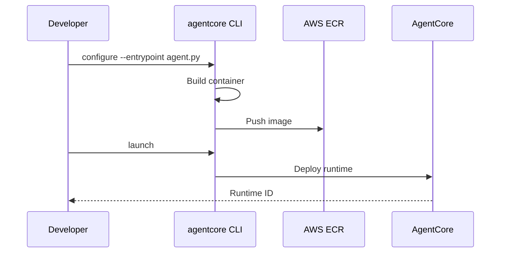
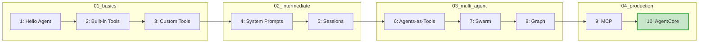

# Level 10 Reflection: Amazon Bedrock AgentCore Deployment

**Date:** 2025-12-11
**File:** `04_production/agentcore_deploy.py`

## What We Built

Production deployment example with two approaches:



## Patterns That Worked

### 1. SDK Approach (Simplest)
```python
from bedrock_agentcore.runtime import BedrockAgentCoreApp
from strands import Agent

app = BedrockAgentCoreApp()
agent = Agent()

@app.entrypoint
def invoke(payload):
    result = agent(payload.get("prompt", "Hello"))
    return {"result": result.message}
```

### 2. Required Endpoints
```mermaid
graph LR
    C[Client] -->|POST| I[/invocations]
    C -->|GET| P[/ping]

    I --> A[Agent Response]
    P --> H[Health Status]

    style I fill:#c8e6c9
    style P fill:#bbdefb
```

| Endpoint | Method | Purpose |
|----------|--------|---------|
| `/invocations` | POST | Agent invocation |
| `/ping` | GET | Health check |

### 3. Local Testing
```bash
# Start server
uv run python 04_production/agentcore_deploy.py --serve

# Test invocation
curl -X POST http://localhost:8080/invocations \
  -H "Content-Type: application/json" \
  -d '{"input": {"prompt": "What is 2+2?"}}'

# Response: {"output":{"message":"4\n","status":"success"}}
```

## Insights

### 1. AgentCore Production Features



### 2. Deployment Toolkit Flow



### 3. Complete Learning Progression



## Summary Statistics

**Full Learning Path:**
- 10 levels completed
- 4 folders: basics, intermediate, multi-agent, production
- 50+ observations captured
- Key patterns: tool decorator, streaming, multi-agent coordination, production deployment

**Level 10 Specific:**
- 2 deployment approaches documented
- Local test server verified working
- Dockerfile template provided
- Step-by-step deployment instructions included

## Open Questions (Future Exploration)

- How to implement canary deployments with AgentCore?
- Cost optimization strategies for production agents?
- How to integrate AgentCore with existing CI/CD pipelines?
- Multi-region deployment patterns?

## Observations Logged

6 new observations added to `observations.jsonl`:
- 3 patterns (SDK approach, endpoints, local testing)
- 3 insights (AgentCore features, deployment toolkit, learning complete)
