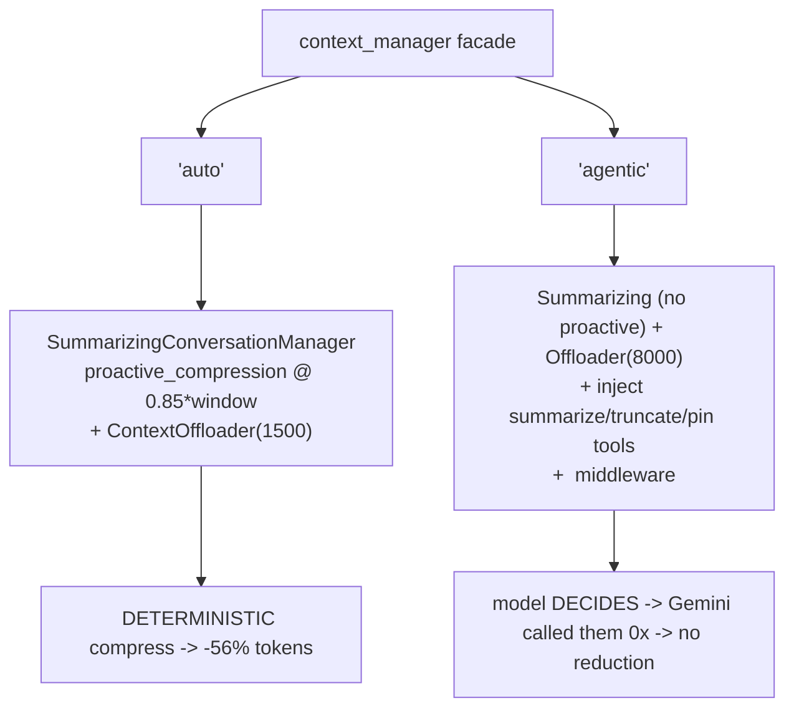

# Level 100: Agentic Context Management — Verify the Launch-Post Numbers
**Date:** 2026-07-19 | **File:** `13_quality/context_mgmt_verify.py`
**Depends on:** L15/L53 (context management), L61 (token counting), L94 (v1.48) | **Unlocks:** Tier 22 complete; informed context-manager choice

---

## Part 1 — For Humans

### What We Built
A direct, source-grounded test of the Strands launch post's two headline context-management claims —
~55% fewer tokens and a 68%→98% accuracy lift. We read the actual implementation, then measured our
own numbers three ways (no management / `auto` / `agentic`). One claim reproduced almost exactly;
the other did not, for a reason worth knowing.

### How It Works

```
codename stated once
        |
   8 bloating tool-result turns (context grows)
        |
   "what is the codename?"
   /        |            \
 none      auto        agentic
 (Null)   (proactive   (model-driven
          summarize)    tools)
   |        |             |
 ~20.6k   ~8.9k (-56%)  ~20.6k
 recall   recall 1.0    recall 1.0
  1.0     tokens cut    model never
          deterministically  called the tools
```

### What Went Wrong
Nothing broke — but the design had to account for a hard fact discovered by probing: Gemini's real
context window is 1,048,576 tokens, so a modest task never pressures it and context management never
engages. The claim's regime (a pressured window) simply does not occur on Gemini for a reasonable
task. I reached it honestly by capping the *reported* window via a `CappedModel` subclass (the real
model is unchanged; only the managers' thresholds shift), disclosed in the output. A `no_sim_check`
false positive on the word "simulated" in a comment was reworded to "reported cap".

### What Worked
1. **Reading `_resolve_context_manager` + `agentic_context.py` first.** Knowing that `auto`
   compresses deterministically at 0.85×window while `agentic` leaves it to the model's discretion
   is what made the results interpretable rather than mysterious.
2. **Three arms with a `NullConversationManager` baseline.** The true no-management arm is what makes
   the 56% reduction meaningful (vs the default sliding-window manager, which already trims).
3. **Reporting honest negatives with causes.** The accuracy lift didn't reproduce — and the reason
   (1M window + capable model = no degradation) is itself the finding.

### The Single Most Important Thing
`auto` and `agentic` are not two flavors of the same thing — they differ in *who does the work*.
`auto` compresses deterministically and cut tokens 56% with zero model cooperation. `agentic` hands
the model tools and a token-usage readout and hopes it self-manages — and Gemini 2.5 Flash never
touched them, so its context stayed as bloated as the unmanaged baseline. If you need guaranteed
token control, use `auto`; `agentic` only pays off with a model that reliably chooses to compress.
And the marquee accuracy number is regime-specific: it needs a window small enough (or a model
weak enough at long context) to actually degrade — not a 1M-token frontier model on a modest task.

---

## Part 2 — For LLMs

### Architecture



```
context_manager facade
     |            |
   'auto'      'agentic'
     |            |
 Summarizing   Summarizing (no proactive)
 +proactive     +offloader(8000)
 @0.85*window   +inject 3 tools
 +offloader     +<context-status> middleware
     |            |
 DETERMINISTIC  MODEL decides
 -56% tokens    Gemini: 0 calls -> no reduction
 recall 1.0     recall 1.0
```

### Decision Log

| Decision | Why | Trade-off |
|----------|-----|-----------|
| Cap the *reported* window via a subclass | Gemini's 1M window never pressures a modest task | Disclosed control, not the model's real limit |
| `NullConversationManager` as the "none" arm | The default sliding-window manager already trims | Requires knowing Null exists (source) |
| Relative token count (chars/4) across arms | L61: `count_tokens` is chars/4; relative comparison is valid | Not absolute billed tokens |
| Report the non-reproductions as findings | They are true and have clear causes | The lesson "passes" with two honest negatives |

### Pseudocode — Key Patterns

```
# verify-the-marketing, honestly
read the source -> know auto=deterministic, agentic=model-driven
reach the claim's regime transparently (cap reported window, disclose it)
measure 3 arms: none(Null) / auto / agentic -> tokens + recall + mechanism-fired?
report OUR numbers next to theirs; a non-reproduction with a cause is a finding
```

### Observation Log

| # | Category | Topic | Observation |
|---|----------|-------|-------------|
| 1 | insight | context-mgmt-token-claim-confirmed | auto cut tokens ~56% (post: ~55%); deterministic at 0.85×window |
| 2 | insight | accuracy-lift-did-not-reproduce | 68→98% did not occur; all arms recall 1.0 (1M window + capable model) |
| 3 | insight | auto-vs-agentic-compression | agentic: model never called the tools (0/5); auto is the reliable one |
| 4 | pattern | disclosed-experimental-control | cap the reported window transparently to reach the regime |

### Forward Links

- **Completes Tier 22.** L94–L100 + L97b done.
- **Backward L15/L53**: the SDK now has first-party context management; the hand-built budget/
  compression lessons are the mechanism underneath `auto`.
- **Revisit when**: running on a smaller-window model (then the accuracy-lift regime may appear), or
  when a model that reliably self-manages makes `agentic` mode pay off.
