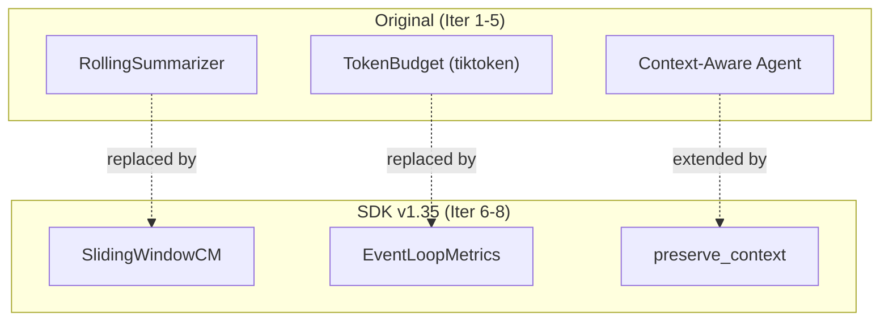

# Level 15: Context Management (v1.35 Enhancement)
**Date:** 2026-04-13 | **File:** `06_memory/context_management.py`
**Depends on:** L5 (Sessions), L6 (AgentAsTool), L58 (Sliding Window) | **Unlocks:** Production context engineering

---

## Part 1 — For Humans

### What We Built
Added three new iterations (6-8) to the existing context management lesson, replacing hand-rolled implementations with SDK v1.35 native features. Iteration 6 replaces RollingSummarizer with SlidingWindowConversationManager. Iteration 7 replaces tiktoken estimates with actual EventLoopMetrics. Iteration 8 adds preserve_context for sub-agent memory.

### How It Works

```
Evolution: hand-rolled --> SDK-native

Iter 1-2 (original):        Iter 6-7 (v1.35):
+------------------+        +------------------+
| TokenBudget      |        | EventLoopMetrics |
| tiktoken estimate|  --->  | actual from model|
| ~12 tokens       |        | ~103 tokens      |
+------------------+        +------------------+
       8.6x gap!

+------------------+        +------------------+
| RollingSummarizer|        | SlidingWindowCM  |
| ~80 lines code   |  --->  | 3 lines config   |
| LLM summarize    |        | no LLM overhead  |
+------------------+        +------------------+

Iter 5 (original):          Iter 8 (v1.35):
+------------------+        +------------------+
| Isolated agents  |        | preserve_context |
| no shared memory |  --->  | sub-agent memory |
| redundant context|        | builds on prior  |
+------------------+        +------------------+
```

### What Went Wrong
Nothing in the new iterations — the bugs were caught and fixed in L58 testing. The token access path and sliding window API were already proven.

### What Worked
1. **tiktoken vs SDK side-by-side** — showing 12 vs 103 tokens (8.6x gap) in a comparison table. Undeniable proof that tiktoken underestimates.
2. **preserve_context research demo** — stateful researcher built on GIL knowledge when answering asyncio question. The orchestrator synthesized findings from both stateful (sequential) and stateless (independent) sub-agents.
3. **Comparison table in Iter 6** — RollingSummarizer vs SlidingWindowCM across 6 dimensions (code, summarization, cost, user-first, tool results, per_turn).

### The Single Most Important Thing
tiktoken estimates are 8.6x too low because they only count message text, ignoring system prompt, role markers, formatting overhead, and accumulated history. For Horthy's 40% rule, this means you could think you're at 5% utilization when you're actually at 43% — already in the "Dumb Zone." Always use SDK actual token counts for production context management.

---

## Part 2 — For LLMs

### Architecture



```
Original (Iter 1-5):     SDK v1.35 (Iter 6-8):
+----------------+       +------------------+
| TokenBudget    |.....>  | EventLoopMetrics |
| (tiktoken)     |replace | (actual counts)  |
+----------------+       +------------------+

+----------------+       +------------------+
| RollingSummary |.....>  | SlidingWindowCM  |
| (80 lines+LLM) |replace| (3 lines config) |
+----------------+       +------------------+

+----------------+       +------------------+
| Context-Aware  |.....>  | preserve_context |
| Agent (isolated)|extend | (shared memory)  |
+----------------+       +------------------+
```

### Decision Log

| Decision | Why | Trade-off |
|----------|-----|-----------|
| Add iters 6-8, keep 1-5 | Original iters teach concepts; new show SDK | Longer lesson |
| Side-by-side token comparison | Most convincing proof of tiktoken gap | Requires both impls |
| stateful vs stateless researcher | Clean demo of preserve_context value | Complex orchestration |

### Pseudocode — Key Patterns

```
# Replace RollingSummarizer (Iter 2 -> Iter 6)
# BEFORE: 80 lines of RollingSummarizer class + LLM calls
# AFTER:
cm = SlidingWindowConversationManager(window_size=10, per_turn=3)
agent = Agent(model=m, conversation_manager=cm)

# Replace TokenBudget (Iter 1 -> Iter 7)
# BEFORE: tiktoken.get_encoding("cl100k_base").encode(text)
# AFTER:
result = agent(msg)
usage = result.metrics.latest_agent_invocation.cycles[-1].usage
actual_tokens = usage["inputTokens"]

# Extend with preserve_context (Iter 5 -> Iter 8)
stateful = agent.as_tool(preserve_context=True)   # remembers
stateless = agent.as_tool(preserve_context=False)  # isolated
```

### Observation Log

| # | Category | Topic | Observation |
|---|----------|-------|-------------|
| 1 | insight | tiktoken 8.6x gap | tiktoken=12, SDK=103 for same turn |
| 2 | pattern | preserve_context | Best for sequential research that builds on prior |
| 3 | pattern | SDK replaces custom | 80 lines -> 3 lines; LLM calls -> zero overhead |

### Forward Links

- **Built on L58**: Token tracking and sliding window proven there first
- **Built on L6**: preserve_context via as_tool() API
- **Revisit when**: Prompt caching available (cache metrics will show hit rates)
