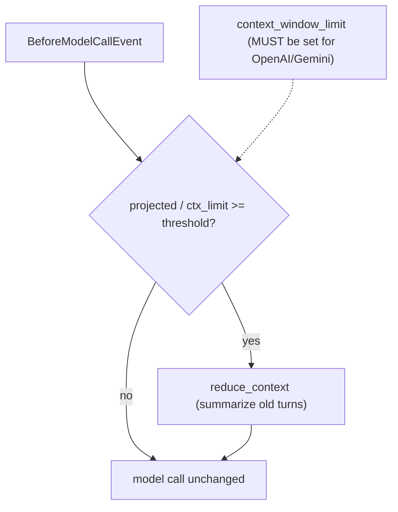

# Level 15 (v1.42): Proactive Context Compression
**Date:** 2026-06-02 | **File:** `06_memory/context_management.py` (Iteration 9)
**Depends on:** L15 (context mgmt), L15-v135 (sliding window) | **Unlocks:** token-budget-aware agents

> v1.42 extension. Adds Iteration 9 (proactive compression) to the L15 lesson.
> Insight is bound to strands 1.42's `ProactiveCompressionConfig`.

---

## Part 1 — For Humans

### What We Built
Iteration 9: a `SummarizingConversationManager` that compresses history
**before** the model call (proactively) when projected tokens cross a threshold,
instead of only trimming **after** an overflow error (reactively, like the
Iter-6 sliding window). The agent summarizes old turns ahead of time, so it
never hits the wall.

### How It Works

```
  before each model call:
  projected_input_tokens / model.context_window_limit  >=  threshold ?
                       |                                        |
                       | yes                                    | no
                       v                                        v
       summarize old turns NOW                          proceed unchanged
       (history 20 -> 13 msgs)
                       |
                       v
              then make the model call
```

### What Went Wrong
1. **The demo wouldn't fire** until I set `context_window_limit` explicitly. The
   proactive hook computes `projected_tokens / model.context_window_limit`. For
   OpenAI/LiteLLM and Gemini models that limit is NOT auto-populated — it falls
   back to a huge default (and logs a warning), so the ratio never reaches the
   threshold. **Fix: pass `context_window_limit` to the model** (added a
   passthrough to `get_model`). With limit=3000 + ~2400 tokens of history, the
   hook fired.

### What Worked
1. Observing the fire via the SDK's own DEBUG log (`"compression threshold
   exceeded"`) AND the message-count drop (20 → 13) — two independent signals.
2. `proactive_compression={"compression_threshold": 0.8}` is the whole config.

### The Single Most Important Thing
Proactive compression is only as good as the model's declared
`context_window_limit`. If the provider doesn't auto-populate it (OpenAI-compat,
Gemini), you MUST set it — otherwise the feature silently no-ops against a giant
default. Reactive trimming (Iter 6) needs no limit; proactive does.

---

## Part 2 — For LLMs

### Architecture



```
        BeforeModelCallEvent
                 |
                 v
  projected / context_window_limit >= threshold ?
        | yes                        | no
        v                            v
 [summarize old turns]        [proceed]
        |                            |
        +------------> model call <--+

 (context_window_limit NOT auto-set for OpenAI/Gemini -> set it!)
```

### Decision Log

| Decision | Why | Trade-off |
|----------|-----|-----------|
| explicit `context_window_limit=3000` | hook reads it; not auto-populated for OpenAI/Gemini | artificially small for demo visibility |
| observe via DEBUG log + msg count | proactive fire is otherwise invisible | depends on log capture |
| `SummarizingConversationManager` (not sliding) | summarize > trim for coherence | summary itself costs a model call |

### Pseudocode — Key Pattern

```
model = get_model("gemini-2.5-flash", context_window_limit=3000)   # MUST set
cm = SummarizingConversationManager(proactive_compression={"compression_threshold": 0.8})
agent = Agent(model=model, conversation_manager=cm)
# preload ~2400 tokens of history, then one call:
agent("...")   # hook fires BEFORE the call -> history compresses 20 -> 13
```

### Observation Log

| # | Category | Topic | Observation |
|---|----------|-------|-------------|
| 1 | insight | proactive-compression-needs-explicit-window | hook reads `model.context_window_limit`; OpenAI/Gemini don't auto-set it |
| 2 | pattern | proactive-vs-reactive | Iter 9 (before-call) vs Iter 6 (after-overflow) |

### Forward Links
- **Builds on L15-v135**: reactive `SlidingWindowConversationManager`.
- **Pairs with L64**: `Limits` caps the loop; proactive compression shrinks each turn's input.
- **Revisit when**: long-running agents on providers without auto context limits.
