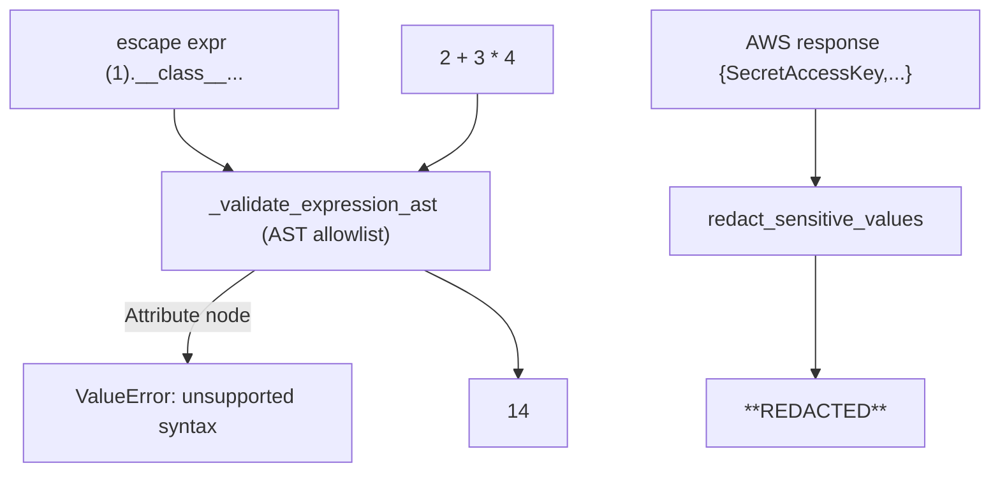

# Level 22 (v1.42): Tool Security Hardening
**Date:** 2026-06-02 | **File:** `08_production/safety_guardrails.py` (Iteration 13)
**Depends on:** L22 (guardrails) | **Unlocks:** safer tool-using agents

> v1.42 extension. Bound to strands-agents-tools 0.7.0. Adds Iteration 13.

---

## Part 1 — For Humans

### What We Built
Iteration 13: three SDK-level tool defenses that shipped in tools 0.7.0, all
demonstrable with NO model and NO AWS:
- **calculator** rejects Python sandbox-escape expressions before evaluating.
- **use_aws** redacts secret-bearing response fields and gates sensitive ops.
- **cron** collapses newline injection so one line can't smuggle a second entry.

### How It Works

```
  calculator("(1).__class__.__bases__[0].__subclasses__()")
        |
        v
  AST walk against an allowlist
        |
        +--> contains an Attribute node -> ValueError "unsupported syntax"
             (blocked BEFORE any eval)

  calculator("2 + 3 * 4") -> 14   (normal math still works)
```

### What Went Wrong
1. **The file already had 12 iterations**, not the 8 its docstring claimed — so
   the new work is Iteration **13**, and the file runs top-to-bottom through
   AWS-backed iters 9-12. (Those ran fine on live AWS; iter 10's Nova
   ConverseStream hit a handled `UnrecognizedClientException` and the file still
   completed.)
2. The actual security boundary is the internal `parse_expression` /
   `_validate_expression_ast`, not a top-level `calculator()` call — found by
   reading the source, not guessing.

### What Worked
1. **Offline verification** — wrote a standalone probe hitting the exact
   functions (`parse_expression`, `_sanitize_cron_line`, `redact_sensitive_values`)
   → 9/9 before touching the lesson. Tool security is pure local logic; no model
   needed. This made it the one Phase-1 lesson verifiable without the proxy.

### The Single Most Important Thing
Security primitives are the cheapest things to verify empirically — they're
deterministic and offline. Probe the actual enforcement function (the AST
validator, the sanitizer, the redactor) directly; don't route through an agent
to test whether a sandbox holds.

---

## Part 2 — For LLMs

### Architecture



```
 escape "(1).__class__..."        "2 + 3 * 4"
        |                              |
        v                              v
   _validate_expression_ast (AST allowlist)
        |                              |
   Attribute node                 only safe nodes
        v                              v
 ValueError "unsupported"            -> 14

 {SecretAccessKey: ...} -> redact_sensitive_values -> "**REDACTED**"
```

### Decision Log

| Decision | Why | Trade-off |
|----------|-----|-----------|
| probe `parse_expression` directly | it's the real enforcement boundary | not the user-facing tool entry |
| Iteration 13 (not 9) | file already had 12 iters | docstring count was stale |
| verify offline (no model) | tool security is deterministic | doesn't exercise the agent's tool-call path |

### Pseudocode — Key Patterns

```
assert raises ValueError: parse_expression("(1).__class__.__bases__[0].__subclasses__()")
assert parse_expression("2 + 3 * 4") == 14
assert redact_sensitive_values({"SecretAccessKey": x})["SecretAccessKey"] == "**REDACTED**"
assert "\n" not in _sanitize_cron_line("a\nb")
```

### Observation Log

| # | Category | Topic | Observation |
|---|----------|-------|-------------|
| 1 | pattern | tools-070-security-hardening | calculator AST sandbox, use_aws redaction (16 keys/17 ops), cron sanitize |
| 2 | insight | security-is-offline-verifiable | probe the enforcement fn directly; 9/9 with no model/AWS |

### Forward Links
- **Builds on L22**: adds SDK-native defenses atop the lesson's hand-rolled guardrails.
- **Revisit when**: exposing `calculator`/`use_aws`/`cron` to an untrusted agent.
