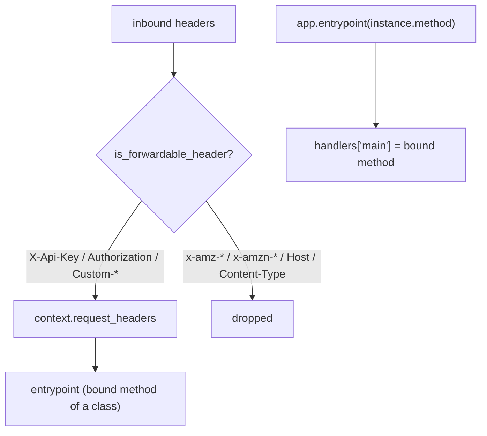

# Level 27 (v1.42): AgentCore Runtime — Header Forwarding + Class-Based Entrypoint
**Date:** 2026-06-02 | **File:** `04_production/agentcore_deploy.py`
**Depends on:** L27 (AgentCore deployment) | **Unlocks:** stateful runtime agents, per-request auth
**Versions:** bedrock-agentcore 1.12

> v1.42 extension. Two SDK-level runtime features, verified LOCALLY (no redeploy).

---

## Part 1 — For Humans

### What We Built
Two new AgentCore runtime capabilities: (1) the runtime **forwards an allowlisted
set of inbound HTTP headers** (like `X-Api-Key`) into your agent via
`context.request_headers`, and (2) your **entrypoint can be a bound method** of a
class — so a stateful object backs the agent, not just a module-level function.

### How It Works

```
  Inbound request headers
        |
   is_forwardable_header(name)?
     FWD: X-Api-Key, Authorization, X-Amzn-...-Custom-*
     drop: Host, Content-Type, x-amz-*, x-amzn-trace-id
        |
        v
   context.request_headers  --> reaches your entrypoint

  class GreetingAgent:               app.entrypoint(greeter.invoke)
     def invoke(self, payload, ctx): ----> handlers["main"] = bound method
        ctx.request_headers["X-Api-Key"]   (carries instance state)
```

### What Went Wrong
Nothing broke — the open question ("does this need a redeploy?") resolved to
**no**: these are SDK-level behaviors exercisable in-process. Saved a slow
runtime redeploy.

### What Worked
1. `is_forwardable_header` is a pure function — printed a FWD/drop table for a
   set of headers. `Content-Type` and `Host` are *restricted* (dropped);
   `X-Api-Key` and custom-prefix headers forward.
2. Registering a **bound method** (`app.entrypoint(greeter.invoke)`) and checking
   `handlers["main"].__self__ is greeter` proves the class instance backs it.
   Invoking it locally with a context carrying `X-Api-Key` returned
   `saw_api_key=True` — the forwarded header reached the entrypoint.

### The Single Most Important Thing
Per-request secrets/tenancy can ride in on forwarded headers (`X-Api-Key`,
custom-prefix) instead of being baked into the image — and a class-based
entrypoint lets that header drive *instance* behavior. Signing/infra headers
(`x-amz-*`, `Host`, `Content-Type`) are deliberately dropped, so you can't lean
on them inside the agent.

---

## Part 2 — For LLMs

### Architecture



```
 inbound headers --> is_forwardable_header?
     FWD: X-Api-Key, Authorization, Custom-*  --> context.request_headers
     drop: x-amz-*, x-amzn-*, Host, Content-Type
                                   |
                                   v
            entrypoint (bound method, carries instance state)
   app.entrypoint(instance.method) -> handlers['main'] = bound method
```

### Decision Log

| Decision | Why | Trade-off |
|----------|-----|-----------|
| verify locally (no deploy) | SDK-level behavior; pure functions + in-proc app | doesn't exercise the real edge header injection |
| bound-method entrypoint via `app.entrypoint(inst.method)` | clearest demo of class-backed agent | (the in-class `@decorator` form is the harder #474 case) |
| `SimpleNamespace` context for local invoke | avoids reverse-engineering `RequestContext` ctor | not the exact runtime context type |

### Pseudocode — Key Pattern

```
from bedrock_agentcore.runtime.models import is_forwardable_header
is_forwardable_header("X-Api-Key")     # True
is_forwardable_header("x-amz-date")    # False (SigV4)

class GreetingAgent:
    def invoke(self, payload, context=None):
        key = (getattr(context, "request_headers", None) or {}).get("X-Api-Key")
        ...
app.entrypoint(GreetingAgent("Hello").invoke)   # bound method as entrypoint
```

### Observation Log

| # | Category | Topic | Observation |
|---|----------|-------|-------------|
| 1 | insight | p27-runtime-features-locally-testable | no redeploy needed; SDK-level, in-proc verifiable |
| 2 | pattern | forwardable-header-allowlist | FWD X-Api-Key/Auth/Custom-*; drop x-amz-*/x-amzn-*/Host/Content-Type |
| 3 | pattern | class-based-bound-method-entrypoint | `app.entrypoint(inst.method)`; forwarded header reaches entrypoint |

### Forward Links
- **Builds on L27**: adds per-request header context + stateful entrypoints to the deploy lesson.
- **Revisit when**: passing per-tenant API keys to a deployed agent, or backing an agent with a stateful class.
