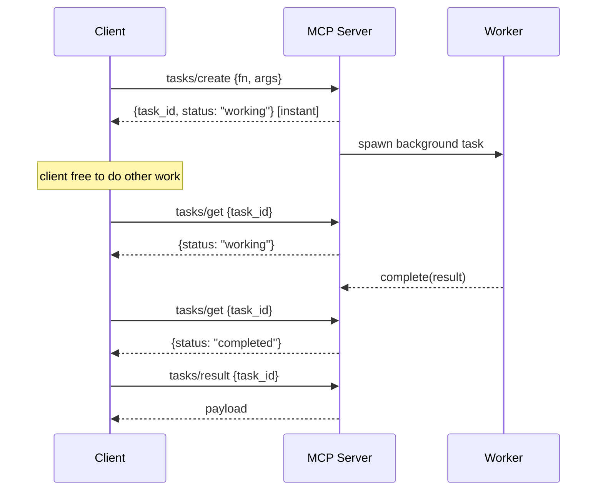

# Level 28: SDK Advances — Concurrency, MCP Tasks, Hooks, Declarative Config
**Date:** 2026-03-17 | **File:** `11_platform/sdk_advances.py`
**Depends on:** L9 (MCP), L21 (Observability/hooks)
**Unlocks:** L29 (Steering), L30 (Skills Plugin) — both use the HookProvider API

---

## Part 1 — For Humans

### What We Built

Four SDK capabilities that were sitting in the library unused: a way to run
tools in parallel instead of one-at-a-time, a typed event system for hooking
into the agent lifecycle, the MCP tasks protocol for non-blocking async work,
and a declarative (JSON/dict) way to create agents without constructor code.

### How It Works

**Concurrency — two layers**

    Your @tool functions are plain Python callables.
    You can run them in parallel right now with asyncio:

    asyncio.gather()
         |
         +---> to_thread(tool_A, args)  -->  result_A  --+
         +---> to_thread(tool_B, args)  -->  result_B  --+--> all results
         +---> to_thread(tool_C, args)  -->  result_C  --+

    3 tools x 1s each = 1s total  (not 3s)

    ConcurrentToolExecutor does the same thing INSIDE the agent loop,
    but only fires when the LLM returns multiple tool calls in ONE turn:

    LLM response --> [call_A, call_B, call_C]  <-- single turn
                              |
                    ConcurrentToolExecutor
                              |
                    asyncio.gather(A, B, C)
                              |
                    merged results --> next LLM turn

    CAVEAT: Claude serialises by default (one tool per turn).
    Wire it in anyway -- it fires for free on the rare batch.

**Hook System**

    Agent lifecycle events fire in this order:

    BeforeInvocation
         |
         v
    BeforeModelCall --> [LLM] --> AfterModelCall
         |
         v
    BeforeToolCall --> [tool runs] --> AfterToolCall
         |
         (loop until done)
         v
    MessageAdded  (fires on every message added to history)
         |
         v
    AfterInvocation

    Two ways to attach your code:

    [Inline]                    [Class-based]
    agent.hooks                 class MyHooks(HookProvider):
      .add_callback(              def register_hooks(registry):
        BeforeToolCall,             registry.add_callback(...)
        my_fn                   Agent(hooks=[MyHooks()])
      )

**MCP Tasks vs Tools**

    TOOL (blocking):            TASK (non-blocking):

    client --> tools/call       client --> tasks/create
                  |                             |
               [waits]                   [returns immediately]
                  |                       task_id + "working"
               result                          |
                                         client free to do other work
                                               |
                                    poll tasks/get until "completed"
                                               |
                                         tasks/result --> payload

    Use tools for: quick lookups, calculations, short I/O
    Use tasks for: report generation, ML inference, multi-step pipelines

**config_to_agent**

    Dict or JSON file  -->  config_to_agent()  -->  Agent()
                                  |
                         validates schema (JSON Draft-7)
                         forwards extra kwargs to Agent()

### What Went Wrong

1. **First attempt: concurrency demo showed a regression (3.2s → 4.5s)**
   Cause: haiku serialised tool calls across turns; ConcurrentToolExecutor
   never fired because there was never a batch to execute. The demo contradicted
   itself — proving the opposite of what it claimed.
   Fix: demonstrate the mechanism directly with asyncio.gather() first, then
   explain ConcurrentToolExecutor as the agent-integrated version.

2. **MCP Tasks was a hollow type-printing exercise**
   Just listed TASK_STATUS_WORKING etc. with print statements. No lifecycle,
   no timing, no actual async behaviour shown.
   Fix: built InProcessTaskServer mirroring the real tasks/ protocol endpoints,
   with actual background asyncio tasks, polling, and cancel demo.

3. **`@tool` functions don't expose `.func`**
   Tried `fetch_population.func(city)` to call the raw function.
   The attribute is `_tool_func` but direct call `fetch_population(city)` works.
   Fix: call tools directly — the DecoratedFunctionTool is callable.

4. **`"─" * 50` printed 50 newlines, not a line**
   `"\n─" * 50` repeats the 2-char string 50 times. Each `─` ended up on its
   own line. Lesson: never embed newlines inside a repeated string.
   Fix: `"\n" + "-" * 50`

5. **Folder named `11_2026_updates` broke naming convention**
   All other folders are topic-based (01_basics, 06_memory).
   Fix: renamed to `11_platform` before writing any files.

6. **haiku alias (`claude-3-5-haiku-20241022`) deprecated by Anthropic**
   Got 404 mid-lesson. Had to update both LiteLLM proxy config and
   tools/models.py to point to claude-haiku-4-5-20251001.

### What Worked

1. **Probe scripts before the main file** — writing small throwaway `.py`
   probes in `_sandbox/` to validate each API surface before committing to
   the implementation. Caught the `.func` issue early, confirmed
   FastMCP has no task API before wasting time on it.

2. **`asyncio.to_thread()` for sync tools** — any blocking @tool function
   becomes parallel-safe by wrapping in `to_thread`. No async rewrite needed.

3. **`HookProvider` as composable bundles** — `Agent(hooks=[A(), B()])` stacks
   cleanly. Each provider is self-contained; you can mix timing, audit, and
   safety hooks without any coupling between them.

4. **`config_to_agent` + kwargs** — the fact that extra kwargs forward to
   `Agent()` makes the experimental API practical: declarative config for the
   simple stuff, programmatic overrides for the complex stuff.

### The Single Most Important Thing

**Prove the mechanism before claiming the benefit.** The first concurrency demo
showed a slowdown because it trusted the LLM to batch — it never did. The fix
was to stop working through the LLM and demonstrate the underlying asyncio
mechanism directly, where the speedup is guaranteed and measurable. This is the
same principle as "the map is not the territory" — the agent interface is an
abstraction over asyncio; when the abstraction obscures the truth, go one layer
deeper and show the real thing.

---

## Part 2 — For LLMs

### Architecture

```mermaid
graph TD
    subgraph "Iteration 1: Concurrency"
        A[asyncio.gather] -->|to_thread| T1[Tool A]
        A -->|to_thread| T2[Tool B]
        A -->|to_thread| T3[Tool C]
        T1 & T2 & T3 --> M[merged results]
        CE[ConcurrentToolExecutor] -.->|same pattern\ninside agent loop| A
    end

    subgraph "Iteration 2: Hook System"
        EV[Agent Event] --> HR[HookRegistry]
        HR --> CB1[add_callback inline]
        HR --> CB2[HookProvider class]
        CB2 --> R[register_hooks]
        R -->|bulk| HR
    end

    subgraph "Iteration 3: MCP Tasks"
        TC[tasks/create] -->|returns immediately| TID[task_id + working]
        TID --> BG[background worker]
        BG --> TG[tasks/get polling]
        TG -->|completed| TR[tasks/result]
        TG -->|cancel| TK[tasks/cancel]
    end

    subgraph "Iteration 4: config_to_agent"
        CFG[dict or JSON file] --> CTA[config_to_agent]
        CTA -->|validates schema| AGT[Agent]
        KW[extra kwargs] -->|forwarded| AGT
    end
```





### Decision Log

| Decision | Why | Trade-off |
|----------|-----|-----------|
| asyncio.gather() before ConcurrentToolExecutor | Prove mechanism independent of LLM batching | Less "integrated" demo but guarantees proof |
| InProcessTaskServer simulation | FastMCP has no task API; mcp.server.experimental too complex for one level | Simulation is honest about what Strands 1.19 actually supports |
| Keep HookProvider iteration unchanged | It already worked cleanly in the first attempt | None |
| `11_platform/` folder name | Consistent with topic-based naming convention | Breaks any existing `11_2026_updates` references in docs |
| Defer full MCP task server | Would require mcp.server.lowlevel deep dive — a lesson in itself | Noted clearly; revisit when Strands MCPClient ≥ 1.23 |

### Pseudocode — Key Patterns

```
# Parallel tool execution
results = await gather(
    run_in_thread(tool_A, args),
    run_in_thread(tool_B, args),
    run_in_thread(tool_C, args)
)
# ConcurrentToolExecutor does this automatically when LLM batches

# Hook registration — two styles
agent.hooks.add_callback(EventType, handler_fn)       # inline

class MyHooks implements HookProvider:
    register_hooks(registry):
        registry.add_callback(EventType, self.handler)
Agent(hooks=[MyHooks()])                              # composable

# MCP task lifecycle
task = server.tasks_create(fn, args)    # returns immediately
while task.status == WORKING:
    task = server.tasks_get(task.task_id)
    sleep(poll_interval)
result = server.tasks_result(task.task_id)

# Declarative agent
agent = config_to_agent({name, prompt}, model=..., tools=[...])
```

### Observation Log

| # | Category | Topic | Observation |
|---|----------|-------|-------------|
| 1 | mistake | concurrent-demo-regression | ConcurrentToolExecutor shows slowdown when LLM serialises calls; never demonstrate executor through LLM without first proving direct asyncio works |
| 2 | mistake | mcp-tasks-hollow | Printing mcp.types constants is not a lesson; build the lifecycle or explicitly defer with a skeleton |
| 3 | mistake | tool-func-attr | @tool DecoratedFunctionTool has no .func attribute; call the tool directly |
| 4 | mistake | unicode-repeat-bug | `"\n─" * 50` repeats newline+char 50 times; use `"\n" + "-" * 50` |
| 5 | mistake | folder-naming | 11_2026_updates breaks topic-based convention; rename before adding files |
| 6 | mistake | haiku-deprecated | claude-3-5-haiku-20241022 removed by Anthropic mid-lesson; update to claude-haiku-4-5-20251001 |
| 7 | pattern | probe-first | Write _sandbox/*.py probes to validate each API surface before the main file |
| 8 | pattern | asyncio-to-thread | asyncio.to_thread(sync_fn, args) makes any blocking tool parallel without rewriting |
| 9 | pattern | hookprovider-composition | Agent(hooks=[A(), B()]) stacks cleanly; each HookProvider is self-contained |
| 10 | pattern | config-to-agent-kwargs | Extra kwargs to config_to_agent() forward to Agent() — declarative + programmatic blend |
| 11 | insight | prove-mechanism-not-abstraction | When an abstraction hides a regression, bypass it and demonstrate the underlying mechanism directly |
| 12 | insight | mcp-tasks-experimental | mcp.server.experimental has TaskSupport + ServerTaskContext; FastMCP has zero task API |
| 13 | insight | llm-serialises-by-default | Claude models serialise tool calls across turns by default; ConcurrentToolExecutor is defensive not guaranteed |

### Forward Links

- **Unlocks L29 (Steering)**: HookProvider is the plugin API that Steering uses to inject guidance at `BeforeToolCall` and `AfterModelCall`
- **Unlocks L30 (Skills Plugin)**: Same HookProvider + `BeforeInvocationEvent` for dynamic system prompt injection
- **Revisit when**: Strands MCPClient ≥ 1.23.0 lands — replace InProcessTaskServer simulation with real stdio MCP server using `mcp.server.experimental.enable_tasks()`
- **Revisit when**: SDK v1.26+ — swap `tool_executor=ConcurrentToolExecutor()` for `concurrent_invocation_mode=True`
