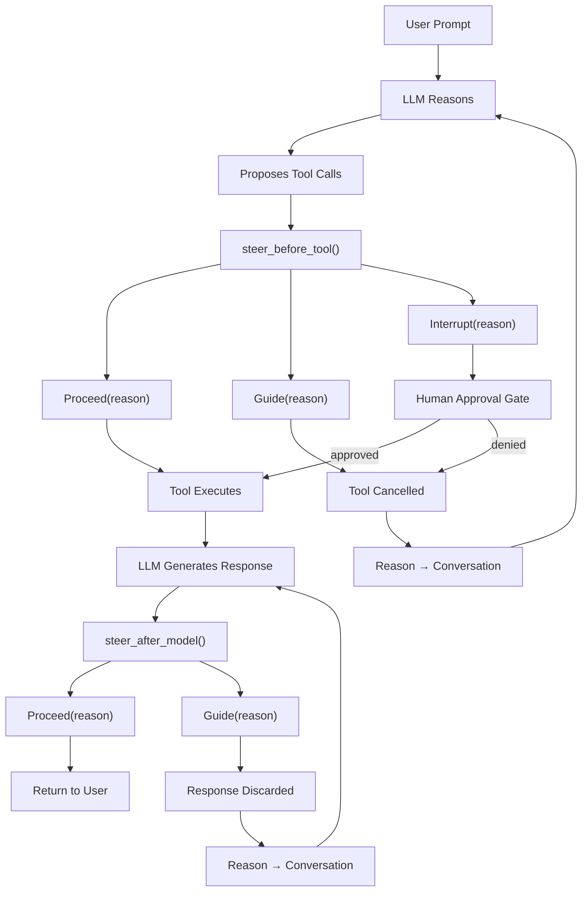
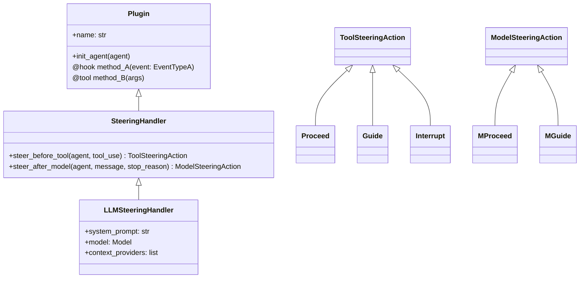
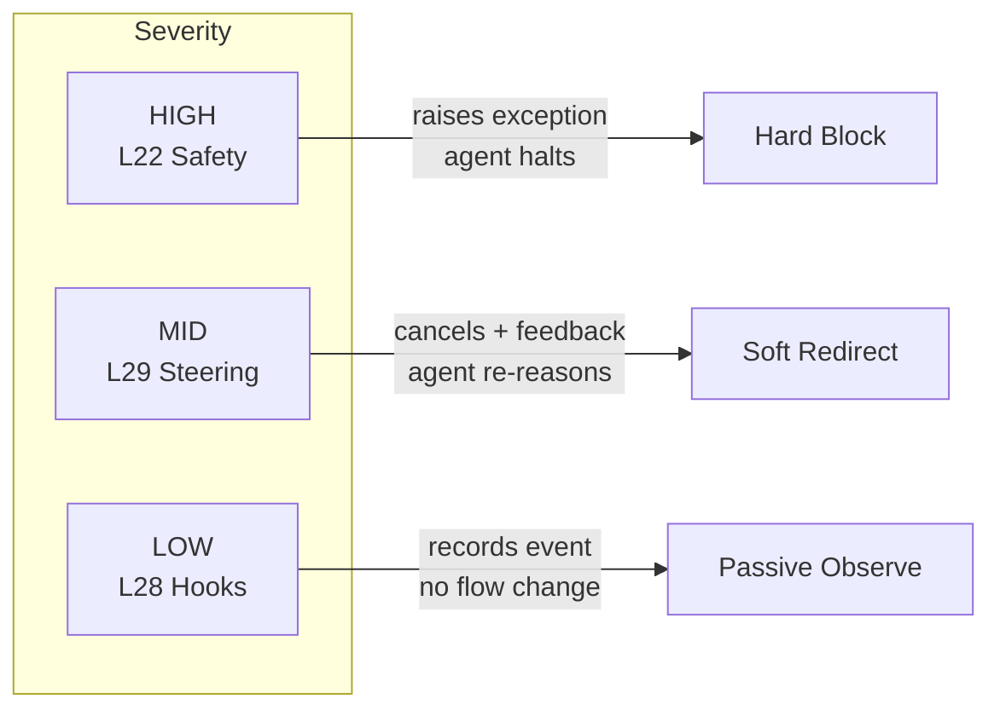

# Level 29: Strands Steering — Contextual Guidance via the Plugin API
**Date:** 2026-03-17 | **File:** `11_platform/steering.py`
**Depends on:** L28 (Plugin API / Hooks) | **Unlocks:** L30 (Skills Plugin)

---

## Part 1 — For Humans

### What We Built

A steering layer that sits beside an agent as a plugin, not inside it. Instead of crashing when the agent does something risky (L22 Safety) or silently logging it (L28 Hooks), steering *intercepts* the action, cancels it if needed, injects feedback into the conversation, and lets the agent re-reason with that new information. The agent learns from the redirect rather than hitting a wall.

### How It Works

Two injection points in the agent lifecycle:

```
  Agent receives prompt
         |
         v
  [LLM reasons] --> proposes tool calls
         |
  steer_before_tool()
         |
    +----+----+----------+
    |         |          |
  Proceed   Guide    Interrupt
    |         |          |
  tool     cancel +   human
  runs     feedback   approval
             |
         agent re-reasons
         with feedback


  [LLM generates response]
         |
  steer_after_model()
         |
    +----+---------+
    |              |
  Proceed        Guide
    |              |
  return to    discard + retry
   user        (reason injected)
```

Three before-tool actions:
- **Proceed** — let the tool run unchanged
- **Guide** — cancel the call; inject the reason as feedback; agent retries
- **Interrupt** — pause and ask a human; cancel if denied (HITL gate)

One extra after-model action:
- **Guide** — discard the model's response; inject the reason; model retries

### What Went Wrong

1. **Wrong method name across API versions.** v1.19 used `steer()`. v1.30 renamed it `steer_before_tool()`. Overriding the old name silently did nothing — no error, risky tools ran unblocked. Fix: read source before writing overrides.

2. **Wrong registration argument.** v1.30 SteeringHandler extends Plugin, not HookProvider. Passing it via `hooks=` no-ops silently. Must use `plugins=`. Fix: confirmed via MRO probe before writing main file.

3. **Action type split.** v1.19 had one `SteeringAction` union. v1.30 splits into `ToolSteeringAction` (before-tool) and `ModelSteeringAction` (after-model). Wrong import fails at runtime, not at import time. Fix: always inspect module exports first.

4. **Module relocation.** `LLMSteeringHandler` moved from `strands.experimental.steering` to `strands.vended_plugins.steering`. Old module still exists but is stale — silent import failure. Fix: probe-first with `importlib` to locate correct home.

### What Worked

1. **Probe-first development.** Eight probe scripts before writing `steering.py`. The main file ran clean on first attempt. No import errors, no API surprises.

2. **Three-tier control hierarchy.** Safety (L22) = hard block. Steering (L29) = soft redirect. Hooks (L28) = passive observer. Choosing the right tier requires knowing what failure mode you want: crash, redirect, or log.

3. **Guide as a teaching moment.** When Guide fires on an external email, the agent doesn't error — it asks "which company.com address did you mean?" The user experience is far better than a crash or a silent drop.

4. **steer_after_model for quality gates.** Tone and completeness rules live in the plugin, not the system prompt. The system prompt stays clean; the quality policy is a separate, testable concern.

### The Single Most Important Thing

Steering is a *collaboration* mechanism, not a control mechanism. Guide says "not that way — here's why" and trusts the agent to find a better path. This is the right default for most policies: reserve hard blocks (Safety, Interrupt) for truly irreversible actions, and use Guide for everything else so the agent can still accomplish the user's intent through an approved route.

---

## Part 2 — For LLMs

### Architecture — Steering as Plugin



### Architecture — Plugin ABC Unification



### Architecture — Three-Tier Control Hierarchy



### Decision Log

| Decision | Why | Trade-off |
|----------|-----|-----------|
| SteeringHandler extends Plugin (v1.30) | Unifies hooks + tools + init under one registration | Breaking change from HookProvider in v1.19 |
| Guide re-reasons instead of erroring | Better UX; agent can find approved alternative | Agent may loop if policy is too strict |
| steer_after_model() new in v1.30 | Quality gates without system prompt pollution | Additional LLM call per response when firing |
| LLMSteeringHandler isolated steering LLM | No shared state with main agent; clean separation | Extra latency per tool call evaluation |
| LedgerProvider for context | Steering LLM sees full tool history — can detect patterns | Larger steering prompt; slightly more tokens |

### Pseudocode — Key Patterns

```
# Pattern 1: @hook auto type inference
class MyPlugin extends Plugin:
    name = "my_plugin"

    @hook  # type inferred from annotation
    def before_tool(self, event: BeforeToolCallEvent):
        log(event.tool_use.name)

Agent(plugins=[MyPlugin()])
# registers hook AND any @tool methods in one call

# Pattern 2: steer_before_tool (v1.30)
class MyPolicy extends SteeringHandler:

    async steer_before_tool(agent, tool_use, **kwargs) -> ToolSteeringAction:
        if tool_use.name in DESTRUCTIVE:
            return Interrupt(reason="Requires human approval")
        if violates_policy(tool_use):
            return Guide(reason="Why + what to do instead")
        return Proceed(reason="OK")

# Pattern 3: steer_after_model (v1.30 exclusive)
class ToneEnforcer extends SteeringHandler:

    async steer_after_model(agent, message, stop_reason, **kwargs) -> ModelSteeringAction:
        text = extract_text(message)
        if sentence_count(text) < 2 and retry_count < MAX:
            return Guide(reason="Too brief — please elaborate")
        return Proceed(reason="Quality gate passed")

# Pattern 4: LLMSteeringHandler
policy = """
  Rules in plain English:
  1. delete_file -> interrupt
  2. send_email -> guide
  3. everything else -> proceed
"""
steering = LLMSteeringHandler(
    system_prompt = policy,
    model = secondary_llm,
    context_providers = [LedgerProvider()]  # adds tool history
)
Agent(plugins=[steering])
```

### Observation Log

| # | Category | Topic | Observation |
|---|----------|-------|-------------|
| 1 | mistake | steer-method-rename-v130 | `steer()` renamed to `steer_before_tool()` in v1.30; old override silently no-ops |
| 2 | mistake | steerer-wiring-hooks-vs-plugins | `hooks=` silently no-ops for SteeringHandler in v1.30; must use `plugins=` |
| 3 | mistake | unified-steeringaction-split | `SteeringAction` split into `ToolSteeringAction` / `ModelSteeringAction` in v1.30 |
| 4 | mistake | llmsteering-module-moved | LLMSteeringHandler moved from `strands.experimental.steering` → `strands.vended_plugins.steering` |
| 5 | pattern | hook-type-inference | `@hook` infers event type from annotation; no explicit EventType arg needed |
| 6 | pattern | probe-before-main-file | 8 probe scripts → steering.py clean on first run; zero import or API surprises |
| 7 | pattern | three-tier-control-hierarchy | Safety = crash, Steering = redirect, Hooks = observe; choose tier by severity |
| 8 | pattern | llm-steering-policy-as-text | Natural-language policy in LLMSteeringHandler; non-engineers can write governance rules |
| 9 | insight | steering-is-polite-no | Guide cancels + injects feedback; agent re-reasons toward an approved path (vs. Safety's hard stop) |
| 10 | insight | after-model-quality-enforcement | steer_after_model() enforces quality without polluting system prompt; policy stays in plugin |
| 11 | insight | plugin-abc-unifies-extensions | Plugin registers hooks + tools + init_agent in one `plugins=` call; replaces fragmented setup |
| 12 | question | stacked-steering-handlers | Can multiple SteeringHandlers compose? Chain vs. compete? Untested. |

### Forward Links

- **Unlocks L30 (Skills Plugin)**: Same Plugin base class used for composable skill libraries; steering patterns apply directly
- **Revisit when**: Building governance layers for production agents; implementing HITL approval gates; enforcing output quality constraints without touching system prompts
- **Related patterns from L28**: HookProvider (passive observer) is the predecessor; Plugin @hook is the v1.30 replacement
- **Related patterns from L22**: Safety raises exceptions; Steering redirects with feedback — complementary, not competing
