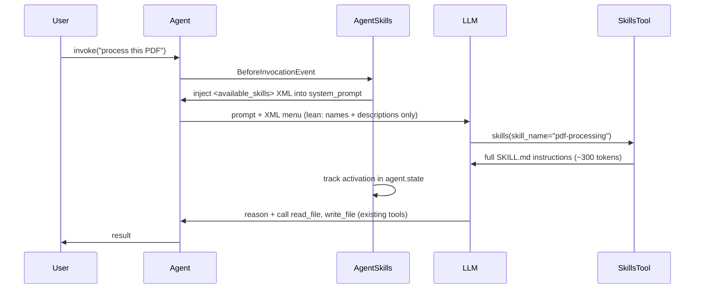
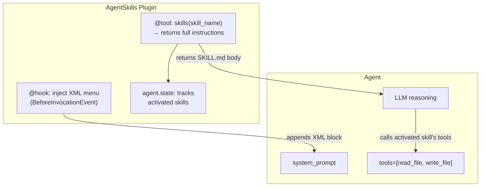
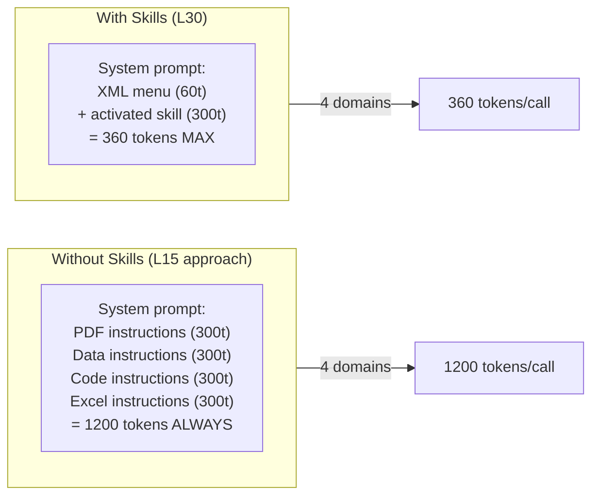

# Level 30: Skills Plugin — Progressive Disclosure for Agent Knowledge
**Date:** 2026-03-17 | **File:** `11_platform/skills_plugin.py`
**Depends on:** L28 (Plugin API), L15 (Context Management) | **Unlocks:** L31 (Workflow)

---

## Part 1 — For Humans

### What We Built

A way to give an agent specialised domain knowledge on demand — without loading it all upfront. Think of it like a reference library on a shelf: the agent knows what books exist (the XML discovery menu), and fetches the one it needs (skill activation) only when the task requires it. Before L30, a multi-domain agent had to cram every domain's instructions into the system prompt on every call, even if only one domain was relevant. Now it doesn't.

### How It Works

```
  AgentSkills plugin registered
         |
  BeforeInvocationEvent fires
         |
  XML menu injected into system prompt:
  +-------------------------------+
  | <available_skills>            |
  |   <skill>                     |
  |     <name>pdf-processing</name>|
  |     <description>...</descr.> |
  |   </skill>                    |
  |   ... (names only, lean)      |
  | </available_skills>           |
  +-------------------------------+
         |
  [LLM reasons with task + menu]
         |
  LLM calls: skills("pdf-processing")
         |
  skills() tool returns full SKILL.md
  instructions (~300 tokens)
         |
  [LLM now has full domain knowledge]
         |
  LLM executes task using existing tools
  (read_file, write_file, etc.)
         |
  Activation recorded in agent.state
```

Three phases:
- **Discovery** — agent sees XML menu with skill names + descriptions only (lean, ~60 tokens total)
- **Activation** — agent calls `skills(skill_name=...)` → full SKILL.md instructions returned
- **Execution** — agent follows skill instructions using its registered tools

### What Went Wrong

Nothing significant — the probe-first pattern paid off completely. `skills_plugin.py` ran clean on first attempt:
1. No import errors — found the module in `strands.vended_plugins.skills` immediately via probe.
2. No API surprises — read `AgentSkills` and `Skill` source before writing the main file.
3. No wiring issues — `plugins=` was already familiar from L28/L29.

The one non-surprise: stub `read_file` tools returning `[contents of path]` caused the agent to ask for clarification rather than demonstrate a fully clean flow — expected in a learning environment with fake tools.

### What Worked

1. **Mixed source list.** `AgentSkills(skills=[path_to_dir, skill_instance])` freely mixes paths and `Skill` objects. No need to pre-separate them. Resolves everything internally.

2. **Probe-first → zero surprises.** Two probe scripts (exports + source) before writing the lesson. All four skill-related classes understood before a single line of lesson code written.

3. **State tracking for testability.** `get_activated_skills(agent)` returns which skills were activated in order. In tests, this lets you assert "given a PDF task, the agent should activate pdf-processing, not code-review".

4. **Dynamic skill list.** `set_available_skills()` can update the skill registry mid-session. The XML block is re-injected on every call (old one removed, new one appended), so the agent sees the updated list automatically. Useful for conditional or role-based skill loading.

### The Single Most Important Thing

Skills are **instruction packages**, not execution units — this is a fundamental architectural distinction. Tools *do* things; skills teach the agent *how* to do things using existing tools. An agent with 20 skills and 5 tools reasons with whichever skill was activated, then calls the same 5 tools. Skills shape the reasoning layer; tools are the execution layer. This separation means you can evolve domain knowledge (update SKILL.md) without changing any code, and swap tools without rewriting skill instructions.

---

## Part 2 — For LLMs

### Architecture — Skills Lifecycle



### Architecture — Skills vs Tools vs Hooks



### Architecture — Context Bloat: L15 vs L30



### Decision Log

| Decision | Why | Trade-off |
|----------|-----|-----------|
| XML format for discovery block | XML reliably parsed by LLMs; unambiguous tags vs YAML indent sensitivity | Verbose vs JSON; XML escaping required |
| XML refreshed on every BeforeInvocationEvent | Supports dynamic `set_available_skills()` mid-session | Extra string manipulation per call |
| `strict=False` default for SKILL.md validation | Tolerant loading; warns on mismatch instead of raising | Name/directory mismatches silently continue |
| `agent.state` for activation tracking | Per-agent; single plugin instance shareable across multiple agents | State cleared if agent is recreated |
| `allowed_tools` not yet enforced (experimental) | Declared intent; enforcement not yet implemented | Cannot yet restrict skill to specific tools at runtime |

### Pseudocode — Key Patterns

```
# Pattern 1: Minimal inline skill
skill = Skill(name="invoice-processing",
              description="Extract line items from invoices",
              instructions="# Instructions\n1. Find vendor...\n2. Extract line items...")
agent = Agent(plugins=[AgentSkills(skills=[skill])])

# Pattern 2: File-based skills from directory
# Directory structure:
#   skills/pdf-processing/SKILL.md
#   skills/data-analysis/SKILL.md
# SKILL.md format:
#   ---
#   name: pdf-processing          # must match directory name
#   description: Extract PDFs
#   allowed_tools: [read_file]
#   ---
#   # Instructions
#   Step 1: ...
agent = Agent(plugins=[AgentSkills(skills=["./skills/"])])

# Pattern 3: Mixed sources
plugin = AgentSkills(skills=[
    "./skills/",           # parent dir → loads all SKILL.md subdirs
    "./skills/my-skill",   # specific skill dir
    Skill(name="...", description="...", instructions="..."),  # inline
])

# Pattern 4: Dynamic skill update mid-session
plugin.set_available_skills([updated_skill_list])
# Next agent call sees new XML menu automatically

# Pattern 5: Test skill activation
result = agent("process this PDF")
activated = plugin.get_activated_skills(agent)
assert "pdf-processing" in activated
```

### Observation Log

| # | Category | Topic | Observation |
|---|----------|-------|-------------|
| 1 | pattern | skills-mixed-sources | `skills=` list freely mixes `Skill` instances, skill dirs, and parent dirs — resolved uniformly |
| 2 | pattern | skill-activation-tracking | `get_activated_skills(agent)` returns ordered activation list from `agent.state` — use for assertions |
| 3 | pattern | skills-xml-refresh-per-invocation | XML block removed + re-injected on every BeforeInvocationEvent — dynamic skill updates work live |
| 4 | pattern | skillmd-directory-name-must-match | `name` in SKILL.md frontmatter must match parent dir name; mismatch → warning or raise (strict=True) |
| 5 | insight | skills-are-knowledge-not-execution | Skills = instruction packages; tools = execution units. Skills shape reasoning; tools do the work |
| 6 | insight | proactive-vs-reactive-context | L30 prevents context bloat proactively; L15 trimmed it reactively. At 4+ domains: 840 tokens saved/call |
| 7 | insight | xml-discovery-intentional | XML chosen for discovery block over YAML/JSON — LLMs parse XML tags more reliably in prompt context |
| 8 | question | skill-resource-files | `scripts/`, `references/`, `assets/` subdirs listed in activation response — untested; may enable richer workflows |

### Forward Links

- **Unlocks L31 (Workflow)**: Workflow tasks could activate skills per step — domain expertise scoped to the task that needs it
- **Unlocks L32 (A2A Protocol)**: Remote agents with AgentSkills — skills could be syndicated across agent boundaries
- **Revisit when**: Building multi-domain agents (analyst + reviewer + summariser in one agent); when context costs become visible in production; when domain knowledge needs to be updatable without code changes
- **Connects backward to L15**: L15 (context management) is the symptom; L30 (skills) is the cure — always reach for Skills before manual context trimming
- **Connects backward to L28/L29**: Same `Plugin` base class; `@hook` on `BeforeInvocationEvent` is the injection point
