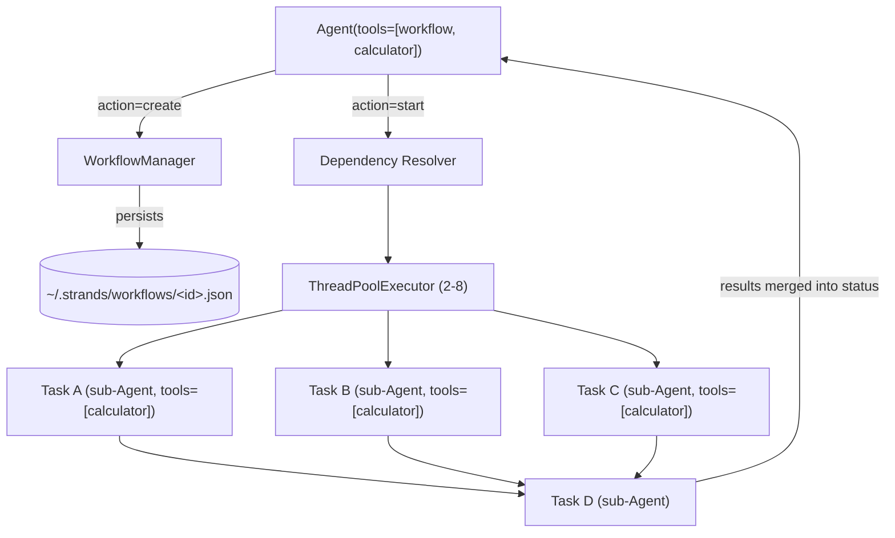

# Level 31: Workflow Pattern — Deterministic DAG Pipelines
**Date:** 2026-03-18 | **File:** `11_platform/workflow_pattern.py`
**Depends on:** L6 (Agents-as-Tools), L7 (Swarm), L8 (Graph) | **Unlocks:** L32 (A2A — remote agents as workflow nodes)

> Backfill note: this reflection was written 2026-05-03; the implementation and probe land 2026-03-18 (file mtimes), between L30 (Mar 18 02:13) and L32 (Mar 18 03:17). Observations carry the original-completion timestamps.

---

## Part 1 — For Humans

### What We Built
A pre-planned multi-step pipeline where each task is a small agent and the dependencies between tasks form a DAG. The workflow tool resolves the dependency order, dispatches tasks that are ready in parallel to a thread pool, and feeds each downstream task the outputs of its predecessors automatically. We exercised three shapes: a linear 3-step pipeline, a diamond fan-out/fan-in, and a 6-task graph with priority-driven scheduling.

### How It Works

```
+------------------------------+
|  Agent(tools=[workflow,      |
|               calculator])   |
+--------------+---------------+
               |
               v  workflow(action=create, tasks=[...])
+------------------------------+
|     WorkflowManager          |
|  (state in-mem + on disk)    |
+--------------+---------------+
               |
               v  workflow(action=start)
+------------------------------+
|   Dependency resolver        |
|   picks all ready tasks      |
+--------------+---------------+
               |
   +-----------+-----------+
   v           v           v
[task A]   [task B]    [task C]    <- run in parallel
   \           |           /          (ThreadPoolExecutor 2-8)
    \          |          /
     +---------+---------+
               |
               v
          [task D]                  <- waits for A,B,C results;
                                       receives them as prompt context
```

### What Went Wrong
1. **Empty `tools: []` does not actually clear inherited tools.** Setting an empty list looked like the obvious "give this task no tools" knob, but the inheritance check is truthiness-based — empty list is falsy in Python, so it behaves identically to omitting the key entirely. The task ends up with the parent's full toolbox.
2. **Forgetting to specify `tools` per task** would have caused recursive sub-workflows: task sub-agents inherit `workflow` from the parent and the LLM happily calls it on itself. We caught this from the strands_tools docs and the project's "probe before code" rule before it bit us at runtime.

### What Worked
1. **Probe first.** `probe_workflow_api.py` validated the response shape (a plain dict with a `content[]` list of `{text}` items, not a streaming `AgentResult`) before we wrote the helper that prints output. The `show()` function in the implementation is a direct consequence of that probe.
2. **One real, harmless tool per task.** Specifying `"tools": ["calculator"]` on every task gives sub-agents a non-recursive toolbox. The LLM never calls calculator on a reasoning prompt, so it amounts to "give this task safe tools and exclude `workflow`."
3. **Let the DAG do the parallelism.** No flags, no manual `asyncio.gather`. Two tasks both depending only on `root` execute simultaneously because the resolver dispatches every ready task at once. Priority (5 high → 1 low) only breaks ties among siblings; it never overrides dependencies.

### The Single Most Important Thing
Workflow is the right multi-agent primitive precisely when the structure is fixed at design time. If you know the steps and the dependencies up front, encoding them as a DAG buys you free parallelism, automatic context-passing between steps, persistent state on disk, and an auditable execution trace — for the cost of writing each step as a JSON dict. Reach for Swarm when the agents themselves should decide who runs next, Graph when the path branches at runtime, and Workflow when the pipeline is the plan.

---

## Part 2 — For LLMs

### Architecture



```
+--------------------------------------+
|  Agent(tools=[workflow, calculator]) |
+--+--------------+--------------------+
   |              |
   | create       | start
   v              v
+----------+   +-------------------+
| Workflow |   | Dependency        |
| Manager  |   | Resolver          |
+----+-----+   +---------+---------+
     |                   |
     v                   v
[~/.strands/    +-----------------+
 workflows/     |  ThreadPool 2-8 |
 <id>.json]    +--+----+----+-----+
                  |    |    |
                  v    v    v
              [TaskA][TaskB][TaskC]   <- parallel
                   \   |   /
                    v  v  v
                  [Task D]            <- waits, gets
                       |                 prior outputs
                       v                 in prompt
                  status / parent
```

### Decision Log

| Decision | Why | Trade-off |
|----------|-----|-----------|
| Use `strands_tools.workflow`, not custom orchestration | Built-in DAG resolver + thread pool + persistence + context passing | Less control over executor; dependent on strands_tools API |
| `"tools": ["calculator"]` on every task | Prevents inheritance of `workflow` -> recursion; calculator is benign | Tasks technically have a tool they don't need |
| Parent agent has both `workflow` AND `calculator` | Tasks need at least one non-`workflow` tool name to reference | Tiny extra surface area on parent |
| `callback_handler=None` on parent | Suppress parent narration; sub-agent task output already streams | Lose parent thinking trace |
| Deterministic `workflow_id` per iteration (e.g. `l31_diamond`) | Reproducible state files; explicit cleanup path | Two concurrent runs of the same script collide |
| Always call `delete` at end of iteration | Avoid orphaned state files in `~/.strands/workflows/` | Must remember; not automatic |

### Pseudocode — Key Patterns

```
# Pattern 1: build a workflow
parent = Agent(tools=[workflow_tool, at_least_one_other_tool])
parent.workflow(
    action = create,
    workflow_id = stable_string,
    tasks = [
        for each step:
            { task_id, description, dependencies=[...], priority, tools=[real_tool] }
    ]
)

# Pattern 2: run + observe
parent.workflow(action=start, workflow_id=...)   # blocks until DAG drains
parent.workflow(action=status, workflow_id=...)  # per-task progress / timing
parent.workflow(action=delete, workflow_id=...)  # cleanup

# Pattern 3: avoid recursion
for every task:
    MUST set tools = [some_real_tool_name]   # NOT [] (falsy -> inherits all)
    MUST NOT include workflow_tool in that list

# Pattern 4: dependency-driven parallelism
independent_tasks = { tasks whose deps are all satisfied now }
dispatch(independent_tasks) in parallel
when each finishes -> recompute ready set
priority breaks ties among ready set; never overrides deps

# Pattern 5: pattern selection
if collaboration is freeform and agents should hand off autonomously:
    use Swarm (L7)
elif the path branches at runtime based on agent decisions:
    use Graph (L8)
elif structure and dependencies are known upfront:
    use Workflow (L31)   <-- this level
```

### Observation Log

| # | Category | Topic | Observation |
|---|----------|-------|-------------|
| 1 | pattern  | probe-before-implementation | Probed import path, call shape, and dict response BEFORE writing the implementation |
| 2 | insight  | task-tool-inheritance-recursion | Tasks without explicit `tools` inherit ALL parent tools incl. `workflow` -> recursion |
| 3 | mistake  | empty-tools-list-falsy | `"tools": []` does NOT prevent inheritance — empty list is falsy in the truthiness check |
| 4 | insight  | automatic-parallel-dispatch | Tasks with simultaneously-satisfied deps run in parallel via ThreadPoolExecutor (2-8 workers) |
| 5 | insight  | priority-tiebreak-only | Priority (1-5) only breaks ties among ready siblings; never overrides dependencies |
| 6 | insight  | automatic-context-passing | Dependent tasks receive `Previous task results:\nResults from X: ...` in their prompt automatically |
| 7 | pattern  | workflow-state-persistence | State persists to `~/.strands/workflows/<id>.json`; explicit `delete` is required for hygiene |
| 8 | pattern  | three-pattern-decision-tree | Selection rule: Swarm=freeform handoff, Graph=runtime path, Workflow=fixed DAG |
| 9 | insight  | dict-response-not-stream | `agent.tool.workflow(...)` returns a dict, not a streaming `AgentResult` |
| 10 | question | workflow-meets-a2a | Can a remote A2A agent (L32) be referenced as a workflow task executor? Resolve in L32 |

### Forward Links

- **Unlocks L32 (A2A Protocol):** workflows are currently in-process; L32 introduces remote agents over HTTP. Open question (#10) is whether A2A agents can be plugged in as task executors, turning workflow into a distributed orchestrator.
- **Composes with L41+ (orchestration patterns):** ReWOO and reflexion-style loops can use a Workflow as the deterministic spine and a higher-level controller decides whether to re-plan.
- **Revisit when:** building any pipeline whose structure is known at design time (ETL, multi-step research, scripted multi-stage prompts) — Workflow gives you parallelism, persistence, and dependency-context wiring for free; reach back here before hand-rolling orchestration.
- **Do NOT use when:** the next step depends on what an agent decides at runtime (use Graph, L8) or when agents must autonomously hand off mid-task (use Swarm, L7).
