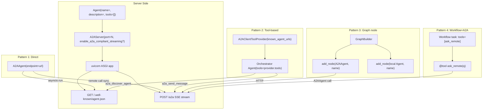

# Level 32: A2A Protocol — Remote Agents as Network Services
**Date:** 2026-03-17 | **File:** `11_platform/a2a_protocol.py`
**Depends on:** L31 (Workflow DAG), L8 (Graph) | **Unlocks:** L33+ (distributed topologies)

---

## Part 1 — For Humans

### What We Built
We exposed local Strands Agents as HTTP services using the A2A open standard, then
consumed them across seven iterations: direct calls, LLM-orchestrated routing, graph
nodes, diamond fan-out/in, compliant streaming, runtime discovery, and a Workflow+A2A
hybrid. The key capability gained: remote agents are indistinguishable from local ones
at every level of the stack — direct call, graph node, or workflow tool.

### How It Works

    ITERATIONS 1-3: The three access patterns
    ==========================================

    Direct (A2AAgent):              Tool-based (A2AClientToolProvider):
    +----------+   HTTP   +------+  +-------------+  discover  +------+
    | A2AAgent |--------->|Agent |  | Orchestrator|----------->|Agent |
    | remote() |          |+tool |  | LLM decides |  send_msg  |:9101 |
    +----------+          +------+  +-------------+            +------+

    Graph node (transparent):
    +----------+   HTTP   +------+     +-------+
    | A2AAgent |--------->|:9100 |---->| local |----> result
    | (node)   |          +------+     | Agent |
    +----------+                       +-------+
    GraphBuilder.add_node() — same call for remote and local

    ITERATIONS 4-7: Advanced patterns
    ==================================

    Diamond (iter 4):         Compliant streaming (iter 5):
         [planner]            Server: enable_a2a_compliant_streaming=True
         /      \             Client: unchanged — handles both wire formats
    [math:9100] [geo:9101]
         \      /             Dynamic discovery (iter 6):
        [synth]               provider seeded with 1 URL
                              orchestrator discovers :9103 at runtime
    Hybrid (iter 7):          → routes to both specialists
    Workflow DAG:
    [remote_a] [remote_b]     @tool ask_math(q):
          \     /               return str(A2AAgent(endpoint=...)(q))
         [local_sum]           → workflow tasks call remote via tool

### What Went Wrong

1. **`get_agent_card()` is async.** Called without `asyncio.run()` → returned
   a coroutine object. Fixed with `asyncio.run(remote.get_agent_card())`.

2. **Missing `a2a` pip extra.** `ModuleNotFoundError: No module named 'a2a'`
   on first import. Fix: `strands-agents[otel,a2a]` in `pyproject.toml`.

3. **ConcurrencyException on diamond branches.** When GraphBuilder dispatched
   math and geo branches in parallel, the geo server received two concurrent
   requests (one from diamond, one from a lingering prior call). A2AServer
   wraps a single Agent instance — same "one concurrent request" rule as
   threading. The server logged the error but the successful branch's result
   reached the synthesizer. Note: production servers should use separate
   Agent instances per concurrent load path.

### What Worked

1. **`**server_kwargs` in the helper.** A single one-character change to
   `start_server_bg(agent, port, **server_kwargs)` lets any A2AServer option
   flow through — compliant streaming, skills, push config, etc.

2. **Compliant streaming is a free upgrade.** `enable_a2a_compliant_streaming=True`
   on the server requires zero client changes. The UserWarning disappears, the
   result is identical. Just turn it on.

3. **Dynamic discovery scales the tool-based pattern.** The orchestrator
   discovered a history specialist it didn't know about at startup, listed
   both agents, and correctly routed maths to one and history to the other —
   purely from LLM judgment, no hardcoded routing.

4. **`@tool` wrapper is the cleanest L31+L32 bridge.** One 4-line function
   converts an A2AAgent call into a workflow-compatible tool. Parallel workflow
   tasks (remote_a, remote_b both priority 5) executed concurrently, each
   calling the remote math specialist, and the fan-in task added the results.

### The Single Most Important Thing

The `@tool` wrapper over `A2AAgent` is the composability key: it turns any
remote specialist into a tool that any local orchestration pattern (Workflow
DAG, Graph node, agent-as-tool) can call without modification. Combined with
dynamic discovery, you get a system that treats its agent topology as a runtime
property — new specialists register themselves, orchestrators discover them,
and the local orchestration logic never changes.

---

## Part 2 — For LLMs

### Architecture



### Decision Log

| Decision | Why | Trade-off |
|----------|-----|-----------|
| `**server_kwargs` in helper | Lets `enable_a2a_compliant_streaming` and other opts flow through without changing helper signature | Loses type safety on server kwargs |
| Reuse math_remote across iterations | Confirms daemon thread stays alive; shows port persistence | Single Agent instance = concurrency limit; parallel calls may ConcurrencyException |
| `@tool` wrapper captures `math_remote` closure | Simplest bridge; no new SDK dependency | Tool is bound to one endpoint; multi-endpoint routing needs provider pattern instead |
| Diamond graph with local planner root | GraphBuilder needs one `set_entry_point`; planner node as root enables two parallel A2A branches | Root node adds one LLM call; true two-entry-point graph not tested |

### Pseudocode — Key Patterns

```
# Pattern 1: Background server with options
fn start_server_bg(agent, port, **opts):
    a2a = A2AServer(agent=agent, port=port, **opts)
    app = a2a.to_starlette_app()
    server = uvicorn.Server(config(app, port))
    Thread(daemon=True, target=asyncio.run(server.serve())).start()
    wait until server.started
    return server

# Pattern 2: Compliant mode (server only change)
start_server_bg(agent, 9102, enable_a2a_compliant_streaming=True)
# client: A2AAgent(endpoint=...) — unchanged

# Pattern 3: Diamond graph
builder.add_node(planner, "plan")
builder.add_node(a2a_math, "math")   # A2AAgent
builder.add_node(a2a_geo,  "geo")    # A2AAgent
builder.add_node(synth,   "synth")   # local Agent
builder.add_edge("plan","math"), builder.add_edge("plan","geo")
builder.add_edge("math","synth"), builder.add_edge("geo","synth")
# GraphBuilder dispatches math+geo in parallel (no shared deps)

# Pattern 4: Dynamic discovery
provider = A2AClientToolProvider(known_agent_urls=[url_A])
# Start url_B later...
orchestrator = Agent(tools=provider.tools)
orchestrator("discover url_B, list agents, route tasks to both")
# LLM: a2a_discover_agent(url_B) → a2a_list_discovered_agents() → route

# Pattern 5: Workflow+A2A hybrid
@tool
def ask_math_specialist(question):
    return str(A2AAgent(endpoint=url)(question))

workflow_agent = Agent(tools=[workflow, ask_math_specialist, calculator])
workflow_agent.tool.workflow(create, tasks=[
    {task_id:"remote_a", tools:["ask_math_specialist"]},
    {task_id:"remote_b", tools:["ask_math_specialist"]},
    {task_id:"sum", tools:["calculator"], deps:["remote_a","remote_b"]},
])
workflow_agent.tool.workflow(start, workflow_id)
# remote_a and remote_b dispatch in parallel → each calls ask_math → HTTP
```

### Observation Log

| # | Category | Topic | Observation |
|---|----------|-------|-------------|
| 1 | mistake  | get-agent-card-async | `get_agent_card()` async → need `asyncio.run()` |
| 2 | mistake  | missing-a2a-extra | `strands-agents[a2a]` extra required |
| 3 | pattern  | background-server-thread | `to_starlette_app()` + uvicorn.Server + daemon thread + poll `server.started` |
| 4 | pattern  | a2a-client-tool-provider | 3 LLM tools: discover/list/send_message |
| 5 | insight  | a2aagent-agentbase-transparency | A2AAgent extends AgentBase → drop-in everywhere |
| 6 | insight  | agent-card-requires-name-description | Agent MUST have `name=` and `description=` |
| 7 | insight  | non-compliant-streaming-warning | Default is legacy; `enable_a2a_compliant_streaming=True` for spec |
| 8 | pattern  | diamond-graph-parallel-a2a | Two A2AAgent branches (same parent) run in parallel in GraphBuilder |
| 9 | insight  | compliant-streaming-client-transparent | Client unchanged; both wire formats handled automatically |
| 10 | pattern | dynamic-discovery-runtime | `a2a_discover_agent(url)` at runtime; service-registry pattern |
| 11 | pattern | a2a-workflow-tool-bridge | `@tool` over A2AAgent call; task `tools:["ask_remote"]` routes to remote |
| 12 | insight | a2a-server-concurrency-limit | One Agent instance = one concurrent request; ConcurrencyException under parallel load |
| 13 | question | compliant-streaming-client-compat | Does A2AAgent work with non-Strands A2A servers? (answered: yes for Strands-to-Strands) |

### Forward Links

- **Unlocks L33+**: Multi-host distributed topologies; heterogeneous framework
  interop (LangGraph or AutoGen server consumed by Strands A2AAgent client)
- **Connects to L6** (agents-as-tools): `@tool` wrapper pattern is exactly L6
  applied to a remote agent — same interface, network transport added
- **Connects to L8** (Graph): diamond and linear A2AAgent graph nodes verified
- **Connects to L31** (Workflow): `@tool` bridge lets workflow tasks call remote
  agents; parallel workflow tasks can call same remote concurrently (subject to
  Agent concurrency limit on server)
- **Revisit when**: scaling A2A servers under parallel load — create one Agent
  instance per uvicorn worker, not shared; or use `concurrent_invocation_mode`
  from L28 if supported in A2AServer context
