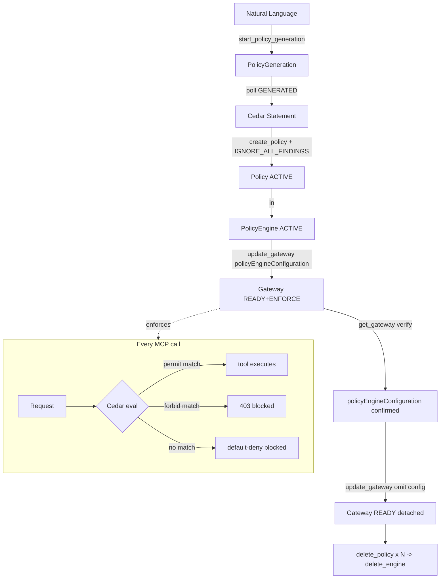

# Level 33: AgentCore Policy — Cedar Enforcement at the Gateway
**Date:** 2026-03-18 | **File:** `11_platform/agentcore_policy.py`
**Depends on:** L22 (in-process guardrails), L27 (AgentCore deployment)
**Unlocks:** L34 (Evaluations — measure what policy protects)

---

## Part 1 — For Humans

### What We Built
Cedar-based policy enforcement wired directly to an AgentCore Gateway. Instead
of writing Python guardrail logic inside the agent (L22), you declare WHO can do
WHAT to WHICH resource in Cedar syntax, and the Gateway enforces it in under 1ms
before any agent code ever runs. No agent redeploy needed to add or change rules.

### How It Works

    [Plain English or Cedar text]
             |
             v NL2Cedar (start_policy_generation)
    [Cedar statement] -- or hand-written if no tool schema
             |
             v create_policy (poll ACTIVE)
    [Policy] in [PolicyEngine]
             |
             v update_gateway(policyEngineConfiguration)
    +--------------------+
    |   Gateway (READY)  |  <-- every MCP call evaluated here
    +--------+-----------+
             |
        Cedar decision
       /           \
    permit        forbid
      |              |
    tool runs    request blocked
                 (no code change)

### What Went Wrong
1. **Wrong Cedar resource syntax** — bare `resource` wildcard rejected; then
   specific action + type resource rejected. Had to iterate to learn the two-rule
   constraint: type wildcard needs `resource is AgentCore::Gateway`, but combining
   a specific action with a type resource also fails — must use full ARN then.

2. **Wrong action name** — guessed `"delete"` as the forbidden action. Error
   message revealed the real registered action: `"l27agentcore-Target"`. Action
   names are not predictable and can only be discovered from API error messages.

3. **ValidationMode on both policies** — assumed only the permissive policy needed
   `IGNORE_ALL_FINDINGS`. The validator also rejects overly-restrictive policies
   (forbid-all). Both extremes need the override.

4. **Gateway IAM role missing permissions** — three successive permission errors
   before update_gateway succeeded: GetPolicyEngine, CheckAuthorizePermissions,
   AuthorizeAction. CDK had only granted `lambda:InvokeFunction` to the role.
   Had to add `bedrock-agentcore:*` manually.

5. **update_gateway is async** — calling detach immediately after attach raised
   "can't update while in UPDATING state". Every update_gateway call must be
   followed by polling get_gateway until READY.

6. **NL2Cedar returns empty findings** — the gateway has no registered tool
   schema, so NL2Cedar has nothing to map the natural language onto. Works in
   production with registered MCP tools; falls back to hand-written Cedar here.

### What Worked
1. **Idempotent startup cleanup** — list engines by name, delete policies first,
   wait for empty list, then delete engine. Prevents ConflictException on reruns.

2. **RUN_ID suffix on generation names** — appending last-6-digits of epoch to
   generation names avoids ConflictException when the engine is recreated
   within the same session.

3. **poll() helper** — single function with configurable done/fail statuses and
   interval covers engine, generation, policy, and gateway state machines.

4. **Error-message-driven discovery** — the Cedar validation errors told us
   exactly what was wrong and what the correct values were. The "did you mean?"
   pattern in AWS error messages is reliable for discovering registered action names.

### The Single Most Important Thing
The Gateway role is not automatically granted the permissions it needs to evaluate
Cedar policies — you must add `bedrock-agentcore:*` to the role's IAM policy
before `update_gateway` with a `policyEngineConfiguration` will succeed. This is
a silent gap in the CDK-generated stack and will block every Cedar attachment
attempt until fixed.

---

## Part 2 — For LLMs

### Architecture



### Decision Log

| Decision | Why | Trade-off |
|----------|-----|-----------|
| `validationMode=IGNORE_ALL_FINDINGS` on both policies | Default rejects both overly-permissive AND overly-restrictive Cedar | Bypasses safety checks — only safe when intent is explicit |
| `resource is AgentCore::Gateway` for broad permit | Bare resource wildcard rejected by API | Type-scoped wildcard is the minimum valid form |
| `resource == AgentCore::Gateway::"arn:..."` for forbid | Specific action requires specific resource | Must hard-code gateway ARN |
| `bedrock-agentcore:*` on gateway IAM role | Three distinct permissions needed incrementally | Overly broad for production; enumerate specific actions in real deployments |
| Poll gateway READY after each update_gateway | update_gateway is async; UPDATING blocks subsequent calls | Adds latency; required to avoid ValidationException |

### Pseudocode — Key Patterns

```
# Full policy lifecycle
engine = create_policy_engine(name)
poll get_policy_engine until ACTIVE

gen = start_policy_generation(engine_id, name+RUN_ID, gateway_arn, nl_text)
poll get_policy_generation until GENERATED
cedar = gen.findings or HAND_WRITTEN_FALLBACK

p1 = create_policy(engine_id, "permit_all", cedar=PERMIT_CEDAR,
                   validationMode=IGNORE_ALL_FINDINGS)
poll get_policy until ACTIVE

p2 = create_policy(engine_id, "forbid_ops", cedar=FORBID_CEDAR,
                   validationMode=IGNORE_ALL_FINDINGS)
poll get_policy until ACTIVE

update_gateway(gateway_id, ...all_fields...,
               policyEngineConfiguration={arn, mode:ENFORCE})
poll get_gateway until READY

# verify
gw = get_gateway(gateway_id)
assert gw.policyEngineConfiguration.arn == engine_arn

# detach
update_gateway(gateway_id, ...all_fields...)  # omit policyEngineConfiguration
poll get_gateway until READY

# cleanup (ordering matters)
for each policy: delete_policy; poll list_policies until empty
delete_policy_engine
```

```
# Cedar resource constraint rules
permit(principal is P, action,                    resource is AgentCore::Gateway)  # OK: type wildcard
permit(principal is P, action == A::"tool",       resource == AG::"arn:...")       # OK: specific+specific
forbid(principal,      action == A::"tool",       resource == AG::"arn:...")       # OK: specific+specific
# INVALID: action == A::"tool"  WITH  resource is AgentCore::Gateway
# INVALID: permit(principal, action, resource)   -- bare wildcard
```

### Observation Log

| # | Category | Topic | Observation |
|---|----------|-------|-------------|
| 1 | mistake | forbid-validation-mode | Both overly-permissive AND overly-restrictive policies need IGNORE_ALL_FINDINGS |
| 2 | mistake | gateway-role-permissions | Gateway IAM role needs bedrock-agentcore:* — CDK only grants lambda:InvokeFunction |
| 3 | mistake | update-gateway-async | update_gateway is async; must poll READY before chaining calls |
| 4 | mistake | nl2cedar-empty-findings | NL2Cedar returns empty when no tool schema registered on gateway |
| 5 | pattern | policy-lifecycle-full | Full lifecycle: engine→generation→policy→attach→verify→detach→cleanup with polling at each step |
| 6 | insight | cedar-resource-constraint-rules | Type wildcard OK for permit; specific action requires specific ARN; combining specific action + type wildcard rejected |
| 7 | insight | cedar-action-name-discovery | Action names discovered from API error "did you mean?" messages; format is typically `<gateway-id>-<target-suffix>` |
| 8 | pattern | idempotent-startup-cleanup | List by name → delete policies (await empty) → delete engine (await gone) prevents ConflictException on reruns |

### Forward Links

- **Unlocks L34**: Evaluations — now that we know what policy protects, we can measure whether agent behaviour stays within those boundaries
- **Revisit when**: Adding new MCP tools to the gateway (action names change, policies need update); implementing per-user Cedar conditions; rotating Cognito clients
