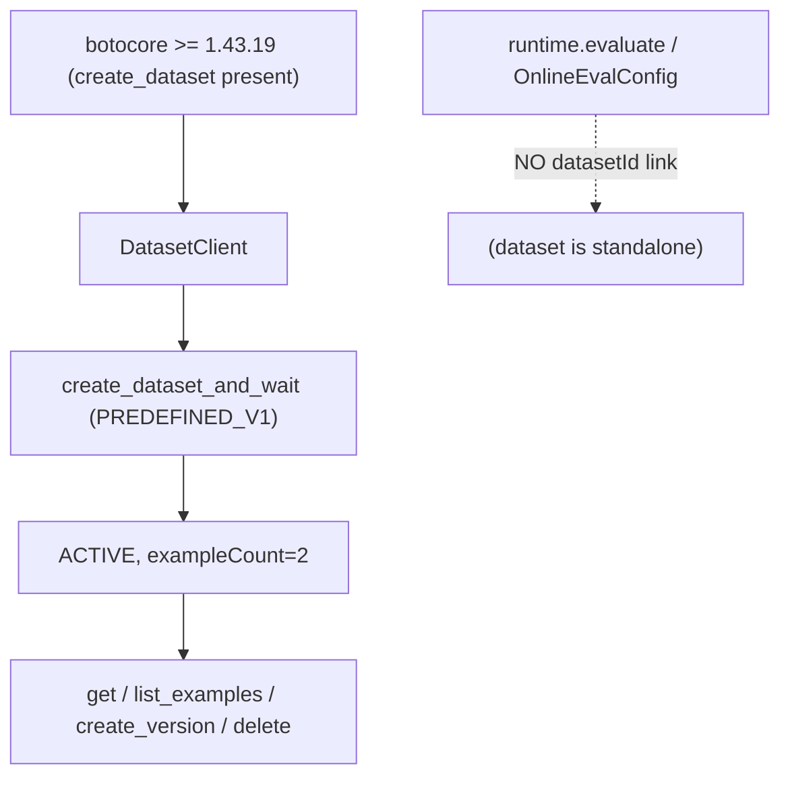

# Level 34 (v1.42): Evaluation Datasets via DatasetClient
**Date:** 2026-06-02 | **File:** `11_platform/agentcore_evaluations.py` (Iteration 4)
**Depends on:** L34 (evaluators/online/on-demand) | **Unlocks:** repeatable offline eval
**Versions:** bedrock-agentcore 1.12, **botocore 1.43.19** (hard requirement)

> v1.42 extension. The densest learning of the session — two wrong assumptions
> corrected empirically, and a schema reverse-engineered from the live API.

---

## Part 1 — For Humans

### What We Built
Iteration 4: `DatasetClient` to create/version/delete reusable **evaluation
datasets** ("golden sets") of curated conversational scenarios on AgentCore.

### How It Works

```
  DatasetClient(region, session)
        |
        v
  create_dataset_and_wait(
     datasetName, schemaType=PREDEFINED_V1,
     source={inlineExamples:{examples:[
        {scenario_id, turns:[{input, expected_output}]}
     ]}})  --> waits ACTIVE
        |
        +--> get / list_examples / create_version / delete  (self-cleaning)
```

### What Went Wrong
1. **Assumed DatasetClient just works** — it doesn't on the pinned botocore.
   `create_dataset` is ABSENT from botocore 1.43.2's service model
   (`hasattr`=False; the SDK bundles no model of its own). Present at 1.43.19.
   **Trap inside the trap:** `uv run` re-syncs to the lockfile and REVERTS an
   ad-hoc `uv pip install` — I had to test the upgrade via `.venv/bin/python`
   directly before trusting it. **Fix: bump boto3/botocore ≥ 1.43.19.**
2. **Assumed datasets feed `evaluate`** — they don't. Scanning every
   `bedrock-agentcore-control` op input: NO operation takes a `datasetId`;
   online eval samples CloudWatch Logs. A dataset is a STANDALONE golden set,
   not an `evaluate` input. The plan's premise was simply wrong.
3. **The example schema is undocumented** — discovered it by firing
   `create_dataset` and reading each `ValidationException` in turn.

### What Worked
1. **API errors as a schema oracle.** Five create attempts, each error naming
   the next missing field: `datasetName` regex → `scenario_id` → `turns` →
   `turns[].input` → `turns[].expected_output` → ACTIVE. Fast, reliable
   reverse-engineering when the shape is undocumented.
2. **Probe → bump → re-probe → build → full-run.** Verified the lifecycle
   standalone, then ran the whole lesson on AWS (self-cleans). Exit 0.

### The Single Most Important Thing
Two assumptions cost real time: that the SDK class implies the API is callable
(it needs a botocore the public model has caught up to), and that a resource is
wired the obvious way (datasets ≠ evaluate input). For a new AWS surface,
*probe the service model AND probe how the resource is consumed* — don't trust
the class name or the obvious wiring.

---

## Part 2 — For LLMs

### Architecture



```
 botocore>=1.43.19 (create_dataset exists)
        |
        v
   DatasetClient.create_dataset_and_wait(PREDEFINED_V1)
        |  source.inlineExamples.examples =
        |    [{scenario_id, turns:[{input, expected_output}]}]
        v
     status=ACTIVE
        |
   get / list_examples / create_version / delete

   evaluate / OnlineEvalConfig --X no datasetId--> dataset is STANDALONE
```

### Decision Log

| Decision | Why | Trade-off |
|----------|-----|-----------|
| bump boto3/botocore ≥1.43.19 | dataset API absent in 1.43.2 | core-dep bump (patch-level, low risk) |
| test upgrade via `.venv/bin/python` | `uv run` reverts ad-hoc installs to lock | bypasses uv's env management |
| schema by ValidationException | undocumented PREDEFINED_V1 shape | several live create calls |
| Iteration 4 = lifecycle demo | datasets aren't evaluate inputs | doesn't show dataset→eval (no such API) |

### Pseudocode — Key Pattern

```
# REQUIRES botocore >= 1.43.19
ds = DatasetClient(region, session).create_dataset_and_wait(
    datasetName="l34_capital_quiz_eval",            # [a-zA-Z][a-zA-Z0-9_]{0,47}
    schemaType="AGENTCORE_EVALUATION_PREDEFINED_V1",
    source={"inlineExamples": {"examples": [
        {"scenario_id": "...", "turns": [{"input": "...", "expected_output": "..."}]}]}})
list_dataset_examples(ds.datasetId); create_dataset_version_and_wait(ds.datasetId)
delete_dataset_and_wait(ds.datasetId)               # self-clean
```

### Observation Log

| # | Category | Topic | Observation |
|---|----------|-------|-------------|
| 1 | mistake | assumed-datasetclient-usable-on-pinned-botocore | `create_dataset` absent in botocore 1.43.2; needs 1.43.19; uv-run reverts ad-hoc installs |
| 2 | mistake | assumed-datasets-feed-evaluate | no op takes a datasetId; datasets are standalone golden sets |
| 3 | pattern | api-error-as-schema-oracle | ValidationExceptions reverse-engineered the PREDEFINED_V1 example schema |

### Forward Links
- **Builds on L34**: adds the dataset path beside continuous/sampled/on-demand eval.
- **Revisit when**: a control-plane API's SDK class exists but the call 404s/AttributeErrors — check the botocore service-model version first.
