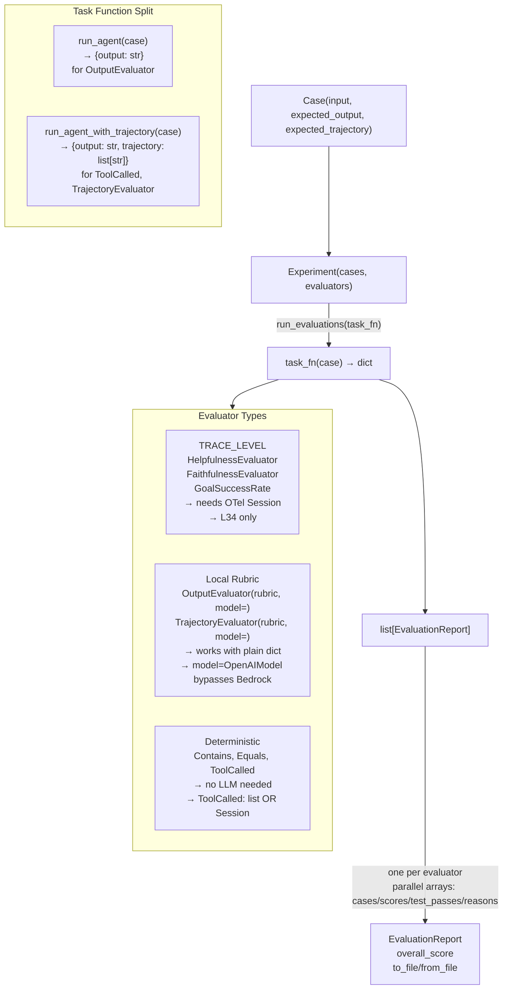

# Level 35: Strands Evals SDK — Local Structured Evaluation
**Date:** 2026-03-17 | **File:** `11_platform/evals_sdk.py`
**Depends on:** L34 (AgentCore Evaluations — cloud counterpart) | **Unlocks:** CI regression testing for any Strands agent

---

## Part 1 — For Humans

### What We Built
A local evaluation harness for Strands agents using the `strands-agents-evals` package.
You can now write explicit test cases (input + expected output/trajectory), run them
against an agent, and get structured scores — all locally, no cloud infra required.
This is the "CI" side of the evaluation story: L34 runs in production on live traffic;
L35 runs in your terminal on every PR.

### How It Works

    +------------------+
    |    Test Cases    |  Case(input, expected_output,
    |  [Case, Case...] |       expected_trajectory)
    +--------+---------+
             |
             v
    +------------------+
    |   Experiment     |  Experiment(cases, evaluators)
    +--------+---------+
             |
             v   run_evaluations(task_fn)
    +------------------+
    |    task_fn(case) |  Two versions:
    |                  |   run_agent → {output}
    |  runs agent      |   run_agent_with_trajectory
    |  returns dict    |     → {output, trajectory:[str]}
    +--------+---------+
             |
             v
    +------------------+     +-------------------+
    | EvaluationReport |     | Per-evaluator,    |
    | [report, report] |     | parallel arrays:  |
    +------------------+     | cases / scores /  |
      one per evaluator       | test_passes /     |
                              | reasons           |
                              +-------------------+

    EVALUATOR SPLIT:
    +---------------------+   +---------------------+
    | TRACE_LEVEL         |   | Local / rubric      |
    |   Helpfulness       |   |   OutputEvaluator   |
    |   Faithfulness      |   |   TrajectoryEvaluat |
    |   GoalSuccessRate   |   |   Contains          |
    |   (needs OTel       |   |   Equals            |
    |    Session — L34)   |   |   ToolCalled        |
    +---------------------+   +---------------------+
         L34 only                   L35 friendly

### What Went Wrong

1. **EvaluationReport is per-evaluator, not per-case.** Assumed one report per Case —
   it's one report per evaluator with parallel arrays. Iteration must be
   `zip(experiment.evaluators, reports)` then inner `zip(report.cases, ...)`.

2. **`tool_metrics` is a plain dict.** Called `.get()` on it — AttributeError.
   It's a regular dict keyed by tool name; use `.keys()` to get call order.

3. **TopicPlanner signature had hidden positional args.** `plan_topics_async` needs
   `(context, task_description, num_topics, num_cases)` — initial call omitted
   `context` and `num_cases`. Only `inspect.signature()` revealed this.

4. **HelpfulnessEvaluator requires OTel Session — always.** Tried it with output-only
   task results, got "Trace parsing requires actual_trajectory to be a Session".
   This is a TRACE_LEVEL evaluator that belongs to L34, not L35. It's not a config
   issue — it's a type requirement at the API level.

5. **TopicPlanner takes a Bedrock model ID string, not an OpenAIModel instance.**
   Passing `str(OpenAIModel)` gave garbage. Also, `plan_topics_async` returns a
   `TopicPlan` object — must access `.topics` attribute, not iterate directly.

### What Worked

1. **Probe scripts before implementation.** `inspect.getsource(ToolCalled)` revealed
   the discriminated union (Session vs list). `inspect.getsource(HelpfulnessEvaluator)`
   revealed the Session requirement. One probe prevented four wrong edits.

2. **Fresh Agent per call via `make_agent()`.** Strands Agent accumulates metrics
   across calls. Creating a new instance per task function call keeps tool_metrics
   clean per case, not cumulative across the full experiment.

3. **`OutputEvaluator(rubric, model=OpenAIModel)` bypasses Bedrock.** All rubric-based
   LLM evaluators accept `model=OpenAIModel` — routes through LiteLLM proxy instead
   of defaulting to Bedrock. No AWS credential friction.

4. **`ToolCalled` accepts a plain list.** No OTel needed — just return
   `{"trajectory": list(result.metrics.tool_metrics.keys())}` from your task function.

5. **`to_file / from_file` round-trips the whole experiment cleanly.** Serialises cases,
   evaluator configs, and results to JSON. Reloaded experiment is ready to re-run
   against a new agent version for regression comparison.

### The Single Most Important Thing

The evaluator taxonomy has a hard architectural split that the docs gloss over:
TRACE_LEVEL evaluators (Helpfulness, Faithfulness, and the rest of the standard
LLM-judge suite) are designed for L34-style cloud evaluation with full OTel Session
traces from ADOT-instrumented agents. They cannot be used in L35 local eval with
plain `{"output": str}` task results — this is an API type requirement, not a config
choice. For local LLM judging, `OutputEvaluator(rubric)` and `TrajectoryEvaluator(rubric)`
are the correct tools: they take a rubric string and judge the output/trajectory via
any LLM you pass as `model=`.

---

## Part 2 — For LLMs

### Architecture



### Decision Log

| Decision | Why | Trade-off |
|----------|-----|-----------|
| Two task functions (run_agent + run_agent_with_trajectory) | TRACE_LEVEL evaluators break when trajectory is a plain list; ToolCalled needs it | Two experiments instead of one |
| Remove HelpfulnessEvaluator from iteration 1 | Requires OTel Session — unavailable in local eval context | Can't demo quality LLM judge names in L35 |
| OutputEvaluator(model=OpenAIModel) | Bypasses Bedrock; works with LiteLLM proxy | TopicPlanner still needs Bedrock (str-only model) |
| TopicPlanner(model="amazon.nova-micro-v1:0") | Anthropic models blocked on channel accounts | Nova model; functionally equivalent |
| make_agent() factory per call | Strands Agent accumulates tool_metrics across calls | Small overhead creating new instance per case |

### Pseudocode — Key Patterns

```
EXPERIMENT SETUP:
  cases = [Case(name, input, expected_output, expected_trajectory)]

  exp_deterministic = Experiment(cases, [Contains(val), ToolCalled(name)])
  reports = exp_deterministic.run_evaluations(run_agent_with_trajectory)

  exp_llm = Experiment(cases, [OutputEvaluator(rubric, model=model)])
  reports = exp_llm.run_evaluations(run_agent)  // output only — no trajectory

REPORT ITERATION (per-evaluator structure):
  for evaluator, report in zip(experiment.evaluators, reports):
    // report has: overall_score, cases[], scores[], test_passes[], reasons[]
    for case_data, score, passed, reason in zip(report.cases, report.scores, ...):
      print(case_data.get('name'), score, passed)

TASK FUNCTIONS:
  run_agent(case) → agent(case.input) → {output: str(result)}
  run_agent_with_trajectory(case) →
    result = fresh_agent(case.input)
    trajectory = list(result.metrics.tool_metrics.keys())  // dict keyed by name
    return {output: str(result), trajectory: trajectory}

TOPIC PLANNER:
  planner = TopicPlanner(model="amazon.nova-micro-v1:0")  // str only, Bedrock
  plan = asyncio.run(planner.plan_topics_async(
    context="", task_description=desc, num_topics=4, num_cases=6
  ))
  topics_list = plan.topics  // TopicPlan.topics, not len(plan) directly

PERSISTENCE:
  experiment.to_file(path)          // serialize cases + evaluators + results
  reloaded = Experiment.from_file(path)
  avg = mean([s for r in reports for s in r.scores if s is not None])
```

### Observation Log

| # | Category | Topic | Observation |
|---|----------|-------|-------------|
| 1 | mistake | evaluation-report-structure | EvaluationReport is per-evaluator with parallel arrays, not per-case |
| 2 | mistake | tool-metrics-dict | tool_metrics is a plain dict; .get() doesn't exist; use .keys() |
| 3 | mistake | topic-planner-signature | plan_topics_async(context, task_description, num_topics, num_cases) — context and num_cases were missing |
| 4 | mistake | helpfulness-evaluator-trace-level | HelpfulnessEvaluator requires OTel Session; fails with plain dict task results |
| 5 | mistake | topic-planner-model-type | TopicPlanner takes str model ID; plan returns TopicPlan object not list |
| 6 | pattern | probe-before-code | inspect.getsource() on evaluator classes reveals exact API requirements before writing code |
| 7 | pattern | two-task-functions | Split experiments: run_agent for output LLM judges, run_agent_with_trajectory for ToolCalled/TrajectoryEvaluator |
| 8 | pattern | fresh-agent-per-call | make_agent() per task_fn call; agent accumulates metrics across calls |
| 9 | insight | trace-level-evaluators-l34-only | TRACE_LEVEL evaluators are an L34 feature — require OTel Session, not usable in L35 local eval |
| 10 | insight | tool-called-list-trajectory | ToolCalled accepts plain list[str] via discriminated union; no OTel needed |
| 11 | question | trace-level-evaluators-local | Can a synthetic Session be constructed locally to test TRACE_LEVEL evaluators without ADOT? |

### Forward Links

- **Unlocks CI regression**: `to_file` baseline + score comparison = PR quality gate for any Strands agent
- **Connects to L34**: TRACE_LEVEL evaluators (Helpfulness etc.) work in L34's cloud context where ADOT produces real Session objects
- **Revisit when**: building a CI pipeline for a Strands agent — wire L35 experiments to PR checks with score threshold gates
