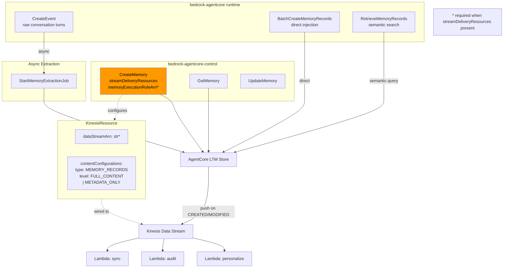

# Level 37: AgentCore LTM Streaming + Kinesis
**Date:** 2026-03-18 | **File:** `11_platform/ltm_streaming.py`
**Depends on:** L14-17 (Memory Architecture), L27 (AgentCore Deployment) | **Unlocks:** Real-time personalization, cross-agent memory sync patterns

---

## Part 1 — For Humans

### What We Built
A pipeline that pushes memory record changes from AgentCore's Long-Term Memory
to a Kinesis Data Stream, enabling real-time downstream processing without
polling. Instead of Lambda functions repeatedly asking "are there new memories?",
they receive a push notification the moment a record is created or modified.
We also learned the two paths for writing memory records: raw conversation events
(async pipeline) and direct record injection (immediate).

### How It Works

    Agent writes conversation turns
            |
            v
    +------------------------------+
    | bedrock-agentcore (runtime)  |
    |  CreateEvent                 |   raw turns
    |  --or--                      |   +-- async extraction job --+
    |  BatchCreateMemoryRecords    |   |                          |
    +------------------------------+   |                          v
                |                      |          +------------------------------+
                | direct records        |         | AgentCore LTM (memory store) |
                +----------------------+-------> | records indexed for search   |
                                                 +-------------+----------------+
                                                               |
                                    streamDeliveryResources    | push on CREATED / MODIFIED
                                    (Kinesis ARN configured    |
                                     at CreateMemory time)     v
                                                 +------------------------------+
                                                 | Kinesis Data Stream          |
                                                 | FULL_CONTENT | METADATA_ONLY |
                                                 +------+-------+---------------+
                                                        |       |
                                               +--------+  +----+--------+
                                               v           v             v
                                          [Lambda:    [Lambda:      [Lambda:
                                           personalize] audit log]   sync agents]

    Management plane (bedrock-agentcore-control):
      CreateMemory(streamDeliveryResources) -- wires the Kinesis ARN
    Runtime plane (bedrock-agentcore):
      CreateEvent, BatchCreateMemoryRecords -- writes records

### What Went Wrong

1. **SDK version lag.** The installed botocore (1.42.7) had no Kinesis shapes in the
   bedrock-agentcore-control model. The feature went GA March 12, 2026 but shapes only
   appeared in 1.42.70+. Fix: `uv add "botocore>=1.42.70"` before probing.

2. **Memory name regex.** Names must match `[a-zA-Z][a-zA-Z0-9_]{0,47}` — no hyphens.
   `l37-ltm-streaming` and `l37-semantic` both failed. Fix: underscores only.

3. **`memoryExecutionRoleArn` hidden requirement.** The CreateMemory shape marks this
   field optional. The API enforces it as required when `streamDeliveryResources` is
   present. Shape and API enforcement can diverge — you won't know until you try it live.

4. **`RetrieveMemoryRecords` wrong params.** Called with `query=` (unknown to the API).
   Correct params: `namespace` (required) + `searchCriteria.searchQuery`. Search is
   always namespace-scoped — no global across-all-namespaces mode.

5. **`BatchCreateMemoryRecords` response key mismatch.** Expected `memoryRecords` — got
   empty list. Actual response has `successfulRecords` and `failedRecords`. Probe the
   output shape before parsing.

6. **`CreateEvent` response nesting.** Expected `resp["eventId"]` — got `None`. Actual
   path: `resp["event"]["eventId"]`.

7. **Inline Python (again).** Used `python3 -c "..."` twice during shape exploration.
   Each time corrected by writing a `_sandbox/probe_*.py` script instead.

### What Worked

1. **Iterative probing.** Six probe scripts, each answering specific unknowns before
   writing a line of implementation code. When the first probe found no Kinesis shapes,
   the question became "is the SDK too old?" — confirmed by upgrading. Zero guessing
   in the final implementation.

2. **`BatchCreateMemoryRecords` for immediate record injection.** Direct path — no async
   extraction job needed. Returns real memory record IDs. Works immediately on any
   memory store regardless of strategy configuration.

3. **`RetrieveMemoryRecords` semantic search.** With correct `namespace` + `searchCriteria`,
   returns results with relevance scores in under a second. Namespace-scoped search is
   the right design when memory is organized by topic.

4. **Graceful fallback on CreateMemory failure.** When the IAM-gated memory store creation
   failed, the script fell back to the existing L27 store for the remaining demos. The
   semantic search and event injection worked correctly against the fallback.

### The Single Most Important Thing

The API shape is documentation, not a contract. `memoryExecutionRoleArn` is listed as
optional in the CreateMemory shape, but the API enforces it as required when you add
Kinesis streaming config. This gap between shape spec and runtime enforcement is not
a bug — it's a feature with conditional dependencies. The SDK can't express "required
when field X is present" in a flat shape definition. The only way to discover these
conditional requirements is to call the API and read the error message. Probe live.

---

## Part 2 — For LLMs

### Architecture



### Decision Log

| Decision | Why | Trade-off |
|----------|-----|-----------|
| BatchCreateMemoryRecords over CreateEvent | Immediate injection, no async pipeline | Bypasses conversation context — records must be pre-structured |
| FULL_CONTENT level | Demo needs to see actual content in Kinesis records | Larger Kinesis records; for audit-only use METADATA_ONLY |
| Fallback to L27 memory on CreateMemory failure | IAM role creation out of scope; demos still work | Cannot show end-to-end Kinesis push without correct role |
| 6 probe scripts before implementation | Each unknown is a potential stuck point; probing is cheaper than debugging | More upfront setup |

### Pseudocode — Key Patterns

```
CREATE MEMORY WITH KINESIS STREAMING:
  Prerequisites:
    1. Kinesis stream ARN
    2. IAM role with kinesis:PutRecord + kinesis:PutRecords
       trust: { bedrock-agentcore.amazonaws.com }

  ctrl.create_memory(
    name: [a-zA-Z][a-zA-Z0-9_]{0,47},   // NO hyphens
    eventExpiryDuration: int,            // required
    memoryExecutionRoleArn: str,         // REQUIRED when streamDeliveryResources set
    streamDeliveryResources: {
      resources: [{
        kinesis: {
          dataStreamArn: str,
          contentConfigurations: [{
            type: "MEMORY_RECORDS",      // only valid value today
            level: "FULL_CONTENT"        // or "METADATA_ONLY"
          }]
        }
      }]
    }
  )

WRITE MEMORY RECORDS (direct path):
  resp = runtime.batch_create_memory_records(
    memoryId: str,
    records: [{
      requestIdentifier: str,    // idempotency key
      namespaces: [str],         // must match strategy namespace
      content: { text: str },
      timestamp: datetime,
    }]
  )
  ok    = resp["successfulRecords"]   // NOT "memoryRecords" or "records"
  failed = resp["failedRecords"]

WRITE CONVERSATION EVENTS:
  resp = runtime.create_event(
    memoryId, actorId, sessionId, eventTimestamp,
    payload: [{conversational: {content: {text}, role: "USER"|"ASSISTANT"}}]
  )
  event_id = resp["event"]["eventId"]  // nested under "event" key

SEMANTIC SEARCH:
  runtime.retrieve_memory_records(
    memoryId: str,
    namespace: str,              // REQUIRED — search is always namespace-scoped
    searchCriteria: {
      searchQuery: str,          // natural language
      topK: int,
    }
  )
  results = resp["memoryRecordSummaries"]
  each result: { memoryRecordId, content.text, namespaces, score, createdAt }

KINESIS CONSUMER (Lambda):
  for record in event["Records"]:
    payload = json.loads(base64.decode(record["kinesis"]["data"]))
    if payload["eventType"] == "CREATED":
      handle_new(payload["recordId"], payload.get("content"))
    elif payload["eventType"] == "MODIFIED":
      handle_update(payload["recordId"])
    // FULL_CONTENT: has content + metadata
    // METADATA_ONLY: has recordId + timestamp + eventType only
```

### Observation Log

| # | Category | Topic | Observation |
|---|----------|-------|-------------|
| 1 | mistake | inline-python-ban | Used `python3 -c "..."` twice — same rule as L36 |
| 2 | mistake | name-regex-violation | Hyphens in memory/strategy names fail regex; use underscores |
| 3 | mistake | retrieve-wrong-params | `query=` not accepted; requires `namespace=` + `searchCriteria=` |
| 4 | mistake | batch-create-response-key | Response uses `successfulRecords` not `memoryRecords` |
| 5 | mistake | create-event-response-path | Event ID at `resp["event"]["eventId"]` not `resp["eventId"]` |
| 6 | mistake | botocore-version-lag | Kinesis shapes only in botocore ≥1.42.70; check version first |
| 7 | insight | memory-execution-role-required | `memoryExecutionRoleArn` optional in shape but required when Kinesis config present — shape vs API enforcement mismatch |
| 8 | insight | content-type-vs-level | ContentType (MEMORY_RECORDS) = what; ContentLevel (FULL/META) = how much detail |
| 9 | insight | kinesis-push-is-post-extraction | Kinesis push fires on memory RECORDS, not raw events; CreateEvent goes through async extraction first |
| 10 | insight | retrieve-namespace-scoped | RetrieveMemoryRecords always requires namespace — no global search |
| 11 | pattern | successive-probe-pattern | 6 probe scripts before implementation; each answered one unknown, revealed next question |
| 12 | question | memory-execution-role-iam | What exact IAM trust policy does memoryExecutionRoleArn need for Kinesis streaming? |
| 13 | question | kinesis-push-timing | Is Kinesis push sync (on BatchCreateMemoryRecords return) or async? 15s wait yielded zero records |

### Forward Links

- **Unlocks real-time personalization**: Wire Kinesis → Lambda → DynamoDB cache update; user preference changes propagate in near-real-time without polling LTM
- **Unlocks cross-agent memory sync**: Multiple agents can subscribe to the same memory store's Kinesis stream and stay in sync
- **Revisit when**: Creating a production memory store with actual streaming — need to set up the IAM role (`memoryExecutionRoleArn`) with correct trust policy first
- **Connects to L27**: L27 created `l27agentcore_Memory-9RYaOkDitt` which was used as the fallback store for BatchCreateMemoryRecords and RetrieveMemoryRecords demos
- **Connects to L14-17**: Namespaces defined at strategy creation time are the same namespaces required for RetrieveMemoryRecords
