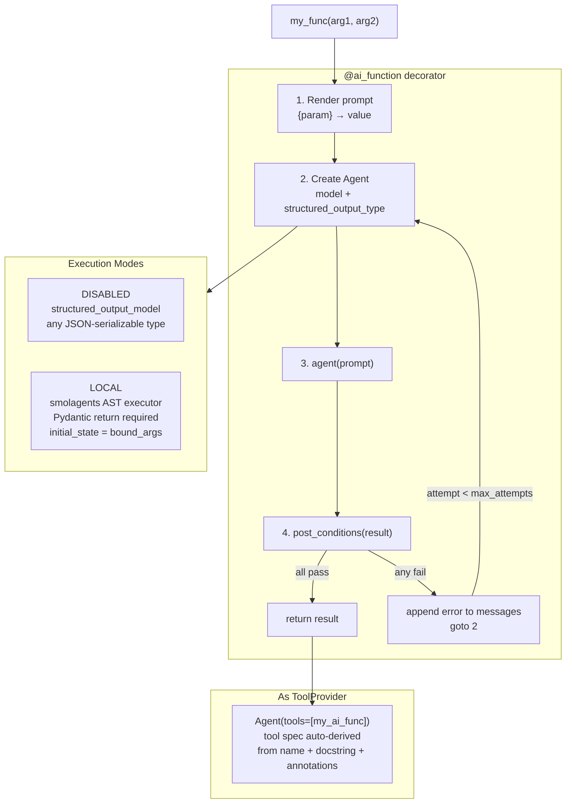

# Level 38: Strands Labs — AI Functions
**Date:** 2026-03-18 | **File:** `11_platform/ai_functions.py`
**Depends on:** L24 (Tool Synthesis — production baseline) | **Unlocks:** Rapid prototyping path for LLM-powered functions

---

## Part 1 — For Humans

### What We Built
A way to turn any Python function into an LLM-powered function by decorating it
with `@ai_function`. The function's docstring becomes the prompt, the return type
annotation becomes the output schema, and `post_conditions` validators gate the
output with automatic retry — all without writing Agent boilerplate. We also
showed how these AI functions plug directly into a parent Agent as tools.

### How It Works

    @ai_function
    def analyze(review: str) -> SentimentResult:
        """Analyze: {review}"""

                 |
                 v (call: analyze("great product"))

    +------------------------------------+
    | AIFunction.__call__                |
    |                                    |
    |  1. render docstring               |
    |     "{review}" -> "great product"  |
    |                                    |
    |  2. create Strands Agent           |
    |     model + structured_output_type |
    |                                    |
    |  3. agent(prompt) -> result        |
    |                                    |
    |  4. run post_conditions            |
    |     [                              |
    |       validator_1(result)          |  <-- None = pass
    |       validator_2(result)          |  <-- PostConditionResult
    |     ]                              |
    |                                    |
    |  5a. all pass -> return result     |
    |  5b. any fail -> append error msg  |
    |       to conversation, goto 2      |
    |       (up to max_attempts=10)      |
    +------------------------------------+
                 |
                 v
           SentimentResult(
             sentiment="positive",
             score=0.9,
             key_phrases=[...]
           )

    Two execution modes:

    DISABLED (default)
    +----------------------------+
    | Agent uses structured      |
    | output from LLM directly.  |
    | Works for str, int, list,  |
    | Pydantic, etc.             |
    +----------------------------+

    LOCAL
    +----------------------------+
    | Agent gets python_executor |
    | tool (smolagents AST).     |
    | Writes code, runs it,      |
    | calls final_answer(result) |
    | Pydantic return required.  |
    +----------------------------+

### What Went Wrong

1. **Wrong package name.** Tried `strands-agents-labs`, `ai-functions`, `strands-labs`
   before finding the correct `strands-ai-functions`. Import name is `ai_functions`
   (not `strands_ai_functions`). No prefix relationship between pip name and import name.

2. **Script filename shadowed the package.** `11_platform/ai_functions.py` has the same
   name as the installed `ai_functions` package. Python adds the script directory to
   `sys.path[0]` when executing a script, so `from ai_functions import ...` found the
   script itself (partially initialized) instead of the package.
   Fix: remove the script directory from `sys.path` before any imports.

### What Worked

1. **3 probe scripts before implementation.** `probe_l38_package.py` → module structure.
   `probe_l38_api.py` → `AIFunctionConfig` defaults + source + smoke tests.
   `probe_l38_exec.py` → execution loop + model compatibility.
   Zero API misunderstandings in the implementation.

2. **`post_conditions` + retry.** `has_three_lines` and `no_title_line` validators
   enforced haiku structure reliably. The retry loop adds the error as a conversation
   turn, not a fresh prompt — the agent sees its mistake and corrects it.

3. **`AIFunction` as a `ToolProvider`.** Parent Agent called `extract_keywords` and
   `generate_title` as regular tools. The `@ai_function` decorator creates a full tool
   spec automatically from the function's signature, so the parent agent's planning
   logic worked without any extra wiring.

4. **LOCAL mode + `additional_imports`.** `compute_stats` with `["statistics"]` let the
   agent use Python's statistics module inside the sandboxed executor to produce correct
   numerical results with an exact API.

### The Single Most Important Thing

`@ai_function` is not just sugar over `Agent(prompt)` — it bridges Python's type
system and the LLM in both directions. Inbound: the function signature (param names +
annotations) becomes the tool spec that tells a parent agent HOW to call it. Outbound:
the return type annotation becomes the structured output schema that forces the LLM's
response into a typed Python object. This bidirectional type bridge is what makes
`@ai_function` composable in a way that raw agent calls are not. You can build
pipelines out of typed functions, and Python's own type checker gives you interface
contracts between LLM-powered steps.

---

## Part 2 — For LLMs

### Architecture



### Decision Log

| Decision | Why | Trade-off |
|----------|-----|-----------|
| `sys.path` shadow fix instead of renaming file | LEARNING_PLAN specifies `ai_functions.py`; rename breaks convention | Slightly unusual top-of-file sys.path surgery |
| `post_conditions` on haiku instead of math | Structural constraints (line count) are easy to verify deterministically | LLM-generated validators would add latency |
| `code_executor_additional_imports=["statistics"]` | Demonstrates extending the sandbox allowlist | Imported module must already be installed |
| OpenAIModel (LiteLLM proxy) instead of Bedrock default | Consistency with rest of project | model= works with any strands Model object |

### Pseudocode — Key Patterns

```
BASIC @ai_function (DISABLED mode):
  @ai_function(model=model)
  def my_func(param1: str, param2: int) -> ReturnType:
      """Docstring with {param1} and {param2} substitution."""
  result = my_func("value", 42)   # -> ReturnType instance

PYDANTIC RETURN (structured output):
  class Output(BaseModel):
      field1: str
      field2: float

  @ai_function(model=model)
  def analyze(input: str) -> Output:
      """Analyze: {input}"""
  result = analyze("...")   # -> Output(field1=..., field2=...)

POST_CONDITIONS (retry on failure):
  def must_have_n_lines(result: str) -> PostConditionResult | None:
      lines = [l for l in result.split("\n") if l.strip()]
      if len(lines) == 3:
          return None              # pass
      return PostConditionResult(
          passed=False,
          message=f"Need 3 lines, got {len(lines)}"
      )
      # error appended to conversation → retry (max_attempts=10)

LOCAL MODE (code execution):
  @ai_function(
      model=model,
      code_execution_mode=CodeExecutionMode.LOCAL,
      code_executor_additional_imports=["statistics"],
  )
  def compute(numbers: list[float]) -> ResultModel:
      """Compute stats for: {numbers}\nUse final_answer() to return."""
  # Agent writes Python, calls python_executor, calls final_answer(result)

AS A TOOL IN PARENT AGENT:
  @ai_function(model=model)
  def my_step(x: str) -> str:
      """Do something with {x}"""

  parent = Agent(model=model, tools=[my_step])
  parent("Use my_step to process 'hello'")
  # parent agent sees my_step as a tool with auto-derived spec

SYS.PATH SHADOW FIX (when script name = package name):
  _here = os.path.dirname(os.path.abspath(__file__))
  sys.path = [p for p in sys.path if os.path.abspath(p) != _here and p != ""]
  # run this BEFORE any imports from the shadowed package
```

### Observation Log

| # | Category | Topic | Observation |
|---|----------|-------|-------------|
| 1 | mistake | wrong-package-name | pip: `strands-ai-functions`; import: `ai_functions` — no prefix relationship |
| 2 | mistake | self-shadow-circular-import | `ai_functions.py` shadows package; Python's script dir is sys.path[0] |
| 3 | insight | disabled-mode-any-json-type | DISABLED works for any JSON-serializable type, not just Pydantic |
| 4 | insight | function-body-as-dynamic-prompt | Body called first; returns str → that IS the prompt; returns None → use docstring |
| 5 | insight | retry-preserves-conversation | Error appended as user turn; agent sees its mistake and corrects |
| 6 | insight | ai-function-as-tool-provider | AIFunction implements ToolProvider; tool spec auto-derived from signature |
| 7 | insight | local-mode-injects-bound-args | bound_args injected as variables in executor namespace |
| 8 | pattern | probe-then-implement | 3 probes before implementation; zero API misunderstandings |
| 9 | pattern | sys-path-shadow-fix | Filter script dir from sys.path before importing shadowed package |
| 10 | insight | dynamic-prompt-from-body | Body is called first; returns str → IS the prompt; returns None → use docstring |
| 11 | mistake | kwargs-bind-folding | inspect.Signature.bind folds **kwargs into {"kwargs": {...}}; use explicit named params on @ai_function validators |
| 12 | pattern | ai-validator-wrapper-pattern | @ai_function judge (explicit params) + regular wrapper function (captures **kwargs) |
| 13 | insight | llm-validates-llm | AI-powered post_conditions enable semantic checks (factual consistency, tone, safety) that code can't express |
| 14 | question | additional-imports-install | Does additional_authorized_imports install missing packages or just allow them? |

### Forward Links

- **Unlocks rapid prototyping**: Replace boilerplate Agent() calls with @ai_function for any typed transformation task
- **Connects to L24**: L24 (Tool Synthesis) is the production-grade equivalent — Docker sandbox, explicit security; L38 is for trusted environments
- **Connects to L31 (Workflow Pattern)**: DAG pipelines where each node is an @ai_function — typed inputs/outputs enforce interface contracts between steps
- **Revisit when**: Need AI-powered post_conditions (LLM-validates-LLM) — not tested here; PostConditionRunner explicitly supports @ai_function validators
