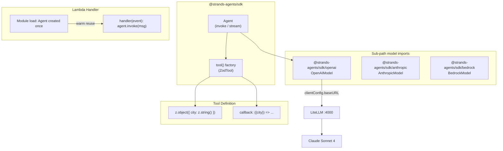

# Level 39: TypeScript SDK
**Date:** 2026-03-18 | **Files:** `11_platform/typescript/agent.ts`, `11_platform/typescript/lambda_handler.ts`
**Depends on:** L1-3 (Python SDK patterns) | **Unlocks:** L40 (Edge Strands)

---

## Part 1 — For Humans

### What We Built
We built Strands agents in TypeScript — the same agent loop, tools, and LiteLLM integration
we know from Python, but in a Node.js/Lambda-native environment. You can now write a Lambda
function that takes a user message, runs it through an LLM with tools, and returns a response,
with full type safety from Zod schemas rather than Python type hints.

### How It Works

    TypeScript SDK structure
    +-----------------------------------------+
    |  @strands-agents/sdk  (main index)       |
    |    Agent, tool, Swarm, Graph, hooks ...  |
    +-----------------------------------------+
         |              |             |
         v              v             v
    +----------+  +----------+  +----------+
    | /openai  |  |/anthropic|  | /bedrock |
    |OpenAI    |  |Anthropic |  |Bedrock   |
    |Model     |  |Model     |  |Model     |
    +----------+  +----------+  +----------+

    Tool definition (Zod replaces Python type hints)
    +-----------------------------+
    | tool({                      |
    |   name: "get_weather",      |
    |   description: "...",       |
    |   inputSchema: z.object({   |   <-- Zod schema
    |     city: z.string(),       |       (vs type hints)
    |   }),                       |
    |   callback: ({city}) => ... |   <-- async function
    | })                          |       (vs @tool fn)
    +-----------------------------+

    Lambda warm-start pattern
    +---------------------------+
    |  MODULE LOAD (cold start) |
    |    new OpenAIModel(...)   |
    |    new Agent(...)         |  <-- once per container
    +---------------------------+
             |
             v repeated on each request
    +---------------------------+
    |  handler(event)           |
    |    agent.invoke(message)  |
    |    return JSON response   |
    +---------------------------+

### What Went Wrong

1. **Zod version mismatch** — specified `zod@^3.23.8` but the SDK requires v4. Always
   check `peerDependencies` in the SDK's `package.json` before pinning versions.

2. **Optional peer deps still crash at runtime** — `@aws-sdk/client-s3` is marked optional
   but Node's ESM loader fails if the module is absent because it's imported unconditionally
   in the module graph. Install all optional deps listed in the SDK.

3. **Wrong stream event field** — guessed `event.update.type` but the actual field is
   `event.event.type`. The inner `ModelStreamEvent` lives at `.event`, not `.update`.
   Reading the `.d.ts` files before coding would have caught this instantly.

4. **`result.lastMessage` is not a string** — it's a `Message` object. Use
   `result.toString()` to get the concatenated text.

### What Worked

1. **Probing `.d.ts` files** — reading `node_modules/@strands-agents/sdk/dist/src/**/*.d.ts`
   before writing code revealed exact constructor signatures, field names, and export paths
   with zero guessing.

2. **Python-to-TypeScript pattern transfer** — Every Python SDK concept maps directly.
   Once you know that `clientConfig.baseURL` is the TypeScript equivalent of `base_url`,
   the entire LiteLLM setup is identical.

3. **`printer: false`** — Disabling the agent's auto-print callback gives full control over
   output in stream(), Lambda, and test contexts.

4. **`tsx`** — Running TypeScript directly with `npx tsx agent.ts` eliminates a compile step
   during development. No `tsc` round-trip needed until you're ready to bundle for Lambda.

### The Single Most Important Thing
The TypeScript SDK is not a rewrite — it's a port. The concepts, patterns, and even the
LiteLLM trick transfer 1:1. The only surface changes are Zod schemas for tool input,
`.event` instead of `.update` for stream events, `agent.invoke()` instead of `agent()`,
and sub-path imports for model providers. If you've done any Python level here, you already
know the TypeScript SDK — you just need to know where to look for the differences.

---

## Part 2 — For LLMs

### Architecture



### Decision Log

| Decision | Why | Trade-off |
|----------|-----|-----------|
| `OpenAIModel` via LiteLLM | Same pattern as Python SDK; LiteLLM exposes OpenAI-compatible API | Requires LiteLLM proxy running |
| `printer: false` on Agent | Prevents double-output when manually consuming stream() | Must handle output manually |
| `tsx` for dev execution | Zero compile step, fast iteration | Not a production bundler |
| Agent at module level in Lambda | Warm-start reuse: model init is expensive | Cold start latency includes full agent init |
| Install all optional peer deps | ESM loader fails even on optional imports | Larger node_modules footprint |

### Pseudocode — Key Patterns

```
# Tool definition (TypeScript)
tool({
  name = string
  description = string
  inputSchema = zod_object({ field: zod_type })   # Zod replaces Python type hints
  callback = function(validated_input) -> value    # async allowed
})

# Agent invocation
result = await agent.invoke(prompt)     # returns AgentResult
text   = result.toString()             # extracts all text blocks as string

# Streaming
for event in agent.stream(prompt):
  if event.type == "modelStreamUpdateEvent":
    inner = event.event                           # NOT event.update
    if inner.type == "modelContentBlockDeltaEvent":
      if inner.delta.type == "textDelta":
        write(inner.delta.text)

# Lambda pattern
# Module level (runs once):
model = OpenAIModel({ modelId, apiKey, clientConfig: { baseURL } })
agent = Agent({ model, tools, systemPrompt, printer: false })

# Handler (runs per invocation):
handler(event):
  message = event.body or event.message
  result  = await agent.invoke(message)
  return { statusCode: 200, body: { response: result.toString() } }
```

### Observation Log

| # | Category | Topic | Observation |
|---|----------|-------|-------------|
| 1 | mistake  | zod-version-mismatch | `@strands-agents/sdk@0.6.0` requires `zod@^4.1.12`, not v3 |
| 2 | mistake  | optional-peer-deps | `@aws-sdk/client-s3` optional but crashes ESM loader if absent |
| 3 | mistake  | stream-event-field | Inner event is at `.event`, not `.update` on `ModelStreamUpdateEvent` |
| 4 | mistake  | lastmessage-is-object | `result.lastMessage` is a `Message` object; use `result.toString()` |
| 5 | pattern  | subpath-model-imports | Model providers are sub-paths: `@strands-agents/sdk/openai` |
| 6 | pattern  | litellm-openai-model-ts | `clientConfig.baseURL` = TypeScript equivalent of Python `base_url` |
| 7 | pattern  | d-ts-probing | Read `.d.ts` files before coding — more reliable than README |
| 8 | pattern  | lambda-module-level-agent | Create Agent at module scope for warm-start reuse |
| 9 | insight  | ts-sdk-mirrors-python | TypeScript SDK is architecturally identical to Python SDK — knowledge transfers 1:1 |
| 10 | insight | printer-false-for-control | `printer: false` prevents double-output when consuming stream() manually |
| 11 | question | ts-a2a-timeline | When does TypeScript SDK get A2A support? |
| 12 | question | lambda-streaming-response | Can `agent.stream()` pipe to a Lambda streaming response? |

### Forward Links

- **Unlocks L40**: Edge Strands — same agent concepts but with `LlamaCppModel` for local
  inference on edge devices; cloud delegation patterns build on the agent-as-microservice
  pattern established here in Lambda
- **Revisit when**: deploying a TypeScript Lambda that needs A2A (currently unsupported —
  check if TS SDK has reached parity); or when Lambda streaming responses become relevant
- **Related L10**: AgentCore Deploy — Python-side Lambda deployment; TypeScript Lambda
  is the Node.js parallel path
