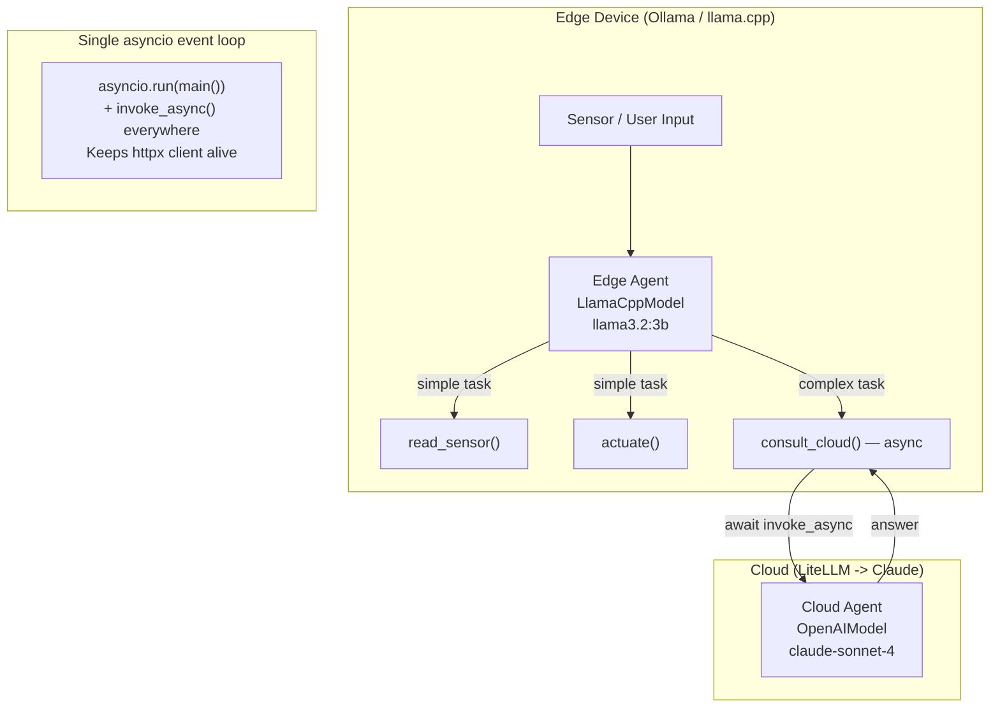

# Level 40: Edge Strands + Cloud Orchestration
**Date:** 2026-03-18 | **File:** `11_platform/edge_strands.py`
**Depends on:** L6 (agents-as-tools), L36 (bidi streaming), L27 (AgentCore) | **Unlocks:** terminal

---

## Part 1 — For Humans

### What We Built
A two-tier agent system where a small local model (Llama 3.2 3B via Ollama) handles
fast, cheap sensor reads and actuations on the "edge", and escalates to a powerful
cloud model (Claude Sonnet 4) only when the task needs deep reasoning or planning.
You now have the pattern for putting AI at the edge of a network — IoT, robotics,
embedded — while still having the full intelligence of the cloud available on demand.

### How It Works

    +-------------------------------------------+
    |  EDGE DEVICE (M2 Mac / Jetson / Pi)        |
    |                                            |
    |  User / Sensor Input                       |
    |       |                                    |
    |       v                                    |
    |  +------------------+                      |
    |  | Edge Agent       |  Llama 3.2 3B        |
    |  | LlamaCppModel    |  (Ollama / llama.cpp) |
    |  +--------+---------+                      |
    |           |                                |
    |     +-----+--------+                       |
    |     |              |                       |
    |     v              v                       |
    | [simple task]  [complex task]              |
    |     |              |                       |
    |     v              |                       |
    | [read_sensor]  [consult_cloud]----------+  |
    | [actuate]          |                    |  |
    |                    |                    |  |
    +--------------------|--------------------|--+
                         |                    |
                         v                    |
    +-------------------------------------------+
    |  CLOUD                                    |
    |  Cloud Agent — Claude Sonnet 4            |
    |  (deep reasoning, planning, diagnosis)    |
    +-------------------+       ^               |
                        |       |               |
                        +-------+               |
                        answer returned         |
    +-------------------------------------------+

    Single asyncio event loop threads everything together.
    Edge model's httpx client stays alive on one loop.

### What Went Wrong

1. **Event loop destroyed between calls** — called `cloud_agent()` (the sync shorthand)
   from inside a `@tool` function. That triggers a nested `asyncio.run()`, which creates
   a new event loop and destroys the old one when it finishes. The edge model's HTTP
   client was tied to the old loop and crashed on the next use with
   `RuntimeError: Event loop is closed`.

   Fix: put everything in one `asyncio.run(main())`, make the delegation tool `async`,
   and call `cloud_agent.invoke_async()` from inside it — stays on one loop throughout.

### What Worked

1. **Probe before coding** — a 10-line probe script (`_sandbox/probe_l40_llamacpp.py`)
   confirmed that `LlamaCppModel` works with Ollama's endpoint before any real code
   was written. Saved potential hours of debugging an incompatibility that didn't exist.

2. **Ollama as edge proxy on Mac** — Ollama provides the same OpenAI-compatible API
   as llama.cpp server, plus Metal acceleration and easy model management. Perfect for
   edge simulation without needing a real Jetson. On actual hardware you'd use llama.cpp
   directly for tighter GPU memory control.

3. **The SLM routed itself correctly** — Llama 3.2 3B (a 2GB model!) correctly decided
   which tasks to handle locally and which to escalate to the cloud, purely based on
   the system prompt describing the escalation contract. No special routing code needed.

4. **Single event loop wrapping** — `asyncio.run(main())` with `invoke_async()` throughout
   is the right pattern any time you have an HTTP-backed model provider and multiple
   sequential or nested agent calls in the same session.

### The Single Most Important Thing
`asyncio.run()` creates a new event loop and tears it down when it finishes — every time.
Any object that holds an async HTTP client (like `LlamaCppModel`) becomes invalid after that
teardown. If you call agents multiple times in a session, or call one agent from inside
another agent's tool, you must run the entire session inside a single `asyncio.run()` and
use `invoke_async()` throughout. This is not a Strands quirk — it is a fundamental Python
asyncio rule that applies to any async HTTP client used across multiple event loops.

---

## Part 2 — For LLMs

### Architecture



### Decision Log

| Decision | Why | Trade-off |
|----------|-----|-----------|
| Ollama instead of raw llama.cpp | Easier setup on Mac; same OpenAI-compatible API | On real Jetson hardware, llama.cpp gives tighter GPU memory control |
| Single `asyncio.run(main())` | LlamaCppModel httpx.AsyncClient lives on one loop — no stale-loop crashes | All agent calls must be `await`ed; sync shorthand `agent()` breaks it |
| `async def consult_cloud` + `invoke_async` | Avoids nested `asyncio.run()` from inside a tool | Cloud delegation adds ~1-3s latency — acceptable for planning, not for 50Hz loops |
| SLM routing via system prompt only | Llama 3.2 3B correctly decides escalation with clear instructions | No fallback if SLM hallucinates that a complex task is simple |
| `LlamaCppModel(base_url="localhost:11434")` | Ollama uses same endpoint path as llama.cpp server | model_id must match the Ollama model name exactly (e.g. "llama3.2:3b") |

### Pseudocode — Key Patterns

```
# Two-tier agent setup
edge_model  = LlamaCppModel(base_url="http://localhost:11434", model_id="llama3.2:3b")
cloud_model = OpenAIModel(model_id="claude-sonnet-4", base_url="http://localhost:4000")

cloud_agent = Agent(model=cloud_model)

# Cloud delegation tool MUST be async — avoids nested event loop
@tool
async def consult_cloud(question):
    result = await cloud_agent.invoke_async(question)   # NOT cloud_agent(question)
    return str(result)

edge_agent = Agent(model=edge_model, tools=[read_sensor, actuate, consult_cloud])

# Wrap all calls in ONE asyncio.run — keeps httpx alive
async def main():
    r1 = await edge_agent.invoke_async("simple task")
    r2 = await edge_agent.invoke_async("complex task — triggers consult_cloud")

asyncio.run(main())

# What breaks:
# edge_agent("task1")     <- asyncio.run() 1, creates loop1, closes loop1
# edge_agent("task2")     <- asyncio.run() 2, but httpx client is on loop1 -> CRASH
```

### Observation Log

| # | Category | Topic | Observation |
|---|----------|-------|-------------|
| 1 | mistake  | httpx-client-event-loop-binding | httpx.AsyncClient bound to loop1; asyncio.run() teardown closes loop1; next call crashes |
| 2 | pattern  | single-event-loop-for-multi-agent | Single asyncio.run(main()) + invoke_async() throughout prevents loop teardown crashes |
| 3 | pattern  | async-tool-for-agent-delegation | @tool async def + await invoke_async() — right way to call agent from within agent's tool |
| 4 | pattern  | llamacpp-model-with-ollama | LlamaCppModel(base_url="localhost:11434") works with Ollama unchanged |
| 5 | insight  | slm-knows-when-to-escalate | Llama 3.2 3B correctly routes tasks via system prompt alone — no routing code needed |
| 6 | insight  | ollama-as-practical-edge-proxy | Ollama = llama.cpp server substitute on Mac; same API, Metal GPU, easy model management |
| 7 | question | cloud-latency-in-robot-loop | 1-3s cloud round-trip blocks 50Hz robot loop — how does Strands Labs handle this? |
| 8 | question | ollama-gbnf-grammar | Does Ollama pass GBNF grammar params through to llama.cpp, or silently ignore them? |

### Forward Links

- **Terminal level** — this is the final level of the learning path (L40 of 40)
- **Revisit when**: building a real edge deployment — swap Ollama for llama.cpp server,
  swap LiteLLM for direct Bedrock/AgentCore; the agent code stays identical
- **Revisit when**: robot latency matters — need async cloud delegation with local
  fallback behaviour so the control loop never blocks waiting for cloud response
- **Connects to L36**: bidi streaming (voice) + edge agents (L40) = voice-controlled
  robots with cloud reasoning — the full Strands Labs stack
