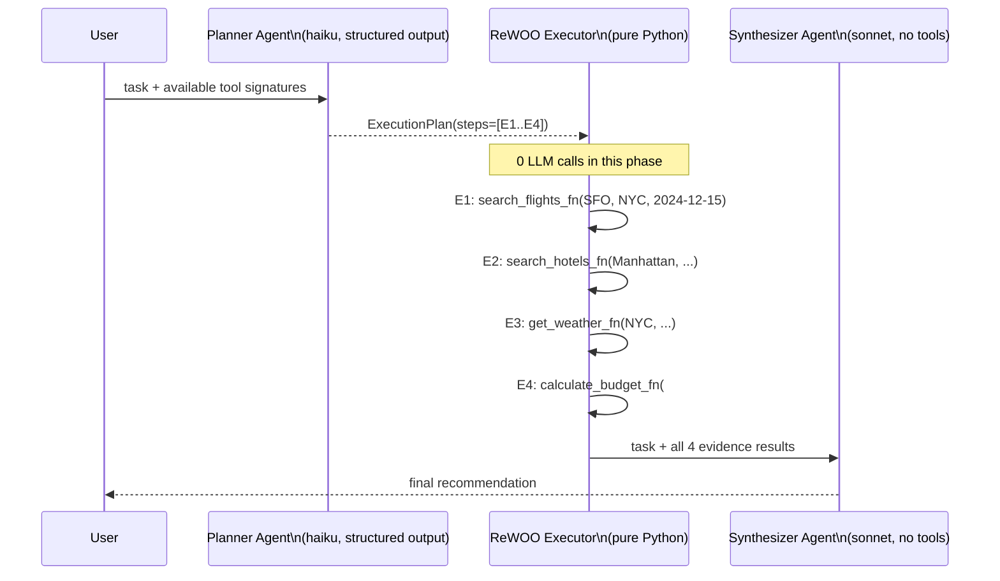

# Level 41 Reflection: Custom Orchestration — ReWOO
**Date:** 2026-03-18 | **File:** `12_orchestration/rewoo.py`
**Depends on:** L11 (Reflection), L6-8 (Multi-Agent), L12 (Structured Outputs)
**Unlocks:** L42 (Reflexion — the adaptive complement to ReWOO)

---

## Part 1 — For Humans

### What We Built
A pure ReWOO orchestrator for trip planning: LLM writes the full tool-call script in one pass, tools execute deterministically in order with placeholder resolution, then LLM synthesizes the final answer. Contrasted side-by-side with a standard ReAct agent on the same task.

### How It Works

```
User task
    │
    ▼ 1 LLM call (Planner, haiku model)
ExecutionPlan  ←── structured_output_model=ExecutionPlan
    │  steps: [E1: search_flights(...), E2: search_hotels(...),
    │          E3: get_weather(...), E4: calculate_budget(#E1.price, #E2.price, 3)]
    │
    ▼ 0 LLM calls (deterministic for-loop)
results = {E1: {...}, E2: {...}, E3: {...}, E4: {...}}
    │  placeholder resolver: "#E1.price" → results["E1"]["price"]
    │
    ▼ 1 LLM call (Synthesizer, sonnet model)
Final recommendation with all evidence embedded
```

### What Went Wrong
1. **Deprecation on structured_output()** — probe caught this before writing the main file. Old: `agent.structured_output(Model, prompt)`. New: `agent(prompt, structured_output_model=Model)`, then `result.structured_output`.
2. **`tools` module import from `_sandbox/`** — needs `PYTHONPATH` set to project root. All probes and the main file require `PYTHONPATH=/path/to/project uv run python3 ...` OR running from the project root.

### What Worked
1. **Probe-first payoff** — two probe scripts caught the deprecated API and confirmed `#En.field` placeholder format before writing 200 lines of implementation. Zero fixup passes on the main file.
2. **LLM uses field references correctly** — when the planner prompt explicitly listed `search_flights → {price, ...}`, the model used `#E1.price` and `#E2.price` without any coaching.
3. **Plain fn + @tool separation** — keeping raw Python functions (`search_flights_fn`) separate from `@tool` decorated versions made the ReWOO executor and ReAct comparison clean without duplication.

### The Single Most Important Thing
ReWOO is not "add reflection to an agent" — it's a fundamentally different execution model where the LLM is removed from the tool-dispatch loop entirely. The plan is inspectable before any tool runs. That's the payoff: you can insert policy checks, budget limits, or human approval at the plan level before a single side effect occurs. If that audit/control capability matters for your use case, ReWOO is worth the loss of mid-flight adaptability.

---

## Part 2 — For LLMs

### Architecture



### Decision Log

| Decision | Why | Trade-off |
|----------|-----|-----------|
| Planner uses `haiku`, Synthesizer uses `sonnet` | Planner just structures steps (low reasoning), Synthesizer needs quality output | Minor cost saving; could use same model for both |
| ExecutionPlan as Pydantic model | LLM returns typed dict directly, no string parsing | Requires planner to call a tool (structured output mechanism) |
| TOOL_REGISTRY as plain dict | Executor needs to look up fn by name string from plan | Could use reflection instead; dict is explicit and debuggable |
| `resolve_arg` coerces numeric strings | Plan step args are all strings; tools expect int/float | Would break on non-numeric strings that look like numbers (e.g. "123 Main St") |
| Planner prompt lists exact field names | LLM needs to know `#E1.price` not `#E1.cost` | If tool signatures change, prompt must be updated |

### Pseudocode — Key Patterns

```
# Phase 1: structured planning
planner = Agent(model=fast, tools=[], system_prompt=PLANNER_PROMPT)
result = planner(task, structured_output_model=ExecutionPlan)
plan = result.structured_output      # → typed ExecutionPlan

# Phase 2: deterministic execution
results = {}
for step in plan.steps:
    args = {k: resolve_arg(v, results) for k, v in step.arguments.items()}
    results[step.evidence_id] = TOOL_REGISTRY[step.tool_name](**args)

# Resolver — handles "#E1", "#E1.field", literal, numeric string
resolve_arg(value, results):
    if not starts with "#": coerce to number or return as-is
    parts = value.strip("#").split(".", 1)
    result = results[parts[0]]
    if len(parts)==2 and result is dict: return result[parts[1]]
    return result

# Phase 3: synthesis
evidence = "\n".join(f"#{k}: {v}" for k,v in results.items())
synthesizer = Agent(model=main, tools=[], system_prompt=SYNTHESIZER_PROMPT)
answer = synthesizer(f"Task: {task}\n\nEvidence:\n{evidence}")
```

### Observation Log

| # | Category | Topic | Observation |
|---|----------|-------|-------------|
| 1 | insight | rewoo-vs-react | ReWOO is loop-level override, L11 reflection is prompt-level critique — different layer entirely |
| 2 | pattern | rewoo-three-phase | 2 LLM calls total regardless of number of tools; execution phase is pure Python |
| 3 | pattern | placeholder-resolution | #En.field resolved with 10-line function; LLM uses correct field names when prompt lists tool return shapes |
| 4 | mistake | structured-output-deprecated | agent.structured_output() deprecated; use agent(prompt, structured_output_model=Model).structured_output |
| 5 | insight | rewoo-audit-trail | Plan is inspectable before execution — enables policy gates not possible with ReAct |
| 6 | insight | rewoo-weakness | Fixed plan can't adapt if a tool returns no results; ReAct handles this naturally |
| 7 | pattern | tool-registry-separation | Raw fn + @tool wrapper pattern keeps ReWOO executor and ReAct agent both clean |

### Forward Links

- **Unlocks L42**: Reflexion adds iterative self-critique *at the orchestrator level* — the adaptive counterpart to ReWOO's determinism
- **Revisit when**: Inserting policy/budget gates before execution (inspect `plan.steps` after Phase 1, before Phase 2); building auditable pipelines for regulated domains
