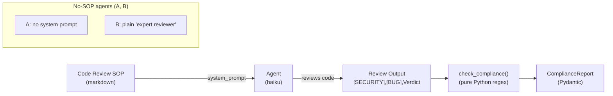

# Level 43 Reflection: Agent SOPs — Natural Language Workflow Specs
**Date:** 2026-03-18 | **File:** `12_orchestration/agent_sops.py`
**Package:** `strands-agents-sops==1.1.1`
**Depends on:** L22 (Safety), L42 (Reflexion — SOPs are human-readable exit criteria)
**Unlocks:** Portable, auditable agent workflows without rewriting agent code

---

## Part 1 — For Humans

### What We Built
A three-way comparison of code review agents: no SOP, plain "expert code reviewer" prompt, and a custom Code Review SOP with RFC 2119 constraints. Paired with a pure-Python compliance checker that reads the agent output and verifies whether MUST steps were followed.

### How It Works

```
SOP markdown (MUST/SHOULD/MAY)
    │ → system_prompt
    ▼
Agent runs → produces structured output
    │ ([SECURITY], [BUG], "Verdict: FAIL")
    ▼
check_compliance(output) → ComplianceReport
    │ pure Python regex, 0 LLM calls
    ▼
Compliance table: ✓ MUST | ✓ SHOULD | ✓ MAY
```

### What We Learned

**SOP is just a markdown string.** No special runner. No SDK methods. Pass it as `system_prompt` to any Agent. Works in Kiro, Cursor, Claude Code, or any model that reads system prompts.

**Plain prompts give no guarantees.** Agent A (no SOP) and Agent B ("expert code reviewer") both found SQL injection but MISSED the [BUG] label and the VERDICT entirely. Neither missed it by accident — there was simply no instruction to include those. The SOP agent followed all MUST steps: [SECURITY] ✓, [BUG] ✓, Verdict: FAIL ✓, plus the SHOULD [PERF] and MAY [STYLE].

**`_with_input(user_input='')` adds an XML envelope:**
```
<agent-sop name="pdd">
  <content>...markdown SOP...</content>
  <user-input>...task...</user-input>
</agent-sop>
```
Single positional argument. `{param}` placeholders stay in the markdown and are filled by the agent during execution — no pre-substitution.

### The Single Most Important Thing
SOPs are human-readable Reflexion exit criteria. L42 used a numeric threshold (`score >= 1.0`) to decide "done". L43 uses structured prose (`MUST include Verdict: PASS|FAIL`) to define the same thing. Both are objectively checkable without LLM cost. The difference: SOPs work for open-ended tasks where there's no ground truth — just a contract about what the output must contain.

---

## Part 2 — For LLMs

### Architecture



### Decision Log

| Decision | Why | Trade-off |
|----------|-----|-----------|
| SOP as system_prompt directly | Simplest; shows that SOPs need no special machinery | User might expect a dedicated `run_sop()` API — there isn't one |
| Pure-Python regex compliance check | 0 LLM cost; deterministic | Only works for well-defined output labels; open-ended MUST steps need LLM evaluation |
| haiku as reviewer | Speed + cost; review quality isn't the point | Sonnet would produce richer reviews |
| RFC 2119 in custom SOP | Models are trained to follow RFC language; it works | Over-specified SOPs become brittle; too few constraints give too little guidance |

### Pseudocode — Key Patterns

```
# SOP as system prompt
sop_markdown = """# Code Review SOP
## Steps
### 1. Security
- You MUST prefix every finding with [SECURITY]
### 3. Verdict
- You MUST end with: "Verdict: PASS | PASS_WITH_NOTES | FAIL"
"""
agent = Agent(model=..., system_prompt=sop_markdown, ...)
review = agent(task)

# _with_input() envelope
wrapped = sops.pdd_with_input(user_input="build a CLI")
# → <agent-sop name="pdd"><content>...sop...</content><user-input>build a CLI</user-input></agent-sop>

# Compliance check (pure Python)
def check_compliance(text):
    verdict = re.search(r'Verdict:\s*(PASS_WITH_NOTES|PASS|FAIL)', text, re.I)
    return ComplianceReport(
        security_check_done = "[SECURITY]" in text or "sql inject" in text.lower(),
        bug_check_done      = "[BUG]" in text,
        verdict_present     = verdict is not None,
        verdict             = verdict.group(1).upper() if verdict else "MISSING",
        ...
    )

# In production: retry if MUST step missing (same as Reflexion)
if not report.verdict_present:
    # re-run agent or escalate
```

### Observation Log

| # | Category | Topic | Observation |
|---|----------|-------|-------------|
| 1 | pattern | sop-as-system-prompt | SOP = markdown string as system_prompt. No special runner. Works in any MCP IDE. |
| 2 | pattern | sop-with-input-api | `_with_input(user_input='')` → XML envelope. Single arg. {params} stay in markdown. |
| 3 | insight | sop-vs-plain-prompt | A/B plain prompts: no [BUG] label, no verdict. C SOP: all MUST steps followed. "Expert code reviewer" adds zero guarantees. |
| 4 | insight | sop-reflexion-connection | SOP MUST = human-readable Reflexion exit criterion. L42 uses numeric score; L43 uses prose constraints. Both checkable without LLM. |
| 5 | pattern | sop-compliance-checking | Pure-Python regex on output. If MUST step missing → reject+retry (like Reflexion). SHOULD/MAY violations are notes, not failures. |

### Forward Links

- **Connection to L42 Reflexion**: SOP constraints are the human-readable version of numeric thresholds. Could wrap SOP compliance checking in a Reflexion loop: run agent, check MUST compliance, reflect on failures, retry.
- **Revisit when**: Building any multi-step agent workflow where output must satisfy fixed quality gates; authoring custom SOPs for domain-specific tasks (incident response, PR review, deployment checklist).
