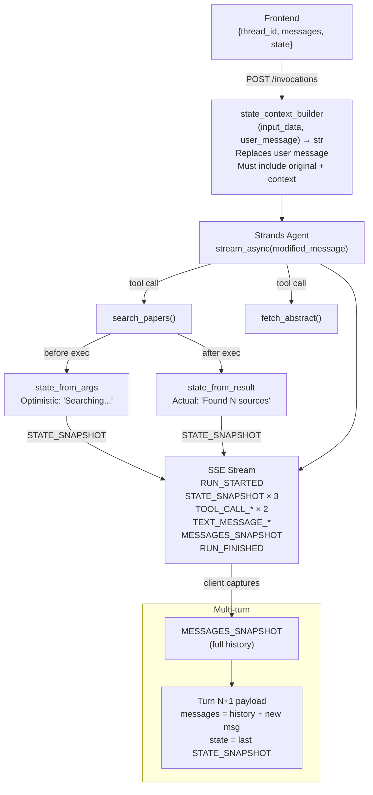

# Level 44: AG-UI — Agent-to-Frontend Protocol
**Date:** 2026-03-18 | **File:** `12_orchestration/agui_protocol.py`
**Package:** `ag-ui-strands==0.1.1` + `ag-ui-protocol==0.1.14`
**Depends on:** L32 (A2A), L40 (Edge Strands)
**Unlocks:** Live agent UIs with CopilotKit/React without custom WebSocket wiring

---

## Part 1 — For Humans

### What We Built
A research assistant that streams its internal state to a frontend in real time — no polling,
no custom WebSocket code. Every tool call, every token of text, and every state change is an
SSE event that any AG-UI-compatible frontend can consume. Two-turn conversation with state
persisting across turns.

### How It Works

    FRONTEND (browser)           AGENT SERVER (/invocations)
    +------------------+         +-------------------------+
    | POST /invocations|-------->| FastAPI + SSE           |
    | {thread_id, msgs,|         |                         |
    |  state: {...}}   |         | state_context_builder() |
    +------------------+         |   - gets user message   |
                                 |   - returns msg + ctx   |
                                 |         |               |
    +------------------+         |         v               |
    | SSE event stream |<--------| strands_agent.run()     |
    |                  |         |         |               |
    | RUN_STARTED      |         |    tool called?         |
    | STATE_SNAPSHOT   |         |    state_from_args()    |
    |   (optimistic)   |         |    [STATE_SNAPSHOT]     |
    | TOOL_CALL_START  |         |    execute tool         |
    | TOOL_CALL_ARGS   |         |    state_from_result()  |
    | TOOL_CALL_END    |         |    [STATE_SNAPSHOT]     |
    | TOOL_CALL_RESULT |         |         |               |
    | STATE_SNAPSHOT   |         |    text tokens...       |
    |   (actual)       |         |         |               |
    | TEXT_MESSAGE_*   |         | MESSAGES_SNAPSHOT       |
    | MESSAGES_SNAPSHOT|         | RUN_FINISHED            |
    | RUN_FINISHED     |         +-------------------------+
    +------------------+

### The Three State Update Points

    TIMELINE OF ONE TOOL CALL:

    t0: run starts
        --> STATE_SNAPSHOT: {status: "idle"}

    t1: tool is CALLED (not yet executed)
        --> state_from_args() fires immediately
        --> STATE_SNAPSHOT: {status: "Searching for: X..."}
        ** frontend shows spinner NOW, before any network call **

    t2: tool RETURNS
        --> state_from_result() fires with actual result
        --> STATE_SNAPSHOT: {sources: ["p004","p005"], status: "Found 3 sources"}
        ** frontend updates with real data **

### Multi-Turn Thread

    TURN 1                          TURN 2
    +-------------------+           +-------------------+
    | payload.state =   |           | payload.state =   |
    |   {status: "idle"}|           | TURN1 final state |
    |   {sources: []}   |           |   {sources: [p004,|
    +-------------------+           |    p005, p006]}   |
            |                       +-------------------+
            v                               |
    [MESSAGES_SNAPSHOT] -------> messages list in Turn 2
    (full history sent back)      Agent sees past tool results

    Same thread_id = same conversation.
    Client is responsible for carrying state + history forward.

### What Went Wrong (3 critical bugs)

    1. WRONG: state_context_builder(input, thread_id) -> "Response style: concise"
              Agent saw ONLY the style note, not the user's task.
              Result: "I understand you prefer concise responses."
       RIGHT:  Second arg IS the user message. Return msg + context together:
               return f"{user_message}\n\n[Context] {injected_state}"

    2. WRONG: File named ag_ui.py in 12_orchestration/
              Shadowed the installed ag_ui package, caused circular import.
       RIGHT:  Rename to agui_protocol.py. Never name .py files after packages.

    3. WRONG: ctx.tool_call_args, ctx.result, ctx.state
       RIGHT:  ctx.tool_input, ctx.result_data, ctx.input_data.state
               Event fields: toolCallName (not tool_name), content (not result)

### The Single Most Important Thing
`state_context_builder` is a **user message modifier**, not a system prompt injector.
The SDK extracts the last user message, hands it to your function as the second arg, and
replaces it wholesale with whatever you return. If you forget to include the original message
in your return value, the agent never sees the user's task — it only sees your injected
context. The fix is always: `return f"{user_message}\n\n{your_context}"`.

---

## Part 2 — For LLMs

### Architecture



### Decision Log

| Decision | Why | Trade-off |
|----------|-----|-----------|
| Return original message + context from state_context_builder | SDK replaces user message with return value — must include original | Easy to forget; silent bug (agent sees context, ignores task) |
| Probe ToolCallContext/ToolResultContext shapes before coding | Field names are non-obvious dataclass fields, not Pydantic model | Extra probe step, but avoids 3-4 AttributeErrors in one shot |
| Rename file from ag_ui.py to agui_protocol.py | Python module shadowing — local file wins over installed package | Lose obvious naming; must remember this rule |
| TestClient + client.stream() for SSE testing | No browser/frontend required; deterministic; fast | TestClient is sync; async SSE behavior may differ slightly in prod |

### Pseudocode — Key Patterns

```
# state_context_builder — MUST include original message
def state_context_builder(input_data, user_message):
    state = input_data.state or {}
    context = build_context_from(state)
    return f"{user_message}\n\n{context}"   # <-- user_message first!

# ToolBehavior setup
tool_behaviors = {
    "search_papers": ToolBehavior(
        state_from_args   = fn(ToolCallContext) -> dict | None,
        state_from_result = fn(ToolResultContext) -> dict | None,
    )
}
# ToolCallContext fields: .tool_input (dict), .tool_name, .tool_use_id, .args_str
# ToolResultContext adds: .result_data, .message_id
# State from: ctx.input_data.state (NOT ctx.state)

# SSE event field names (camelCase inside events):
# TOOL_CALL_START:  ev["toolCallName"], ev["toolCallId"]
# TOOL_CALL_RESULT: ev["content"]
# STATE_SNAPSHOT:   ev["snapshot"]
# (event TYPE is UPPER_SNAKE_CASE; fields inside are camelCase)

# Multi-turn: reconstruct payload from previous turn's MESSAGES_SNAPSHOT
history = last MESSAGES_SNAPSHOT event from Turn N
Turn N+1 payload = {
    thread_id: same_thread_id,
    messages:  history + [new_user_message],
    state:     last STATE_SNAPSHOT.snapshot,
}
```

### Observation Log

| # | Category | Topic | Observation |
|---|----------|-------|-------------|
| 1 | mistake | state-context-builder-signature | Second arg is user_message (str), not thread_id. Return value REPLACES user message. Must include original msg. |
| 2 | mistake | ag-ui-module-naming | File ag_ui.py shadows installed ag_ui package → circular import. Rename to agui_protocol.py. |
| 3 | mistake | tool-context-fields | ctx.tool_call_args → ctx.tool_input; ctx.result → ctx.result_data; ctx.state → ctx.input_data.state |
| 4 | mistake | event-field-names-camelcase | TOOL_CALL_START field: toolCallName (not tool_name). TOOL_CALL_RESULT field: content (not result). |
| 5 | insight | state-context-builder-semantics | state_context_builder is a user message MODIFIER. SDK extracts last user msg, passes as 2nd arg, replaces with return value before streaming. Not a system prompt injector. |
| 6 | insight | agui-three-state-hooks | 3 update points: (1) initial STATE_SNAPSHOT from payload; (2) state_from_args — optimistic, fires on call; (3) state_from_result — actual, fires on return. Each emits STATE_SNAPSHOT. |
| 7 | pattern | agui-event-stream-order | RUN_STARTED → STATE_SNAPSHOT(initial) → [STATE_SNAPSHOT(opt) → TOOL_CALL_START → ARGS → END → RESULT → STATE_SNAPSHOT(actual)] × N → TEXT_MESSAGE_* → MESSAGES_SNAPSHOT → RUN_FINISHED |
| 8 | pattern | agui-multi-turn-state | Same thread_id = same conversation. Client carries last STATE_SNAPSHOT forward as next payload.state. MESSAGES_SNAPSHOT gives history for next payload.messages. |
| 9 | pattern | agui-testclient-sse | TestClient + client.stream() + iter_lines() tests SSE without frontend. Skip lines starting with ':' (keepalive). Parse 'data:' prefix lines as JSON. |
| 10 | question | state-context-builder-vs-system-prompt | No system_prompt_builder hook observed. System prompt must be fixed at Agent() construction. How to inject dynamic context into system prompt per-run? |

### Forward Links

- **AG-UI + CopilotKit**: `create_strands_app()` output mounts directly behind CopilotKit's `useCoAgent()` hook. The SSE event stream is the shared contract.
- **Revisit when**: Building any live agent UI where the frontend needs to show tool progress, maintain shared state, or drive loading indicators — reach for `state_from_args` (optimistic) + `state_from_result` (actual).
- **Connection to L32 (A2A)**: A2A = agent↔agent over SSE. AG-UI = agent↔frontend over SSE. Same streaming concept, different consumers and payload schemas.
