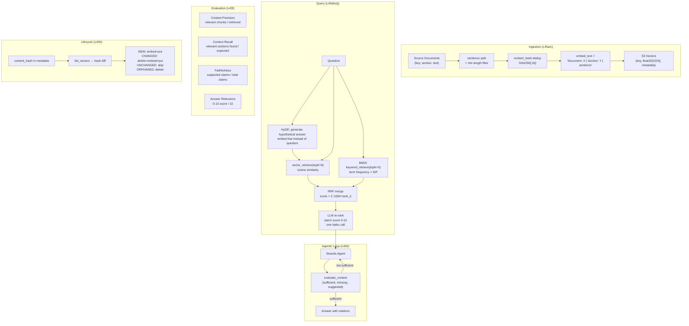

# Level 45 RAG Series: Complete Reference
**Date:** 2026-03-19 | **Files:** `12_orchestration/s3_vectors_rag*.py`
**Covers:** L45a → L45h — all RAG dimensions

---

## Part 1 — For Humans

### The Full RAG Stack

Every layer has a failure mode. Fix one layer, another becomes the bottleneck.

    INGESTION PIPELINE (L45a, L45c)
    +----------------------------------+
    |  Document                        |
    |    v split (sentence boundary)   |
    |    v dedup (content hash)        |
    |    v enrich embedding text       |  <- most impactful change
    |      "Document: X | Section: Y  |
    |       | <sentence>"             |
    |    v embed (Titan v2, 1024d)    |
    |    v store (raw text + metadata)|
    +----------------------------------+
             |
             v
    VECTOR INDEX (S3 Vectors)
    +----------------------------------+
    | bucket/index                     |
    | key | float32[1024] | metadata   |
    |   metadata: text, section,       |
    |             content_hash         |
    +----------------------------------+
             |
             v
    QUERY PIPELINE (L45d, L45e, L45g)
    +----------------------------------+
    | Raw query                        |
    |   HyDE: generate hypothetical    |
    |   answer → embed that instead    |
    |                                  |
    | Stage 1 — vector similarity      |
    |   retrieve top-N candidates      |
    |                                  |
    | [optional] BM25 keyword search   |
    |   merge via RRF                  |
    |                                  |
    | Stage 2 — LLM re-rank            |
    |   batch score all N, reorder     |
    +----------------------------------+
             |
             v
    GENERATION + EVALUATION (L45b, L45f)
    +----------------------------------+
    | Agent decides when/what to       |
    | retrieve (agentic loop)          |
    |                                  |
    | evaluate_context: sufficient?    |
    | → No: search again (Reflexion)   |
    |                                  |
    | 4 metrics: precision, recall,    |
    | faithfulness, answer_relevance   |
    +----------------------------------+
             |
             v
    INDEX LIFECYCLE (L45h)
    +----------------------------------+
    | Incremental update:              |
    |   hash diff → add/update/delete  |
    |   only changed chunks re-embedded|
    +----------------------------------+


### What Each Iteration Proved (Numbers)

    L45a: Basic RAG works. S3 Vectors is serverless — no ops overhead.

    L45c: Ingestion pipeline comparison (precision@1):
      Naive fixed-size:      50%
      Sentence boundary:     50%  ← same as naive!
      Contextual enrichment: 100% ← ALL gains came from this
      Hierarchical:          100%
      Key: sentence chunking gave zero improvement. Enrichment was everything.

    L45d: Query-side techniques:
      Raw query:        62%
      HyDE:             75%  ← hypothetical answer is in document space
      Query expansion:  12%  ← WORSE — paraphrase drift + RRF amplifies noise
      HyDE + expansion: 25%  ← expansion dragged HyDE down
      Key: HyDE is robust; expansion is fragile without quality control.

    L45e: Re-ranking:
      Vector only (top-8):   88%
      After LLM re-rank:     100%
      Key case: same phrase "callback_handler=None" in 2 sections.
      Vector can't distinguish intent. LLM re-ranker can.

    L45f: Evaluation metrics (overall score):
      A: Naive:              0.804
      B: Contextual:         0.831
      C: Enrichment+Rerank:  0.850
      Context precision:     A=0.667, B=0.723, C=0.834 (discriminating metric)
      Faithfulness:          1.0 for all (constrained prompts work)

    L45g: Hybrid search:
      Semantic:   75%
      Keyword:    75%
      Hybrid:     88%  ← 3 cases fixed where one retriever failed
      Key case where hybrid failed: RRF consensus wrong (semantic too strong on wrong answer)

    L45h: Incremental indexing:
      T1 re-ingest (no changes): 0 embed calls (was 11)
      T2 update (1 changed, 1 new, 1 deleted): 3 of 12 possible calls
      75% cost savings vs full re-ingest


### The Hierarchy of Impact

    If you can only do one thing:    → contextual enrichment at ingestion
    If you can do two:               → add LLM re-ranking
    If you're in production:         → add evaluation harness to measure
    For exact-term queries:          → add BM25 hybrid
    For a growing corpus:            → add incremental indexing
    For agentic use:                 → wrap in iterative retrieval loop


### The Surprising Results

    1. Sentence boundary chunking = naive (both 50%). Everyone assumes
       chunking strategy matters. It doesn't, without enrichment.

    2. Query expansion made things WORSE (12%). More queries + RRF is not
       always better. Garbage paraphrases poison the merge.

    3. RRF failed when one retriever was confidently wrong. Consensus
       mechanisms don't help when the majority is wrong.

    4. Faithfulness = 1.0 for all configs. With "use ONLY context"
       instruction, haiku didn't hallucinate. The failure modes are
       precision and relevance, not faithfulness.

---

## Part 2 — For LLMs

### Complete Architecture



### Decision Log (Series-wide)

| Level | Decision | Why | Outcome |
|-------|----------|-----|---------|
| L45c | embed enriched, store raw | enrichment improves cosine; raw keeps answer clean | 50%→100% precision |
| L45c | nonFilterableMetadataKeys=["text"] | large text excluded from filter index | topic/section remain filterable |
| L45d | HyDE over expansion | hypothetical answer is in document space; paraphrases can drift | HyDE: +13pp, expansion: -50pp |
| L45e | batched re-rank prompt | one LLM call for all N; haiku sufficient for scoring | 88%→100%; cheap |
| L45f | 4 metrics, not 1 | each metric catches a different failure mode | faithfulness=1.0 for all; precision was the diff |
| L45g | RRF not score fusion | BM25 and cosine are on different scales; RRF is scale-free | works without calibration |
| L45h | hash in vector metadata | no external DB needed; survives index rebuilds | 75% cost savings on re-index |

### Pseudocode — Critical Patterns

```
# 1. Contextual enrichment (most impactful)
embed_text = f"Document: {doc_title} | Section: {section} | {sentence}"
store_text = sentence  # raw — different from embed_text

# 2. HyDE
hyp_answer = llm("Write 2-3 sentences answering: " + question)
results = vector_retrieve(hyp_answer)  # embed the answer, not the question

# 3. RRF (k=60)
for result_list in [semantic_results, keyword_results]:
  for item in result_list:
    scores[item.section] += 1 / (60 + item.rank)
merged = sorted_by(scores, descending=True)

# 4. Batched LLM re-rank
numbered = "\n".join(f"[{i+1}] {c.text[:100]}" for i,c in enumerate(candidates))
resp = llm(f"Rate relevance 0-10. Return comma-separated scores, {N} numbers.\n{numbered}")
scores = re.findall(r'\d+(?:\.\d+)?', resp)[:N]

# 5. Evaluation (RAGAS-style)
context_precision = len([c for c in retrieved if c.section in relevant_sections]) / len(retrieved)
context_recall    = len([s for s in relevant_sections if any(c.section==s for c in retrieved)]) / len(relevant_sections)
faithfulness      = llm("{supported:N, unsupported:N} for claims in answer vs context")
answer_relevance  = llm("Rate 0-10: does answer address question?") / 10

# 6. Incremental index
indexed = {v.key: v.metadata.content_hash for v in list_vectors()}
new_map  = {c.key: c for c in new_chunks}
to_add   = [c for c in new_chunks if c.key not in indexed or indexed[c.key] != c.hash]
orphaned = [k for k in indexed if k not in new_map]
delete_vectors(orphaned + [c.key for c in to_add if c.key in indexed])  # stale + changed
put_vectors([embed(c) for c in to_add])
```

### Observation Log (All L45 Iterations)

| # | Level | Cat | Topic | Key Observation |
|---|-------|-----|-------|-----------------|
| 1 | L45a | pattern | s3vectors-idempotent | get → NotFoundException → create. Direct get, no list scan. |
| 2 | L45a | insight | s3vectors-truly-serverless | No cluster, no port, no process. Just boto3. |
| 3 | L45c | insight | ingestion-precision-gap | Sentence chunking = naive (50%). Enrichment → 100%. |
| 4 | L45c | insight | dangling-pronoun | "This is handled" and "It uses" indistinguishable without section context. |
| 5 | L45c | pattern | embed-enrich-store-raw | Embed enriched, store raw. Zero extra storage cost. |
| 6 | L45b | insight | reflexion-retrieval | Agentic RAG is Reflexion applied to retrieval. Same loop. |
| 7 | L45d | insight | hyde-vs-expansion | HyDE +13pp. Expansion -50pp. Paraphrase drift poisons RRF. |
| 8 | L45e | insight | same-phrase-two-sections | Vector can't distinguish intent. LLM re-ranker can. |
| 9 | L45e | pattern | batched-reranking | One haiku call for all N candidates. Parse comma-separated scores. |
| 10 | L45f | insight | faithfulness-not-bottleneck | Faithfulness=1.0 for all. Precision was the discriminating metric. |
| 11 | L45g | insight | rrf-consensus-failure | RRF fails when majority is confidently wrong. |
| 12 | L45h | pattern | incremental-hash-diff | SHA256 in metadata → list_vectors → diff → only changed chunks re-embedded. 75% cost savings. |
| 13 | L45h | pattern | s3vectors-no-update | No update_vectors. Pattern: delete(old_key) + put(new_key+new_vector). |
