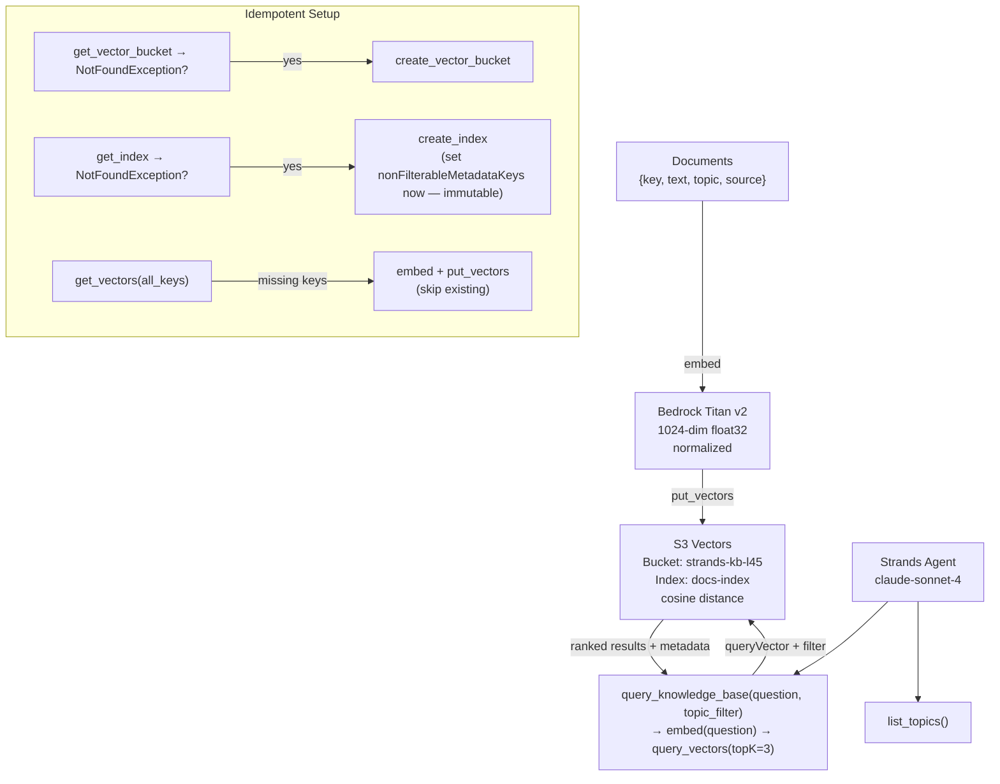

# Level 45: Agentic RAG with S3 Vectors
**Date:** 2026-03-19 | **File:** `12_orchestration/s3_vectors_rag.py`
**Package:** `boto3` (s3vectors client, us-east-1) + `bedrock-runtime` (Titan v2 embeddings)
**Depends on:** L13 (ChromaDB RAG), L10 (AgentCore/Bedrock basics)
**Unlocks:** Durable, billion-scale knowledge bases without ops overhead

---

## Part 1 — For Humans

### What We Built
A Strands research agent whose knowledge base lives in AWS S3 Vectors — a fully managed
vector store with no servers to run, no port to open, no data to back up. Documents are
embedded with Titan v2 (1024 dimensions), stored with filterable metadata, and queried
by the agent's `query_knowledge_base` tool. Re-run the script and nothing gets re-ingested.

### How It Works

    Documents (text + metadata)
         |
         v embed via Bedrock Titan v2
         |
    +----+-------------------+
    | S3 Vectors             |
    |  Bucket: strands-kb    |
    |  Index: docs-index     |
    |    key | float32[1024] |
    |    metadata: {topic,   |
    |      source, text}     |
    +----+-------------------+
         ^                |
         | put_vectors    | query_vectors
         |                | (embed question → topK=3)
    +----+-------------------+
    | Strands Agent          |
    |  tools:                |
    |   - query_knowledge_base|
    |   - list_topics        |
    +------------------------+
         |
         v
    Answer with similarity scores
    [deployment, similarity=0.624]

### Idempotent Setup Pattern

    get_vector_bucket → NotFoundException?
      YES: create_vector_bucket
      NO:  skip (already exists)

    get_index → NotFoundException?
      YES: create_index (set filterable fields NOW — immutable)
      NO:  skip

    get_vectors(all_keys) → find missing keys
      → embed + put only the missing ones
      → skip keys that already have vectors

    This means: re-running the script is safe and cheap.
    Only new documents trigger Bedrock embedding calls.

### Metadata: What Can Be Filtered?

    CreateIndex:
      nonFilterableMetadataKeys = ["text"]
                                        ^
                     REVERSE logic: everything NOT in this list IS filterable.
                     "text" = large free-text body, too big to index for filtering.
                     "topic", "source" = small strings, filterable by default.

    QueryVectors with filter:
      filter = {"topic": {"$eq": "deployment"}}

    The metadata configuration is SET ONCE at index creation.
    No UpdateIndex operation exists. Wrong choice = delete + recreate + re-ingest.

### What Went Wrong

    1. s3v.exceptions.ResourceNotFoundException does not exist.
       Correct exception: s3v.exceptions.NotFoundException
       Fix: read the AttributeError message — it lists all valid exception names.
       Rule: always probe exception names before catching them.

### What Worked

    1. Idempotent setup: get → NotFoundException → create.
       Clean, no list-scan required, works at both bucket and index level.

    2. Pre-ingest dedup: get_vectors(all_keys) before put_vectors.
       Non-existent keys come back with an error field (no exception thrown).
       Build set of existing keys → only embed+ingest what's missing.

    3. nonFilterableMetadataKeys as reverse-exclusion.
       Store everything in metadata; exclude large text fields from filter index.
       Keeps filter index small; text still stored and returned in query results.

### The Single Most Important Thing
S3 Vectors is genuinely serverless — no connection string, no port, no process to
start. The only things that exist are API calls. This means the "infrastructure setup"
is just two idempotent API calls (`CreateVectorBucket`, `CreateIndex`) that run once and
then cost nothing until you store or query vectors. The operational gap between L13
(ChromaDB running locally) and L45 (S3 Vectors) is not about features — it's about
where the operational burden lives. For production agents, that gap is everything.

---

## Part 2 — For LLMs

### Architecture



### Decision Log

| Decision | Why | Trade-off |
|----------|-----|-----------|
| `nonFilterableMetadataKeys = ["text"]` | text field is large free-text — indexing it for filtering is wasteful and expensive | text still stored and returned; just can't use `{"text": {"$eq": ...}}` filter |
| `distanceMetric = "cosine"` | Normalized embeddings (Titan normalize=True) → cosine is the right metric | euclidean works on raw unnormalized vectors; mixing metric+normalization incorrectly gives wrong rankings |
| Pre-ingest dedup via `get_vectors` | Avoids Bedrock Titan calls on re-run (each call costs money) | Extra API call per ingest; worth it for idempotency |
| `topK=3` in query tool | Balance: enough results for synthesis, not too many to confuse agent | Could expose topK as tool arg for caller control |
| Cleanup at end of demo | Avoid leaving AWS resources running after level completes | Comment out cleanup block to demo cross-session durability |

### Pseudocode — Key Patterns

```
# Idempotent infrastructure
try get_vector_bucket(name)
  if NotFoundException: create_vector_bucket(name)

try get_index(bucket, index_name)
  if NotFoundException:
    create_index(bucket, index_name,
      dataType="float32",
      dimension=1024,
      distanceMetric="cosine",
      metadataConfiguration={
        nonFilterableMetadataKeys: ["text"]  # reverse-exclusion
      }
    )

# Pre-ingest dedup
existing = get_vectors(bucket, index, all_keys, returnData=False)
# non-existent keys → result has error field, not an exception
existing_set = {v.key for v in existing.vectors if no error}
to_ingest = [doc for doc in docs if doc.key not in existing_set]

# Put vectors
for doc in to_ingest:
  vec = bedrock.invoke_model(titan_v2, doc.text, dim=1024, normalize=True)
put_vectors(bucket, index, [
  {key, data: {float32: vec}, metadata: {text, topic, source}}
])

# Query
query_vec = embed(question)
results = query_vectors(bucket, index,
  topK=3,
  queryVector={float32: query_vec},
  filter={"topic": {"$eq": topic_filter}},  # optional
  returnMetadata=True,
  returnDistance=True,
)
# distance 0=identical, 2=opposite → similarity = 1 - distance
```

### Observation Log

| # | Category | Topic | Observation |
|---|----------|-------|-------------|
| 1 | mistake | s3vectors-exception-name | `ResourceNotFoundException` does not exist. Use `NotFoundException`. Read AttributeError for valid names. |
| 2 | pattern | s3vectors-idempotent-setup | `get_X → NotFoundException → create_X` for bucket and index. No list-scan needed. |
| 3 | pattern | s3vectors-pre-ingest-dedup | `get_vectors(all_keys)` returns error field for missing keys (no exception). Build existing set → only ingest missing. |
| 4 | pattern | s3vectors-vector-shapes | PutVectors: `{key, data: {float32: [...]}, metadata: {...}}`. Query: `{float32: [...]}`. Only float32 supported. |
| 5 | pattern | s3vectors-metadata-filterability | `nonFilterableMetadataKeys` is reverse-exclusion. Everything not listed is filterable. Set at `CreateIndex` time — immutable. |
| 6 | insight | s3vectors-truly-serverless | No cluster, no port, no process. Just boto3 calls. Operational gap vs Chroma/Pinecone is significant for production. |
| 7 | insight | s3vectors-metadataconfiguration-immutable | No `UpdateIndex` operation. Plan filterable fields before `CreateIndex`. Wrong choice = delete + recreate + re-ingest. |
| 8 | question | s3vectors-scale-limits | Max vectors/index? Max metadata size? ANN or exact? Latency at scale? Not tested. |

### Forward Links

- **Connection to L13 (ChromaDB RAG)**: Same semantic search pattern; S3 Vectors replaces local Chroma client. Embedding call, put, query, retrieve metadata — identical flow, different infra.
- **Unlocks production RAG**: S3 Vectors + Bedrock embeddings is the AWS-native stack for production knowledge bases attached to AgentCore-deployed agents (L27).
- **Revisit when**: Building any agent that needs knowledge beyond a single session, needs to scale beyond one machine, or needs metadata-filtered retrieval (e.g., "only search docs tagged as security").
