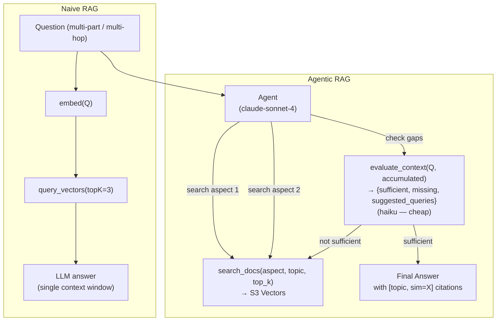

# Level 45b: Agentic RAG — Iterative Retrieval vs Naive RAG
**Date:** 2026-03-19 | **File:** `12_orchestration/s3_vectors_rag_advanced.py`
**Depends on:** L45 (S3 Vectors basics), L42 (Reflexion loop)
**Unlocks:** Production RAG systems that handle multi-part and cross-topic questions

---

## Part 1 — For Humans

### What We Built
A side-by-side comparison of naive RAG (retrieve once, answer) against agentic RAG
(agent controls the retrieval loop, self-evaluates, searches again if gaps found).
Same S3 Vectors KB, same questions — two fundamentally different architectures.

### The Core Difference

    NAIVE RAG (single-shot):

    Question
       |
       v embed once
       |
    S3 Vectors (topK=3)
       |
       v ONE cluster of results
       |
    LLM: "Here's what I found..."
    (if question spans 3 topics, probably misses 2 of them)


    AGENTIC RAG (iterative):

    Question
       |
    +--v-------------------------+
    | Agent                      |
    |                            |
    | search_docs("aspect 1")    |--> S3 Vectors
    | search_docs("aspect 2")    |--> S3 Vectors
    | evaluate_context()         |--> Haiku: sufficient?
    |   - NO: search again       |
    |   - YES: answer            |
    |                            |
    | Cite [topic, sim=X]        |
    +----------------------------+
    (multi-part questions answered correctly)


### What The Numbers Said

    Q1: Simple — 1 topic (Reflexion)
      Naive:   1 search — correct answer
      Agentic: 4 searches — correct answer (more thorough)

    Q2: Multi-part — 3 topics (tools + multi-agent + deployment)
      Naive:   1 search — partial answer (missed multi-agent tradeoffs)
      Agentic: 4 searches — complete answer, all aspects covered

    Q3: Multi-hop (Lambda cold starts → what tool to use?)
      Naive:   1 search — "I cannot answer this question" (FAILED)
      Agentic: 4 searches — found S3 Vectors + Titan v2 correctly

    The gap on Q3 is the whole argument for agentic RAG.


### Self-Evaluation = Reflexion Applied to Retrieval

    This is the exact same pattern as L42 Reflexion,
    just applied to retrieval instead of code generation:

    L42 Reflexion:
      attempt code → evaluate(score) → reflect(what's wrong) → retry

    L45 Agentic RAG:
      search docs → evaluate(sufficient?) → reflect(what's missing) → search again

    The evaluate_context tool returns:
      - sufficient: yes/no
      - missing_aspects: what's still unanswered
      - suggested_queries: what to search next

    Haiku does the evaluation cheaply. The agent decides what to do next.


### Multi-Hop Without Any Special Code

    Q3 asked about "Lambda cold starts" and "embedding model".
    The agent:
      1. searched "Lambda cold starts" → found Lambda thread-safety doc
      2. evaluate_context → "missing: persistent storage, embeddings"
      3. searched "knowledge base persists Lambda" → found S3 Vectors doc
      4. searched "embedding model Titan" → found Titan v2 details

    No explicit "extract entities → search entities" code.
    The agent bridges hops by reading the retrieved text and deciding what to search next.
    The system prompt instruction ("search each aspect separately") was enough.


### What Went Wrong
    Nothing broke this time. The shapes were correct from iter 1.
    The only surprise: agentic RAG used 4 searches even for the simple Q1 —
    the evaluate_context tool + system prompt drove extra searches even when
    the first result was sufficient.


### The Single Most Important Thing
Naive RAG has a hard limit: one query can only surface one semantic cluster. A question
that spans three topics requires three queries. Agentic RAG breaks this limit not by
changing the vector store but by giving the agent control over the retrieval loop. The
evaluator (Reflexion applied to retrieval) is what prevents premature answering. The cost
is real — ~4x more embedding calls — but for production systems where wrong answers
are costly, it's the right tradeoff.

---

## Part 2 — For LLMs

### Architecture



### Decision Log

| Decision | Why | Trade-off |
|----------|-----|-----------|
| evaluate_context uses haiku (not sonnet) | Sufficiency check is a simple classification task — cheap model sufficient | haiku may over-report "sufficient" for ambiguous cases; sonnet would be more conservative |
| search_docs exposes top_k param | Agent can request more results when it suspects sparse coverage | Agent rarely changes top_k — mostly uses default 3; might simplify to fixed value |
| Module-level `_session` for search counter | Simple way to count searches without modifying Agent internals | Not thread-safe; single-threaded demo only |
| Naive RAG uses haiku (not sonnet) | Fair comparison: haiku is the "cheap" baseline; sonnet for agentic | Could argue unfair — sonnet naive vs sonnet agentic would be cleaner |
| evaluate_context is a tool, not a Python function | Agent can decide when to call it; follows agentic pattern | Agent called it even for simple Q1 → 4 searches instead of 1-2 |

### Pseudocode — Key Patterns

```
# Agentic RAG loop (what the agent does internally)
list_topics()                          # optional: understand KB scope
search_docs(question_aspect_1)         # always search at least once
search_docs(question_aspect_2)         # for multi-part: search each part

evaluate_context(question, all_retrieved_text)
  → {sufficient: false, missing: ["embedding model", "cold starts"], suggested: [...]}

if not sufficient:
  search_docs(suggested_queries[0])
  search_docs(suggested_queries[1])
  re-evaluate

if sufficient (or 4 searches done):
  answer with [topic, sim=X] citations for every claim

# evaluate_context prompt (key: return JSON only)
"Return ONLY valid JSON with keys:
  sufficient (bool),
  covered_aspects (list str),
  missing_aspects (list str),
  suggested_queries (list str, empty if sufficient=true)"
# Then extract JSON with regex: re.search(r'\{.*\}', resp, re.DOTALL)

# Reflexion-retrieval connection:
# L42:  attempt → evaluate(score >= threshold?) → reflect → retry code
# L45b: search  → evaluate(sufficient?)         → reflect → retry search
# Same loop, same stopping conditions, different domain.
```

### Observation Log

| # | Category | Topic | Observation |
|---|----------|-------|-------------|
| 1 | insight | agentic-rag-vs-naive-rag | Q3 naive RAG returned "I cannot answer" — retrieved wrong cluster. Agentic RAG got it right across 4 searches. Gap is not marginal. |
| 2 | insight | reflexion-applied-to-retrieval | evaluate_context is Reflexion for retrieval: search → evaluate sufficiency → reflect on gaps → search again. Same loop, different domain. |
| 3 | pattern | agentic-rag-search-count | Agentic RAG used 4 searches on all questions including simple ones. evaluate_context + system prompt drove extra checks. Cost: ~4x embedding calls vs naive. |
| 4 | pattern | multi-hop-retrieval | No explicit entity-extraction code needed. Agent reads retrieved text, identifies new entities, searches them. System prompt "search each aspect" enables this. |
| 5 | pattern | topic-scoped-search-tool | search_docs(question, topic='', top_k=3): optional topic filter + adjustable top_k makes one tool work for both broad exploration and narrow targeted retrieval. |

### Forward Links

- **Connection to L42 (Reflexion)**: Agentic RAG IS Reflexion applied to retrieval. The evaluate_context tool is the evaluator. The missing_aspects are the reflection. The suggested_queries are the improvement strategy.
- **Connection to L46 (Hybrid DAG-in-Graph)**: Agentic RAG could be one node in a DAG — "retrieve relevant context" as a sub-graph that loops until sufficient. L46 makes this explicit.
- **Revisit when**: Any production RAG system where questions span multiple topics, require multi-hop reasoning, or where wrong answers have real cost. The 4x retrieval overhead is justified when "I cannot answer" is not acceptable.
