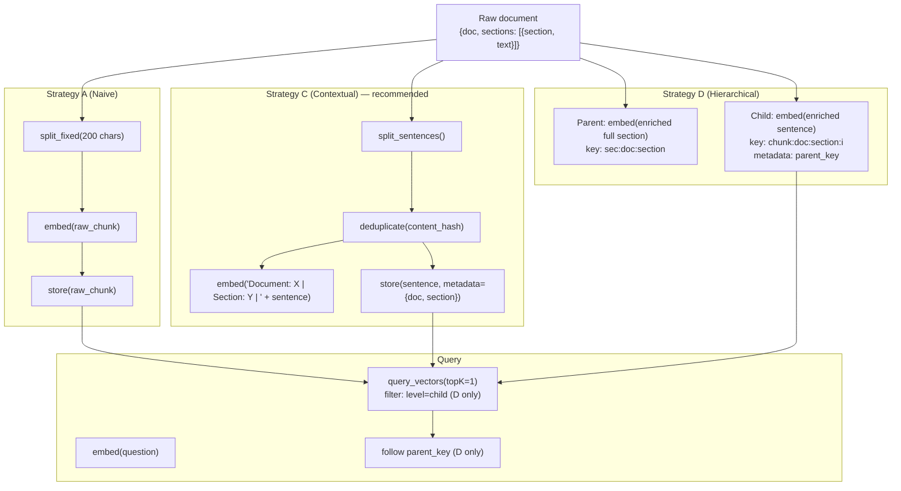

# Level 45c: RAG Ingestion Pipeline — What Goes In Determines What Comes Out
**Date:** 2026-03-19 | **File:** `12_orchestration/s3_vectors_ingestion.py`
**Depends on:** L45 (S3 Vectors), L45b (Agentic RAG)
**Unlocks:** Production-quality RAG systems where retrieval precision is non-negotiable

---

## Part 1 — For Humans

### What We Built
A four-strategy ingestion pipeline comparison on the same document corpus, with
measurable precision@1 scores. The result: chunking strategy (naive vs sentence
boundary) had zero effect on precision. Contextual enrichment (adding document
and section context to the embedding text) jumped precision from 50% to 100%.

### The Four Strategies

    A: NAIVE FIXED-SIZE
    +------------------------------+
    | "...tool orchestration and   |  chunk 0
    |  conversation history. It    |  200 chars
    |  also handles model selec"   |
    +------------------------------+
    | "tion and streaming. To      |  chunk 1
    |  create an agent..."         |  200 chars
    +------------------------------+
    Problem: cuts mid-word, produces garbage fragments.
    Dangling "It" loses its referent across the cut.


    B: SENTENCE BOUNDARY
    +------------------------------+
    | "It manages tool             |  sentence 0
    |  orchestration..."           |
    +------------------------------+
    | "It supports two types of    |  sentence 1 (different section!)
    |  tools..."                   |
    +------------------------------+
    Better units. But "It" still has no referent.
    Query "How is short-term memory handled?" → returns WRONG section.
    (Both memory sections start with "It" or "This".)


    C: CONTEXTUAL ENRICHMENT (embed != store)
    +------------------------------------+
    | EMBED: "Document: Strands SDK     |
    |  Guide | Section: Tool System |   |
    |  It supports two types of tools.."|
    +------------------------------------+
    | STORE: "It supports two types     |  clean text for answers
    |  of tools..."                     |
    +------------------------------------+
    Embedding captures section name. Dangling pronoun resolved.
    Zero extra storage — only the embedding vector changes.
    Precision: 50% -> 100%.


    D: HIERARCHICAL PARENT-CHILD
    +------------------------------------+
    | PARENT key: sec:doc:Tool System    |  full section text
    |  (embedded + enriched)            |
    +------------------------------------+
         |
         +-- CHILD key: chunk:doc:Tool System:0
         |     sentence 0, parent_key pointer
         +-- CHILD key: chunk:doc:Tool System:1
               sentence 1, parent_key pointer

    Query hits children (precision).
    Follow parent_key for full section context (recall).
    Best of both worlds.


### The Precision Numbers

    Strategy          Precision@1   Mean Similarity
    ----------------  -----------   ---------------
    A (naive)              50%           0.38
    B (sentence)           50%           0.39
    C (contextual)        100%           0.57
    D (hierarchical)      100%           0.57

    B is no better than A. The chunking algorithm doesn't matter
    if the embedding text has no context.


### The Dangling Pronoun Case (Most Important)

    Query: "How is short-term memory handled?"

    Section 1 (Short-term Memory):  "This is handled automatically..."
    Section 2 (Long-term Memory):   "It uses AgentCore's LTM API..."

    A returns: Long-term Memory (sim=0.29) — WRONG
    B returns: Long-term Memory (sim=0.23) — WRONG

    Both chose the wrong section because "It uses AgentCore" has higher
    cosine similarity to "short-term memory handled" than "This is handled
    automatically" — the model can't resolve "This" without context.

    C returns: Short-term Memory (sim=0.59) — CORRECT
    Because the embedding has "Section: Short-term Memory" in it,
    and the query has "short-term memory" — cosine is high.


### The Single Most Important Thing
Enriching the embedding text is the highest-leverage change in a RAG pipeline.
You are not changing what is stored — the raw sentence text stays clean for
display. You are changing what is embedded — adding document title and section
header before the sentence text. This costs nothing in storage and nothing in
query time. It only affects the embedding call at ingestion time. The result is
that sentences with dangling pronouns, ambiguous "this", or implicit subjects
become findable by section-level queries. Without it, 50% of retrieval fails.
This pattern (embed enriched, store raw) is the first thing to add to any RAG pipeline.

---

## Part 2 — For LLMs

### Architecture



### Decision Log

| Decision | Why | Trade-off |
|----------|-----|-----------|
| Embed enriched, store raw | Zero storage cost, improves cosine matching for section-level queries, clean answer text | Enrichment prefix must match query vocabulary — "Document: X \| Section: Y" vs "Section: Y in X" |
| `nonFilterableMetadataKeys = ["text", "embed_prefix"]` | Large strings excluded from filter index; only level/section/doc are filterable | embed_prefix is diagnostic only; real system might not store it |
| Embed cache (`_embed_cache` dict) | Avoids redundant Bedrock calls for identical texts during one pipeline run | In-memory only — for production use Redis/DynamoDB keyed on (model_id, text_hash) |
| content_hash dedup before embedding | Prevents index inflation from duplicate sentences; dedup on text not vector | MD5 is fast but not collision-free; for safety use SHA-256 |
| Level filter for D hierarchy | Allows querying only children (precision) or only parents (recall) | Requires level metadata field to be filterable — must NOT be in nonFilterableMetadataKeys |

### Pseudocode — Key Patterns

```
# Contextual enrichment pipeline (Strategy C — the recommended baseline)
for doc in corpus:
  for section in doc.sections:
    for sentence in split_sentences(section.text, min_len=20):
      h = md5(sentence)
      if h in seen: continue   # dedup
      seen.add(h)

      embed_text = f"Document: {doc.title} | Section: {section.name} | {sentence}"
      store_text = sentence   # raw — clean for display

      put_vectors(key, data={float32: embed(embed_text)},
                  metadata={text: store_text, doc: doc.title, section: section.name})

# Hierarchical parent-child (Strategy D)
# Level 1: parent = full section
put_vectors(
  key=f"sec:{doc}:{section}",
  data={float32: embed(f"Document: {doc} | Section: {section} | {full_text}")},
  metadata={text: full_text, level: "parent", doc: doc, section: section}
)
# Level 2: children = individual sentences, point to parent
for i, sent in enumerate(split_sentences(section.text)):
  put_vectors(
    key=f"chunk:{doc}:{section}:{i}",
    data={float32: embed(f"Document: {doc} | Section: {section} | {sent}")},
    metadata={text: sent, level: "child", parent_key: f"sec:{doc}:{section}"}
  )

# Retrieve: child precision + parent context
child = query_vectors(q_vec, topK=1, filter={"level": {"$eq": "child"}})
parent = get_vectors([child.metadata.parent_key])  # full section
```

### Observation Log

| # | Category | Topic | Observation |
|---|----------|-------|-------------|
| 1 | insight | ingestion-precision-gap | A=50%, B=50%, C=100%, D=100%. Sentence boundary gave zero improvement over naive. All gains came from contextual enrichment. |
| 2 | insight | dangling-pronoun-failure | "How is short-term memory handled?" → A and B both returned Long-term Memory section. Root cause: "It uses..." and "This is handled..." are equally ambiguous without section context. |
| 3 | pattern | embed-enrich-store-raw | Embed "Document: X \| Section: Y \| sentence", store raw sentence. Zero storage cost. Most impactful single change in an ingestion pipeline. |
| 4 | pattern | hierarchical-parent-child | Two levels: parent (full section) + child (sentence, stores parent_key). Query children for precision, retrieve parent for context. Level filter: `{"level": {"$eq": "child"}}`. |
| 5 | pattern | content-hash-dedup | MD5 hash of text before embedding. Dedup on text content, not vectors. Run before any embedding calls. |
| 6 | insight | embedding-cache-in-pipeline | In-process dict cache avoids redundant Titan calls. For production: Redis/DynamoDB keyed on (model_id, text_hash). Each Titan v2 call ~100ms + compute cost. |

### Forward Links

- **Connection to L45b (Agentic RAG)**: Agentic RAG's iterative retrieval partly compensates for bad ingestion — more searches can recover missed sections. But the right fix is better ingestion upstream. A 100% precision pipeline means the agent finds the right chunk on the first search, every time.
- **Revisit when**: Building any production RAG pipeline. The embed-enrich-store-raw pattern (Strategy C) should be the default baseline for all new indexing work. Hierarchical (D) adds value when documents are long and queries range from specific to broad.
- **Ingestion pipeline checklist**: (1) sentence-boundary split, (2) min-length quality gate, (3) content-hash dedup, (4) contextual enrichment prefix before embedding, (5) rich metadata for filtering, (6) embed cache for re-runs.
