# Level 46: Hybrid DAG-in-Graph
**Date:** 2026-03-19 | **File:** `12_orchestration/hybrid_dag_graph.py`
**Depends on:** L6 (Agents-as-Tools), L8 (Graph routing), L31 (Workflow DAG), L40 (thread safety)
**Unlocks:** L47 (Human-on-the-Loop — interruption points in hybrid pipelines)

---

## Part 1 — For Humans

### What We Built

A hybrid architecture that answers "when do I use Graph vs Workflow?" with "both — at different layers." A routing Agent (LLM-driven) inspects each incoming request and decides which deterministic pipeline to hand it off to. The pipelines are Workflows wrapped as tools — the LLM routes, but once a pipeline starts, it runs every step in the defined order with no deviation possible.

### How It Works

```
User Request
     |
     v
+--------------------+
|   Router Agent     |  LLM decides: ingest? analyze? direct?
+---+------------+---+
    |            |
    v            v
+---------+  +----------+
| @tool   |  | @tool    |  <-- boundary: LLM stops here
| ingest  |  | analysis |
| pipeline|  | pipeline |
+---------+  +----------+
    |            |
    v            v
[validate]  [research ]--+
    |       [assess   ]--+--> [synthesize]
[extract]
    |
[index   ]

Above the @tool: LLM flexibility
Below the @tool: deterministic DAG, guaranteed step order
```

The key is the `@tool` boundary. The router agent calls `run_ingest_pipeline("source")` — it has no visibility into validate, extract, or index steps. Those always run in that order. Always. The LLM cannot skip a step, reorder them, or add its own.

The analysis pipeline runs a **diamond DAG**: research and assess_complexity have no dependencies on each other, so the Workflow dispatches both to a thread pool simultaneously. The synthesize step waits for both to complete before merging. You can literally see this in the output — the two branches' text is interleaved.

### What Went Wrong

Nothing broke at runtime — this level ran correctly on the first attempt. That's because:
- L31 taught us the task tool inheritance gotcha: always specify `tools` in task definitions. Applied here with `"tools": ["calculator"]` on every task.
- L40 taught us agents are not thread-safe. Applied here with a fresh Agent created inside each `_run_workflow()` call.

The one gap that surfaced: workflow sub-tasks only see what's in their task description string. When the source was "technical report on S3 Vectors, 12 pages", the validator sub-agent correctly noted it couldn't read the actual file. In production you'd embed actual content or provide a retrieval tool.

### What Worked

1. **`@tool` as layer boundary** — wrapping the Workflow lifecycle inside a `@tool` function cleanly separates LLM routing from deterministic execution. The router's LLM reads the docstring; it never sees the DAG steps. This is the most important pattern in the level.

2. **`_run_workflow()` helper** — encapsulating create→start→status→delete in one function keeps each `@tool` focused on task definitions, not lifecycle boilerplate. Three lines to run a pipeline.

3. **Tool description routing** — the router correctly handled 5 requests including phrasing variants ("ingest:" vs "Please ingest...", "analyze:" vs "Can you analyze..."). The LLM used natural language understanding on the docstring to route. Zero prompt engineering on the routing logic itself.

4. **Diamond DAG** — analysis pipeline used a real parallel structure. research and assess_complexity had no shared dependencies, so the Workflow engine dispatched both simultaneously. The interleaved output confirmed actual parallel execution.

### The Single Most Important Thing

The `@tool` decorator is not just a way to give an agent a capability — it is an **architectural boundary**. Everything above it is LLM territory: flexible, natural language, autonomous. Everything below it is engineering territory: deterministic, ordered, testable. When you wrap a Workflow as a `@tool`, you get the LLM's flexibility at the routing layer without sacrificing the pipeline's reliability at the execution layer. The question "Graph or Workflow?" has been a false choice all along — they compose, and `@tool` is the joint.

---

## Part 2 — For LLMs

### Architecture

```mermaid
flowchart TD
    REQ["User Request\n(natural language)"]

    subgraph "LLM Layer (Agent)"
        ROUTER["Router Agent\nsonnet model\ncallback_handler=None"]
        DIRECT["Direct answer\n(no tool call)"]
    end

    subgraph "Boundary"
        T1["@tool run_ingest_pipeline(source)"]
        T2["@tool run_analysis_pipeline(subject)"]
    end

    subgraph "DAG Layer (Workflow)"
        subgraph "Ingest DAG"
            V["validate"] --> EM["extract_metadata"] --> IX["index_entry"]
        end
        subgraph "Analysis DAG (diamond)"
            R["research"]
            AC["assess_complexity"]
            SY["synthesize"]
            R --> SY
            AC --> SY
        end
    end

    subgraph "_run_workflow() helper"
        LC["create → start → status → delete\nFresh Agent per call"]
    end

    REQ --> ROUTER
    ROUTER --> T1
    ROUTER --> T2
    ROUTER --> DIRECT
    T1 --> LC
    T2 --> LC
    LC --> V
    LC --> R
    LC --> AC
```



```
[User Request]
      |
      v
+------------------+
|  Router Agent    |
|  (LLM / sonnet)  |
+--+--------+---+--+
   |        |   |
   v        v   v
[@tool   [@tool  [Direct
 ingest]  analysis] answer]
   |        |
   v        v
+----------+----------+
|  _run_workflow()    |
| create→start→status |
|  →delete  [fresh    |
|            Agent]   |
+--+----------+--+----+
   |               |
   v               v
[validate]      [research ]--+
[extract_meta]  [assess_cx]--+--> [synthesize]
[index_entry]
```

### Decision Log

| Decision | Why | Trade-off |
|----------|-----|-----------|
| Wrap Workflow as `@tool` not sub-Agent | Workflow is not an Agent; `@tool` wraps any callable | None — cleaner than spawning an Agent that uses the workflow tool |
| Fresh Agent in `_run_workflow()` | Agents not thread-safe; router may call tools concurrently | Tiny overhead per call, not meaningful |
| `tools=["calculator"]` in all tasks | Prevent L31 task-tool-inheritance gotcha (recursive sub-workflows) | Tasks can't use other tools; fine for LLM reasoning tasks |
| `callback_handler=None` on sub-agents | Workflow sub-tasks stream to stdout by default, clutters output | Sub-task output is lost (only status summary preserved) |
| Separate `router_model` (sonnet) vs `model` (haiku) | Router needs intent detection; pipeline tasks are simpler | Cost: one sonnet call per request, haiku for all N task agents |
| UUID-based `wf_id` | Avoid collisions if router calls both pipelines in one turn | Slight string complexity, no real downside |

### Pseudocode — Key Patterns

```
# Pattern 1: @tool as layer boundary
@tool
def run_X_pipeline(input: str) -> str:
    """Router-visible description. Use for X requests."""
    wf_id = new_uuid()
    return _run_workflow(task_list, wf_id)
    # LLM router sees only the docstring
    # DAG steps are invisible to the routing layer

# Pattern 2: Lifecycle helper
def _run_workflow(tasks, wf_id):
    agent = Agent(tools=[workflow, calculator])  # fresh — thread safe
    agent.tool.workflow(action="create", workflow_id=wf_id, tasks=tasks)
    agent.tool.workflow(action="start",  workflow_id=wf_id)
    status = agent.tool.workflow(action="status", workflow_id=wf_id)
    agent.tool.workflow(action="delete", workflow_id=wf_id)
    return extract_text(status)

# Pattern 3: Diamond DAG (parallel branches)
tasks = [
    {task_id: "A", deps: []},   # dispatched immediately
    {task_id: "B", deps: []},   # dispatched simultaneously with A
    {task_id: "C", deps: ["A", "B"]},  # waits for both
]
# Workflow engine: A and B have no shared deps → thread pool gets both
# C is blocked until both complete → merge point

# Pattern 4: Task tool isolation
{
    "task_id": "step",
    "tools": ["calculator"],  # explicit — prevents workflow tool inheritance
    # Without this: task sub-agent inherits ALL parent tools including
    # "workflow" → LLM creates recursive sub-workflows (L31 gotcha)
}
```

### Observation Log

| # | Cat | Topic | Observation |
|---|-----|-------|-------------|
| 1 | pattern | workflow-as-tool | @tool wraps full Workflow lifecycle; router LLM sees docstring only |
| 2 | insight | tool-boundary-is-layer-boundary | @tool is the exact boundary between LLM flexibility and deterministic execution |
| 3 | pattern | fresh-agent-per-workflow-call | Create new Agent per _run_workflow() call — agents not thread-safe |
| 4 | insight | diamond-parallel-execution-visible | Interleaved output confirmed research+assess_complexity ran simultaneously |
| 5 | pattern | lifecycle-helper | _run_workflow() encapsulates create→start→status→delete in 4 lines |
| 6 | insight | task-content-limitation | Tasks only see their description string; no file access without a retrieval tool |
| 7 | pattern | router-tool-description-routing | Tool docstrings drove correct routing across 5 varied-phrasing requests, no prompt engineering |

### Forward Links

- **Unlocks L47**: Human-on-the-Loop — now that pipelines are deterministic, you can add human approval checkpoints between DAG steps. The `@tool` boundary is where you'd inject a pause.
- **Revisit when**: building any system where "what to do" is dynamic but "how to do it" must be guaranteed — ETL, document processing, SLA-bound pipelines.
- **Backward connection L6**: This is Agents-as-Tools with Workflows instead of Agents. Identical composition primitive, different execution model below the @tool.
- **Backward connection L31**: Task tool inheritance gotcha (`tools: ["calculator"]`) applied here. Always specify task tools explicitly.
