# Level 46 Series: LLM/Deterministic Hybrid Systems
**Date:** 2026-03-19 | **Files:** `12_orchestration/hybrid_*.py` (4 files)
**Depends on:** L6 (Agents-as-Tools), L8 (Graph routing), L31 (Workflow DAG), L40 (thread safety)
**Unlocks:** L47 (Human-on-the-Loop), L48 (evals harness / CI for LLM systems)

---

## Part 1 — For Humans

### What We Built

Four iterations on the single most important question in production AI: how do you reliably
embed LLM judgment into deterministic systems without sacrificing correctness, security, or
auditability? Each iteration attacked the problem from a different angle — routing, embedding,
planning, and trust — and together they form a complete architecture.

### How It Works

The four iterations form a 2×2:

```
+---------------------------+---------------------------+
|   L46a: LLM ROUTES        |   L46b: LLM EMBEDDED      |
|   to deterministic DAG    |   in deterministic flow   |
|                           |                           |
|   LLM → @tool → Workflow  |   code → LLM() → code     |
|   Direction: top-down     |   Direction: inside-out   |
+---------------------------+---------------------------+
|   L46c: LLM PLANS         |   L46d: TRUST ZONES       |
|   deterministic executes  |   defend the boundary     |
|                           |                           |
|   JSON plan → op registry |   guardrails + gates +    |
|   Direction: config→exec  |   fitness functions       |
+---------------------------+---------------------------+
```

**L46a — The `@tool` boundary.**
LLM router picks which pipeline to call. Below the `@tool` decorator: deterministic Workflow
DAG runs in fixed step order. LLM sees the docstring; it never touches the steps. The
`@tool` decorator is the exact architectural boundary between flexible and deterministic.

```
User Request
     |
     v
+---------------+
|  Router (LLM) |  sees: docstring only
+----+------+---+
     |      |
     v      v
[@tool]  [@tool]   <-- boundary here
     |      |
     v      v
[Workflow]  [Workflow]   LLM cannot touch these
[val→ext→idx] [research∥assess→synth]
```

**L46b — LLM as typed function.**
Deterministic pipeline code calls LLM at exactly two judgment slots: classify and
quality-gate. Both return dataclasses, never raw strings. Retry on parse failure with
error context. Confidence score gates the second LLM call — low confidence routes directly
to flagged without a quality check.

```
input text
     |
     v
[1] length check (deterministic, free)
     |
     v
[2] classify_document()
    → Classification(category, confidence, reason)
     |
     v
[3] confidence >= 0.60?
    NO  → flagged (done)
    YES → continue
     |
     v
[4] assess_quality()
    → QualityAssessment(score, passes, recommendation)
     |
     v
[5] recommendation gate → processed / flagged / rejected
```

**L46c — Constrained op vocabulary.**
LLM generates a JSON plan selecting from a fixed op registry (Filter, Normalize, Validate,
Enrich). Unknown ops are dropped. Field names are fuzzy-matched. Invalid enums are
substituted. Validated plan is executed deterministically. LLM configures from a safe
vocabulary — it cannot invent arbitrary execution, same principle as parameterized SQL.

```
LLM generates JSON plan
     |
     v
[parse + repair]
  fuzzy field match, enum fix, bad op drop
     |
     v
[validate]
  reject empty / excess enrichment / missing fields
     |
     v
[execute]   deterministic runner, step audit per op
     |  (only _apply_enrich calls LLM — per record, typed)
     v
list[StepAudit]   full trace of what happened
```

**L46d — Trust zones.**
Four layers of defense around the LLM/deterministic boundary. Zone 1 data is sanitized
before the LLM sees it. Zone 2 signals (fraud, compliance) are structurally filtered out —
the LLM cannot reason about them because they are absent from its input. Hard gates check
Zone 2 after LLM completes and override unconditionally. Fitness functions check system
state that no per-call check can see.

```
RAW REQUEST
     |
     v
[Layer 1] inject patterns + PII stripped from Zone 1
     |
     v
[Zone 1 only] → LLM risk/recommend
     |
     v
[Layer 3] hard gates:
  fraud_flag / compliance / frozen / large
     | override
     v
[Layer 4] fitness:
  budget_cap / approval_cap
     | override
     v
FINAL DECISION + delta_log
```


### What Went Wrong

1. Nothing broke at runtime across all four iterations. L46a-d all ran correctly on the
   first attempt. This is because the lessons from L31 (task tool inheritance), L40
   (thread safety), and L6 (Agents-as-Tools composition) were applied proactively.

2. Date error in web research: searched for 2024 Fowler/ThoughtWorks articles when the
   current year is 2026. Corrected immediately when user pointed it out.


### What Worked

1. **`@tool` as layer boundary (L46a)** — The decorator is not just a capability hook; it
   is an architectural boundary. Everything above: LLM territory. Everything below:
   engineering territory. This single insight resolves the "Graph vs Workflow" false choice.

2. **Typed output wrapper (L46b)** — Wrapping LLM calls to return dataclasses eliminates
   the "raw string" problem. Retry with error context dramatically improves parse success
   rate. Callers get a typed interface; they never see the LLM.

3. **Confidence as routing signal (L46b)** — Returning confidence alongside classification
   turns LLM uncertainty into a first-class branching condition. Avoids expensive downstream
   calls when the upstream classification is already shaky.

4. **Constrained op vocabulary (L46c)** — Defining an op registry that the LLM configures
   but cannot escape from is the safest way to give LLMs influence over execution flow.
   The parameterized SQL analogy is exact: the variable part fills slots, it doesn't write
   the query.

5. **Structural filtering over prompt instructions (L46d)** — "Please ignore fraud flags"
   in a prompt is a hope. `build_llm_view()` that structurally omits them is a guarantee.
   For signals that deterministic code handles, the LLM should never see them at all.

6. **Decision delta log (L46d)** — Logging every LLM→system divergence with override
   reason is the primary monitoring instrument for hybrid systems. 50% override rate in
   the test set — all three overrides came from information the LLM was structurally
   prevented from accessing.

7. **ThoughtWorks external confirmation** — Two ThoughtWorks Radar entries
   independently confirm patterns from this series. LLM Guardrails (Languages &
   Frameworks, Vol.31, Oct 2024, Trial) supports L46d's input guardrails design.
   Structured Output from LLMs (Techniques, Vol.33, Nov 2025, Trial — moved from
   Assess) confirms L46b's typed output contract as production-validated practice.
   **Correction (post-review)**: The original "Martin Fowler explicit manual gates"
   citation was not found in `engineering-practices-llm.html` (published Feb 2024,
   not 2025). Both ThoughtWorks entries were misattributed to Vol.32. The
   "Toxic Flow Analysis" reference was also misidentified — see L50 for the correct
   definition (flow graph analysis of multi-agent architectures, not adversarial
   prompt sequences).


### The Single Most Important Thing

The LLM does not need to see everything to be useful — in fact, showing it everything is
dangerous. The most powerful insight across this series is that production-grade hybrid
systems require structural filtering: Zone 2 signals (fraud flags, compliance holds) should
be physically absent from the LLM's context, not "mentioned but ignored." Combine this with
the `@tool` boundary (L46a), typed output contracts (L46b), constrained vocabularies (L46c),
and fitness functions on accumulated state (L46d), and you have the complete four-layer
architecture for deploying LLM judgment safely in deterministic production code. The LLM
fills judgment slots. Deterministic code drives everything else. The boundary between them
must be enforced architecturally, not promptually.

---

## Part 2 — For LLMs

### Architecture

```mermaid
flowchart TD
    subgraph "L46a: @tool boundary"
        ROUTER["Router Agent (LLM)"]
        T1["@tool run_ingest"]
        T2["@tool run_analysis"]
        WF1["Workflow DAG\nval→ext→idx"]
        WF2["Workflow DAG\nresearch∥assess→synth"]
        ROUTER --> T1 --> WF1
        ROUTER --> T2 --> WF2
    end

    subgraph "L46b: Typed output + confidence gate"
        TXT["input text"]
        CLF["classify_document()\n→ Classification"]
        CGATE{confidence >= 0.60}
        QA["assess_quality()\n→ QualityAssessment"]
        RESULT["PipelineResult"]
        TXT --> CLF --> CGATE
        CGATE -- YES --> QA --> RESULT
        CGATE -- NO --> RESULT
    end

    subgraph "L46c: Constrained vocabulary"
        LLMPLAN["LLM generates JSON plan"]
        REPAIR["parse + repair\n(fuzzy match, enum fix)"]
        VALIDATE["validate\n(empty/excess/missing)"]
        EXEC["deterministic executor\n+ step audit"]
        LLMPLAN --> REPAIR --> VALIDATE --> EXEC
    end

    subgraph "L46d: Trust zones"
        RAW["Raw request"]
        G1["Layer 1: input guardrail\nZone 1 → sanitized"]
        LLMR["LLM risk + recommend\n(Zone 1 only)"]
        G3["Layer 3: hard gates\nfraud/compliance/frozen/large"]
        G4["Layer 4: fitness fns\nbudget_cap / approval_cap"]
        DELTA["decision delta log"]
        RAW --> G1 --> LLMR --> G3 --> G4 --> DELTA
    end
```



```
L46a: @tool boundary
  [Router Agent (LLM)]
    |              |
    v              v
[@tool ingest]  [@tool analysis]
    |              |
    v              v
[Workflow DAG]  [Workflow DAG]
[val→ext→idx]   [research∥assess→synth]

L46b: Typed output + confidence gate
  [input text]
      |
      v
  [classify_document() → Classification]
      |
      v
  {confidence >= 0.60?}
   YES |        | NO
      v         v
  [assess_quality()]  [PipelineResult]
      |
      v
  [PipelineResult]

L46c: Constrained vocabulary
  [LLM generates JSON plan]
      |
      v
  [parse + repair]
      |
      v
  [validate]
      |
      v
  [deterministic executor + step audit]

L46d: Trust zones
  [Raw request]
      |
      v
  [Layer 1: input guardrail → Zone 1 sanitized]
      |
      v
  [LLM risk + recommend (Zone 1 only)]
      |
      v
  [Layer 3: hard gates fraud/compliance/frozen/large]
      |
      v
  [Layer 4: fitness fns budget_cap/approval_cap]
      |
      v
  [decision delta log]
```

### Decision Log

| Decision | Why | Trade-off |
|----------|-----|-----------|
| Dataclass return type (L46b) | Typed interface between LLM and caller; parse errors caught at boundary | Requires schema prompt engineering; LLM must output valid JSON |
| Retry with error context (L46b) | LLM parse errors are often recoverable with diagnostic feedback | Max 3 retries → 3 agent instances per call; latency cost |
| Confidence threshold = 0.60 (L46b) | Below this, classification uncertainty outweighs the cost of quality check | Threshold is a business decision; too high = over-flagging |
| Op registry as dataclasses (L46c) | Fixed vocabulary prevents LLM from inventing unsafe ops | New op types require code change; not dynamically extensible |
| Repair before validate (L46c) | Tolerate LLM field name variation; fail only on structurally bad plans | Risk: repair masks genuine errors; fuzzy matching could misinterpret intent |
| Structural Zone 2 filter (L46d) | Instruction-based filtering is unreliable; absence is a guarantee | LLM cannot use Zone 2 signals even for benign purposes |
| Hard gates post-LLM (L46d) | Code is more reliable than prompt for binary safety signals | LLM reasoning on fraud is wasted; gate fires regardless |
| Fitness functions on state (L46d) | Budget/approval caps accumulate across decisions; per-call checks miss this | Requires mutable pipeline state; concurrency risk in distributed systems |
| Decision delta log (L46d) | Override rate is the primary health metric for hybrid systems | Requires storage and monitoring infrastructure in production |

### Pseudocode — Key Patterns

```
# Pattern 1: LLM as typed function
function classify(text) → Classification:
    for attempt in 1..3:
        raw = llm(classify_prompt + text)
        json = extract_json(raw)
        if valid: return Classification(**json)
        else: prepend error to prompt
    return Classification(category="unknown", confidence=0.0)  # fallback

# Pattern 2: Confidence gate
result = classify(text)
if result.confidence < FLOOR:
    return flagged(result.category)  # stop here, save LLM call
qa = assess_quality(text)
route(qa.recommendation)

# Pattern 3: Constrained op vocabulary
plan_json = llm(f"Return JSON array of ops from: {OP_REGISTRY.keys()}")
ops = parse_and_repair(plan_json)   # fuzzy match, enum fix, drop unknowns
validate(ops)                        # reject structurally bad plans
for op in ops:
    records = execute_op(op, records)
    audit.append(StepAudit(...))

# Pattern 4: Trust zones
request = sanitize_zone1(raw)       # strip injection patterns + PII
llm_view = filter_zone2(request)    # remove fraud_flag, compliance_hold, frozen
recommendation = llm(risk_prompt + llm_view)
final = apply_hard_gates(recommendation, request)  # check zone2 post-LLM
final = apply_fitness(final, pipeline_state)        # check accumulated state
log(delta(recommendation, final))

# Pattern 5: Decision delta log
if llm_recommendation != system_final:
    log(f"LLM={llm_recommendation} → system={system_final} [{override_reason}]")
monitor(override_rate)  # if climbing, update model or invariants
```

### Observation Log

| # | Cat | Topic | Observation |
|---|-----|-------|-------------|
| 1 | pattern | llm-as-typed-function | Every LLM call returns a validated dataclass; caller never sees raw string |
| 2 | pattern | retry-with-error-context | Parse failure → retry with error message prepended; fallback on exhaustion |
| 3 | pattern | confidence-as-routing-signal | Confidence float from LLM drives branching; uncertainty is a first-class signal |
| 4 | pattern | minimize-llm-surface-area | Deterministic pre-checks before every LLM call; LLM fills exactly N judgment slots |
| 5 | insight | llm-call-as-external-api | LLM calls are like HTTP calls: can fail, need retry, output must be validated |
| 6 | pattern | constrained-op-vocabulary | Fixed op registry; LLM configures from safe vocab, cannot invent ops |
| 7 | pattern | plan-parse-and-repair | Fuzzy field match + enum fix + bad op drop before validate |
| 8 | pattern | step-audit-trail | StepAudit per op: before/after record counts, changes summary |
| 9 | insight | constrained-vocab-sql-analogy | Constrained vocabulary : LLM code gen :: parameterized SQL : string concat |
| 10 | pattern | input-guardrails | 8 injection patterns + 2 PII patterns stripped from Zone 1 before LLM |
| 11 | pattern | llm-invisible-signals | Zone 2 fields absent from LLM context structurally, not instructionally |
| 12 | pattern | hard-gates-override | Post-LLM code checks Zone 2 and overrides unconditionally |
| 13 | pattern | fitness-functions-pipeline | System-level invariants on accumulated state; no per-call check can catch this |
| 14 | pattern | decision-delta-log | Every LLM→system divergence logged; override rate = primary health metric |
| 15 | insight | fifty-percent-override-rate | LLM overridden 3/6 times (50%) — all from info structurally withheld from LLM |
| 16 | correction | fowler-thoughtworks-sources | Post-review: Fowler 'explicit manual gates' NOT in engineering-practices-llm.html (article is Feb 2024, not 2025; claim absent); ThoughtWorks misattributed to Vol.32 — LLM Guardrails = Vol.31 (Oct 2024) L&F category; Structured Output = Vol.33 (Nov 2025) moved Assess→Trial |

### Forward Links

- **Unlocks L47**: Human-on-the-Loop — now that pipelines have trust zones and hard gates,
  adding human approval as a fifth gate type is a natural extension. The `@tool` boundary
  (L46a) is where pause-and-wait semantics would be injected.
- **Unlocks L49**: Evals harness — how do you test that the LLM judgment layer hasn't
  degraded after a model update or prompt change? L49 answers this via
  inference-testing decoupling and boundary contract tests against the four L46
  judgment slots.
- **Unlocks L50**: Toxic Flow Analysis covers architecture-level unsafe data paths in
  multi-agent systems — specifically, whether private data + untrusted content +
  external channel are all reachable by the same agent. L46d's structural Zone 2
  filter is a direct mitigation. Note: the original reflection incorrectly described
  Toxic Flow as "adversarial prompt sequences across sessions" — see L50.
- **Revisit when**: building any system where LLM output affects real-world state (payments,
  approvals, access control, data mutations). The four-layer trust boundary architecture
  (guardrails + invisible signals + hard gates + fitness functions) is the production template.
- **Backward connection L6**: Agents-as-Tools composition primitive reused in L46a with
  Workflows instead of Agents. Identical pattern, different execution model below the @tool.
- **Backward connection L31**: Task tool inheritance gotcha (`tools: ["calculator"]`) applied
  throughout. Always specify task tools explicitly.
- **Backward connection L8**: Graph routing — L46a is L8 routing + L31 Workflow execution
  composed via the @tool boundary.
