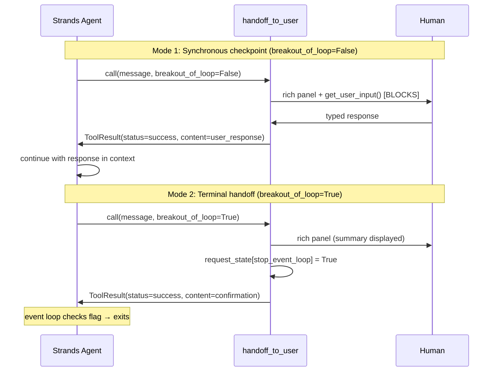

# Level 47: Human-in-the-Loop — Checkpoints and Handoffs
**Date:** 2026-03-19 | **File:** `12_orchestration/hitl_checkpoints.py`
**Depends on:** L23 (Error Recovery), L22 (Safety)
**Unlocks:** L48 (Durable Execution — when long-running pipelines need human gates)

---

## Part 1 — For Humans

### What We Built

An expense approval agent that pauses mid-workflow to collect human decisions on borderline items, then terminates gracefully by handing off a final summary. The core tool is `handoff_to_user` — a built-in from `strands_tools` that handles all the mechanics: displaying a rich panel, blocking for typed input, and signalling the event loop to stop.

### How It Works

```
+---------------------------------------+
|         Expense Approval Agent        |
+---------------------------------------+
         |
         v
  [item < $100?]
     YES  |    NO
          |    v
          | [item $100-$999?]
          |     YES  |     NO (>= $1000)
          |          |          |
          v          v          v
      [auto-     [Mode 1]    [Mode 1]
       approve]  [breakout   [breakout
                  =False]     =False]
                  |   ^        |   ^
                  v   |        v   |
               [Human]      [Human]
               [input ]      [input]
                  |               |
                  +-------+-------+
                          |
                          v
                   [all items done]
                          |
                          v
                      [Mode 2]
                  [breakout=True]
                          |
                          v
              [summary displayed]
              [stop_event_loop=True]
              [session ends]
```

**Mode 1 — Synchronous checkpoint (`breakout_of_loop=False`):**
The agent calls the tool with a message asking for yes/no. The tool prints a
green panel, calls `get_user_input()` which blocks until the human types a
response, then returns that response to the agent as a tool result. The agent
reads the response and continues — approving, rejecting, or escalating based
on what was typed.

**Mode 2 — Terminal handoff (`breakout_of_loop=True`):**
The agent calls the tool with a summary message when its work is done. The
tool prints the message, sets `stop_event_loop = True` in the request state,
and returns. The Strands event loop checks that flag and exits. The agent
doesn't run another turn — the session is over.

### What Went Wrong

1. **tty requirement not obvious until runtime.** The first run produced
   `[Errno 22] Invalid argument` on every `breakout_of_loop=False` call
   because `get_user_input()` requires a real terminal. The agent retried
   multiple times before gracefully providing a summary. Fixed by adding
   `sys.stdin.isatty()` check at startup to warn the user before running.
   HITL levels require interactive terminals — this should always be checked.

### What Worked

1. **Confidence-based routing via system prompt.** A clear policy in the
   system prompt (`< $100 → auto-approve, $100–$999 → checkpoint`) was
   sufficient. The LLM applied it correctly across 5 varied items without
   any routing code. The agent calls `handoff_to_user` when it judges human
   input appropriate — no external policy engine needed.

2. **Built-in tool, zero implementation.** `from strands_tools import
   handoff_to_user` and add to the tools list. The tool handles rich UI,
   input blocking, and event loop control internally. Nothing to build.

3. **The two modes are architecturally distinct.** Mode 1 (`=False`) keeps
   the agent running — it collects input and continues. Mode 2 (`=True`)
   terminates the agent — it's a final handoff, not a checkpoint. Using them
   for different purposes (mid-workflow vs. end-of-workflow) was the right
   decomposition.

### The Single Most Important Thing

`handoff_to_user` is not a single pattern — it is two different patterns that
share a tool. `breakout_of_loop=False` is a synchronous mid-workflow gate:
the agent is still running, it's just blocked waiting for a human decision
before proceeding. `breakout_of_loop=True` is a terminal event: the agent
considers its work complete and explicitly returns control to the human. The
distinction matters architecturally — a checkpoint keeps the agent alive; a
handoff ends it. Conflating them leads to either agents that terminate
prematurely or agents that keep running after their job is done.

---

## Part 2 — For LLMs

### Architecture



```
Mode 1: Synchronous checkpoint (breakout_of_loop=False)
  [Agent]
     |
     v call(message, breakout_of_loop=False)
  [Tool]
     |
     v rich panel + get_user_input() [BLOCKS]
  [Human]
     |
     v typed response
  [Tool]
     |
     v ToolResult(user_response)
  [Agent] <-- continues with response in context

Mode 2: Terminal handoff (breakout_of_loop=True)
  [Agent]
     |
     v call(message, breakout_of_loop=True)
  [Tool]
     |
     v rich panel displayed to Human
     |
     v stop_event_loop = True
     |
     v ToolResult(confirmation)
  [Agent] <-- event loop flag set → exits
```

### Decision Log

| Decision | Why | Trade-off |
|----------|-----|-----------|
| Use `haiku` model | Routing policy is simple rule-based classification; haiku sufficient, cheaper | Less natural language flexibility for ambiguous cases |
| Policy in system prompt only | LLM self-routes to human based on amount thresholds; no routing code | LLM must follow the policy reliably — tested, it does |
| `sys.stdin.isatty()` check | `get_user_input()` raises `[Errno 22]` on non-tty stdin; better to warn early | Still runs (shows structure); doesn't hard-exit |
| Expense approval scenario | Clean threshold policy, naturally produces both Mode 1 and Mode 2 calls in one run | Doesn't demonstrate on-the-loop (async) — noted as out of scope |
| Single agent, single prompt | Simple enough to run in one turn; checkpoints are within the same agent session | Agent retries on `get_user_input()` failure — adds noise in non-tty runs |

### Pseudocode — Key Patterns

```
# Pattern 1: built-in HITL tool
agent = Agent(tools=[handoff_to_user])  # import from strands_tools, done

# Pattern 2: policy-driven self-routing (no routing code)
system_prompt = """
  if amount < 100: auto-approve
  if amount 100-999: call handoff_to_user(breakout_of_loop=False)
  if amount >= 1000: call handoff_to_user(breakout_of_loop=False)
  when done: call handoff_to_user(breakout_of_loop=True)
"""

# Pattern 3: Mode 1 — agent blocks until human responds
# tool internals (from strands_tools/handoff_to_user.py):
if not breakout_of_loop:
    response = get_user_input(prompt)    # BLOCKS — requires tty
    return ToolResult(content=response)  # returned to agent as tool result
    # agent reads response and continues

# Pattern 4: Mode 2 — agent terminates
# tool internals:
if breakout_of_loop:
    request_state["stop_event_loop"] = True
    return ToolResult(content="handoff completed")
    # event loop checks flag → exits

# Pattern 5: tty guard for HITL demos
if not sys.stdin.isatty():
    print("requires interactive terminal")
    # continue anyway — shows structure, checkpoint calls fail gracefully
```

### Observation Log

| # | Cat | Topic | Observation |
|---|-----|-------|-------------|
| 1 | pattern | handoff-to-user-builtin | Built-in strands_tools; import and add to tools list; no custom impl |
| 2 | pattern | two-mode-hitl | Mode 1 (=False) blocks and continues; Mode 2 (=True) terminates — architecturally distinct |
| 3 | pattern | confidence-based-routing | System prompt policy sufficient; LLM self-routes to human; no routing code |
| 4 | insight | tty-requirement | get_user_input() requires real tty; [Errno 22] on piped stdin; add isatty() guard |
| 5 | insight | on-the-loop-not-built-in | Only in-the-loop (=False) and out-of-the-loop (=True) are built-in; async on-the-loop requires SQS+DynamoDB |
| 6 | insight | hitl-in-multi-agent | stop_event_loop=True does NOT propagate from sub-agent to parent — sub-agents invoked as tools create their own fresh invocation_state with request_state={}; the flag stops only the agent that set it (verified: event_loop.py line 124 initialises fresh request_state per invocation; line 563 checks it) |

### Forward Links

- **Unlocks L48**: Durable Execution — once agents have human gates, long-running
  pipelines need checkpoint/resume across crashes too. L48 asks: what happens
  between human checkpoints if the process dies?
- **Revisit when**: building any agent that touches production data, sends external
  messages, or executes irreversible actions — `handoff_to_user` is the right
  pause primitive before the point of no return.
- **Backward connection L22**: Safety (L22) taught what actions need oversight;
  L47 provides the mechanism to request it at the right moment.
- **Backward connection L46d**: L46d used hard gates (deterministic code overrides
  LLM); L47 uses soft gates (LLM requests human judgment). Both defend the same
  boundary, at different layers.
- **Resolved**: `stop_event_loop` scope in multi-agent systems — sub-agents invoked
  as tools create their own `invocation_state` with `request_state = {}` (fresh per
  invocation, event_loop.py line 124). `stop_event_loop=True` only stops the agent
  whose `invocation_state` it is set in (checked at line 563). It does NOT propagate
  to the parent orchestrator. If a sub-agent calls `breakout_of_loop=True`, the
  sub-agent terminates but the parent continues. For HITL to stop the parent, the
  parent agent itself must be the one calling `handoff_to_user`.
