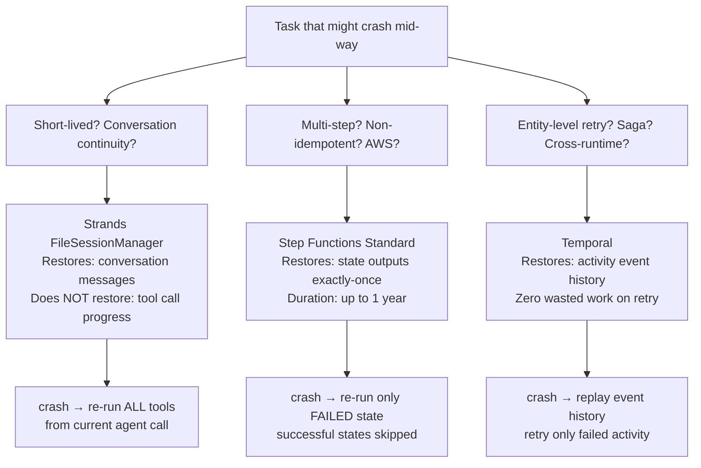

# Level 48: Durable Execution — Long-Running Agents That Survive Crashes
**Date:** 2026-03-19 | **Files:** `12_orchestration/durable_execution.py`, `12_orchestration/temporal_crash_demo.py`
**Depends on:** L5 (Sessions), L23 (Error Recovery), L47 (HITL)
**Unlocks:** L49 (Testing), L53 (AgentCore Advanced — production durable pipelines)

---

## Part 1 — For Humans

### What We Built

A three-tier comparison of durable execution options, all demonstrated live: Strands `FileSessionManager` (conversation-level), AWS Step Functions Standard (state-level), and Temporal (activity-level — real process kill and recovery). The core question it answers: when your agent is doing ten things and the process dies halfway through, what gets re-run?

### How It Works

```
+------------------------------------------+
| The Durability Ladder                    |
|                                          |
|  Crash after tool #7 of 10:             |
|                                          |
|  [FileSessionManager]                    |
|    restores: conversation history        |
|    re-runs:  tools #1 through #10        |  <- NOT durable
|                                          |
|  [Step Functions Standard]               |
|    restores: output of each STATE        |
|    re-runs:  only the failed state       |  <- state-level
|                                          |
|  [Temporal]                              |
|    restores: output of each ACTIVITY     |
|    re-runs:  only the failed activity    |  <- activity-level
+------------------------------------------+
```

The Step Functions demo makes this concrete. Three states each call Amazon Nova via Bedrock. The execution history shows each `TaskSucceeded` event — proof that the state's output was written to durable storage. If the orchestrating process crashed between state 2 and state 3, Step Functions would resume at state 3. State 2's Bedrock call would not re-run. That is something `FileSessionManager` cannot guarantee.

```
+-------------------+      +-------------------+
| FrameProblem      | ---> | AnalyseSFN        |
| [Bedrock: Nova]   |      | [Bedrock: Nova]   |
|                   |      |                   |
| TaskSucceeded ✓   |      | TaskSucceeded ✓   |
| (persisted)       |      | (persisted)       |
+-------------------+      +-------------------+
                                    |
                                    v
                           +-------------------+
                           | Synthesise        |
                           | [Bedrock: Nova]   |
                           |                   |
                           | TaskSucceeded ✓   |
                           | (persisted)       |
                           +-------------------+
                                    |
                                    v
                           [ExecutionSucceeded]
```

### What Went Wrong

1. **Anthropic models blocked on channel program accounts.** `bedrock:InvokeModel` for `anthropic.claude-haiku-4-5-20251001-v1:0` raised `ValidationException: Access to this model is not available for channel program accounts.` AWS reseller/partner accounts cannot use Anthropic models directly. Fixed by probing all available models first and switching to `amazon.nova-micro-v1:0`.

2. **Nova request format is not Anthropic format.** First probe run used Anthropic's `content: "string"` format — Nova requires `content: [{text: "string"}]` (array of objects). Fixed after reading the `ValidationException: Malformed input` error and correcting the probe.

3. **Step Functions IAM trust policy rejected without confused deputy conditions.** Bare `states.amazonaws.com` trust policy caused `The principal states.amazonaws.com is not authorized to assume the provided role` on first execution run. AWS now enforces a condition requiring `aws:SourceAccount` and `aws:SourceArn` for SDK optimistic integrations. Fixed by adding both conditions.

4. **8-second IAM propagation sleep was not enough.** Execution failed even after adding the conditions — role hadn't propagated yet. Increased to 20 seconds.

5. **`Body` in Step Functions execution history is already a parsed dict.** Called `json.loads(body)` expecting a string — got `TypeError` because Step Functions had already deserialised it. The probe script (`probe_l48_sfn_output.py`) revealed `Body type: dict` immediately. Fixed by removing the inner `json.loads`.

6. **Temporal workflow sandbox breaks with `multiprocessing.spawn`.** When `multiprocessing.Process` spawns a child that runs a Temporal worker, the sandbox importer fails with `ModuleNotFoundError: No module named '__mp_main__'` because the child module is registered under `__mp_main__` not the file's actual name. Fixed with `workflow_runner=UnsandboxedWorkflowRunner()` — correct for local demos.

7. **`WorkflowHandle.result()` has no `timeout` parameter.** Used `asyncio.wait_for(handle.result(), timeout=60)` instead.

8. **`activity.info().worker_version` does not exist in temporalio 1.23.0.** Use `os.getpid()` to label which process an activity ran in.

### What Worked

1. **Probe before implementing, probe when stuck.** Two probe scripts resolved all blocking issues: `probe_l48_bedrock.py` found the working model before writing `durable_execution.py`. `probe_l48_sfn_output.py` revealed the exact `Body` type. Without probes, these would have required blind fix attempts.

2. **Existing phase-17-temporal evaluation reused.** The Temporal research reference came directly from `sap-dev-playbook/domains/successfactors/phases/phase-17-temporal/` — ADR-T02 (activity granularity) and ADR-T06 (saga compensation). No re-research needed.

3. **Three-tier comparison table.** Side-by-side of `conversation continuity`, `step-level recovery`, `activity-level retry`, `saga/compensation`, `infrastructure required` makes the selection decision unambiguous.

### The Single Most Important Thing

`FileSessionManager` is often described as making agents "durable" — but it only makes conversations durable, not executions. The distinction matters enormously: if an agent is calling ten tools sequentially and crashes on tool seven, `FileSessionManager` restores the conversation history but the agent re-runs all ten tools from the beginning. True durable execution (Step Functions Standard or Temporal) persists at the step/activity level — the completed work is not re-done. Before reaching for a session manager as a "crash recovery" solution, ask which level of durability you actually need.

---

## Part 2 — For LLMs

### Architecture



```
+-------------------------------------------+
| Task that might crash mid-way             |
+-------+---------------+-------------------+
        |               |                   |
        v               v                   v
[Short-lived?]  [Multi-step?]     [Entity-level?]
[Conversation?] [Non-idempotent?] [Saga? Cross-runtime?]
        |               |                   |
        v               v                   v
+-------+----+  +-------+----+   +----------+---+
| FileSession|  | SFN Std    |   | Temporal     |
| Manager    |  | Bedrock    |   | (cluster req)|
+-------+----+  +-------+----+   +----------+---+
        |               |                   |
        v               v                   v
[re-run ALL    [re-run only     [replay history
 tools from     failed state;   skip done activities;
 beginning]     done = skip]    retry only failed]
```

### Decision Log

| Decision | Why | Trade-off |
|----------|-----|-----------|
| `amazon.nova-micro-v1:0` | Only model invokable on channel program account; probe confirmed all Nova variants work | Less capable than Claude Haiku; sufficient for demo prompts |
| Source account + ARN conditions in trust policy | AWS enforces confused deputy protection for SFN SDK integrations | Slightly more verbose trust policy; required for execution to succeed |
| 20s IAM propagation sleep | 8s caused first execution failure in us-east-1 | Adds 20s to demo runtime on new role creation |
| Step Functions Standard (not Express) | Exactly-once semantics; up to 1-year duration; execution history queryable | Higher cost than Express Workflow; Express is at-least-once |
| Temporal as research reference only | No cluster available; phase-17-temporal docs are authoritative | Cannot run live Temporal demo; pseudocode illustrates pattern |
| Probe script for SFN output structure | `json.loads(Body)` failed silently with `(could not parse)` — needed to see actual type | One extra script; saved multiple blind debug attempts |

### Pseudocode — Key Patterns

```
# Pattern 1: probe before implementing (channel program accounts)
candidate_models = ["amazon.nova-micro-v1:0", "amazon.nova-lite-v1:0", ...]
for model in candidates:
    try invoke with correct request format
    print "✓" if success else "✗ + error"
# → reveals which models are actually available in this account

# Pattern 2: Nova request format (NOT Anthropic format)
nova_body = {
    "messages": [{"role": "user", "content": [{"text": "prompt"}]}],
    "inferenceConfig": {"maxTokens": N}
}
# NOT: {"messages": [{"role": "user", "content": "string"}], "max_tokens": N, "anthropic_version": "..."}

# Pattern 3: Step Functions trust policy — confused deputy
trust_policy = {
    Principal: "states.amazonaws.com",
    Action: "sts:AssumeRole",
    Condition: {
        StringEquals: {"aws:SourceAccount": ACCOUNT_ID},
        ArnLike: {"aws:SourceArn": "arn:aws:states:REGION:ACCOUNT:stateMachine:*"}
    }
}
# Without Condition: execution fails with "not authorized to assume role"

# Pattern 4: reading SFN Bedrock output — Body is already a dict
raw = event["taskSucceededEventDetails"]["output"]  # JSON string
outer = json.loads(raw)           # dict with keys: Body, ContentType
body = outer.get("Body", {})     # already a dict — do NOT json.loads again
# Nova response path: body["output"]["message"]["content"][0]["text"]

# Pattern 5: three-tier durability selection
if task_is_short_lived and needs_conversation_continuity:
    use FileSessionManager
elif task_runs_for_hours and steps_are_non_idempotent and aws_native:
    use Step Functions Standard
elif entity_level_retry or saga_compensation or cross_runtime:
    use Temporal (requires cluster)
```

### Observation Log

| # | Cat | Topic | Observation |
|---|-----|-------|-------------|
| 1 | mistake | anthropic-channel-program-blocked | Anthropic models blocked on channel program accounts; Amazon Nova available |
| 2 | mistake | nova-request-format | Nova content must be `[{text: "..."}]` array, not a plain string |
| 3 | mistake | sfn-trust-policy-confusion-deputy | Bare `states.amazonaws.com` trust rejected; `aws:SourceAccount` + `aws:SourceArn` conditions required |
| 4 | mistake | iam-propagation-8s-not-enough | 8s sleep insufficient; 20s reliable for us-east-1 |
| 5 | mistake | sfn-bedrock-body-already-parsed | `Body` in SFN execution history is a dict, not a string; `json.loads(body)` fails |
| 6 | pattern | probe-first-aws-output-structure | Write probe scripts for unknown AWS output shapes; type() + str()[:200] reveals all |
| 7 | insight | three-tier-durability-distinction | FileSession = conversation; SFN = state; Temporal = activity — three different failure recovery boundaries |
| 8 | insight | sfn-bedrock-optimistic-integration | SFN `arn:aws:states:::bedrock:invokeModel` deserialises Bedrock JSON response automatically |
| 9 | insight | session-manager-not-durable-execution | FileSessionManager restores messages but re-runs ALL tool calls from start on crash — NOT true durable execution |

### Forward Links

- **Unlocks L49**: Testing — once agents have durable execution, testing strategies need to account for step-level idempotency and partial execution states
- **Unlocks L53**: AgentCore Advanced — production pipelines need exactly this selection logic (SessionManager vs SFN vs Temporal) applied to real workloads
- **Revisit when**: building any agent pipeline with non-idempotent steps (writes to external APIs, sends emails, charges cards) — Step Functions Standard is the right primitive before Temporal complexity
- **Backward connection L5**: Sessions (L5) showed FileSessionManager; L48 clarifies its limits as durable execution
- **Backward connection L47**: HITL (L47) showed human checkpoints mid-workflow; L48 shows infrastructure checkpoints on crash — complementary safety mechanisms
- **Note**: Channel program account constraint (no Anthropic Bedrock direct access) applies to all future levels that use Step Functions + Bedrock integration — always probe models first
- **Temporal live demo fully verified**: `temporal_crash_demo.py` — Worker A killed after Activity 1, Worker B resumes at Activity 2, event history confirms Activity 1 ran exactly once. All three tiers are now live-demonstrated, not research references.
