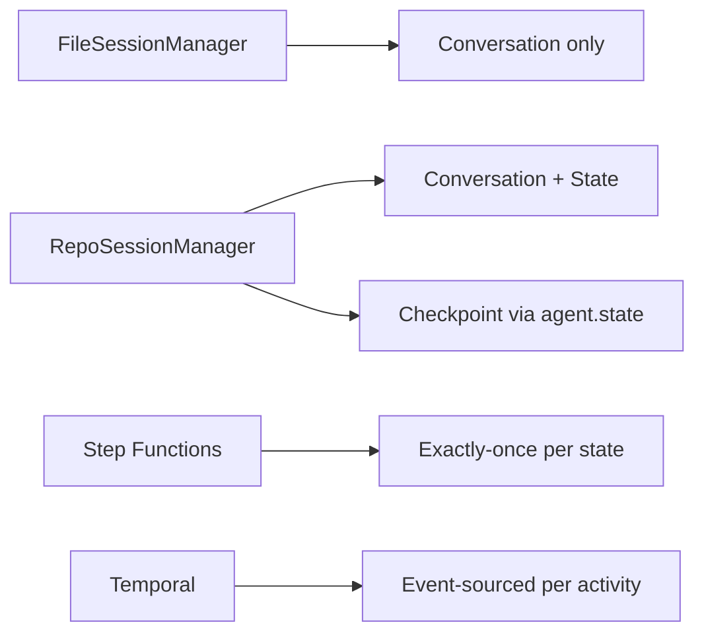

# Level 48: Durable Execution (v1.35 Enhancement)
**Date:** 2026-04-13 | **File:** `12_orchestration/durable_execution.py`
**Depends on:** L5 (Sessions), L23 (Error Recovery), L57 (Session Mgmt) | **Unlocks:** Production durability

---

## Part 1 — For Humans

### What We Built
Added a new tier (1b) to the existing durable execution lesson: `RepositorySessionManager` with application-level checkpointing. This fills the gap between FileSessionManager (conversation-only) and Step Functions (infrastructure-heavy). The lesson now covers four tiers with a revised decision table.

### How It Works

```
Four-tier durability spectrum:

+----------------+  +----------------+
| Tier 1a: File  |  | Tier 1b: Repo  |
| SessionManager |  | + Checkpoint   |
+----------------+  +----------------+
| conversation   |  | conversation   |
| messages only  |  | + agent.state  |
| no checkpoint  |  | app-level skip |
+-------+--------+  +-------+--------+
        |                    |
   [gap: tool re-run]  [partial: skip
                         completed work]
        |                    |
+-------+--------+  +-------+--------+
| Tier 2: SFN    |  | Tier 3:Temporal|
| Step Functions |  |                |
+----------------+  +----------------+
| exactly-once   |  | event-sourced  |
| per state      |  | per activity   |
| AWS infra      |  | cluster needed |
+----------------+  +----------------+
```

### What Went Wrong
1. **boto3 credential guard insufficient** — `_sfn_clients()` succeeded (boto3 session created) but `iam.get_role()` crashed with `TokenRetrievalError`. Fix: added `iam.list_roles(MaxItems=1)` as credential probe. Lesson: boto3 client creation does NOT validate credentials.

### What Worked
1. **RepositorySessionManager for resume** — agent2 with same session_id got full conversation restored, answered "What was the result?" without re-running the pipeline. Proves the value even without step-level durability.
2. **Updated decision table** — 4 columns now (File, Repo+Chk, SFN, Temporal) with 9 comparison rows. Makes the trade-offs concrete.

### The Single Most Important Thing
`RepositorySessionManager` is the pragmatic middle ground. It doesn't give you exactly-once or step-level recovery (that's Step Functions/Temporal territory), but it gives you conversation continuity with custom storage AND application-level checkpointing via `agent.state` — and it requires zero infrastructure beyond your existing database.

---

## Part 2 — For LLMs

### Architecture



```
[FileSessionManager] --> [Conversation only]

[RepoSessionManager] --> [Conversation + State]
                     --> [Checkpoint via agent.state]

[Step Functions]     --> [Exactly-once per state]

[Temporal]           --> [Event-sourced per activity]
```

### Decision Log

| Decision | Why | Trade-off |
|----------|-----|-----------|
| Add tier 1b, not replace 1a | Both have value; File is simpler for dev | More content |
| Credential probe with list_roles | Cheapest IAM read operation | Extra API call |
| InMemoryRepo for demo | Simulates DB without setup | Not persistent across runs |

### Pseudocode — Key Patterns

```
# Checkpoint-and-resume pattern
repo = MyDatabaseRepo()
sm = RepositorySessionManager(session_id=id, session_repository=repo)
agent = Agent(model=m, tools=[pipeline], session_manager=sm)

# In tool: check agent.state for completed steps
completed = agent.state.get("completed_steps", [])
for step in steps:
    if step in completed:
        skip
    else:
        run step
        agent.state["completed_steps"].append(step)
        # state auto-persisted by hooks
```

### Observation Log

| # | Category | Topic | Observation |
|---|----------|-------|-------------|
| 1 | mistake | boto3 credentials | Client creation != credential validation |
| 2 | pattern | checkpoint state | agent.state + SessionManager = app-level checkpointing |
| 3 | insight | pragmatic middle | RepoSM fills gap between File and Step Functions |

### Forward Links

- **Extends L57**: Uses RepositorySessionManager from session management lesson
- **Revisit when**: Need exactly-once semantics (upgrade to Step Functions/Temporal)
