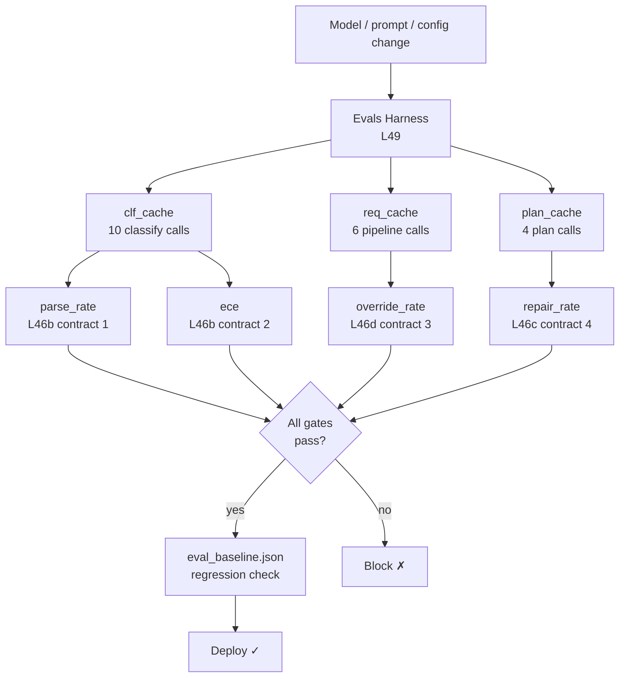

# Level 49: Evals Harness — CI/CD for LLM Systems
**Date:** 2026-03-19 | **File:** `12_orchestration/evals_harness.py`
**Depends on:** L46 (Hybrid LLM/Deterministic — produces the boundary contracts), L35 (Strands Evals SDK — different layer)
**Unlocks:** L51 (Evals Methodology — Fowler's three test types applied systematically)

---

## Part 1 — For Humans

### What We Built

An automated test harness that detects regression in the LLM judgment layer. The core
problem it solves: when you swap a model, tweak a prompt, or change a config, you need
to know *before* deploying whether the LLM's behaviour at your system's boundaries has
degraded. This harness measures four boundary contracts derived from L46 and gates
deployment on all four passing.

### How It Works

```
  INFERENCE PHASE (LLM calls happen here)
  +-----------------------------------------+
  |  classify_document x10  --> clf_cache   |
  |  process_request x6     --> req_cache   |
  |  generate_plan x4       --> plan_cache  |
  +-----------------------------------------+
              |  (zero extra LLM calls below)
              v
  EVALUATION PHASE (pure functions on cached results)
  +--------------------------------------------+
  | parse_rate   = non-fallback / total        |
  | ece          = |conf - accuracy| per bin   |
  | override_rate= LLM != system / total       |
  | repair_rate  = plans needing fix / total   |
  +--------------------------------------------+
              |
              v
  CI GATE
  +------------------------------+
  | parse_rate  >= 0.90 ?        |
  | ece         < 0.25  ?        |
  | override_rate in [0.10-0.70]?|
  | repair_rate < 0.50  ?        |
  +-----+----------+-------------+
       YES         NO
        |           |
     [DEPLOY]   [BLOCK]
        |
  save/compare baseline.json
```

### What Went Wrong

Nothing broke during implementation. The interesting signal came from the run itself:
"personal" documents (salary reviews, 1:1 meeting notes) were classified as "business"
with 92–95% confidence. The model wasn't confused — it was confidently wrong. Accuracy
of 0.80 looked acceptable; ECE of 0.156 told the deeper story.

### What Worked

1. **Decoupling inference from evaluation.** Building the cache in Iter 1, then
   consuming it in Iters 2 and 3 at zero extra cost, made the Fowler pattern concrete
   rather than theoretical. Adding a fourth test type to that cache would cost nothing.

2. **Directional regression thresholds.** Parse rate can only degrade (drop is bad).
   ECE, override rate, repair rate can only rise problematically (increase is bad). The
   asymmetry is meaningful: a model with *better* parse rate than baseline is not a
   regression; a model that is *more* overconfident always is.

3. **Override rate as a range, not a floor.** [0.10, 0.70] means both ends are tested:
   too low means hard gates aren't firing; too high means LLM is being overridden on
   everything. This catches two distinct failure modes with one metric.

4. **Baseline captured on first run, checked on every subsequent run.** No manual
   threshold-setting required. The system learns its own "good" state and flags drift.

### The Single Most Important Thing

ECE reveals overconfident wrong predictions that accuracy misses entirely. When the
model is wrong with high confidence, downstream confidence-gate logic routes those
predictions as if they were correct — silently. A 0.80 accuracy model with ECE 0.35
is more dangerous than a 0.75 accuracy model with ECE 0.05, because the first model
lies about what it doesn't know. This is the metric that makes confidence scores
actionable rather than decorative.

---

## Part 2 — For LLMs

### Architecture



```
[Model/prompt/config change]
           |
           v
    [Evals Harness L49]
    /         |         \
   v          v          v
[clf_cache] [req_cache] [plan_cache]
  /    \        |           |
 v      v       v           v
[parse] [ece] [override] [repair]
   \      |      |       /
    \     v      v      /
     --> [CI Gate] <---
          |       \
        [yes]    [no]
          |        |
     [baseline] [BLOCK]
          |
       [DEPLOY]
```

### Decision Log

| Decision | Why | Trade-off |
|----------|-----|-----------|
| Cache inference results as dataclasses | Separates LLM concerns from metric logic; metric functions are pure | Slightly more boilerplate than raw dicts |
| Override rate as range [min, max] | Catches two failure modes: gates broken (too low) and LLM useless (too high) | Threshold range must be tuned to test corpus |
| Directional regression thresholds | A model improving parse_rate is not a regression | Requires knowing which direction is "bad" per metric |
| ECE with 3 bins on 10 samples | Demonstration scale; enough to show the pattern | Not statistically reliable; production needs ≥50 samples/bin |
| Baseline saved to eval_baseline.json in same directory | Co-located with harness file | Must be committed/versioned to be useful across runs |

### Pseudocode — Key Patterns

**Inference-testing decoupling:**
```
# Phase 1: inference — LLM calls happen exactly here
cache = [run_llm(input) for input in corpus]

# Phase 2: evaluation — pure functions, zero LLM calls
parse_rate    = count(not fallback) / len(cache)
ece           = bucketed_calibration_error(cache, ground_truth)
# New test type? Add here. Cost: zero.
```

**ECE computation:**
```
bins = equal-width buckets over [0, 1]
for each prediction:
    b = floor(confidence * num_bins)
    bucket[b].total += 1
    bucket[b].conf_sum += confidence
    if predicted == true_label:
        bucket[b].correct += 1

ece = sum over bins:
    |fraction_correct(b) - mean_confidence(b)| * bucket_size / total
```

**Directional regression check:**
```
for metric in [parse_rate, ece, override_rate, repair_rate]:
    delta = current[metric] - baseline[metric]
    if metric == "parse_rate":
        regressed = delta < -threshold  # drop is bad
    else:
        regressed = delta > threshold   # rise is bad
```

**Override rate range gate:**
```
override_rate = count(llm_said != system_delivered) / total
pass = (min_threshold <= override_rate <= max_threshold)
# too low  -> hard gates not working
# too high -> LLM contributing nothing
```

### Observation Log

| # | Category | Topic | Observation |
|---|----------|-------|-------------|
| 1 | pattern  | inference-testing-decoupling | Run inference once, cache, apply all test types. Each new test type = zero LLM cost. |
| 2 | insight  | ece-overconfidence | ECE=0.156 at accuracy=0.80: model was 95% confident on two wrong "personal→business" predictions. Accuracy looked fine; ECE exposed the dishonesty. |
| 3 | insight  | override-rate-range | Range [min, max] catches both "gates broken" (too low) and "LLM useless" (too high). A floor alone misses the second failure mode. |
| 4 | insight  | l49-vs-l35-different-layers | L35: agent output quality. L49: LLM/deterministic boundary contracts. Different failure modes. Both needed. |
| 5 | pattern  | directional-regression | parse_rate: only drops are regressions. ECE/override/repair: only rises are regressions. Asymmetry is meaningful. |
| 6 | question | ece-sample-size | Min corpus size for statistically reliable ECE? 10 is demo scale. Literature: ≥50/bin. |
| 7 | question | eval-harness-ci-speed | 26 LLM calls @ ~500ms = 15-30s. Fast enough for CI? Options: replay fixtures, subset gate, async merge-only gate. |

### Forward Links

- **Unlocks L51** (Evals Methodology): Fowler's three named test types (example-based,
  auto-evaluator, adversarial) applied to the same harness pattern. L49 built the
  infrastructure; L51 names and systematises the test types.
- **Revisit when**: adding a new LLM judgment point to any hybrid pipeline — the new
  boundary contract (its parse rate, calibration, gate frequency) belongs in this
  harness before the feature ships.
- **Revisit when**: ECE rises above 0.20 after a model upgrade — that's the signal
  that the new model is overconfident in a way that will silently degrade
  confidence-gated routing decisions.

### Links to L46

L49 is a direct continuation of L46. The test targets are the boundary contracts
that L46 created:

| L46 file | Boundary contract | L49 metric |
|----------|------------------|------------|
| L46b `hybrid_llm_in_deterministic.py` | `classify_document` returns typed Classification | parse_rate, ece |
| L46d `hybrid_trust_boundaries.py` | Hard gates override LLM at Zone 2 signals | override_rate |
| L46c `hybrid_plan_execute.py` | LLM plan stays within op vocabulary | repair_rate |
