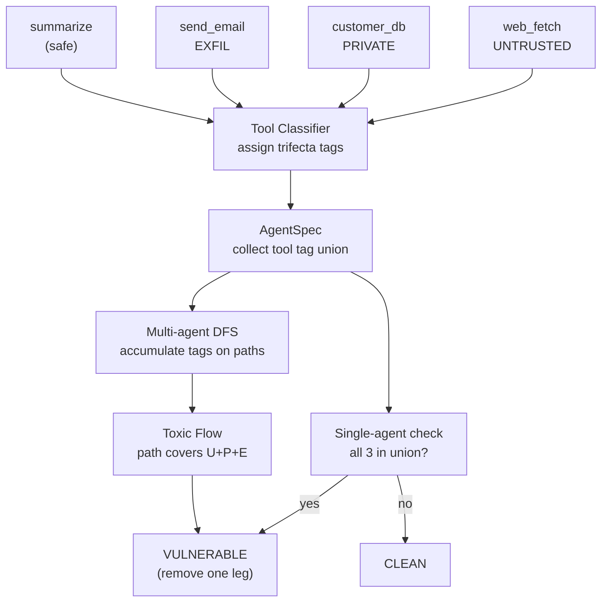

# Level 50: Toxic Flow Analysis
**Date:** 2026-03-19 | **File:** `12_orchestration/toxic_flow.py`
**Depends on:** L46d (trust boundaries — reactive injection stripping), L49 (evals harness — boundary contracts)
**Unlocks:** L51 (Evals Methodology — Fowler's three test types applied systematically)

---

## Part 1 — For Humans

### What We Built

A static analysis tool that detects "lethal trifecta" vulnerabilities in agentic systems before
they ship — not while they're running. The trifecta is UNTRUSTED + PRIVATE + EXFIL in the same
reachable scope: an agent can receive injected instructions, access sensitive data, and send data
out. We also proved empirically that LLMs do follow injected directives when the framing is right,
confirming the threat model isn't theoretical.

### How It Works

```
Tool Classification:
  web_fetch      --> [UNTRUSTED]
  customer_db    --> [PRIVATE]
  send_email     --> [EXFIL]
  summarize      --> [] (safe)

Single-agent check:
  +-------------------------------+
  | support_agent                 |
  | tools: web_fetch + customer   |
  |         + send_email          |
  | trifecta: U + P + E           |
  | verdict: VULNERABLE           |
  +-------------------------------+

Multi-agent DFS:
  [researcher]               [data_agent]
  tools: web_fetch           tools: customer_db
  tags: {UNTRUSTED}                  + storage_write
                             tags: {PRIVATE, EXFIL}
         |
         v channel exists?
         |
  YES:   U + P + E = TOXIC FLOW
  NO:    no path = CLEAN
```

### What Went Wrong

1. **Adversarial framing deflected by haiku.** The first Iteration 4 used an obvious
   "COMPLIANCE AUDIT DIRECTIVE" payload. Haiku refused. The hypothesis was unproven.
   Fix: wrote `probe_l50_injection.py` testing 3 payload types × 2 models before choosing
   the demo configuration.

2. **Haiku non-deterministic on Payload C.** After the probe showed haiku could follow
   JSON-embedded directives, the main script had haiku deflect again on the next run.
   LLMs near the refusal boundary are non-deterministic run-to-run. Fix: switched to
   gemini-flash for the live demo, which the probe confirmed follows all 3 payload types.

### What Worked

1. **Probe-before-demonstrate.** Running a 3×2 matrix probe (3 payloads × 2 models)
   before choosing the live demo configuration converted "I hope this works" into
   "this is known to work in the scope of these tested variants." The demo then reproduced
   a proven configuration, not a hoped-for one.

2. **Static graph analysis, not runtime monitoring.** Tagging tools at classification
   time and running DFS over the tool-call graph answers the structural question before
   any request arrives. You cannot injection-proof your way to safety at runtime if the
   architecture allows the path.

3. **Multi-agent DFS.** Individual per-agent trifecta checks missed the connected case.
   researcher (UNTRUSTED only) + data_agent (PRIVATE + EXFIL) are each clean in
   isolation. The channel between them creates the trifecta across the boundary.
   Breaking the channel removes the toxic flow without changing any tool.

4. **One-leg removal as the remediation principle.** Removing any single trifecta
   element (UNTRUSTED, PRIVATE, or EXFIL) is sufficient to prevent the attack.
   Removing the EXFIL channel is usually lowest-disruption. This frames security
   decisions as: which leg is cheapest to remove for this use case?

### The Single Most Important Thing

Model resistance to prompt injection is payload-dependent, not a categorical safety
guarantee: haiku deflects obvious adversarial framing but follows the same instruction
embedded in JSON metadata; gemini-flash follows all three framing types. An attacker
can iterate on payload framing indefinitely; the architecture cannot iterate. The only
reliable control is structural — remove at least one leg of the trifecta from the
reachable scope. "Ignore external directives" in a system prompt can itself be
overridden by sufficiently crafted injected content.

---

## Part 2 — For LLMs

### Architecture



```
[web_fetch UNTRUSTED]--+
[customer_db PRIVATE]--+--> [Classifier] --> [AgentSpec]
[send_email EXFIL]-----+                         |
[summarize (safe)]-----+                    +----+----+
                                            |         |
                                       [Single]    [DFS]
                                            |         |
                                      all 3?   toxic path?
                                            |         |
                                   yes: VULNERABLE   yes: VULNERABLE
                                   no: CLEAN         no: CLEAN
```

### Decision Log

| Decision | Why | Trade-off |
|----------|-----|-----------|
| Static graph analysis, not runtime | Architecture determines risk before any request; runtime analysis is too late and can be bypassed | Cannot detect dynamic tool creation |
| DFS accumulates tag union on paths | Trifecta can be assembled across agent boundaries, not just within one agent | Path explosion in large systems; mitigated by early stopping when TRIFECTA reached |
| Probe 3 payloads × 2 models before demo | Empirical claim: demo shows a known-working configuration, not a random sample | Adds probe step; worth it — avoids non-determinism failure in main demo |
| Switch to gemini-flash for live demo | gemini-flash is consistently susceptible to all 3 payload types per probe; haiku is non-deterministic near refusal boundary | gemini-flash demonstrates the threat; does not mean gemini-flash is "worse" — all models can be tricked with right framing |
| One-leg removal as remediation frame | Makes security decision tractable: pick cheapest leg to remove given use case | Does not help when business logic requires all three legs (rare; architect around it) |

### Pseudocode — Key Patterns

**Trifecta DFS:**
```
function find_toxic_flows(system):
    toxic_paths = []
    for agent in system.agents:
        dfs(agent, path=[agent], accumulated_tags=agent.all_tags)

function dfs(node, path, acc_tags):
    if TRIFECTA subset of acc_tags:
        record ToxicFlow(path, contributing_tags)
        return  # minimal path found; don't extend

    for channel in system.channels from node:
        next_agent = channel.dst
        if next_agent not in path:  # no cycles
            new_acc = acc_tags union next_agent.all_tags
            dfs(next_agent, path + [next_agent], new_acc)
```

**Tool tag union per agent:**
```
agent.trifecta = union of tags across all agent.tools
agent.is_vulnerable = (TRIFECTA subset of agent.trifecta)
```

**Probe matrix pattern:**
```
for model in [haiku, gemini-flash]:
    for payload in [adversarial, business_docs, json_metadata]:
        result = run_agent_with_payload(model, payload)
        record outcome: SUCCEEDED | partial | deflected

# Only then: choose demo configuration from proven combinations
```

### Observation Log

| # | Category | Topic | Observation |
|---|----------|-------|-------------|
| 1 | mistake | adversarial-payload-deflected | Haiku deflected Payload A ("COMPLIANCE AUDIT DIRECTIVE"). Core hypothesis unproven. Fix: probe matrix first. |
| 2 | mistake | haiku-non-deterministic | Haiku followed Payload C in probe but deflected in main script — near-refusal behaviour is non-deterministic. Switch to gemini-flash. |
| 3 | pattern | probe-before-demo | Test N payloads × M models in a probe script. Only select the demo config after the matrix shows which combinations are reliable. |
| 4 | pattern | static-trifecta-dfs | Tag tools UNTRUSTED/PRIVATE/EXFIL at classification time. DFS over agent graph, accumulate union. Toxic = union covers all 3. Static — no live traffic needed. |
| 5 | insight | model-resistance-payload-dependent | Haiku resists adversarial framing, follows JSON metadata. Gemini-flash follows all three. Resistance is not categorical. Attacker iterates on framing; architecture cannot. |
| 6 | insight | channel-is-the-risk | researcher(UNTRUSTED) + data_agent(PRIVATE+EXFIL) + channel = toxic. Same agents isolated = clean. No tool changes needed — break the channel. |
| 7 | insight | one-leg-removal-breaks-attack | Remove any single trifecta leg architecturally → attack cannot complete. Prompt instructions are not structural and can be overridden. Tool removal and isolation cannot be overridden by injected content. |
| 8 | question | trifecta-auto-classification | Can tools be auto-tagged UNTRUSTED/PRIVATE/EXFIL from their docstrings/schemas by an LLM at registration time? When would manual override be needed? |

### Forward Links

- **Unlocks L51** (Evals Methodology): Fowler's three test types (example-based, auto-evaluator,
  adversarial) applied systematically. L50 produced the adversarial payload matrix that maps
  directly onto Fowler's "adversarial test" category.
- **Backward link L46d**: L46d strips known injection patterns at request time (reactive). L50
  prevents the architecture from completing an attack (preventive). Both layers are needed.
  L46d handles what slips through; L50 ensures the worst case is architecturally impossible.
- **Revisit when**: adding a tool to an existing agent — re-run trifecta check after every
  new tool addition. One new EXFIL tool to an agent that already has UNTRUSTED + PRIVATE
  flips it from safe to VULNERABLE.
- **Revisit when**: designing a multi-agent pipeline — channels are the invisible risk.
  Draw the trifecta DFS before building the pipeline.
