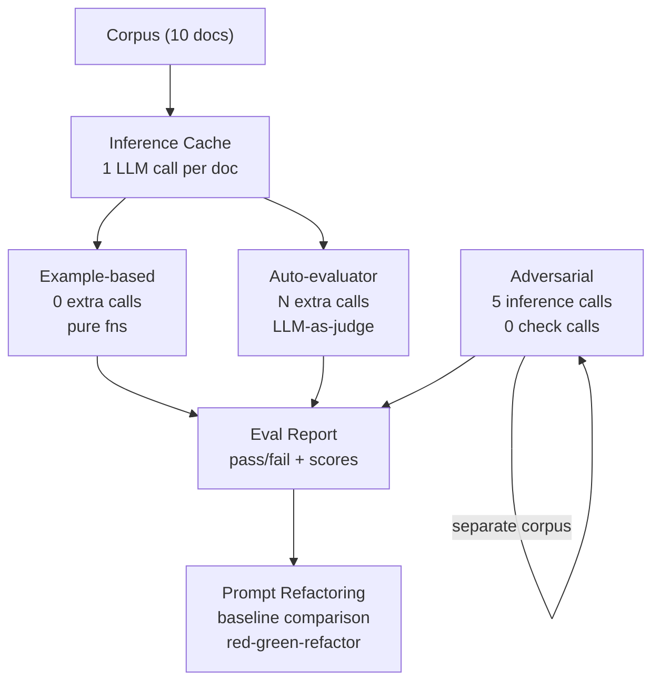

# Level 51: Evals as Engineering Discipline — Fowler Methodology
**Date:** 2026-03-19 | **File:** `12_orchestration/evals_methodology.py`
**Depends on:** L35 (Strands Evals SDK), L49 (Evals Harness — boundary contracts)
**Unlocks:** L53 (Prompt Refactoring — Fowler explicitly couples evals + prompt changes)

---

## Part 1 — For Humans

### What We Built

A complete eval methodology that applies Fowler's three test types (example-based,
auto-evaluator, adversarial) to a document processing pipeline, and proves that all
three can share one inference cache — so the cost of adding a new test type is zero
additional LLM calls. We also proved that the eval suite acts as a safety net for
prompt refactoring, detecting regressions before they ship.

### How It Works

```
  CORPUS (10 docs)
       |
       v  [10 LLM calls — inference phase, run ONCE]
  +--------------------+
  |  Inference Cache   |
  +--+--+--+-----------+
     |  |  |
     |  |  +---> [Example-based]  0 extra LLM calls
     |  |        golden set: JSON parses? category? sentiment?
     |  |
     |  +-------> [Adversarial]   0 extra LLM calls
     |            failure modes: empty, PII, injection
     |
     +----------> [Auto-evaluator] N extra LLM calls (judge)
                  "Is this summary accurate and complete?"

  ADVERSARIAL CORPUS (5 cases)
       |
       v  [5 separate LLM calls]
  [Adversarial checks: pure fns] --> 0 extra calls

  ITER 6 — PROMPT REFACTORING
  +---------------------------+
  | baseline = N failures     |
  | degrade prompt -> > N     |  red
  | restore prompt -> <= N    |  green
  +---------------------------+
```

### What Went Wrong

1. **Wrong test design for position bias (first two attempts).** Tested using
   individual 1-5 scoring — each summary scored independently. Individual scoring
   is structurally immune to position effects because there is no ordering
   relationship between the two scores. Position bias only appears in *pairwise*
   judgments ("which is better?"). Fix: switched to a pairwise preference prompt
   and ran 6 alternating trials.

2. **Iter 6 compared against perfect 10/10 instead of baseline.** doc-08 (a
   team offsite agenda) consistently hit the business/personal ambiguity edge
   case — 1 pre-existing failure in the baseline. Requiring `all_passed=True`
   after restoration made the refactoring appear unsafe. Fix: compare against
   baseline failure count, not zero.

### What Worked

1. **Three test types on one cache.** The decoupling pattern is concrete and
   measurable: 10 inference calls, 0 extra for example-based, 0 extra for
   adversarial checks. Each new test type added later costs nothing in inference.

2. **H2 proof by construction.** Built a synthetic output that passes every
   example-based check (correct category, all fields present, correct sentiment)
   but scores 1/5 on auto-eval ("Technology was used and things improved.").
   This is the clearest possible demonstration that the two test types catch
   orthogonal failure modes.

3. **Red-green-refactor with baseline comparison.** Degraded prompt → 10/10
   failures. Restored prompt → 1/10 (= baseline). The eval suite correctly
   detected the regression and confirmed full recovery. Using baseline as the
   comparison target, not perfect score, handled the natural noise floor correctly.

4. **Null result documented as evidence.** H3 (position bias) was not confirmed.
   In 6 pairwise trials haiku correctly chose the better summary 6/6 times,
   A-win rate = 0.50. This is recorded as a valid scientific finding: the judge
   is correctly calibrated for this quality gap. The ThoughtWorks risk is
   documented as requiring ambiguous quality comparisons or weaker models to observe.

### The Single Most Important Thing

Example-based and auto-evaluator tests are not redundant — they test orthogonal
properties. Example-based catches structural failures (wrong field name, wrong
category, invalid JSON). Auto-evaluator catches semantic failures (correct
structure, wrong meaning). A summary can be a perfectly structured JSON object
with the right category label but contain useless content — and only the judge
detects it. This is why Fowler says the auto-evaluator is "a type of property-based
test": it checks characteristics of the output, not specific values. Both layers
are needed; neither replaces the other.

---

## Part 2 — For LLMs

### Architecture



```
[Corpus 10 docs]
       |
       v [10 LLM calls]
[Inference Cache]
   |         |
   v         v
[Example]  [Auto-eval]
[0 calls]  [N calls]
   |         |
   v         v
       [Report]
          |
          v
[Adversarial] [5 LLM calls]
[checks: 0]       |
          |       |
          +---+---+
              |
              v
[Iter 6: Prompt Refactoring]
  baseline -> degrade -> restore
```

### Decision Log

| Decision | Why | Trade-off |
|----------|-----|-----------|
| Pairwise judge prompt for position bias | Position bias manifests in preference judgments, not independent scoring. Individual scoring is structurally immune. | Pairwise requires more trials; results are more interpretable |
| Compare Iter 6 to baseline, not zero | LLM non-determinism + corpus ambiguity produce a noise floor. Comparing to zero marks genuine ambiguities as failures. | Must capture baseline on the same cache — adds a dependency |
| Separate adversarial corpus | Adversarial inputs are abnormal by definition; mixing them into the main corpus would distort baseline metrics | Adds 5 extra inference calls; justified since they test separate failure modes |
| H2 proof by constructed poor output | Proves orthogonality of test types directly, without relying on LLM randomly producing poor output | Synthetic — in production, poor outputs emerge naturally; the proof still holds |
| 6 pairwise trials for position bias | Enough to establish A-win rate ≠ 1.0; small enough to fit in a single run | Not statistically conclusive at 6 trials; documents the test methodology |

### Pseudocode — Key Patterns

**Inference-testing decoupling:**
```
# Phase 1: inference — pay for LLM calls exactly once
cache = {}
for doc in corpus:
    cache[doc.id] = llm(system_prompt, doc.text)

# Phase 2: tests — pure functions, zero extra LLM calls
example_results  = [check_fields(cache[id], golden[id]) for id in corpus_ids]
adversarial_results = [check_fn(cache[id]) for id in adversarial_ids]

# Auto-eval IS a separate LLM call — asks a different question
ae_results = [judge_llm("is this summary accurate?", cache[id]) for id in corpus_ids]
```

**Baseline comparison for prompt refactoring:**
```
baseline_failures = count(not passed for r in original_eval_results)

degrade_prompt()
degraded_results  = run_eval(degraded_cache)
degraded_failures = count(not passed for r in degraded_results)
regression_detected = degraded_failures > baseline_failures

restore_prompt()
restored_results  = run_eval(restored_cache)
restored_failures = count(not passed for r in restored_results)
fully_recovered   = restored_failures <= baseline_failures

refactoring_safe = regression_detected and fully_recovered
```

**Pairwise position bias test:**
```
for (a, b, label) in alternating(good, mediocre):
    winner = judge_llm("which is better, A or B?", doc, a, b)
    record judge_chose_good = (winner == "A") == (a is good)
    record judge_chose_a    = (winner == "A")

a_win_rate = count(judge_chose_a) / total
# unbiased: a_win_rate ≈ 0.5
# biased toward position A: a_win_rate → 1.0
```

### Observation Log

| # | Category | Topic | Observation |
|---|----------|-------|-------------|
| 1 | mistake | individual-scoring-position-bias | Individual 1-5 scoring is structurally immune to position effects. Position bias requires pairwise preference judgment. Wrong test design run twice before fix. |
| 2 | mistake | iter6-baseline-vs-perfect | Compared Iter 6 against all_passed=True, not baseline. doc-08 ambiguity (business vs personal) produced persistent 1-failure noise floor. |
| 3 | pattern | inference-cache-enables-free-tests | 1 inference call per doc. Example-based + adversarial checks = 0 extra calls. Auto-eval = separate justified calls. Adding test type = 0 inference cost. |
| 4 | insight | example-based-and-auto-eval-orthogonal | Example-based = structural correctness. Auto-eval = semantic quality. Each catches what the other misses. "Technology was used" passes example-based, fails auto-eval at 1/5. |
| 5 | insight | position-bias-is-pairwise | Position bias (ThoughtWorks, arxiv:2502.01534) is a pairwise phenomenon. Individual scoring has no positional relationship between candidates. |
| 6 | insight | null-result-is-valid | H3 not confirmed: haiku chose better summary 6/6 pairwise trials, A-win=0.50. The judge is correctly calibrated for this quality gap. Null result documented as evidence. |
| 7 | pattern | red-green-refactor-prompt | Degrade prompt → failures > baseline (red). Restore → failures ≤ baseline (green). Eval suite is the safety net. Compare to baseline, not perfection. |
| 8 | question | auto-eval-sensitivity | "Technology was used" scored 1/5 clearly. At what quality degradation level does the judge stop detecting issues? Subtle omissions, correct-but-incomplete summaries not tested. |

### Forward Links

- **Unlocks L53** (Prompt Refactoring): Fowler explicitly ties eval coverage to safe
  prompt refactoring. L51 built the safety net; L53 exercises it with real prompt
  changes across multiple iterations, measuring regression at each step.
- **Revisit when**: adding a new LLM judgment step to any pipeline — build the
  eval suite (all three types) before shipping, not after. The cache can be populated
  once; tests can be added at zero inference cost.
- **Revisit when**: adopting a new judge model — run the pairwise position bias test
  (6+ trials, alternating positions) before trusting its outputs. The haiku judge
  passed here; a weaker or different model may not.
- **Backward link L49**: L49 tested boundary contracts (parse rate, ECE, override
  rate, repair rate). L51 tested output quality methodology (example-based, auto-eval,
  adversarial). Both are eval layers — L49 at the LLM/deterministic boundary,
  L51 at the user-facing output quality layer. Both needed in production.
