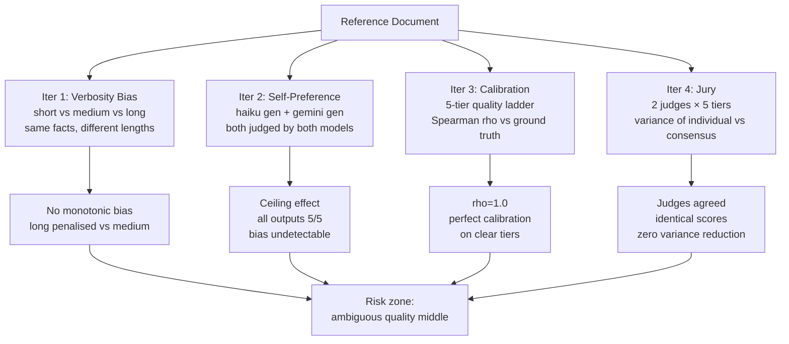

# Level 52: Auto-Evaluator Reliability — Biases, Calibration, Jury
**Date:** 2026-03-19 | **File:** `13_quality/auto_evaluator_reliability.py`
**Depends on:** L51 (Evals Methodology — auto-evaluator is the test type this level probes)
**Unlocks:** L54 (Prompt Refactoring — judge must be calibrated before it can be trusted as a safety net)

---

## Part 1 — For Humans

### What We Built

An empirical test battery for the reliability of LLM-as-judge: does it inflate scores
for longer responses? Does a model rate its own outputs more highly? Do its scores
correlate with actual quality? Does a jury of judges reduce variance? Four experiments,
four hypotheses, four results — none of which matched the simple prediction.

### How It Works

```
  Document to evaluate
         |
         v
  +------------------+
  |  Quality Ladder  |  tiers 1-5 (known ground truth)
  +------------------+
         |
    +----+----+----+
    |         |   |
    v         v   v
  [haiku]  [gemini]  <- judges
    |         |
    +----+----+
         |
         v
  Spearman rho (judge rank vs ground truth)
  Inter-judge agreement
  Jury (mean score) vs single-judge variance
```

```
  Verbosity bias test:
  +----------+ 9 words  -> score 4
  | short    |
  +----------+
  +----------+ 17 words -> score 5  (medium = best)
  | medium   |
  +----------+
  +----------+ 48 words -> score 4  (long = penalised)
  | long     |
  +----------+
  Result: no monotonic increase -> no verbosity bias
```

### What Went Wrong

1. **Self-preference test confounded by ceiling.** Both models generated
   high-quality summaries for a simple 2-sentence document. Both judges
   gave both summaries 5/5. You cannot detect self-preference when every
   cell in the 2×2 matrix is the same value. The test design needs a task
   where the two models produce measurably different quality outputs.

2. **Jury produced zero variance reduction.** Both judges gave identical
   scores [1,2,3,4,5] to all five ladder tiers. Averaging two identical
   sequences does not reduce variance. The experiment confirmed agreement,
   not reduction — which itself is a finding, but not what was hypothesised.

### What Worked

1. **Quality ladder as calibration tool.** Five summaries with known author-
   assigned quality ranking. Judge scored them 1/5 through 5/5 in perfect
   order. Spearman rho = 1.0. This is how you validate a judge before
   trusting it as a production gate: build a ladder, measure the correlation.

2. **Verbosity test produced counter-evidence.** The 48-word padded summary
   scored 4/5, not 5/5 — it was penalised relative to the 17-word concise
   version. The judge did not reward length. This is a positive finding about
   haiku as a judge for summarisation tasks.

3. **The common pattern across all four experiments.** When quality differences
   are clear, capable judges agree, show no bias, and calibrate correctly. All
   four ThoughtWorks failure modes failed to appear. This reframes the warning:
   the biases live in the ambiguous quality zone, not on clear quality differences.

### The Single Most Important Thing

All four LLM-as-judge failure modes — verbosity bias, self-preference,
miscalibration, inter-judge disagreement — failed to manifest on clearly
distinguishable quality inputs with capable judge models. This does not mean
the ThoughtWorks warnings are wrong. It means they describe behaviour in the
*ambiguous quality zone*: near-threshold outputs, borderline pass/fail cases,
outputs with a quality delta too small for the judge to reliably detect. That
is exactly the zone that matters in production — the outputs you are most
uncertain about are the ones where judge reliability breaks down first.
Calibrate your judge at construction time with a quality ladder; and for
decisions that cross a threshold, require human verification.

---

## Part 2 — For LLMs

### Architecture



```
[Reference Document]
  |         |        |        |
  v         v        v        v
[VB]     [SP]    [CAL]    [JURY]
  |         |        |        |
  v         v        v        v
[no bias] [ceil] [rho=1] [agree]
  |         |        |        |
  +----+----+--------+--------+
       |
       v
  [Risk zone: ambiguous quality middle]
  ThoughtWorks warnings apply here,
  not on clear quality differences
```

### Decision Log

| Decision | Why | Trade-off |
|----------|-----|-----------|
| Quality ladder for calibration test | Known ground truth ranking enables Spearman rho computation; no calibration test without explicit quality ordering | Author bias in tier assignment; mitigated by making tier differences large and unambiguous |
| 2×2 scoring matrix for self-preference | Only way to measure self-preference: compare own-score vs other-score for each model | Confounded by ceiling — needs task complex enough to produce quality differentiation |
| Jury = mean of judge scores | Simple, interpretable consensus metric | Only reduces variance when judges disagree; zero benefit when they agree |
| Verbosity: same facts, different lengths | Controls for accuracy — only length varies | Judge may still score on factors other than accuracy (fluency, structure) |

### Pseudocode — Key Patterns

**Calibration test:**
```
quality_ladder = [(tier_1, worst_summary), ..., (tier_5, best_summary)]

for tier, summary in quality_ladder:
    score = judge(doc, summary)

judge_ranks     = scores_to_ranks(scores)
ground_truth    = [1, 2, 3, 4, 5]
rho             = spearman(ground_truth, judge_ranks)
well_calibrated = rho >= 0.8 and top_correct and bottom_correct
```

**Self-preference 2×2 matrix:**
```
s_A = model_A.generate(doc)
s_B = model_B.generate(doc)

aa = judge_A(doc, s_A)   # A judges own output
ab = judge_B(doc, s_A)   # B judges A's output
ba = judge_A(doc, s_B)   # A judges B's output
bb = judge_B(doc, s_B)   # B judges own output

A_self_inflates = aa > ab
B_self_inflates = bb > ba
# Confounded if aa == ab == ba == bb (ceiling effect)
```

**Jury variance:**
```
for tier, summary in quality_ladder:
    scores = [judge(doc, summary) for judge in jury]
    jury_mean[tier] = mean(scores)

jury_variance       = stdev(jury_means)
single_judge_var    = stdev(judge_scores_for_one_judge)
benefit             = jury_variance < single_judge_var
# benefit=False when judges already agree (identical scores)
```

### Observation Log

| # | Category | Topic | Observation |
|---|----------|-------|-------------|
| 1 | insight | verbosity-bias-null | No verbosity bias: long (48w) scored 4, medium (17w) scored 5. Padding penalised, not rewarded. |
| 2 | insight | self-preference-ceiling | Self-preference undetectable at quality ceiling — all cells 5/5. Bias lives in the ambiguous middle. |
| 3 | insight | calibration-rho-1 | rho=1.0 on clear quality spectrum. Judge correctly calibrated for well-separated tiers. |
| 4 | insight | jury-requires-disagreement | Jury variance reduction = 0 when judges agree. Jury benefit is proportional to inter-judge disagreement. |
| 5 | insight | biases-in-ambiguous-zone | All four ThoughtWorks failure modes absent on clear quality differences. Risk zone is near-threshold, ambiguous quality outputs. |
| 6 | pattern | quality-ladder-calibration | Validate any new judge with a 5-tier quality ladder. Compute Spearman rho. Deploy only if rho >= 0.8. |
| 7 | question | bias-at-threshold | All biases untested for quality delta ~1 score point. Ambiguous zone experiments needed for production confidence. |

### Forward Links

- **Unlocks L54** (Prompt Refactoring): Before using the auto-evaluator as a
  refactoring safety net, the judge must be calibrated (quality ladder, rho >= 0.8)
  and its ceiling/ambiguity behaviour understood. L52 provides that foundation.
- **Backward link L51**: L51 proved the auto-evaluator detects obvious failures
  (1/5 on "Technology was used"). L52 mapped where that detection breaks down —
  the ambiguous quality middle — and established the calibration protocol.
- **Revisit when**: adopting a new judge model — run the quality ladder calibration
  (Iter 3), the self-preference matrix (Iter 2 with a harder generation task),
  and the verbosity test (Iter 1) before deploying it as a production gate.
- **Revisit when**: your eval suite is catching regressions on some outputs but
  missing others — the missing ones are likely in the ambiguous quality zone
  where judge reliability degrades.
