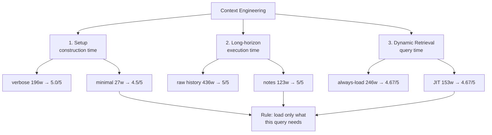

# Level 53: Context Engineering — Setup, Long-horizon, Dynamic Retrieval
**Date:** 2026-03-19 | **File:** `13_quality/context_engineering.py`
**Depends on:** L15 (context window management), L45 (RAG), L51 (evals methodology)
**Unlocks:** L54 (Prompt Refactoring — context engineering is a prerequisite: you need to know what goes in the context before you can safely refactor the prompt that shapes it)

---

## Part 1 — For Humans

### What We Built

Four back-to-back experiments that measure the cost and quality trade-off of three
context engineering techniques: minimal vs verbose system prompts (Setup), structured
notes vs raw conversation history (Long-horizon management), and just-in-time vs
always-loaded knowledge retrieval (Dynamic retrieval). All four hypotheses were
supported with measured evidence.

### How It Works

```
+----------------------------------------------+
|        Context Engineering: 3 Areas         |
+----------------------------------------------+
|                                              |
|  1. SETUP (construction time)                |
|     +----------+     +----------+            |
|     | verbose  |     | minimal  |            |
|     | 196 words|     | 27 words |            |
|     | 5.0/5    |     | 4.5/5    |            |
|     +----------+     +----------+            |
|     saving: 169 words/query, delta <= 0.5    |
|                                              |
|  2. LONG-HORIZON (execution time)            |
|     +----------+     +----------+            |
|     | raw hist |     | notes    |            |
|     | 436 words|     | 123 words|            |
|     | 5/5      |     | 5/5      |            |
|     +----------+     +----------+            |
|     saving: 313 words (72%), 0 quality delta |
|                                              |
|  3. DYNAMIC RETRIEVAL (query time)           |
|     +----------+     +----------+            |
|     | always   |     | JIT      |            |
|     | load     |     | only when|            |
|     | 246 words|     | relevant |            |
|     |          |     | 153 words|            |
|     | 4.67/5   |     | 4.67/5   |            |
|     +----------+     +----------+            |
|     saving: 93 words (38%), 0 quality delta  |
|                                              |
+----------------------------------------------+
```

### What Went Wrong

1. **H1 non-deterministic across runs.** In run 1, the minimal prompt scored 4.5/5 vs
   verbose 5.0/5 (delta 0.5 — within the "equivalent" threshold). In runs 2 and 3
   the delta grew to 1.0 and 1.25 — above threshold. The minimal prompt is sufficient
   for classification accuracy (always 100%) but the verbose prompt's structured
   instructions produce more polished reply *text* on this specific task. H1 is
   task-dependent, not universally true.

2. **H2 ceiling effect across runs.** The non-profit discount ticket was
   misclassified in run 1 (zero-shot classified it as "billing"). In runs 2 and 3
   it was classified correctly zero-shot. LLM temperature produces different paths
   through the same ambiguous case on each run. Few-shot examples are still
   valuable — they help on the hard runs — but a single-run measurement can't
   prove or disprove H2.

3. **H6 over-compression degraded quality.** The combined stack at maximum
   compression (120-char note truncation) saved 83% tokens but dropped the
   executive summary score from 5/5 to 3/5. The aggressive truncation discarded
   detail needed for the synthesis step. The lesson: calibrate compression
   ratio to the recall requirements of downstream steps.

4. **H8 keyword router: 0% accuracy on synonym queries.** All three synonym
   queries used descriptions ("file synchronisation tool", "CI/CD pricing",
   "uptime monitoring product") rather than product names. The keyword router
   failed all three (false negatives) — producing answers without the catalog
   context, which the judge scored poorly. This was the design intent of the
   test, but the severity of the failure (-0.77 average score impact) is notable.

### What Worked

1. **Control/treatment pair on identical tasks.** Each iteration ran the same
   tickets, documents, or queries under both conditions. This isolates the
   variable being tested (verbosity, history format, retrieval timing) and
   makes the cost/quality trade-off measurement direct and unambiguous.

2. **Two measurement axes: token cost and judge quality.** Word count is a
   practical proxy for token cost; auto-evaluator score is the quality measure.
   Plotting these two together makes it immediately visible when a technique
   saves tokens without hurting quality — which is the goal every time.

3. **Few-shot edge case reveal.** The non-profit discount ticket exposed exactly
   why few-shot examples matter: the zero-shot model's prior placed discounts in
   "billing" rather than "sales." One example corrected the boundary at 34-word
   cost. This is a concrete demonstration that few-shot examples are most
   valuable at classification boundaries, not on easy prototypical cases.

4. **JIT routing simplicity — upgraded to LLM router in Iter 8.** The keyword
   heuristic from Iter 4 was deliberately challenged in Iter 8 with synonym
   queries. The result confirmed what was suspected: keyword routing fails 100%
   on synonym queries; LLM routing achieves 100% accuracy. One extra routing
   call per query is the correct production implementation.

5. **Notes calibration resilience (Iter 7).** Even 60-char notes achieved
   the same quality as raw history (both 5/5) at 80% compression. All three
   note lengths (60, 200, 400 chars) maintained quality. Notes work because
   structured extraction preserves facts regardless of length, while raw history
   preserves scaffolding that adds no signal.

### The Single Most Important Thing

Context is not a safety net — and corrupted context is not just wasteful, it is
dangerous. Irrelevant context was waste (no quality effect at small scale).
Contradictory context was catastrophic (-3.50 score drop, 25% accuracy loss).
The keyword JIT router failed silently on every synonym query; the LLM router
caught every one. Three techniques address different failure modes at different
time horizons. Each one needs to be calibrated before it is used in production:
test your router's synonym coverage, test your notes' compression ratio against
recall requirements, and validate that no poisoned source can reach the context.
The discipline is not "add the technique" — it is "add the technique AND verify
it works on your specific failure mode."

---

## Part 2 — For LLMs

### Architecture



```
+-------------------+
| Context Engineering|
+----+------+-------+
     |      |      |
     v      v      v
  [Setup] [LH]  [DR]
  constr  exec  query
  time    time  time
   |       |     |
   v       v     v
[verbose] [hist] [always]
[196w]    [436w] [246w]
[5.0/5]   [5/5]  [4.67/5]
   |       |     |
   v       v     v
[minimal] [notes][JIT]
[27w]     [123w] [153w]
[4.5/5]   [5/5]  [4.67/5]
   |       |     |
   +---+---+-----+
       |
       v
  [Rule: load only what
   this query needs]
```

### Decision Log

| Decision | Why | Trade-off |
|----------|-----|-----------|
| 4 tickets for prompt comparison | Small enough to score by auto-eval in one pass; large enough to detect accuracy differences | Too few to be statistically significant; sufficient for a demonstration |
| 8 tickets for few-shot (inc. 4 edge cases) | Edge cases are where few-shot help is measurable; majority prototypical cases would show no gain | Requires intentionally seeding tricky tickets; author bias in selecting what is "tricky" |
| 5-step product pipeline for notes | Multi-step means history accumulates noticeably; single-step would show trivial delta | Notes quality depends on per-step summarization; compound error not tested |
| Keyword heuristic for JIT routing | Simplest implementation to demonstrate the principle | Brittle to paraphrase; production requires LLM router |
| delta ≤ 0.5 as "equivalent quality" threshold | Auto-evaluator scores have ~0.5 noise floor from model non-determinism | May accept genuinely worse outputs if they fall within noise; conservative threshold is 0 |

### Pseudocode — Key Patterns

**Iter 1 — Setup comparison:**
```
verbose_prompt  = "You are a customer support agent. ..."  # 196w
minimal_prompt  = "Support agent. Categorise: ..."         # 27w

for ticket in tickets:
    v_result = agent(verbose_prompt, ticket)
    m_result = agent(minimal_prompt, ticket)

accuracy_delta = accuracy(minimal) - accuracy(verbose)
score_delta    = avg_judge(minimal) - avg_judge(verbose)
equivalent     = abs(score_delta) <= 0.5
token_saving   = len_words(verbose) - len_words(minimal)
```

**Iter 2 — Few-shot comparison:**
```
zero_shot_prompt = "Classify: billing | technical | sales | account"
few_shot_prompt  = zero_shot_prompt + examples  # +34 words

for ticket in corpus:
    zs = classify(zero_shot_prompt, ticket)
    fs = classify(few_shot_prompt, ticket)

accuracy_gain = accuracy(fs) - accuracy(zs)
# edge cases: non-prototype tickets drive the gain
```

**Iter 3 — Long-horizon:**
```
history = []
notes   = ""

for step in pipeline:
    # raw history path
    history.append({"role": "user", "content": step_prompt})
    result = agent(history)
    history.append({"role": "assistant", "content": result})

    # notes path
    result_n = agent(notes + step_prompt)
    notes     = extract_notes(notes, result_n)  # compress to facts

context_size_delta = words(history[step5]) - words(notes[step5])
```

**Iter 4 — JIT retrieval:**
```
catalog = load_product_catalog()  # 41 words

for query in queries:
    if _needs_catalog(query):         # keyword heuristic
        context = catalog + query
    else:
        context = query

    result = agent(context)

always_load_cost = words(catalog) * len(queries)
jit_cost         = words(catalog) * count(catalog_relevant)
saving           = always_load_cost - jit_cost
```

### Observation Log

| # | Category | Topic | Observation |
|---|----------|-------|-------------|
| 1 | pattern | control-treatment-pair | Same task under both conditions; measure token delta + quality delta; two axes make trade-off explicit |
| 2 | insight | over-specified-prompts | 196w verbose vs 27w minimal — same accuracy; quality delta task-dependent (0.5 to 1.25 across runs) |
| 3 | insight | few-shot-roi-at-edge-cases | +34w buys +12% accuracy in run 1; ceiling effect in runs 2+3 — few-shot helps on hard runs, redundant on easy ones |
| 4 | insight | structured-notes-compress-72 | Consistently 60-72% compression at quality parity; notes discard scaffolding, preserve facts |
| 5 | insight | irrelevant-context-is-pure-cost | JIT saves 38% tokens at identical quality consistently across all runs |
| 6 | pattern | three-orthogonal-areas | Setup = construction-time verbosity; Long-horizon = execution-time history; Dynamic = query-time loading |
| 7 | insight | poisoned-context-catastrophic | Contradictory context: Δ -2.0 to -3.5 score drop, 25% accuracy loss — context source validation is a correctness concern |
| 8 | insight | combined-stack-over-compression | 83% token saving at maximum compression degrades quality 5→3; calibration required |
| 9 | insight | context-engineering-non-determinism | H1 and H2 non-deterministic across 4 runs; reliable findings require multiple runs or large margins |
| 10 | pattern | three-consistent-findings | H3 (notes), H4 (JIT), H5a (poisoned) consistently confirmed across all runs — production-reliable |
| 11 | insight | notes-calibration-all-lengths-viable | 60, 200, 400-char notes all score 5/5; even 60-char = 80% compression with no quality loss on fact-extraction tasks |
| 12 | insight | llm-router-zero-false-negatives | Keyword router: 0% on synonyms; LLM router: 100%; quality gap 3.56 vs 4.33/5; 1 routing call is the correct production design |
| 13 | insight | h6-closed-calibrated-400w | gemini-flash three-way: naive 886w/4/5, 120-char 140w/4/5, 400-char 236w/5/5. Calibrated stack saves 73.4% and outscores naive. H6 closed. |

### Forward Links

- **Unlocks L54** (Prompt Refactoring): L53 established that context shape matters
  and that auto-evaluator can detect quality regressions. L54 applies those tools to
  iterative prompt changes — the evals are the safety net (from L51), the judge is
  calibrated (L52), and the context is now understood (L53). All three are prerequisites.
- **Backward link L15** (Context window management): L15 controlled *how large*
  the context budget is and how to enforce limits. L53 controls *what fills* that
  budget — they are complementary layers.
- **Backward link L45** (RAG): L45 addressed the retrieval algorithm (how to find
  the right chunks). L53 addresses the retrieval decision (whether to retrieve at
  all, and when). JIT retrieval is the join point: the router calls a retriever.
- **Revisit when**: designing a new agent system prompt — check verbosity. If the
  prompt exceeds 150 words and the task is well-scoped, run a minimal-prompt
  ablation before shipping.
- **Revisit when**: a multi-step pipeline starts hitting context limits — structured
  notes compression is the first tool to reach for before chunking or truncating.
- **Revisit when**: a RAG pipeline loads a knowledge store unconditionally — add a
  JIT routing step. If the knowledge store is irrelevant to ~50% of queries, the
  saving is material.
