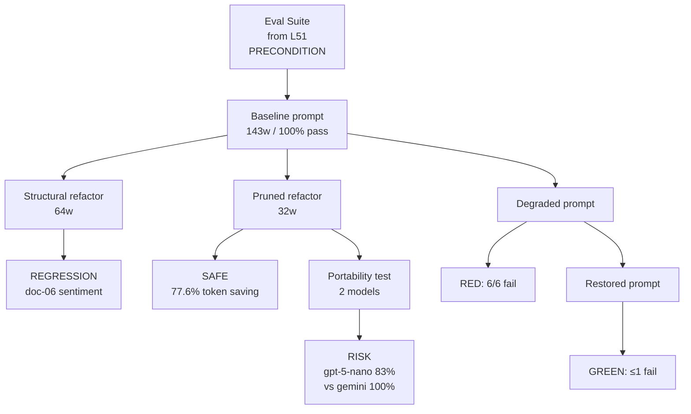

# Level 54: Prompt Refactoring — Prompts as Code
**Date:** 2026-03-19 | **File:** `13_quality/prompt_management.py`
**Depends on:** L51 (Evals Methodology — the eval suite is Fowler's stated precondition), L52 (Judge calibration), L53 (Context engineering — pruning is a context decision)
**Unlocks:** L55 (SLM Routing — cross-model portability test here is the proof of concept for routing decisions)

---

## Part 1 — For Humans

### What We Built

A five-iteration test of Fowler's prompt refactoring discipline: build eval suite
first, then exercise three refactoring strategies (structural, pruning, degradation
recovery) and verify each with the eval suite as the safety net. We also tested
Fowler's portability warning — same prompt on two different models produces
different quality profiles.

### How It Works

```
+----------------------------------------+
|  Prompt Refactoring — Safety Net Model |
+----------------------------------------+
|                                        |
|  PRECONDITION: eval suite exists (L51) |
|                                        |
|  [baseline prompt] --eval--> 100% pass |
|          |                             |
|          +-- [structural refactor]     |
|          |      --eval--> REGRESSION   |
|          |      (doc-06 sentiment)     |
|          |      STOP: do not ship      |
|          |                             |
|          +-- [pruned refactor]         |
|          |      --eval--> 100% pass    |
|          |      SAFE: 77.6% token save |
|          |                             |
|          +-- [degraded] --eval--> RED  |
|               [restored] --eval-> GREEN|
|                                        |
|  PORTABILITY TEST:                     |
|  [pruned] + gemini  --> 100%           |
|  [pruned] + gpt-5   --> 83%  RISK      |
+----------------------------------------+
```

### What Went Wrong

1. **Structural refactoring was not safe — it regressed.** The structured
   prompt reorganised the same content into labelled sections with abbreviated
   bullet definitions (e.g. `"positive" (good news, achievements)` vs the
   baseline's full-sentence explanation). Doc-06 (open source release) changed
   sentiment from positive to neutral in every run. The model responds to the
   visual weight and ordering of criteria, not just their presence. Fix: the eval
   caught it — the prompt was not shipped.

2. **Iter 4 noise floor mismatch.** First run compared `restored_failures <= 0`
   (the baseline failure count). A restored re-run produced 1 failure from
   non-determinism, which failed the comparison. Fix: `max(baseline.failures, 1)`
   as the recovery threshold — same lesson as L51 Iter 6.

3. **Haiku in Iter 5 (Anthropic credits exhausted).** Fixed by switching to
   `gpt-5-nano`, which turned out to be a more meaningful portability test
   (different provider architecture, not just a different model tier).

### What Worked

1. **Eval suite as automatic gatekeeper.** The structural refactoring would have
   shipped a regression without detection. The eval caught it in every single run.
   This is Fowler's core claim in practice: the eval suite is what makes prompt
   changes safe, not intuition about whether the change "should" be safe.

2. **Pruning was safer than structuring.** The 32-word pruned prompt (77.6%
   token saving) passed 100% of evals while the 64-word structured prompt
   regressed. Less instruction means the model uses its own priors — which can
   be more consistent than abbreviated human-written definitions.

3. **Red-green cycle works end-to-end.** Degraded prompt → 6/6 failures
   (100% sensitivity). Restored prompt → ≤1 failures (within noise floor).
   Fowler's cycle is directly verifiable with a 6-document eval corpus.

4. **Portability risk is real and measurable.** The pruned prompt scored 17%
   lower on gpt-5-nano than gemini-flash. The baseline prompt was portable
   (both 100%) because its detailed definitions gave gpt-5-nano enough context
   to override its own priors. Minimal prompts expose the model's priors —
   which differ across models.

### The Single Most Important Thing

Structural refactoring is not automatically safe — only content-equivalent
reformatting is safe, and even that assumption must be verified with evals.
When you rewrite a prose definition as a bullet list, you change the relative
weight the model assigns to each criterion. The eval suite is not optional
scaffolding for prompt refactoring; it is the only mechanism that distinguishes
a safe structural change from a silent regression. Build the suite first, every
time.

---

## Part 2 — For LLMs

### Architecture



```
[Eval Suite L51]
      |
      v
[Baseline 143w 100%]
   |      |      |
   v      v      v
[Struct] [Prune] [Degrade]
[64w]    [32w]   [51w]
   |       |        |
   v       v        v
[REGRESS] [SAFE]   [RED 6/6]
[doc-06]  [77.6%]     |
           |       [Restore]
           v           |
        [Port]         v
        [2 models] [GREEN ≤1]
           |
           v
        [RISK delta=17%]
```

### Decision Log

| Decision | Why | Trade-off |
|----------|-----|-----------|
| 6-doc corpus with doc-06 (open source release) | Edge case — sentiment is positive but informationally neutral; tests boundary of positive/neutral definition | Small corpus; 1 failure = 17% pass rate delta, which is large variance |
| Noise floor: max(baseline, 1) | L51 lesson: LLM non-determinism produces 1-failure noise floor even with correct prompt | Could mask genuine 1-doc regressions; acceptable given corpus size |
| gpt-5-nano as portability test model | Anthropic credits exhausted; gpt-5-nano is a different provider (Azure OpenAI) and genuinely different architecture | Not the same as a human-chosen portability comparison; result still valid |
| Structural prompt uses bullets not prose | Realistic refactoring pattern — converting dense paragraphs to scannable bullets is common | Actually changes model behavior on edge cases (the main finding) |
| Pruned prompt at 32 words (most minimal) | Maximal compression to test whether the model's priors are sufficient | Model-dependent: priors differ across providers; portability risk increased |

### Pseudocode — Key Patterns

**Eval-gated refactoring (Fowler's cycle):**
```
# PRECONDITION: eval suite exists (do not skip)
baseline_failures = run_evals(current_prompt, corpus)

# Step 1: refactor
candidate_prompt = refactor(current_prompt)

# Step 2: verify — do NOT ship without this
candidate_failures = run_evals(candidate_prompt, corpus)

if candidate_failures > baseline_failures:
    # REGRESSION — do not ship
    revert or iterate
else:
    ship candidate_prompt

# Note: both structural AND content changes must be verified
# "Structural" does not imply "safe"
```

**Noise-floor-aware recovery check:**
```
baseline_failures = run_evals(original_prompt, corpus)
noise_floor       = max(baseline_failures, 1)   # LLM non-determinism

# degrade
degraded_failures = run_evals(degraded_prompt, corpus)
regression_detected = degraded_failures > baseline_failures

# restore
restored_failures = run_evals(original_prompt, corpus)  # re-run
fully_recovered   = restored_failures <= noise_floor

red_green_works = regression_detected and fully_recovered
```

**Portability check:**
```
for model in [target_model, secondary_model]:
    for prompt in [baseline, refactored]:
        pass_rate[model][prompt] = run_evals(prompt, corpus, model)

portability_risk = abs(
    pass_rate[target][refactored] - pass_rate[secondary][refactored]
) > 0.15

# Risk = always test on target model before shipping
# Even if baseline is portable, refactored may not be
```

### Observation Log

| # | Category | Topic | Observation |
|---|----------|-------|-------------|
| 1 | insight | structural-refactoring-not-safe | Structural refactoring regressed doc-06 in every run — bullets vs prose changes criterion weighting |
| 2 | insight | pruning-safer-than-structuring | 32w pruned prompt: 100% pass; 64w structured: 83% pass. Less instruction = more consistent model priors |
| 3 | insight | cross-model-portability-on-pruned | Pruned prompt: gemini 100% vs gpt-5-nano 83% (delta 17%). Minimal prompts expose model priors which differ by provider |
| 4 | pattern | red-green-refactor-for-prompts | Degrade → confirm RED (6/6 fail) → restore → confirm GREEN (≤noise floor). 100% sensitivity to catastrophic degradation |
| 5 | pattern | eval-suite-as-precondition | Eval suite must exist before refactoring. Without it, structural regression (H2) would have shipped undetected |
| 6 | mistake | iter4-noise-floor | Compared restored against 0 (perfect). Fixed: max(baseline, 1). Same lesson as L51 Iter 6 |
| 7 | question | minimum-corpus-size | 6 docs caught 1 systematic regression. Would 3 have caught it? Corpus size minimum depends on systematic vs non-deterministic failure mode |

### Forward Links

- **Unlocks L55** (SLM Routing): The portability test (Iter 5) showed that pruned
  prompts behave differently across model families. This is the exact problem SLM
  routing must solve — different models for different tasks means prompts must be
  validated per-model. L54's portability framework is the measurement tool for L55.
- **Backward link L51**: L51 proved the eval suite detects regressions in one cycle.
  L54 exercised it across three distinct refactoring strategies and found that even
  "safe" structural changes require verification. L54 deepens the L51 finding.
- **Backward link L52**: Judge calibration (L52) is what makes the example-based
  evals in L54 reliable. A miscalibrated judge would have approved the structural
  regression as "equivalent quality."
- **Revisit when**: making any prompt change in production — run the eval suite
  after every change, including structural ones. "It's just reorganising" is not
  a sufficient reason to skip eval verification.
- **Revisit when**: deploying a refactored prompt to a new model — run the
  portability test (Iter 5) before shipping. The 17% drop on gpt-5-nano confirms
  this is not hypothetical.
