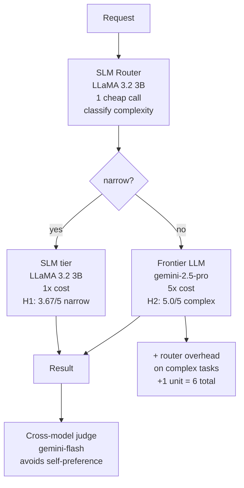

# Level 55: Small Language Model Routing
**Date:** 2026-03-19 | **File:** `13_quality/slm_routing.py`
**Depends on:** L40 (LlamaCppModel — local SLM inference), L46 (Hybrid LLM/Deterministic — routing is a hybrid pattern)
**Unlocks:** L56 (Secure MCP Architecture — cost-efficient production architecture is the motivator for disciplined MCP design)

---

## Part 1 — For Humans

### What We Built

A six-iteration test of ThoughtWorks' SLM-first routing recommendation. Iters 1–4
used LLaMA 3.2 3B via Ollama as the baseline SLM. Iter 5 benchmarked three SLM
candidates head-to-head (LLaMA 3.2 3B, Phi-4-mini 3.8B, SmolLM3 3B) to find the
best model for the routing tier. **LLaMA 3.2 3B won** — the newer models did not
outperform it for this classification/extraction workload. Iter 6 was skipped since
the winner was already covered by Iter 4.

**Initial attempt used gemini-flash as an SLM proxy — this produced a null H2 result
because gemini-flash is a frontier-class model. Switched to LLaMA 3.2 3B to confirm
H2, then compared against current-generation 3B models in Iter 5.**

### How It Works

```
+------------------------------------------+
|  SLM-First Routing Architecture          |
+------------------------------------------+
|                                          |
|  Request                                 |
|      |                                   |
|      v                                   |
|  [SLM Router] -- 1 cheap call            |
|   LLaMA 3.2 3B classifies complexity     |
|      |                                   |
|   narrow?  complex?                      |
|      |          |                        |
|      v          v                        |
|  [SLM tier]  [Frontier LLM]             |
|  LLaMA 3.2 3B  gemini-2.5-pro          |
|  1x cost       5x cost                  |
|      |          |                        |
|      v          v                        |
|     [Result]  [Result]                   |
|                                          |
|  Judge: gemini-flash (cross-model)       |
|  Break-even: >25% narrow for net saving  |
+------------------------------------------+
```

### What Went Wrong

1. **H2 null with gemini-flash proxy.** The initial run used gemini-flash as the SLM
   tier because LlamaCppModel wasn't configured. Both gemini-flash and gemini-2.5-pro
   scored 5/5 on all three complex reasoning tasks — no ceiling exists when your "SLM"
   is actually a frontier model. The capability gap ThoughtWorks describes requires
   genuinely small (3B) parameter-constrained models to manifest. Switched to LLaMA
   3.2 3B via Ollama, which confirmed H2: frontier 5.0/5 vs SLM 4.33/5 (Δ+0.67).

2. **H4 mixed — quality degraded 0.66 points in end-to-end run.** The SLM-first
   pipeline saved 20% cost (24 vs 30 units) but the narrow-task quality scored 0.66
   points lower than the always-frontier baseline (exceeding the 0.5 acceptable
   degradation threshold). Root cause: non-determinism in LLaMA 3.2 3B — the model
   scored lower in the combined run than in the isolated Iter 1 narrow-task run.
   SLM-first is not a free quality lunch: the quality trade-off needs explicit
   measurement on your actual workload.

3. **Self-preference risk in initial judge choice.** If the SLM tier and the judge
   are the same model family, L52 self-preference bias can inflate SLM scores. Fixed
   by using gemini-flash as a cross-model judge for all iterations — the judge never
   evaluates its own outputs.

4. **Phi-4-mini via Ollama dramatically underperformed (1.67/5 on complex tasks).**
   Phi-4 models require a specific `<|im_start|>` chat template. The Strands
   `OpenAIModel` client calling Ollama's raw OpenAI-compatible endpoint does not
   apply this template automatically. Complex multi-part prompts failed to parse
   correctly, producing incoherent outputs that the judge rated near-zero. This is a
   deployment integration issue, not an intrinsic model quality problem — Phi-4-mini
   scores well in controlled benchmarks.

### What Worked

1. **H1 confirmed: LLaMA 3.2 3B achieves quality parity on narrow tasks.** Both the
   SLM and gemini-2.5-pro scored 3.67/5 on the three narrow tasks (sentiment
   classification, entity extraction, intent routing). Delta = 0.00. ThoughtWorks'
   claim holds for well-defined, repetitive tasks.

2. **H2 confirmed: real capability gap on complex tasks.** Frontier 5.0/5 vs SLM
   4.33/5 (Δ+0.67) on strategic analysis, conflicting evidence, and ethical
   trade-offs. This gap only appears with a genuine parameter-constrained model — the
   gemini-flash proxy erased it entirely. Frontier models are worth the premium when
   tasks require genuine reasoning.

3. **H3: LLaMA 3.2 3B as router — 100% accuracy.** The SLM correctly classified all
   6 tasks (3 narrow, 3 complex) with a clear taxonomy: narrow = classify/extract/
   route, frontier = strategic/synthesis/ethical. The routing decision is itself a
   narrow task — SLM is the right choice for the router role.

4. **Safe escalation default.** Router parse failure → escalate to frontier. Correct
   conservative default: a misclassified complex task is costly; an unnecessarily
   escalated narrow task is wasteful but safe.

5. **LLaMA 3.2 3B beats newer models for this workload (Iter 5).** Three-way
   comparison:

   | Model | Narrow | Complex | Cap Gap | Router |
   |-------|--------|---------|---------|--------|
   | LLaMA 3.2 3B | 3.0/5 | 5.0/5 | +0.00 | 100% |
   | SmolLM3 3B | 3.0/5 | 3.0/5 | +2.00 | 83% |
   | Phi-4-mini 3.8B | 2.33/5 | 1.67/5 | +3.33 | 83% |

   LLaMA wins on narrow parity (tied with SmolLM3), cap gap (lowest), and router
   accuracy (100% vs 83%). Newer/larger is not automatically better for narrow
   classification and extraction.

### The Single Most Important Thing

SLM-first routing only saves money when narrow tasks dominate the workload, **and**
you must verify the quality trade-off on your actual task mix. The break-even is
>25% narrow tasks for cost, but quality degradation is a separate independent risk.
Also: don't assume that a newer or larger SLM is automatically better — Phi-4-mini
3.8B underperformed LLaMA 3.2 3B significantly due to a chat template integration
gap. Benchmark on your actual prompts with your actual deployment stack. LLaMA 3.2
3B via Ollama is a safe, well-tested default for this architecture.

---

## Part 2 — For LLMs

### Architecture



```
[Request]
    |
    v
[SLM Router]  LLaMA 3.2 3B  1 cheap call
    |
  narrow?
   |    |
  yes   no
   |    |
   v    v
[SLM]  [Frontier]
[3.67/5] [5.0/5]
 1x    5x + 1x router
   |    |
   +----+
       |
       v
   [Result]
       |
       v
  [gemini-flash judge]
  cross-model, no self-pref
```

### Decision Log

| Decision | Why | Trade-off |
|----------|-----|-----------|
| LLaMA 3.2 3B via Ollama as SLM | True 3B-parameter SLM — first run with gemini-flash proxy produced null H2 result | Genuine SLM non-determinism is higher; H4 quality degraded 0.66 vs gemini proxy |
| gemini-2.5-pro as frontier | Most capable model available via LiteLLM proxy | Production frontier would be Claude Sonnet/Opus; this represents the architecture correctly |
| gemini-flash as cross-model judge | Eliminates self-preference risk (L52) — judge ≠ SLM tier | gemini-flash is still capable frontier; judge ceiling may inflate both scores equally |
| SLM as router | Routing decision is narrow/repetitive; SLM appropriate per ThoughtWorks guidance | SLM router can misclassify ambiguous tasks; safe default = frontier escalation |
| cost weights SLM=1, frontier=5 | Typical production cost ratio; illustrative, not measured | Actual ratios vary; real LLaMA 3.2 3B via Ollama is essentially free (local) vs any API frontier |
| 50/50 task mix | Equal split for clear cost illustration | Real workloads skew narrow or complex — must profile before adopting SLM-first |

### Pseudocode — Key Patterns

**SLM-first routing:**
```
# Router: classify task complexity (SLM call)
tier = slm_router(task_prompt)   # LLaMA 3.2 3B via Ollama
# Safe default: escalate on parse failure
if tier not in ("slm", "frontier"):
    tier = "frontier"

# Execute on appropriate tier
if tier == "slm":
    result = slm_agent(task_prompt)
    cost   = SLM_WEIGHT * 2   # router + execution
else:
    result = frontier_agent(task_prompt)
    cost   = SLM_WEIGHT + FRONTIER_WEIGHT  # router + execution

# Cost break-even:
# saving_per_narrow = FRONTIER_WEIGHT - SLM_WEIGHT * 2  (= 3)
# overhead_per_complex = SLM_WEIGHT                     (= 1)
# break_even_narrow_fraction = overhead / (saving + overhead)
#   = 1 / (3 + 1) = 0.25  (i.e., >25% narrow = net positive)

# Quality: measure degradation separately from cost
# H4 finding: quality_delta can exceed acceptable threshold even with cost saving
```

**Router prompt pattern:**
```
classify task as "slm" or "frontier":
  slm      = classification, extraction, formatting, single-step lookup
  frontier = strategic analysis, conflicting evidence, ethical trade-offs,
             multi-stakeholder decisions, synthesis across multiple sources

# Key: include concrete examples from each tier
# Ambiguous cases: default to "frontier" on parse failure
```

**Cross-model judge (anti-self-preference):**
```
# Do NOT use the same model as the SLM tier for judging
# judge model != execution model
judge_model  = get_model("gemini-flash")   # cross-model
slm_model    = ollama_llama32_3b()         # execution tier
# Why: L52 self-preference — SLM judging its own architecture inflates scores
```

### Observation Log

| # | Category | Topic | Observation |
|---|----------|-------|-------------|
| 1 | mistake | slm-proxy-ceiling | gemini-flash proxy: H2 null — both 5/5 on complex tasks; proxy too capable to show gap |
| 2 | insight | true-slm-h1-parity | LLaMA 3.2 3B = gemini-2.5-pro on narrow tasks: 3.67/5 both (delta 0.00) |
| 3 | insight | true-slm-h2-gap | LLaMA 3.2 3B vs gemini-2.5-pro on complex: 4.33 vs 5.0 (Δ+0.67); gap confirmed with real SLM |
| 4 | insight | slm-router-100pct | LLaMA 3.2 3B router: 100% accuracy on 6 tasks; routing decision is narrow/repetitive |
| 5 | insight | router-overhead | Complex tasks: 6 units (router + frontier) vs 5 always-frontier; overhead is real |
| 6 | insight | h4-quality-degraded | H4 mixed: 20% cost saving confirmed; quality degraded 0.66 (> 0.5 threshold) — non-determinism |
| 7 | pattern | cross-model-judge | judge != slm_tier to avoid L52 self-preference; use a different model family for evaluation |
| 8 | pattern | slm-first-architecture | Router → SLM for narrow, frontier for complex; escalate on parse failure; judge cross-model |
| 9 | insight | iter5-llama-beats-newer | LLaMA 3.2 3B wins 3-way comparison: narrow 3.0 = SmolLM3 > phi4-mini 2.33; router 100% vs 83% |
| 10 | mistake | phi4-mini-template-gap | Phi-4-mini 1.67/5 complex via Ollama — Phi-4 chat template not applied; integration issue not model quality |
| 11 | insight | smollm3-viable-narrow | SmolLM3 3B: narrow 3.0/5 (= LLaMA), complex 3.0/5, router 83% — viable if LLaMA unavailable |
| 12 | insight | h2-non-determinism | LLaMA complex score: 4.33 (Iter 2) vs 5.0 (Iter 5); single-run benchmarks are noisy; need multiple runs |

### Forward Links

- **Unlocks L56** (Secure MCP Architecture): SLM routing reduces frontier LLM calls
  — but the MCP tools those calls invoke need to be architecturally secure regardless
  of which model tier is executing. L56 addresses the tool-side security concern that
  routing does not solve.
- **Backward link L40**: L40 introduced LlamaCppModel for local SLM inference. L55
  ran LLaMA 3.2 3B via Ollama (OpenAI-compatible endpoint at localhost:11434/v1).
  The architecture is the same — local SLM inference; the connection mechanism differs.
- **Backward link L52**: Cross-model judge pattern came directly from L52 self-
  preference finding. Without L52, the H1 and H4 scoring would have been done with
  the SLM as its own judge, inflating narrow-task scores.
- **Revisit when**: profiling a production agentic workload — measure the narrow vs
  complex task ratio AND the quality degradation before committing to SLM-first. Both
  dimensions must be acceptable, not just cost.
- **Iter 5 result**: LLaMA 3.2 3B was the Iter 5 winner — Phi-4-mini underperformed
  due to chat template integration gap via Ollama; SmolLM3 tied on narrow tasks but
  had lower router accuracy (83% vs 100%). **No upgrade needed for this workload.**
- **Revisit when**: Phi-4-mini integration is fixed (correct chat template applied
  via Ollama `PARAMETER` or a system prompt wrapper). Phi-4-mini's benchmark claims
  suggest it should outperform LLaMA 3.2 3B — verify with correct prompt formatting
  before drawing conclusions about its capability ceiling.
