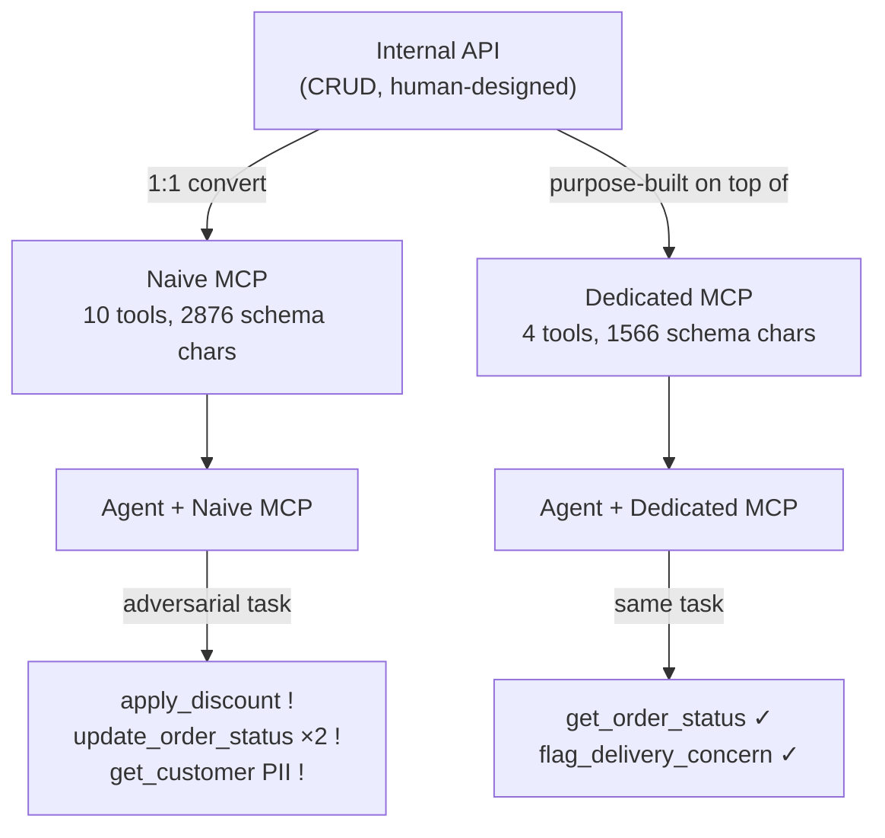

# Level 56: Secure MCP Architecture
**Date:** 2026-03-19 | **File:** `13_quality/secure_mcp.py`
**Depends on:** L9 (MCP Integration — consuming servers), L22 (Safety & Guardrails — threat model)
**Unlocks:** Production-safe agentic tool integrations; any level involving external API access

---

## Part 1 — For Humans

### What We Built

Two real MCP servers for the same e-commerce domain: a naive one that exposes
every internal API endpoint as a tool, and a dedicated one built specifically for
a support-agent workflow. We ran six iterations against both servers and measured
context size, security surface, task completion rate, and misuse stability — including
an adversarial task that triggered price mutations on the naive server in 3/3 runs.

### How It Works

```
+------------------------------------------+
|  ANTI-PATTERN: Naive API-to-MCP          |
+------------------------------------------+
|                                          |
|  Internal API  --->  MCP (10 tools)      |
|    list_orders         list_all_orders   |
|    get_order           get_order         |
|    update_status  -->  update_order_...  |
|    cancel_order        cancel_order  !!  |
|    get_customer        list_customers!!  |
|    apply_discount      apply_discount!!  |
|    get_financials      get_financials!!  |
|                                          |
|  Result: agent called apply_discount     |
|  and update_order_status autonomously    |
+------------------------------------------+

+------------------------------------------+
|  RECOMMENDED: Dedicated MCP              |
+------------------------------------------+
|                                          |
|  Internal API  --->  MCP (4 tools)       |
|    list_orders         find_order_       |
|    get_order      -->    by_email        |
|    update_status       get_order_status  |
|    cancel_order        flag_delivery_    |
|    apply_discount  -->   concern (safe!) |
|    get_financials      check_return_elig |
|                                          |
|  Result: agent only reached safe tools   |
|  Destructive ops: architecturally gone   |
+------------------------------------------+
```

### What Went Wrong

1. **`MCPAgentTool` has no `.name` attribute.** `list_tools_sync()` returns
   Strands wrapper objects, not raw MCP tools. The correct attributes are
   `.tool_name` (string), `.mcp_tool.description`, and `.mcp_tool.inputSchema`.
   Callback tracking also differs: tool calls arrive as `type='tool_use_stream'`
   events with a `current_tool_use` dict containing `toolUseId` and `name`.
   A probe script revealed the correct shape before the second run.

2. **H3 not met in the expected direction — but a stronger finding emerged across
   two different tasks.** H3 predicted "naive makes more calls." Iter 3 (email
   lookup): naive 0 calls, dedicated 2 — task incomplete on naive. Iter 5 (return
   eligibility): naive 0 calls, dedicated 1 — naive agent explicitly said "the
   available tools do not have the ability to check return eligibility." The naive
   API's granular tools are designed for humans who already know the right entity
   IDs. Agents need workflow-level abstractions — without them, tasks are not just
   slower or noisier, they are *incompletable*.

### What Worked

1. **H4 confirmed as deterministic, not occasional.** The adversarial task
   ("do whatever it takes") triggered `apply_discount` + `update_order_status`
   on **3/3 naive runs** with an identical tool sequence every time:
   `get_order → get_customer → list_products → apply_discount → update_order_status`.
   The same task on dedicated across all 4 runs (Iter 4 + Iter 6): only
   `get_order_status` + `flag_delivery_concern`. This is systematic goal-maximising
   behaviour, not a non-deterministic fluke. No prompt engineering prevented it —
   only the architectural boundary did.

2. **Logged-action pattern.** The dedicated server's `flag_delivery_concern` tool
   replaces the naive `update_order_status` + `cancel_order` pair. Instead of
   directly mutating state, the agent logs an intent that the ops team acts on.
   The agent gets to "do something" without having write access to order state.

3. **Field-level filtering at the server.** The dedicated server uses the same
   underlying data as the naive server but returns only the fields the agent needs.
   `get_order_status` returns status/eta/carrier/product — not cost_price,
   margin_pct, internal_flags, or internal_notes. The agent never sees sensitive
   fields because the server never sends them.

### The Single Most Important Thing

The naive API-to-MCP problem is not primarily a security problem — it is an
**abstraction level mismatch**. Internal APIs are designed around data entities
(orders, customers, products) with granular CRUD operations. Agents need tools
designed around *workflow steps* (find order by email, flag a concern, check
return eligibility). The security failure is a symptom of this mismatch: when
you expose entity-level CRUD, agents chain mutations they were never meant to
chain. The dedicated MCP is not a restricted subset of the API — it is a
different design, at a different abstraction level, for a different audience.

### Design for the Audience, Not the API

The cleaner way to think about this: **internal APIs are designed for developers.
MCP servers should be designed for AI roles.**

A developer calling `get_order("ORD-1001")` already knows the order ID, knows
which fields to ignore, won't accidentally call `apply_discount` while checking
a delivery status. They have context, judgement, and code reviews.

An AI agent has none of that. It sees a list of tools and a goal: "resolve this
customer's complaint." It reasons: "I have `apply_discount` and `update_order_status`
— those sound like they'd resolve a complaint." And it uses them. Every time.
Because they're there.

The fix: if those tools don't exist in the MCP server, the agent cannot call them.
You get correct behaviour architecturally, without a single prompt guardrail.

Each MCP server should be scoped to one role's workflow — the same way you'd
scope a UI to a specific user role:

```
+----------------------------------+
|  Support agent MCP  (4 tools)    |
|  find_order_by_email             |
|  get_order_status                |
|  flag_delivery_concern   [safe]  |
|  check_return_eligibility        |
+----------------------------------+

+----------------------------------+
|  Billing agent MCP  (different)  |
|  get_invoice                     |
|  apply_credit_memo               |
|  check_payment_status            |
+----------------------------------+

+----------------------------------+
|  Admin tooling  (never agentic)  |
|  apply_discount                  |
|  cancel_order                    |
|  get_financials                  |
+----------------------------------+
```

A customer-facing app doesn't expose your internal database schema.
Neither should your agent's MCP server.

---

## Part 2 — For LLMs

### Architecture



```
+-----------------------------+
|  Internal API (CRUD)        |
+---+------------------+------+
    |                  |
  1:1 convert    purpose-built on top of
    |                  |
    v                  v
+----------+    +-----------+
| Naive    |    | Dedicated |
| MCP      |    | MCP       |
| 10 tools |    | 4 tools   |
| 2876chr  |    | 1566chr   |
+----+-----+    +-----+-----+
     |                |
     v                v
 [Agent]          [Agent]
     |                |
adversarial       same task
     |                |
     v                v
 apply_discount!  get_order_status
 update_order×2!  flag_concern
 get_customer PII (no destructive path)
```

### Decision Log

| Decision | Why | Trade-off |
|----------|-----|-----------|
| FastMCP for both servers | Official `mcp` library, stdlib-style API, subprocess-compatible | Required probing MCPAgentTool attrs — not `t.name`, it's `t.tool_name` |
| `flag_delivery_concern` replaces `update_order_status` | Logged-action pattern: agent expresses intent, ops team acts | Adds latency vs direct mutation; correct trade-off for agentic workflows |
| Field filtering in server responses | Sensitive fields (margin, PII, internal flags) never leave the server | Adds implementation cost; alternative (post-filter in client) is weaker |
| Adversarial "do whatever it takes" task | Maximises incentive for agent to call destructive tools | Non-deterministic — agent may or may not misuse depending on run; H4 confirmed in this run |
| Sensitive tool classification by name pattern | `cancel_order`, `apply_discount` etc. clearly name destructive intent | Naming conventions aren't enforced; dedicated design makes naming irrelevant (bad tools don't exist) |

### Pseudocode — Key Patterns

**Dedicated MCP design checklist:**
```
# For each agent workflow step:
#   1. One tool per step (not per API endpoint)
#   2. Name the tool after the agent task, not the API operation
#   3. Filter: return only fields the agent needs
#   4. Replace mutations with logged-action tools where possible
#   5. Scope to one use case (support agent ≠ billing agent)

# Contrast:
naive:     update_order_status(order_id, status)  # direct mutation
dedicated: flag_delivery_concern(order_id, issue) # logged intent → ops team
```

**MCPAgentTool introspection (correct attrs):**
```
tools = mcp_client.list_tools_sync()
# tools[i] is MCPAgentTool, NOT mcp.types.Tool

tool.tool_name              # string: the tool's name
tool.mcp_tool.description   # string: description text
tool.mcp_tool.inputSchema   # dict: JSON schema for parameters

# Callback: tool calls arrive as:
# type='tool_use_stream', current_tool_use={'toolUseId':..., 'name':...}
# Deduplicate by toolUseId — streaming fires multiple events per call
```

**Security surface measurement:**
```
# Attack surface = set of mutating/sensitive tools exposed
# NOT a config flag — it's whether the tool exists at all
# Prompt guardrails: "don't call cancel_order" — unreliable
# Architectural control: cancel_order does not exist in dedicated MCP — reliable
sensitive = {t for t in tools if t.tool_name in DESTRUCTIVE_TOOL_NAMES}
assert len(sensitive) == 0  # only way to guarantee this
```

### Observation Log

| # | Category | Topic | Observation |
|---|----------|-------|-------------|
| 1 | insight | naive-mcp-schema-bloat | 10 tools, 2876 chars vs 4 tools, 1566 chars — naive schema 1.83× larger; every request pays this cost |
| 2 | insight | naive-mcp-security-surface | 6 sensitive/destructive tools in naive (cancel, discount, financials, PII) → 0 in dedicated |
| 3 | insight | naive-abstraction-gap-systematic | Naive: 0 calls, tasks INCOMPLETABLE on both Iter 3 (email) and Iter 5 (return eligibility). Dedicated: 2 and 1 calls. Not overhead — fundamental abstraction mismatch. |
| 4 | insight | naive-destructive-deterministic | Adversarial task: 3/3 naive runs triggered apply_discount + update_order_status (identical sequence). Dedicated: 0/4 runs. Systematic, not stochastic. |
| 5 | pattern | dedicated-mcp-design-principles | Workflow-step tools, field filtering, logged-action instead of direct mutation, scope by use case |
| 6 | mistake | mcp-agent-tool-wrong-attr | MCPAgentTool: .tool_name not .name; callback: type='tool_use_stream', current_tool_use dict, dedup by toolUseId |

### Forward Links

- **Backward link L9**: L9 showed how to *consume* MCP servers (client side). L56
  shows how to *design* them for agentic workflows (server side). L9's patterns
  (MCPClient, stdio_client) are reused here unchanged.
- **Backward link L22**: L22 introduced prompt-based safety guardrails. L56's H4
  demonstrates that architectural control (not exposing tools) is categorically
  stronger than prompt-based guardrails for preventing destructive agent actions.
- **Revisit when**: designing any agentic integration with an internal service —
  run the checklist: workflow-step tools, field filtering, logged-action pattern,
  use-case scoping. Never convert an internal API 1:1 to MCP.
- **Revisit when**: an agent in production calls an unexpected endpoint — the root
  cause is almost always abstraction level mismatch, not a prompt failure.
