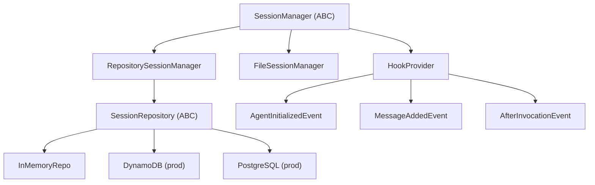

# Level 57: Session Management — Providers, Lifecycle Hooks
**Date:** 2026-04-13 | **File:** `11_2026_updates/session_management.py`
**Depends on:** L5 (Sessions) | **Unlocks:** L48 (Durable Execution)

---

## Part 1 — For Humans

### What We Built
Deep dive into the SDK's session management architecture: the `SessionManager` ABC, its hook-based lifecycle, the `SessionRepository` storage interface, and how `RepositorySessionManager` plugs custom backends into the framework. Four iterations from FileSessionManager basics to building a custom in-memory repository with full persistence.

### How It Works

```
+-------------------+
|   Agent created   |
+--------+----------+
         |
   AgentInitializedEvent
         |
         v
+-------------------+
| SessionManager    |
| .initialize()     |---> restore messages
+--------+----------+     + state from store
         |
   [user sends message]
         |
   MessageAddedEvent
         |
         v
+-------------------+
| .append_message() |---> persist to store
| .sync_agent()     |---> persist state
+--------+----------+
         |
   [LLM responds]
         |
   MessageAddedEvent
   + AfterInvocationEvent
         |
         v
| .append_message() |
| .sync_agent() x2  |---> final sync
+-------------------+
```

### What Went Wrong
1. **SessionMessage.role doesn't exist** — assumed SessionMessage was a flat dataclass with a `role` field. Reality: `SessionMessage.message` is the Message dict containing `role`. Fix: `session_message.message.get("role")`. Root cause: didn't probe the dataclass fields before writing code.

### What Worked
1. **LoggingSessionManager subclass** — subclassing FileSessionManager with print statements in each method showed the exact hook sequence. Made the lifecycle tangible.
2. **InMemorySessionRepository** — implementing all 12 methods of the ABC forced understanding of what data flows where. The repository is the storage contract; the session manager is the lifecycle orchestrator.
3. **Two-turn resume demo** — creating agent1, talking, then creating agent2 with same session_id and showing it remembers. Simple, undeniable proof.

### The Single Most Important Thing
SessionManager is a HookProvider — it wires itself into the agent lifecycle automatically via `register_hooks()`. You never call save/load manually. This is the key architectural insight: session persistence is event-driven, not imperative. Understanding the hook sequence (initialize → append_message+sync → append_message+sync → sync) is essential for building efficient custom repositories.

---

## Part 2 — For LLMs

### Architecture



```
+---------------------+
| SessionManager (ABC)|
| extends HookProvider|
+--+--------+---------+
   |        |
   v        v
+------+ +------------------+
|File  | |Repository        |
|SM    | |SessionManager    |
+------+ +--------+---------+
                   |
                   v
         +------------------+
         |SessionRepository |
         |(ABC - 12 methods)|
         +--+------+-------+
            |      |      |
            v      v      v
         [Memory][DDB] [Postgres]

Hooks wired by register_hooks():
  AgentInitializedEvent -> initialize()
  MessageAddedEvent     -> append_message()
                        -> sync_agent()
  AfterInvocationEvent  -> sync_agent()
```

### Decision Log

| Decision | Why | Trade-off |
|----------|-----|-----------|
| InMemoryRepo over SQLite | Simplest demo, no file I/O | Not production-realistic |
| Show all 12 SessionRepository methods | Complete contract visibility | Long class definition |
| LoggingSessionManager subclass | Best way to show hook sequence | Extra iteration |

### Pseudocode — Key Patterns

```
# Minimal custom repository
class MyRepo(SessionRepository):
    create_session(session) -> Session
    read_session(id) -> Session | None
    create_agent(session_id, agent) -> None
    read_agent(session_id, agent_id) -> SessionAgent | None
    update_agent(session_id, agent) -> None
    create_message(session_id, agent_id, msg) -> None
    list_messages(session_id, agent_id) -> [SessionMessage]
    # ... 5 more methods

# Plug into agent
repo = MyRepo()
sm = RepositorySessionManager(session_id="X", session_repository=repo)
agent = Agent(model=m, session_manager=sm)
# Hooks auto-register — persistence is automatic
```

### Observation Log

| # | Category | Topic | Observation |
|---|----------|-------|-------------|
| 1 | mistake | SessionMessage schema | .role doesn't exist; use .message.get("role") |
| 2 | insight | hook sequence | 6 hook events per turn: init, 2x(append+sync), sync |
| 3 | pattern | HookProvider | SessionManager IS a HookProvider — no manual wiring |

### Forward Links

- **Unlocks L48**: RepositorySessionManager for checkpoint-and-resume
- **Revisit when**: Building production session storage (DynamoDB, PostgreSQL)
