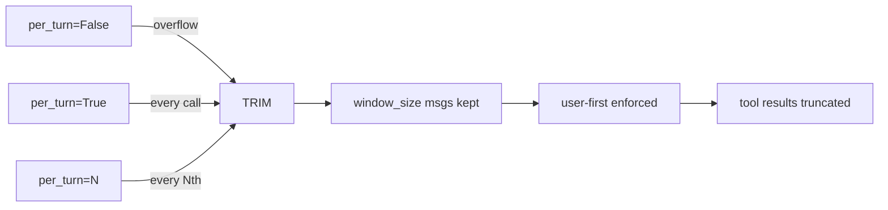

# Level 58: Sliding Window Per-Turn + Token Tracking
**Date:** 2026-04-13 | **File:** `11_2026_updates/sliding_window_tokens.py`
**Depends on:** L5 (Sessions), L15 (Context Mgmt) | **Unlocks:** L15 Enhanced, L59 (Service Tiers)

---

## Part 1 — For Humans

### What We Built
Mastered the SDK's built-in context management: `SlidingWindowConversationManager` with the new `per_turn` parameter, and `EventLoopMetrics` for actual token tracking. Five iterations from baseline windowing through per-turn control to combined context+cost visibility.

### How It Works

```
per_turn=False (default):
  Messages grow until > window_size
  [m1][m2][m3]...[m40] -> TRIM -> [m21]...[m40]
  Only trims when overflow occurs

per_turn=True:
  Trim after EVERY model call
  [m1][m2] -> call -> trim
  [m1][m2][m3][m4] -> call -> trim
  Context stays bounded

per_turn=3:
  Trim every 3rd model call
  call1 -> grow
  call2 -> grow
  call3 -> TRIM -> bounded
  Best for production

Token access path:
+----------------+
| AgentResult    |
| .metrics       |---+
+----------------+   |
                     v
          +---------------------+
          | EventLoopMetrics    |
          | .accumulated_usage  |
          | .latest_agent_inv.. |--+
          +---------------------+  |
                                   v
                    +------------------+
                    | AgentInvocation   |
                    | .cycles[-1]      |--+
                    +------------------+  |
                                          v
                           +------------------+
                           | CycleMetrics     |
                           | .usage (dict)    |
                           | inputTokens: int |
                           | outputTokens:int |
                           | cacheRead...: int|
                           +------------------+
```

### What Went Wrong
1. **result.metrics.get("inputTokens")** — assumed metrics was a dict. It's `EventLoopMetrics` (a dataclass). Had to navigate: `result.metrics.latest_agent_invocation.cycles[-1].usage`. The usage at the end IS a dict (Usage TypedDict).
2. **Cache metrics always 0** — `cacheReadInputTokens` and `cacheWriteInputTokens` are 0 through LiteLLM proxy. The proxy doesn't forward cache metadata from upstream providers.

### What Worked
1. **per_turn=3 sweet spot** — messages plateau after first trim, giving predictable context size. Better than per_turn=True (too aggressive) or False (unbounded growth).
2. **Tool schema token impact** — without tools: ~25 input tokens/turn. With 1 tool: ~595 tokens/turn. Tool schemas are re-sent every turn and dominate context cost.

### The Single Most Important Thing
Tool schemas are the hidden context cost. A single simple tool adds 500+ tokens to every model call. With 5 tools, you're burning 2500+ tokens before any conversation history. `per_turn` trimming helps with conversation growth, but the real token savings come from minimizing tool count per agent.

---

## Part 2 — For LLMs

### Architecture



```
per_turn=False --[overflow]--> TRIM
per_turn=True  --[every call]-> TRIM
per_turn=N     --[every Nth]--> TRIM
                                 |
                                 v
                    [window_size msgs kept]
                                 |
                                 v
                    [user-first enforced]
                                 |
                                 v
                    [tool results truncated]
```

### Decision Log

| Decision | Why | Trade-off |
|----------|-----|-----------|
| per_turn=3 recommended | Balance cost/freshness | More complex than True/False |
| Show cache metrics (even if 0) | Document the feature exists | May confuse users on LiteLLM |
| Tool schema cost callout | Non-obvious, high impact | Not directly per_turn related |

### Pseudocode — Key Patterns

```
# Production sliding window
cm = SlidingWindowConversationManager(
    window_size=20,     # max messages
    per_turn=5,         # trim every 5th call
)
agent = Agent(model=m, conversation_manager=cm)

# Token tracking
result = agent("question")
usage = result.metrics.latest_agent_invocation.cycles[-1].usage
input_tokens = usage["inputTokens"]
output_tokens = usage["outputTokens"]
# cache (requires direct provider, not LiteLLM):
cache_read = usage.get("cacheReadInputTokens", 0)
```

### Observation Log

| # | Category | Topic | Observation |
|---|----------|-------|-------------|
| 1 | mistake | metrics access | result.metrics is EventLoopMetrics, not dict |
| 2 | insight | tool schema cost | 1 tool adds ~500 tokens/turn overhead |
| 3 | insight | cache metrics | Always 0 through LiteLLM proxy |
| 4 | pattern | per_turn=N | Best production setting; N=3-5 balances cost/freshness |

### Forward Links

- **Unlocks L15 Iter 7**: SDK token tracking replaces tiktoken estimates
- **Unlocks L59**: Token tracking informs cost modeling for service tiers
- **Revisit when**: Direct Anthropic/Bedrock access available (cache metrics visible)
