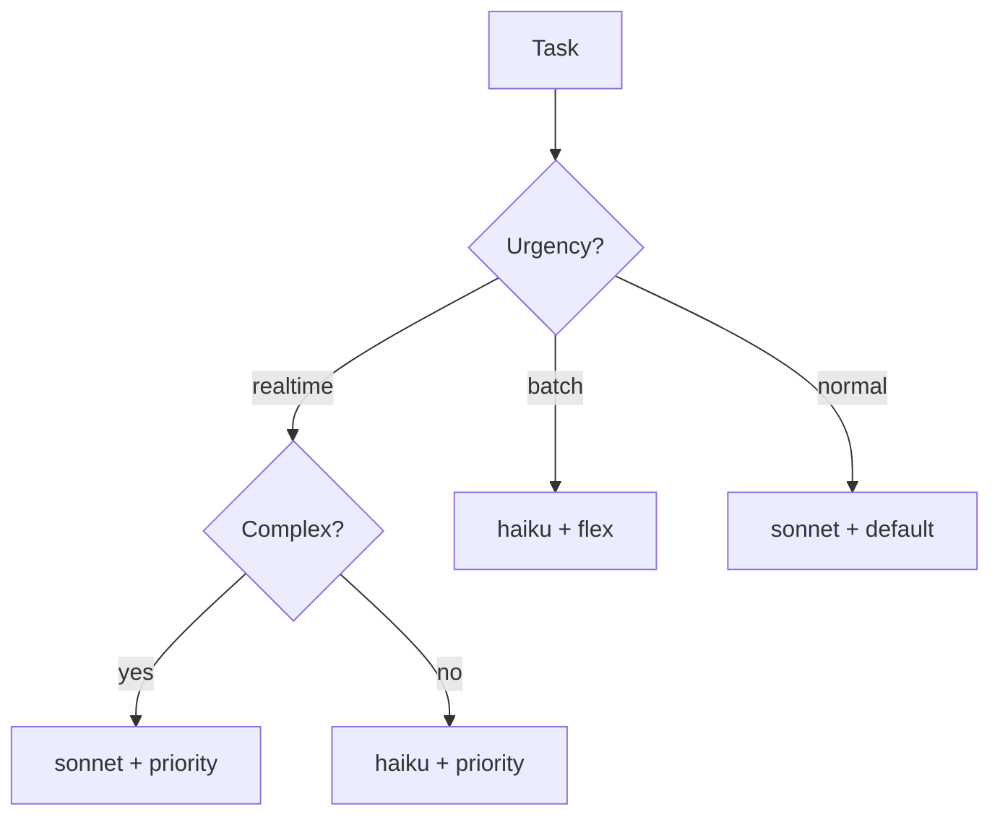

# Level 59: Bedrock Service Tiers — Cost/Latency Control
**Date:** 2026-04-13 | **File:** `11_2026_updates/service_tiers.py`
**Depends on:** L27 (AgentCore), L55 (SLM Routing) | **Unlocks:** Production cost optimization

---

## Part 1 — For Humans

### What We Built
Service tier routing for Bedrock models: default, priority, and flex tiers that control the cost/latency trade-off per request. Extended into dynamic routing by task urgency and a unified routing strategy combining model selection (L55) with tier selection into a 2D optimization.

### How It Works

```
+-------------------+
|   Task Request    |
| urgency + source  |
+--------+----------+
         |
    +----+----+
    | Router  |
    +--+---+--+
       |   |
  +----+   +----+
  |              |
  v              v
+--------+  +--------+
| Model  |  | Tier   |
| haiku  |  | flex   |  <-- batch/simple
| sonnet |  | priority| <-- realtime/complex
+--------+  | default |  <-- normal
            +--------+
                |
                v
     +-------------------+
     | BedrockModel(      |
     |   model_id=...,   |
     |   service_tier=..)|
     +-------------------+
```

### What Went Wrong
1. **No live Bedrock test** — AWS SSO token was expired, so iteration 1 fell back to the reference table. The graceful fallback worked correctly though.

### What Worked
1. **2D routing matrix** — combining model selection with tier selection creates a clean decision space. Simple batch = haiku+flex (cheapest). Complex realtime = sonnet+priority (best quality+latency).
2. **Cost modeling** — simulated 1000-request workload showed 27.7% savings from tier-aware routing vs all-default. The savings come almost entirely from flex on batch work.
3. **Graceful Bedrock fallback** — `try/except` around BedrockModel creation lets the lesson run anywhere, with the reference table as fallback.

### The Single Most Important Thing
Service tiers are a second dimension of optimization that's orthogonal to model selection. Most teams optimize only which model to use. Adding tier selection is free (no code change beyond config) and can save 25-50% on batch workloads. The routing function is trivial — the hard part is classifying task urgency, not selecting the tier.

---

## Part 2 — For LLMs

### Architecture



```
      [Task]
        |
   +----+----+
   | Urgency?|
   +--+--+---+
      |  |  |
  real | batch
  time |  |
   |   |  v
   |   | [haiku + flex]
   |   |
   |   v
   | [sonnet + default]
   |
   v
+--------+
|Complex?|
+--+--+--+
   |  |
  yes  no
   |   |
   v   v
[sonnet  [haiku
+priority]+priority]
```

### Decision Log

| Decision | Why | Trade-off |
|----------|-----|-----------|
| Hypothetical pricing | Real pricing changes; lesson teaches the pattern | Numbers will be stale |
| Graceful Bedrock fallback | Lesson must run without AWS | Can't verify tier latency difference |
| Tie to L55 SLM routing | Natural extension of existing model routing | Adds dependency |

### Pseudocode — Key Patterns

```
# Bedrock service tier config
model = BedrockModel(
    model_id="us.anthropic.claude-sonnet-4-20250514-v1:0",
    service_tier="flex",  # or "priority", "default"
)

# Routing decision
if task.urgency == "realtime" and task.source == "user":
    tier = "priority"
elif task.urgency == "batch":
    tier = "flex"
else:
    tier = "default"
```

### Observation Log

| # | Category | Topic | Observation |
|---|----------|-------|-------------|
| 1 | pattern | 2D routing | Model x tier = independent dimensions of optimization |
| 2 | insight | flex savings | 27.7% savings on mixed workload; all from batch tier |
| 3 | pattern | graceful fallback | try/except BedrockModel lets lesson run anywhere |

### Forward Links

- **Extends L55**: SLM routing + service tiers = unified routing
- **Revisit when**: AWS publishes actual tier pricing differentials
