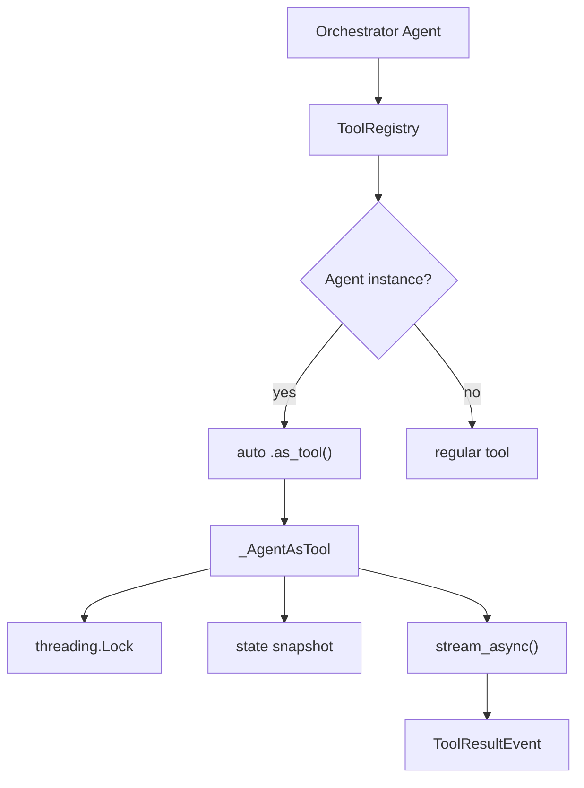

# Level 6: Agents-as-Tools (v1.35 Rewrite)
**Date:** 2026-04-13 | **File:** `03_multi_agent/agents_as_tools.py`
**Depends on:** L1-3 (basics, tools) | **Unlocks:** L7 (Swarm), L8 (Graph), L15 (Context Mgmt)

---

## Part 1 — For Humans

### What We Built
Rewrote the foundational agents-as-tools lesson from the old `@tool` closure pattern to the SDK v1.35 `Agent.as_tool()` API. The new API provides thread-safe wrapping, state snapshotting, and a single-line auto-wrapping shortcut. Five iterations walk from the deprecated pattern through explicit wrapping, auto-wrapping, stateful sub-agents, to a full production orchestrator.

### How It Works

```
Old pattern (deprecated):
+------------------+
|  @tool decorator |
|  def wrapper():  |
|    agent = Agent()|<-- new Agent every call
|    return str()  |    no state, no lock
+------------------+

New pattern (v1.35):
+------------------+
| Agent(name="X")  |  created ONCE
+--------+---------+
         |
   .as_tool()  or  tools=[agent]
         |
+--------+---------+
| _AgentAsTool     |
| - threading.Lock |<-- thread-safe
| - state snapshot |<-- reset per call
| - event streaming|<-- parent sees progress
+------------------+
```

### What Went Wrong
1. **Tried `Agent.as_tool()` as class method** — it's instance-only. Had to create an instance first, then call `.as_tool()` on it. The release notes were ambiguous about this.
2. **Lock contention warning in logs** — saw "agent is already processing a request" during iteration 4. This is actually correct behavior: the lock is non-blocking and returns an error immediately rather than queuing.

### What Worked
1. **Auto-wrapping** — `tools=[reviewer, writer, tester]` just works. Zero boilerplate. The SDK detects AgentBase instances and calls `.as_tool()` internally.
2. **preserve_context demo** — stateful helper remembered "My name is Alice" across calls; stateless helper forgot. Clean proof of the feature.
3. **Same demo scenario across iterations** — using the same `calculate_discount` code review task made the API evolution visible without changing the problem.

### The Single Most Important Thing
The `@tool` closure pattern was a workaround for a missing SDK feature. Now that `Agent.as_tool()` exists, every agents-as-tools implementation should use it — you get thread safety, state management, and event streaming for free. Auto-wrapping with `tools=[agent]` makes the common case trivial.

---

## Part 2 — For LLMs

### Architecture



```
+---------------------+
|  Orchestrator Agent  |
+---------+-----------+
          |
          v
+---------------------+
|    ToolRegistry      |
+---------+-----------+
          |
    Agent instance?
    /           \
   yes           no
    |             |
    v             v
+----------+ +----------+
|auto      | | regular  |
|.as_tool()| | tool     |
+----+-----+ +----------+
     |
     v
+-----------------+
| _AgentAsTool    |
| [Lock] [Snap]   |
| [stream_async]  |
+--------+--------+
         |
         v
  [ToolResultEvent]
```

### Decision Log

| Decision | Why | Trade-off |
|----------|-----|-----------|
| Rewrite L6 in-place | Foundational lesson — old pattern teaches bad habits | Breaks git blame continuity |
| Keep legacy iter as "before" | Shows WHY the new API exists | Extra code in lesson |
| Use auto-wrap in iter 5 | Production pattern should be simplest | Less explicit than .as_tool() |
| preserve_context demo | Unique v1.35 feature, no prior coverage | Adds complexity to lesson |

### Pseudocode — Key Patterns

```
# Auto-wrapping (simplest)
specialist = Agent(name="X", description="does Y")
orchestrator = Agent(tools=[specialist])

# Explicit wrapping (when you need control)
tool = agent.as_tool(name="custom", description="override")

# Stateful sub-agent
tool = agent.as_tool(preserve_context=True)
# WARNING: cannot combine with session_manager
```

### Observation Log

| # | Category | Topic | Observation |
|---|----------|-------|-------------|
| 1 | insight | as_tool is instance method | Agent.as_tool() is on the instance, not the class |
| 2 | insight | threading lock | Non-blocking lock returns error immediately vs queuing |
| 3 | pattern | auto-wrap needs name | Agent must have name= set for auto-wrapping |

### Forward Links

- **Unlocks L7**: Swarm — uses different multi-agent pattern but same Agent class
- **Unlocks L15 Iter 8**: preserve_context for context-aware sub-agents
- **Revisit when**: SDK adds async auto-wrapping or tool dependency graphs
