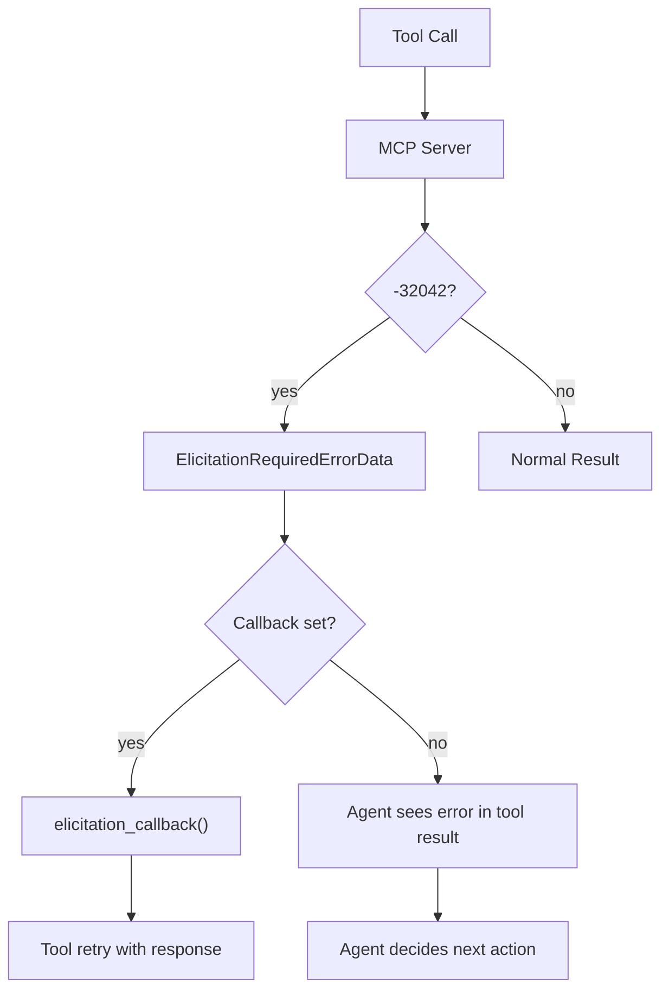

# Level 60: MCP Elicitation — Server-Requested User Input
**Date:** 2026-04-13 | **File:** `11_2026_updates/mcp_elicitation.py`
**Depends on:** L9 (MCP Integration) | **Unlocks:** L47 (Human-on-the-Loop)

---

## Part 1 — For Humans

### What We Built
Educational walkthrough of MCP elicitation: the protocol flow when an MCP server needs user input mid-tool-call (error code -32042), the SDK's `elicitation_callback` parameter, how agents see elicitation data in tool results, and how it compares to agent-initiated handoff patterns.

### How It Works

```
Agent         MCPClient        MCP Server
  |               |                |
  | call_tool()   |                |
  |-------------->| tools/call     |
  |               |--------------->|
  |               |                | needs input!
  |               | error: -32042  |
  |               |<---------------|
  |               |                |
  |               | parse elicit   |
  |               | data from err  |
  |               |                |
  |  tool_result  |                |
  |<--------------|                |
  |  (elicitation |                |
  |   prompt +    |                |
  |   schema)     |                |
  |               |                |
  | agent decides |                |
  | next action   |                |

Two handling modes:
+---------------------+  +---------------------+
| elicitation_callback|  | No callback         |
| (programmatic)      |  | (agent-mediated)    |
+---------------------+  +---------------------+
| callback receives   |  | agent sees error    |
| params + schema     |  | with elicitation    |
| returns response    |  | data in tool result |
| automatic           |  | LLM decides action  |
+---------------------+  +---------------------+
```

### What Went Wrong
Nothing — this lesson is protocol documentation, no LLM calls needed. Clean run on first attempt.

### What Worked
1. **Protocol-first teaching** — explaining the sequence diagram before any code made the concept clear. The -32042 error code is just a structured way for servers to ask "are you sure?"
2. **Simulated tool result** — showing exactly what the agent sees (the JSON structure) grounded the concept without needing a live MCP server.
3. **Elicitation vs handoff comparison table** — the key insight is they're complementary, not competing. Server-initiated (structured) vs agent-initiated (free-form).

### The Single Most Important Thing
Elicitation and handoff serve different masters. Elicitation is the **server** saying "I need confirmation before I proceed" (structured, schema-validated, single tool scope). Handoff is the **agent** saying "I need human judgment" (free-form, conversation-wide). Production agents need both: elicitation for approval gates, handoff for ambiguity resolution.

---

## Part 2 — For LLMs

### Architecture



```
[Tool Call] --> [MCP Server]
                    |
              -32042 error?
              /          \
            yes           no
             |             |
             v             v
  [ElicitationData]  [Normal Result]
             |
     callback set?
      /         \
    yes          no
     |            |
     v            v
[callback()]  [agent sees
     |         error+data]
     v            |
[retry tool]  [agent decides]
```

### Decision Log

| Decision | Why | Trade-off |
|----------|-----|-----------|
| No live MCP server | Would need custom server setup | Can't demo full round-trip |
| Simulated tool result | Shows exact JSON structure | Not a running proof |
| Comparison with L47 | Critical architectural distinction | L47 not yet built |

### Pseudocode — Key Patterns

```
# Programmatic handling (callback)
async def handle_elicitation(context, params):
    print(f"Server asks: {params.message}")
    return {"confirmed": True}  # match requestedSchema

mcp = MCPClient(transport, elicitation_callback=handle_elicitation)

# Agent-mediated (no callback)
# Agent sees in tool result:
# "MCP Elicitation required: [msg] with data [{schema}]"
# Agent can parse, ask user, retry
```

### Observation Log

| # | Category | Topic | Observation |
|---|----------|-------|-------------|
| 1 | insight | complementary patterns | Elicitation (server) + handoff (agent) = complete HITL |
| 2 | pattern | error code convention | -32042 is structured, not arbitrary — carries schema |
| 3 | insight | two handling modes | Callback = programmatic; no callback = agent-mediated |

### Forward Links

- **Unlocks L47**: Human-on-the-loop — elicitation is the server-side half
- **Revisit when**: Building MCP servers that need user confirmation flows
