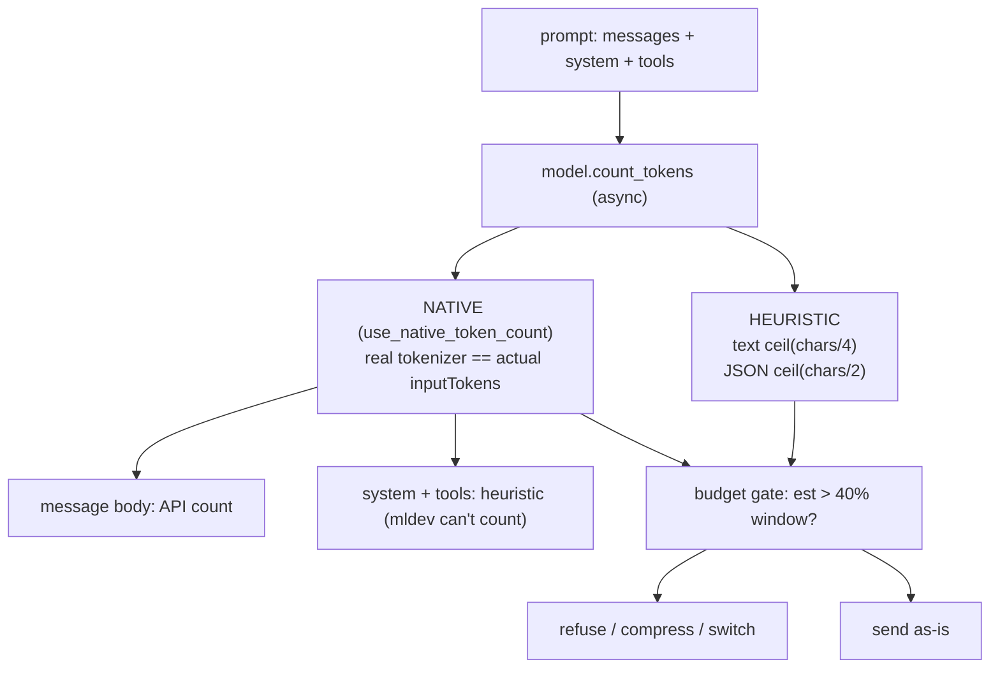

# Level 61: Token Counting + Pre-Call Estimate (async `count_tokens`)
**Date:** 2026-06-02 | **File:** `14_token_economics/token_counting.py`
**Depends on:** L15 (context mgmt / Horthy 40% rule), L58 (token tracking AFTER a call)
**Unlocks:** L62 (cache TTL), L68 (Invocation Limits — already built, names L61 as a dep)

---

## Part 1 — For Humans

### What We Built
A lesson that estimates a prompt's input-token cost *before* sending it, so an agent
can refuse or compress an over-budget prompt without paying for the call. The twist:
there are two estimators — a free character heuristic and a real-tokenizer "native"
count — and the gap between them is dangerous exactly where it matters most.

### How It Works

```
+----------------------+
|   prompt to send     |
+----------+-----------+
           |
           v
+----------------------+      free, instant
|  count_tokens()      |---->  HEURISTIC: ceil(chars/4)
|  (async, on Model)   |        good on English, BLIND to
+----------+-----------+        code / CJK / punctuation
           |
           | use_native_token_count=True
           v
+----------------------+      one API call
|  NATIVE count        |---->  == actual billed inputTokens
+----------+-----------+        (ground truth)
           |
           v
+----------------------+
|  budget gate (40%)   |--> over? compress / switch / refuse
+----------------------+    under? send as-is
```

### What Went Wrong
1. **Vacuous green check.** My first draft asserted the structural invariant
   (`heuristic_total - native_total == heuristic_msgonly - native_msgonly`) and it
   passed as `0 == 0` — because native had *silently fallen back* to the heuristic.
   Gemini's `count_tokens` catches every exception, logs at DEBUG, and returns the
   heuristic, so `native == heuristic` does **not** prove native ran. Fixed by
   validating native on an input known to diverge (code), so equality now fails loudly.
2. **Built on one noisy run.** A first probe returned native `19`; every run after
   returned a stable `22` for the identical string. I nearly wrote "native saves 3
   tokens" off a single sample. Measured twice — within a run native is stable and
   equals the real count.
3. **Wrong direction claim.** The draft said "chars/4 over-estimates, so it errs
   toward caution." Measuring code/CJK/punctuation showed the opposite: it
   *under-counts* by 40–75%. The reassuring claim was empirically false.
4. **Oversized the demo blob.** The gate-flip used `PUNCT*6` (840 chars) →
   heuristic already 210, over the 80 budget, so nothing flipped. Sized down to a
   single `PUNCT` (140 chars → heuristic 35, native 138) to straddle the budget.

### What Worked
1. **Probe the installed source, then measure across input *types*.** English alone
   hid every failure mode; the 4-row table (english/code/cjk/punct) made the truth
   obvious.
2. **Anchor estimates to ground truth.** Comparing each estimate to the real
   `result.metrics.accumulated_usage["inputTokens"]` is what proved native == actual.
3. **Guard the silent-fallback trap with a divergent input.** Turn an invisible
   failure into a loud assertion.

### The Single Most Important Thing
The *free* token estimate lies precisely where it's most dangerous. `chars/4` is
spot-on for English prose but under-counts code, logs, and multilingual text by up
to 75% — and those are exactly the inputs that overflow a context window. If you
gate a budget on the cheap heuristic, you will wave through the very prompts you
meant to stop. Gate structured input on the native count; the heuristic is a
convenience, not a safety net.

---

## Part 2 — For LLMs

### Architecture



```
[prompt: messages + system + tools]
              |
              v
   [model.count_tokens (async)]
        |               |
        v               v
   [HEURISTIC]      [NATIVE = actual inputTokens]
   text /4              |            |
   JSON /2              v            v
        |        [body: API]   [sys+tools: heuristic]
        |               |
        +-------+-------+
                v
     [budget gate: est > 40% window?]
            |              |
            v              v
   [refuse/compress]   [send as-is]
```

### Decision Log

| Decision | Why | Trade-off |
|----------|-----|-----------|
| Lesson on Gemini, direct | Anthropic budget paused; native count is provider-specific | Native facts are Gemini-flavored; LiteLLM/OpenAIModel uses heuristic only |
| Use CODE (not English) for the invariant proof | English makes native==heuristic, so the assert is vacuous | One more input type to define |
| Hard-assert `native != heuristic` on code | Catches the silent-fallback false positive | Flakes if Gemini throttles — but that's the point: surface it |
| `abs(native - actual) <= 2` not `==` | Allow ±1 framing/rounding noise | Slightly looser than the exact equality observed |
| Pretend 200-token window in iter4 | Make the 40% gate trip in a demo | Not a real model size; labeled as illustrative |

### Pseudocode — Key Patterns

```
# Pre-call budget gate
est = await model.count_tokens(messages, system_prompt=sys, tool_specs=tools)
if est > 0.40 * context_window_limit:
    handle_over_budget()   # compress / switch model / refuse
else:
    send(messages)

# Native vs heuristic structural invariant (always true)
heur_full - nat_full == heur_msgonly - nat_msgonly
# because system_prompt + tools use the SAME heuristic in both modes;
# native only swaps in the real count for the message body.

# Silent-fallback guard
assert native_count(CODE) != heuristic_count(CODE)
# else native fell back to the heuristic (API error) and proved nothing.
```

### Observation Log

| # | Category | Topic | Observation |
|---|----------|-------|-------------|
| 1 | insight | count-tokens-async-on-model | `await model.count_tokens(...)` — async, on the Model not the Agent; pre-call, no generation |
| 2 | mistake | docstring-claims-tiktoken-but-isnt | Base docstring says tiktoken cl100k_base; v1.42 path is char heuristic (87 chars → 22 = ceil/4, not tiktoken 18) |
| 3 | insight | native-count-equals-actual-billed | Gemini native == actual inputTokens exactly (22/75/18/138) — ground truth, not just "more accurate" |
| 4 | insight | chars4-undercounts-structured-input | Heuristic error 0% English, −40% code, −50% CJK, −75% punct; it under-counts overflow-prone inputs |
| 5 | insight | native-refines-only-message-body | Native counts the body; system+tools stay heuristic (mldev rejects them). Invariant: full-delta == msg-delta |
| 6 | mistake | silent-fallback-vacuous-assert | native==heuristic passed 0==0 because native silently fell back; guard with a divergent input |
| 7 | mistake | one-run-noise-near-false-narrative | native=19 once, stable 22 after; nearly built a claim on one noisy run |
| 8 | pattern | measure-across-input-types | Test english/code/cjk/punct, not just the happy-path example; the table exposes the truth |
| 9 | mistake | threshold-demo-blob-oversized | Gate-flip blob PUNCT*6 already over budget; size input to sit BETWEEN the two estimates |
| 10 | pattern | gate-structured-input-on-native | Gate dense/untrusted input on native; the free heuristic is for rough English sizing |
| 11 | pattern | native-flag-constructor-or-update-config | use_native_token_count via kwarg or update_config; isinstance guard for LESSON_MODEL override |
| 12 | question | native-count-cross-run-stability | Is native count contractually stable per input, or does alias routing shift it (19 vs 22)? |

### Forward Links

- **Unlocks L62 (cache TTL):** count_tokens sizes the prompt; cache TTL controls what you re-pay for. Together: estimate, then decide what to cache vs compress.
- **Feeds L68 (Invocation Limits):** L68 already lists L61 as a dependency — count_tokens is "look before you leap," `Limits` is "stop mid-leap."
- **Pairs with L15 (40% rule) / L58 (token tracking):** L61 estimates *before*, L58 measures *after*; the loop closes when the estimate drives proactive compression.
- **Revisit when:** an agent ingests code, logs, JSON, or non-English text under a token budget — that's where the heuristic silently fails and native counting earns its API call.
