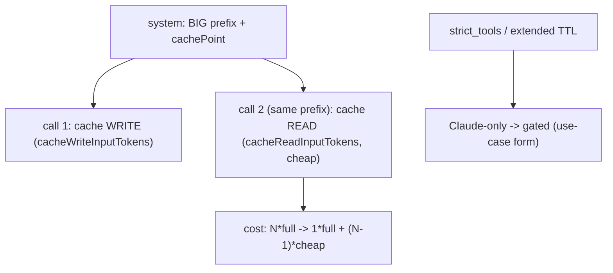

# Level 62: Bedrock Prompt Caching (Amazon Nova) — and what needs Claude
**Date:** 2026-06-02 | **File:** `14_token_economics/cache_and_strict.py`
**Depends on:** L61 (token counting), L59 (Bedrock service tiers)
**Unlocks:** cheaper repeated-context agents; pairs with L63 (offload) + L68 (limits)

---

## Part 1 — For Humans

### What We Built
A demonstration of Bedrock prompt caching: mark a big, constant prefix with a
`cachePoint`, pay full price to write it once, then pay a steep discount to *read*
it on every reuse. We proved it live on Amazon Nova (the model the account can
actually use) — and, just as importantly, validated *empirically* that the
originally-planned `strict_tools` and extended cache TTL need Claude, which this
account can't reach yet.

### How It Works

```
 call 1 (fresh big prefix)
   [system: BIG + cachePoint] --> WRITE cache (2005 tok)
 call 2 (same prefix)
   [system: BIG + cachePoint] --> READ cache (2012 tok, cheap)
        |
   cost: N*full  -->  1*full + (N-1)*cheap
```

### What Went Wrong
1. **I trusted metadata over a real call.** `GetFoundationModelAvailability` said
   Claude's `agreementAvailability = NOT_AVAILABLE`, so I declared "no Claude." That
   was *directionally* right but for the *wrong* reason — and a single `converse` to
   Claude Haiku even returned "OK" once. When the user said "don't take my word for
   it, validate it," a real call exposed the truth: Claude is gated behind an unfilled
   **use-case form** (`Model use case details have not been submitted`), and that one
   success was a flake that didn't reproduce.
2. **The first cache demo looked broken.** Call 1 showed *both* cacheWrite and
   cacheRead — because a prior probe with the same prefix had warmed the cache (it
   lives ~5 min). Fix: a unique per-run marker so call 1 genuinely writes.

### What Worked
1. **`cachePoint` SystemContentBlock.** `system = [{"text": BIG}, {"cachePoint":
   {"type":"default"}}]` — the modern injection (the `cache_prompt` config is
   deprecated). Write-then-read showed cleanly once the prefix was fresh.
2. **Per-call deltas.** `accumulated_usage` is cumulative; subtracting gives each
   call's true cache write/read.
3. **An empirical survey.** Testing `strict_tools` on Nova/Llama/Mistral (all reject)
   plus a real Claude `converse` settled "what can this account actually do."

### The Single Most Important Thing
Entitlement metadata is a map, not the territory. `agreementAvailability` lied, a
single call flaked-succeeded, and only a *repeated real call* plus
`GetUseCaseForModelAccess` told the truth: Claude is gated behind a form, and
`strict_tools` is Claude-only. When the question is "can we actually use model X with
feature Y," the answer is a Converse call and the error it returns — never a
capability table. That's why this lesson ships the caching it *can* prove and
*documents* the rest with the evidence for why.

---

## Part 2 — For LLMs

### Architecture



```
[system: BIG prefix + cachePoint]
        |                 |
        v                 v
[call 1: cache WRITE]  [call 2 same prefix: cache READ (cheap)]
                              |
                              v
              [cost: N*full -> 1*full + (N-1)*cheap]

[strict_tools / extended TTL] --> [Claude-only -> gated (use-case form)]
```

### Decision Log

| Decision | Why | Trade-off |
|----------|-----|-----------|
| Build on Nova, not Claude | Claude gated behind unfilled use-case form | Can't demo strict_tools / TTL |
| Unique per-run prefix marker | Warm caches (~5 min) pollute a fixed prefix | Cache size varies slightly per run |
| Per-call usage deltas | accumulated_usage is cumulative | A little arithmetic |
| Keep strict_tools as a LIVE rejection | Show, don't tell, that it's Claude-only | One expected-failure call |
| Validate Claude with a real call | Metadata + a single sample both misled | A couple of (failed) calls |

### Pseudocode — Key Patterns

```
# Prompt caching
system = [{"text": BIG_PREFIX}, {"cachePoint": {"type": "default"}}]
call_1(system)  -> cacheWriteInputTokens > 0, cacheRead = 0   # fresh prefix
call_2(system)  -> cacheReadInputTokens  > 0                  # reuse
# measure: per-call delta of accumulated_usage; use a unique prefix per run

# Validate an entitlement (don't infer from metadata)
try: bedrock_runtime.converse(modelId=PROFILE_ID, ...small...)
except ResourceNotFoundException as e:  # "use case details not submitted" => gated
except ValidationException as e:        # "doesn't support strict" / "needs profile"
```

### Observation Log

| # | Category | Topic | Observation |
|---|----------|-------|-------------|
| 1 | insight | bedrock-prompt-caching-cachepoint | cachePoint SystemContentBlock; write 2005 / read 2012 on Nova; cache_prompt deprecated |
| 2 | pattern | fresh-marker-for-clean-cache-demo | unique per-run prefix (cache warm ~5min); accumulated_usage is cumulative -> deltas |
| 3 | insight | validate-entitlements-with-real-call | metadata said NOT_AVAILABLE; real call said "use-case form not filled"; one call flaked |
| 4 | insight | strict-tools-is-claude-only | Nova/Llama/Mistral all reject strict_tools (ValidationException) |
| 5 | insight | claude-bedrock-needs-inference-profile | us. inference-profile id required; 8 Claude profiles, all gated by the form |
| 6 | mistake | trusted-metadata-over-call | concluded "no Claude" from metadata; right answer, wrong reason; validate empirically |

### Forward Links

- **Completes the token-economics trio:** L61 (estimate before), L62 (cache the constant
  prefix), L63 (offload the variable part), L68 (cap the run).
- **Blocked-on:** Claude access (fill the Bedrock use-case form) unlocks `strict_tools`
  and extended cache TTL (5m/1h) — revisit L62 then to add those iterations.
- **Revisit when:** a large prefix is reused across many calls (system prompt, RAG
  context, tool catalog) — or when you need to know what a Bedrock account can *really* do.

---

## Update — Claude unlocked (same day)

After this lesson was first written on Nova (Claude gated), the account owner submitted
the **use-case form** (Bedrock console → Model catalog → "Submit use case details"). A few
minutes later Claude went from `ResourceNotFoundException` (3×) to consistently callable —
**confirming the form was the gate.** The lesson was then rewritten to *demonstrate* the
Claude features instead of documenting them:

1. **Caching with `ttl='1h'`** on `us.anthropic.claude-haiku-4-5`: a ~9.8k-token prefix
   wrote 9826 cache tokens, then read 9826 on reuse. `cache_config(strategy="anthropic",
   ttl="1h")` with a **plain-text** system prompt (cache_config injects the cachePoint).
2. **`strict_tools`** demonstrated live: Claude enforces the schema and calls the tool;
   Nova still rejects it (`ValidationException`).
3. **New gotcha (the double-cachePoint trap):** a manual `cachePoint` (defaults to 5m) +
   `cache_config(ttl="1h")` → `ValidationException: a ttl='1h' cache_control block must not
   come after a ttl='5m' block` (order: tools → system → messages). Use **one** — prefer
   `cache_config` alone.
4. **Cache minimum differs by model:** the ~2k-token prefix that cached on Nova produced
   **zero** cache tokens on Claude Haiku (silently); needed ~7k+. Below the minimum,
   caching no-ops without error.

The original "validate entitlements with a real call" lesson still stands — and the full
arc (metadata said unavailable → a call flaked → the gate was a form → form unlocks it)
is the richer story.
