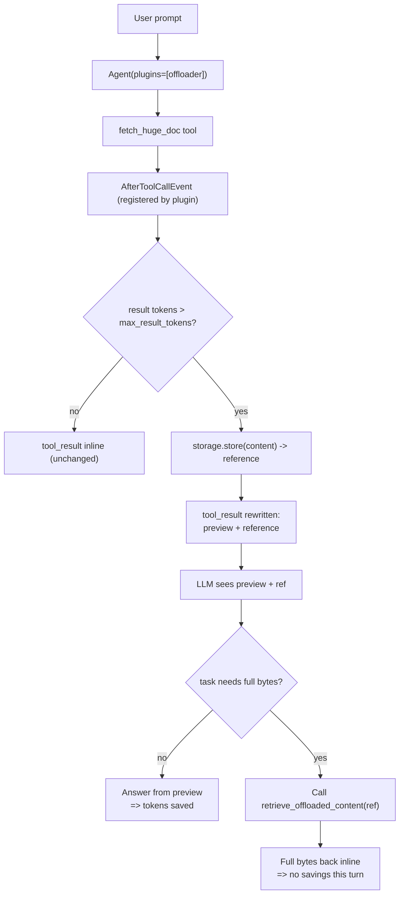

# Level 63: Tool Result Offload — `ContextOffloader`
**Date:** 2026-05-03 | **File:** `14_token_economics/tool_offload.py`
**Depends on:** L9 (MCP), L31 (Workflow), L57 (Sessions) | **Unlocks:** L62 (CachePoint TTL pairs naturally), L67 (AG-UI on AgentCore Runtime)

---

## Part 1 — For Humans

### What We Built
A demonstration that big tool outputs (web scrapes, file reads, search results) don't have to live in the conversation forever. Wire `ContextOffloader` into the agent via `plugins=[...]`; oversized tool results get spilled to a storage backend and replaced inline with a short preview + a reference. The agent gets an auto-injected retrieval tool and decides — per-call — whether to actually load the full content.

### How It Works

```
+-----------------------+
|   Agent runs tool     |
|   (returns 50KB)      |
+----------+------------+
           |
           v
+-----------------------+    +-----------------+
|   AfterToolCall hook  |--->|   Storage put   |
| (offloader plugin)    |    +-----------------+
+----------+------------+
           |
           v
+-----------------------+
| tool_result becomes:  |
|  [preview]            |
|  + reference          |
+----------+------------+
           |
           v
   AGENT DECIDES
   /             \
  v               v
preview       call
enough?       retrieval
  |              tool
  v              |
SAVED         full doc
              back inline
```

### What Went Wrong
1. **Misleading error catch.** First version printed "agent run failed — likely proxy not running" on every exception. When the proxy was up but Anthropic's content filter rejected my repeated "Lorem ipsum" payload, the message lied. Fixed: the catch now prints the exception type and a truncated message.
2. **Test data tripped the content filter.** `"Lorem ipsum dolor sit amet. " * 2000` triggered `ContentPolicyViolationError`. Synthetic content has to look believable — varied sections with parameterised numbers worked.
3. **First demo showed the wrong thing.** I asked the agent "fetch a report and count its words." That requires the full doc, so the agent retrieved it via `retrieve_offloaded_content` and the savings disappeared. The redesign added a *second* prompt — "what's the topic?" — that the agent could answer from the preview alone, which is where the savings actually show up.

### What Worked
1. **Probe before code.** Walking the SDK's module tree gave me the exact `ContextOffloader` and `Storage` signatures; no docs guessing.
2. **Two-case demo.** Case A (preview-sufficient) and Case B (full-content) on the *same* big-doc tool makes the nuance unmissable. One number alone would mislead.
3. **Granular message dump.** When Variant B looked the same size as Variant A, dumping every message by role + content type showed exactly what happened — the offload fired, the agent just chose to retrieve. That diagnostic is the lesson.

### The Single Most Important Thing
The offloader does not magically save tokens. It transforms a token problem into a *decision* problem: instead of every tool result bloating history forever, the agent sees a preview and chooses whether to load the full bytes. **The savings only materialise on tasks that are preview-sufficient.** For tasks that need the full content (count, search, transform), the bytes come back inline anyway. This means the right place to use the offloader is *anywhere your tool's payload size is data-dependent and your agent's tasks are mostly summarisation* — not as a blanket "make context smaller" knob.

---

## Part 2 — For LLMs

### Architecture



```
+--------------+
| User prompt  |
+------+-------+
       |
       v
+-----------------------------+
| Agent(plugins=[offloader])  |
+------+----------------------+
       |
       v
+-----------------------------+
| fetch_huge_doc tool runs    |
+------+----------------------+
       |
       v
+-----------------------------+
| AfterToolCallEvent fires    |
| (registered by plugin)      |
+------+----------------------+
       |
       v
   tokens > max_result_tokens?
   /                         \
  no                          yes
  v                            v
+----------------+   +-----------------------+
| keep inline    |   | storage.store(...)    |
| (no offload)   |   | -> reference          |
+----------------+   +----------+------------+
                                |
                                v
                     +-----------------------+
                     | tool_result rewritten |
                     | preview + reference   |
                     +----------+------------+
                                |
                                v
                            AGENT
                       /            \
                      v              v
              preview enough?   needs full?
                  |                |
                  v                v
              ANSWER            call retrieve_
              (saved)           offloaded_content
                                  |
                                  v
                              full bytes
                              back inline
                              (no savings)
```

### Decision Log

| Decision | Why | Trade-off |
|----------|-----|-----------|
| `plugins=[offloader]` not `hooks=[...]` | Plugin auto-discovers `@hook` + `@tool` members; clean composition | One more concept (Plugin) for users to learn |
| `InMemoryStorage` in the lesson | No external dependency; reproducible | Lost on exit — for production use FileStorage / S3Storage |
| `max_result_tokens=500` (aggressive) | Forces the offload path on a 17K token result so the demo is unambiguous | In real use, default 2500 is usually right |
| Demonstrate BOTH preview-sufficient AND full-content cases | One case alone misleads — preview-sufficient hides the retrieval cost; full-content hides the savings | Twice the demo code |
| Catch and print exception type + message instead of assuming proxy down | Empirically, the first version's "proxy not running" message lied when the real cause was content filtering | Slightly more verbose error handler |

### Pseudocode — Key Patterns

```
# Pattern 1: wire the offloader
agent = Agent(
    model = ...,
    tools = [your_tools_here],
    plugins = [ ContextOffloader(
                  storage = InMemoryStorage()  # or FileStorage / S3Storage
                  max_result_tokens = 2500
                  preview_tokens = 1000
                  include_retrieval_tool = True
              ) ],
)

# Pattern 2: how the agent decides
when tool returns:
    if estimate_tokens(result) > max_result_tokens:
        ref = storage.store(result.bytes)
        replace tool_result with: preview(result, preview_tokens) + ref
    LLM sees preview + ref
    LLM reasons:
        if task answerable from preview:
            no retrieval -> savings
        else:
            call retrieve_offloaded_content(ref)
            full bytes return inline -> no savings this turn

# Pattern 3: choose the storage backend by deployment shape
in-process, ephemeral, single agent run   -> InMemoryStorage()
single host, survives restart             -> FileStorage(artifact_dir=...)
multi-host or long retention              -> S3Storage(bucket=..., prefix=...)
```

### Empirical Numbers (verified 2026-05-03 against LiteLLM proxy + claude-haiku-3.5)

| Case | Variant | History msgs | Inline chars | Inline tokens (est) | Saving |
|---|---|---|---|---|---|
| 3A: "what's the topic?" | no offloader | 4 | 35,880 | 8,970 | — |
| 3A: "what's the topic?" | with offloader | 4 | **2,188** | **547** | **94%** |
| 3B: "how many words?" | no offloader | 6 | 71,659 | 17,914 | — |
| 3B: "how many words?" | with offloader | 8 | 73,564 | 18,391 | **none — agent retrieved** |

### Observation Log

| # | Category | Topic | Observation |
|---|----------|-------|-------------|
| 1 | insight | offloader-gives-choice-not-savings | Offloader transforms a token problem into a decision problem; savings only on preview-sufficient tasks. 94% reduction on Case A; 0% on Case B. |
| 2 | pattern | plugins-parameter-wiring | `Agent(plugins=[offloader])`. Plugin auto-discovers `@hook` and `@tool` members. Confirmed: 1 hook (`AfterToolCallEvent`), 1 tool (`retrieve_offloaded_content`). |
| 3 | mistake | content-filter-on-repeated-text | `"Lorem ipsum " * 2000` tripped Anthropic's content filter. Synthetic test data must look believable. |
| 4 | pattern | storage-backend-choice | Identical `Storage` protocol across InMemory / File / S3. Choice is durability/scope, not API. |
| 5 | insight | misleading-error-message-in-fallback | Generic "proxy not running" catch lied when the real error was ContentPolicyViolationError. Always report exception type. |

### Forward Links

- **Pairs with L61 (token counting):** Use `model.count_tokens()` *before* a tool call to decide if you should even run a tool whose output you'd then have to offload. Predictive vs reactive.
- **Pairs with L62 (CachePoint TTL):** Caching covers the prompt prefix; offloading covers the variable-size middle. Different levers for the same goal — token economics.
- **Unlocks L67 (AG-UI on AgentCore):** AgentCore Runtime has memory budgets per session; offloading is a natural pairing.
- **Revisit when:** building any agent that calls a tool whose payload size is data-dependent (web scrape, file read, search results, S3 GetObject). If payload is bounded and small, skip — overhead not worth it.
